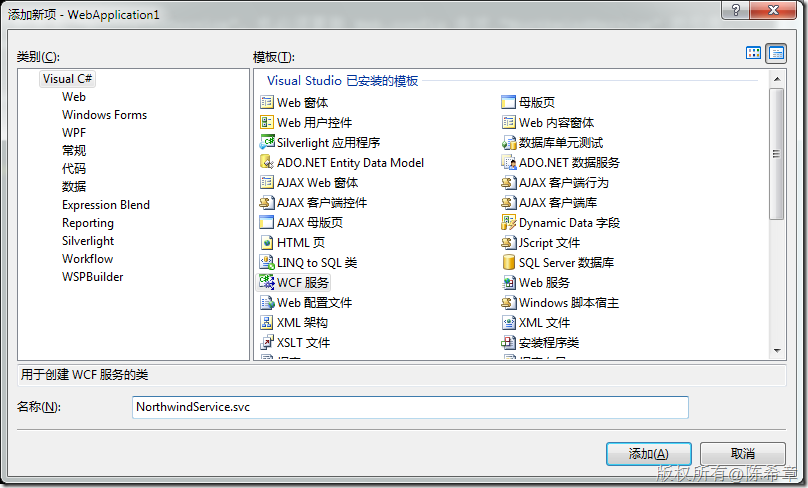
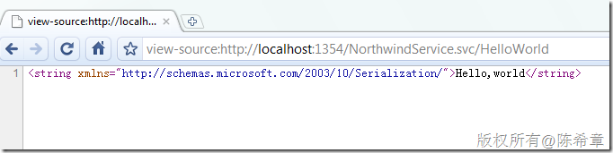
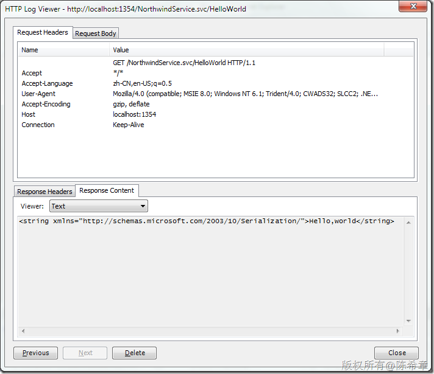
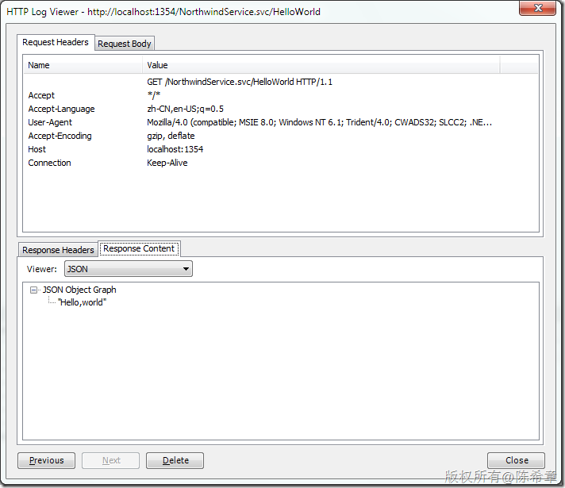

# 如何让WCF服务更好地支持Web Request和AJAX调用 
> 原文发表于 2010-02-28, 地址: http://www.cnblogs.com/chenxizhang/archive/2010/02/28/1675266.html 


WCF的确不错，它大大地简化和统一了服务的开发。但也有不少朋友问过我，说是在非.NET客户程序中，有何很好的方法直接调用服务吗？还有就是在AJAX的代码中（js）如何更好地调用WCF服务呢？

 我首先比较推荐的是可以通过页面静态方法等方式来转接对WCF的服务。尤其是WCF是属于别的网站的一部分的时候。

 但今天我要讲解一下，如果和WCF在一个网站内部，那么js脚本应该如何更好地调用WCF呢？或者说，为了支持js更好地访问，WCF服务在设计的时候应该注意什么呢？

 1. 创建服务

 [](http://images.cnblogs.com/cnblogs_com/chenxizhang/WindowsLiveWriter/WCFWebRequestAJAX_E7CB/image_2.png) 

 2. 修改接口

 为了做演示，我们将默认的那个Operation修改一下


```
using System;
using System.Collections.Generic;
using System.Linq;
using System.Runtime.Serialization;
using System.ServiceModel;
using System.Text;
using System.ServiceModel.Web;
namespace WebApplication1
{
    // 注意: 如果更改此处的接口名称 "INorthwindService"，也必须更新 Web.config 中对 "INorthwindService" 的引用。
    [ServiceContract]
    public interface INorthwindService
    {
        [OperationContract]
        [WebGet(UriTemplate="HelloWorld")]
        string HelloWorld();
    }
}

```


.csharpcode, .csharpcode pre
{
 font-size: small;
 color: black;
 font-family: consolas, "Courier New", courier, monospace;
 background-color: #ffffff;
 /*white-space: pre;*/
}
.csharpcode pre { margin: 0em; }
.csharpcode .rem { color: #008000; }
.csharpcode .kwrd { color: #0000ff; }
.csharpcode .str { color: #006080; }
.csharpcode .op { color: #0000c0; }
.csharpcode .preproc { color: #cc6633; }
.csharpcode .asp { background-color: #ffff00; }
.csharpcode .html { color: #800000; }
.csharpcode .attr { color: #ff0000; }
.csharpcode .alt 
{
 background-color: #f4f4f4;
 width: 100%;
 margin: 0em;
}
.csharpcode .lnum { color: #606060; }

注意，我们这里加了一个WebGet的Attribute，这将允许WCF服务直接通过地址调用


3. 实现服务


```
using System;
using System.Collections.Generic;
using System.Linq;
using System.Runtime.Serialization;
using System.ServiceModel;
using System.Text;

namespace WebApplication1
{
    // 注意: 如果更改此处的类名 "NorthwindService"，也必须更新 Web.config 中对 "NorthwindService" 的引用。
    public class NorthwindService : INorthwindService
    {

        #region INorthwindService 成员

        public string HelloWorld()
        {
            return "Hello,world";
        }

        #endregion
    }
}

```


.csharpcode, .csharpcode pre
{
 font-size: small;
 color: black;
 font-family: consolas, "Courier New", courier, monospace;
 background-color: #ffffff;
 /*white-space: pre;*/
}
.csharpcode pre { margin: 0em; }
.csharpcode .rem { color: #008000; }
.csharpcode .kwrd { color: #0000ff; }
.csharpcode .str { color: #006080; }
.csharpcode .op { color: #0000c0; }
.csharpcode .preproc { color: #cc6633; }
.csharpcode .asp { background-color: #ffff00; }
.csharpcode .html { color: #800000; }
.csharpcode .attr { color: #ff0000; }
.csharpcode .alt 
{
 background-color: #f4f4f4;
 width: 100%;
 margin: 0em;
}
.csharpcode .lnum { color: #606060; }

这里的实现依然是我最喜欢的HelloWorld


4. 修改配置文件（web.config)，要支持直接通过WebGet的方法调用WCF服务，必须用一个特殊的binding，是webHttpBinding


```
 <system.serviceModel>
  <behaviors>
   <serviceBehaviors>
    <behavior name="WebApplication1.NorthwindServiceBehavior">
     <serviceMetadata httpGetEnabled="true" />
     <serviceDebug includeExceptionDetailInFaults="false" />
    </behavior>
   </serviceBehaviors>
 ***<endpointBehaviors>
 <behavior name="test">
 <webHttp/>
 </behavior>
 </endpointBehaviors>***
  </behaviors>
  <services>
   <service behaviorConfiguration="WebApplication1.NorthwindServiceBehavior"
    name="WebApplication1.NorthwindService">
    <endpoint address="" binding="*webHttpBinding*" contract="WebApplication1.INorthwindService" *behaviorConfiguration="test">*
     <identity>
      <dns value="localhost" />
     </identity>
    </endpoint>
    <endpoint address="mex" binding="mexHttpBinding" contract="IMetadataExchange" />
   </service>
  </services>
 </system.serviceModel>
```

.csharpcode, .csharpcode pre
{
 font-size: small;
 color: black;
 font-family: consolas, "Courier New", courier, monospace;
 background-color: #ffffff;
 /*white-space: pre;*/
}
.csharpcode pre { margin: 0em; }
.csharpcode .rem { color: #008000; }
.csharpcode .kwrd { color: #0000ff; }
.csharpcode .str { color: #006080; }
.csharpcode .op { color: #0000c0; }
.csharpcode .preproc { color: #cc6633; }
.csharpcode .asp { background-color: #ffff00; }
.csharpcode .html { color: #800000; }
.csharpcode .attr { color: #ff0000; }
.csharpcode .alt 
{
 background-color: #f4f4f4;
 width: 100%;
 margin: 0em;
}
.csharpcode .lnum { color: #606060; }

上面的粗斜体部分是要添加或者修改的


5. 浏览该服务


[](http://images.cnblogs.com/cnblogs_com/chenxizhang/WindowsLiveWriter/WCFWebRequestAJAX_E7CB/image_4.png) 


我们看到，通过这样的地址就可以实现调用了。默认情况下，它返回的数据格式是XML的


[](http://images.cnblogs.com/cnblogs_com/chenxizhang/WindowsLiveWriter/WCFWebRequestAJAX_E7CB/image_8.png) 


6. 修改合约，让它返回json数据


```
using System;
using System.Collections.Generic;
using System.Linq;
using System.Runtime.Serialization;
using System.ServiceModel;
using System.Text;
using System.ServiceModel.Web;
namespace WebApplication1
{
    // 注意: 如果更改此处的接口名称 "INorthwindService"，也必须更新 Web.config 中对 "INorthwindService" 的引用。
    [ServiceContract]
    public interface INorthwindService
    {
        [OperationContract]
        [WebGet(UriTemplate="HelloWorld",ResponseFormat=WebMessageFormat.Json)]
        string HelloWorld();
    }
}

```

.csharpcode, .csharpcode pre
{
 font-size: small;
 color: black;
 font-family: consolas, "Courier New", courier, monospace;
 background-color: #ffffff;
 /*white-space: pre;*/
}
.csharpcode pre { margin: 0em; }
.csharpcode .rem { color: #008000; }
.csharpcode .kwrd { color: #0000ff; }
.csharpcode .str { color: #006080; }
.csharpcode .op { color: #0000c0; }
.csharpcode .preproc { color: #cc6633; }
.csharpcode .asp { background-color: #ffff00; }
.csharpcode .html { color: #800000; }
.csharpcode .attr { color: #ff0000; }
.csharpcode .alt 
{
 background-color: #f4f4f4;
 width: 100%;
 margin: 0em;
}
.csharpcode .lnum { color: #606060; }

[](http://images.cnblogs.com/cnblogs_com/chenxizhang/WindowsLiveWriter/WCFWebRequestAJAX_E7CB/image_6.png) 


7. 在客户端脚本js中实现对WCF的调用


```
<%@ Page Language="C#" AutoEventWireup="true" CodeBehind="Default.aspx.cs" Inherits="WebApplication1.\_Default" %>

<!DOCTYPE html PUBLIC "-//W3C//DTD XHTML 1.0 Transitional//EN" "http://www.w3.org/TR/xhtml1/DTD/xhtml1-transitional.dtd">
<html xmlns="http://www.w3.org/1999/xhtml">
<head runat="server">
    <title></title>

    <script src="jquery-1.3.2-vsdoc.js" type="text/javascript"></script>

    <script type="text/javascript" language="javascript">
        $(function() {
            $("#helloWorld").click(function() {
                var url = "NorthwindService.svc/HelloWorld";
                $.ajax({
                    url: url,
                    dataType: "json",
                    success: function(result) {
                        alert(result);
                    }
                });
            });
        });
    </script>

</head>
<body>
    <form id="form1" runat="server">
    <input type="button" value="HelloWorld" id="helloWorld" />
    </form>
</body>
</html>

```

.csharpcode, .csharpcode pre
{
 font-size: small;
 color: black;
 font-family: consolas, "Courier New", courier, monospace;
 background-color: #ffffff;
 /*white-space: pre;*/
}
.csharpcode pre { margin: 0em; }
.csharpcode .rem { color: #008000; }
.csharpcode .kwrd { color: #0000ff; }
.csharpcode .str { color: #006080; }
.csharpcode .op { color: #0000c0; }
.csharpcode .preproc { color: #cc6633; }
.csharpcode .asp { background-color: #ffff00; }
.csharpcode .html { color: #800000; }
.csharpcode .attr { color: #ff0000; }
.csharpcode .alt 
{
 background-color: #f4f4f4;
 width: 100%;
 margin: 0em;
}
.csharpcode .lnum { color: #606060; }


这样是不是就很容易了呢？


8. 实现复杂数据的处理


注意下面代码中的黑斜体部分


服务合约


```
using System;
using System.Collections.Generic;
using System.Linq;
using System.Runtime.Serialization;
using System.ServiceModel;
using System.Text;
using System.ServiceModel.Web;
namespace WebApplication1
{
    // 注意: 如果更改此处的接口名称 "INorthwindService"，也必须更新 Web.config 中对 "INorthwindService" 的引用。
    [ServiceContract]
    public interface INorthwindService
    {
        [OperationContract]
        [WebGet(UriTemplate="HelloWorld",ResponseFormat=WebMessageFormat.Json)]
        string HelloWorld();

 ***[OperationContract]
 [WebGet(UriTemplate = "GetEmployee?id={id}", ResponseFormat = WebMessageFormat.Json)]
 Employee GetEmployeeInfo(int id);***
    }


 ***public class Employee {
 public int ID { get; set; }
 public string Name { get; set; }
 }***
}

```

```
服务实现
```

```
using System;
using System.Collections.Generic;
using System.Linq;
using System.Runtime.Serialization;
using System.ServiceModel;
using System.Text;

namespace WebApplication1
{
    // 注意: 如果更改此处的类名 "NorthwindService"，也必须更新 Web.config 中对 "NorthwindService" 的引用。
    public class NorthwindService : INorthwindService
    {

        #region INorthwindService 成员

        public string HelloWorld()
        {
            return "Hello,world";
        }

        #endregion

        #region INorthwindService 成员


 ***public Employee GetEmployeeInfo(int id)
 {
 return new Employee
 {
 ID = id,
 Name = "chenxizhang"
 };
 }***

        #endregion
    }
}
页面代码
```

```
<%@ Page Language="C#" AutoEventWireup="true" CodeBehind="Default.aspx.cs" Inherits="WebApplication1.\_Default" %>

<!DOCTYPE html PUBLIC "-//W3C//DTD XHTML 1.0 Transitional//EN" "http://www.w3.org/TR/xhtml1/DTD/xhtml1-transitional.dtd">
<html xmlns="http://www.w3.org/1999/xhtml">
<head runat="server">
    <title></title>

    <script src="jquery-1.3.2-vsdoc.js" type="text/javascript"></script>

    <script type="text/javascript" language="javascript">
        $(function() {
            $("#helloWorld").click(function() {
                var url = "NorthwindService.svc/HelloWorld";
                $.ajax({
                    url: url,
                    dataType: "json",
                    success: function(result) {
                        alert(result);
                    }
                });
            });


    ***$("#getEmployee").click(function() {
 var url = "NorthwindService.svc/GetEmployee?id=1";
 $.ajax({
 url: url,
 dataType: "json",
 success: function(result) {
 alert(result.Name);
 }
 });

 });***
        });
    </script>

</head>
<body>
    <form id="form1" runat="server">
    <input type="button" value="HelloWorld" id="helloWorld" />
    ***<input type="button" value="Get Employee" id="getEmployee" />***
    </form>
</body>
</html>

```

```
没错，就是这么清晰易懂的代码。
```

```
那么，如何实现POST，或者PUT以及DELETE这种请求呢？
```

```
9. 实现POST或者PUT，DELETE请求
```

```
服务合约
```

```
using System;
using System.Collections.Generic;
using System.Linq;
using System.Runtime.Serialization;
using System.ServiceModel;
using System.Text;
using System.ServiceModel.Web;
namespace WebApplication1
{
    // 注意: 如果更改此处的接口名称 "INorthwindService"，也必须更新 Web.config 中对 "INorthwindService" 的引用。
    [ServiceContract]
    public interface INorthwindService
    {
        [OperationContract]
        [WebGet(UriTemplate="HelloWorld",ResponseFormat=WebMessageFormat.Json)]
        string HelloWorld();

        [OperationContract]
        [WebGet(UriTemplate = "GetEmployee?id={id}", ResponseFormat = WebMessageFormat.Json)]
        Employee GetEmployeeInfo(int id);


    ***[OperationContract]
 [WebInvoke(UriTemplate = "SubmitEmployee?id={id}&Name={name}", ResponseFormat = WebMessageFormat.Json)]
 ActionResult SubmitEmployee(int id, string name);***
    }


    public class Employee {
        public int ID { get; set; }
        public string Name { get; set; }
    }

 ***public class ActionResult{
 public int Code { get; set; }
 public string Message { get; set; }
 }***
}

```

.csharpcode, .csharpcode pre
{
 font-size: small;
 color: black;
 font-family: consolas, "Courier New", courier, monospace;
 background-color: #ffffff;
 /*white-space: pre;*/
}
.csharpcode pre { margin: 0em; }
.csharpcode .rem { color: #008000; }
.csharpcode .kwrd { color: #0000ff; }
.csharpcode .str { color: #006080; }
.csharpcode .op { color: #0000c0; }
.csharpcode .preproc { color: #cc6633; }
.csharpcode .asp { background-color: #ffff00; }
.csharpcode .html { color: #800000; }
.csharpcode .attr { color: #ff0000; }
.csharpcode .alt 
{
 background-color: #f4f4f4;
 width: 100%;
 margin: 0em;
}
.csharpcode .lnum { color: #606060; }


```
 
```

```
实现服务
```

```
using System;
using System.Collections.Generic;
using System.Linq;
using System.Runtime.Serialization;
using System.ServiceModel;
using System.Text;

namespace WebApplication1
{
    // 注意: 如果更改此处的类名 "NorthwindService"，也必须更新 Web.config 中对 "NorthwindService" 的引用。
    public class NorthwindService : INorthwindService
    {

        #region INorthwindService 成员

        public string HelloWorld()
        {
            return "Hello,world";
        }

        #endregion

        #region INorthwindService 成员


        public Employee GetEmployeeInfo(int id)
        {
            return new Employee
            {
                ID = id,
                Name = "chenxizhang"
            };
        }

        #endregion

        #region INorthwindService 成员


 ***public ActionResult SubmitEmployee(int id, string name)
 {
 //这里可以将该员工提交到数据库，并且根据结果返回相应的ActionResult
 //作为演示，直接返回

 return new ActionResult
 {
 Code = 200,
 Message = string.Format("你提交了一个员工，编号为:{0},姓名为:{1}", id, name)
 };
 }***

        #endregion
    }
}

```

.csharpcode, .csharpcode pre
{
 font-size: small;
 color: black;
 font-family: consolas, "Courier New", courier, monospace;
 background-color: #ffffff;
 /*white-space: pre;*/
}
.csharpcode pre { margin: 0em; }
.csharpcode .rem { color: #008000; }
.csharpcode .kwrd { color: #0000ff; }
.csharpcode .str { color: #006080; }
.csharpcode .op { color: #0000c0; }
.csharpcode .preproc { color: #cc6633; }
.csharpcode .asp { background-color: #ffff00; }
.csharpcode .html { color: #800000; }
.csharpcode .attr { color: #ff0000; }
.csharpcode .alt 
{
 background-color: #f4f4f4;
 width: 100%;
 margin: 0em;
}
.csharpcode .lnum { color: #606060; }


```
 
```

```
页面代码
```

```
<%@ Page Language="C#" AutoEventWireup="true" CodeBehind="Default.aspx.cs" Inherits="WebApplication1.\_Default" %>

<!DOCTYPE html PUBLIC "-//W3C//DTD XHTML 1.0 Transitional//EN" "http://www.w3.org/TR/xhtml1/DTD/xhtml1-transitional.dtd">
<html xmlns="http://www.w3.org/1999/xhtml">
<head runat="server">
    <title></title>

    <script src="jquery-1.3.2-vsdoc.js" type="text/javascript"></script>

    <script type="text/javascript" language="javascript">
        $(function() {
            $("#helloWorld").click(function() {
                var url = "NorthwindService.svc/HelloWorld";
                $.ajax({
                    url: url,
                    dataType: "json",
                    success: function(result) {
                        alert(result);
                    }
                });
            });


            $("#getEmployee").click(function() {
                var url = "NorthwindService.svc/GetEmployee?id=1";
                $.ajax({
                    url: url,
                    dataType: "json",
                    success: function(result) {
                        alert(result.Name);
                    }
                });

            });


 ***$("#submitEmployee").click(function() {
 var url = "NorthwindService.svc/SubmitEmployee?id=1&Name=chenxizhang";
 $.ajax({
 type: "POST",
 url: url,
 dataType: "json",
 success: function(result) {
 alert(result.Code + "," + result.Message);
 }
 });
 });***
        });
    </script>

</head>
<body>
    <form id="form1" runat="server">
    <input type="button" value="HelloWorld" id="helloWorld" />
    <input type="button" value="Get Employee" id="getEmployee" />
    ***<input type="button" value="Submit Employee" id="submitEmployee" />***    </form>
</body>
</html>

```

.csharpcode, .csharpcode pre
{
 font-size: small;
 color: black;
 font-family: consolas, "Courier New", courier, monospace;
 background-color: #ffffff;
 /*white-space: pre;*/
}
.csharpcode pre { margin: 0em; }
.csharpcode .rem { color: #008000; }
.csharpcode .kwrd { color: #0000ff; }
.csharpcode .str { color: #006080; }
.csharpcode .op { color: #0000c0; }
.csharpcode .preproc { color: #cc6633; }
.csharpcode .asp { background-color: #ffff00; }
.csharpcode .html { color: #800000; }
.csharpcode .attr { color: #ff0000; }
.csharpcode .alt 
{
 background-color: #f4f4f4;
 width: 100%;
 margin: 0em;
}
.csharpcode .lnum { color: #606060; }


```
 
```

```
 
```

.csharpcode, .csharpcode pre
{
 font-size: small;
 color: black;
 font-family: consolas, "Courier New", courier, monospace;
 background-color: #ffffff;
 /*white-space: pre;*/
}
.csharpcode pre { margin: 0em; }
.csharpcode .rem { color: #008000; }
.csharpcode .kwrd { color: #0000ff; }
.csharpcode .str { color: #006080; }
.csharpcode .op { color: #0000c0; }
.csharpcode .preproc { color: #cc6633; }
.csharpcode .asp { background-color: #ffff00; }
.csharpcode .html { color: #800000; }
.csharpcode .attr { color: #ff0000; }
.csharpcode .alt 
{
 background-color: #f4f4f4;
 width: 100%;
 margin: 0em;
}
.csharpcode .lnum { color: #606060; }

.csharpcode, .csharpcode pre
{
 font-size: small;
 color: black;
 font-family: consolas, "Courier New", courier, monospace;
 background-color: #ffffff;
 /*white-space: pre;*/
}
.csharpcode pre { margin: 0em; }
.csharpcode .rem { color: #008000; }
.csharpcode .kwrd { color: #0000ff; }
.csharpcode .str { color: #006080; }
.csharpcode .op { color: #0000c0; }
.csharpcode .preproc { color: #cc6633; }
.csharpcode .asp { background-color: #ffff00; }
.csharpcode .html { color: #800000; }
.csharpcode .attr { color: #ff0000; }
.csharpcode .alt 
{
 background-color: #f4f4f4;
 width: 100%;
 margin: 0em;
}
.csharpcode .lnum { color: #606060; }

.csharpcode, .csharpcode pre
{
 font-size: small;
 color: black;
 font-family: consolas, "Courier New", courier, monospace;
 background-color: #ffffff;
 /*white-space: pre;*/
}
.csharpcode pre { margin: 0em; }
.csharpcode .rem { color: #008000; }
.csharpcode .kwrd { color: #0000ff; }
.csharpcode .str { color: #006080; }
.csharpcode .op { color: #0000c0; }
.csharpcode .preproc { color: #cc6633; }
.csharpcode .asp { background-color: #ffff00; }
.csharpcode .html { color: #800000; }
.csharpcode .attr { color: #ff0000; }
.csharpcode .alt 
{
 background-color: #f4f4f4;
 width: 100%;
 margin: 0em;
}
.csharpcode .lnum { color: #606060; }
