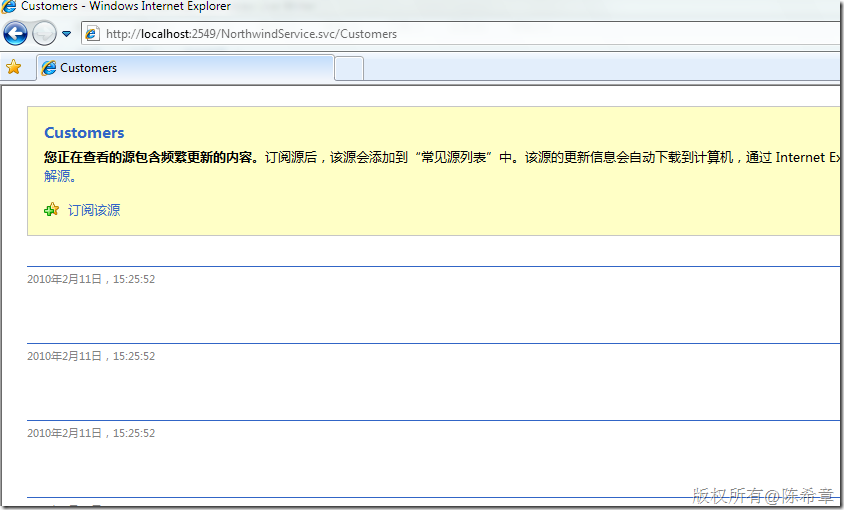
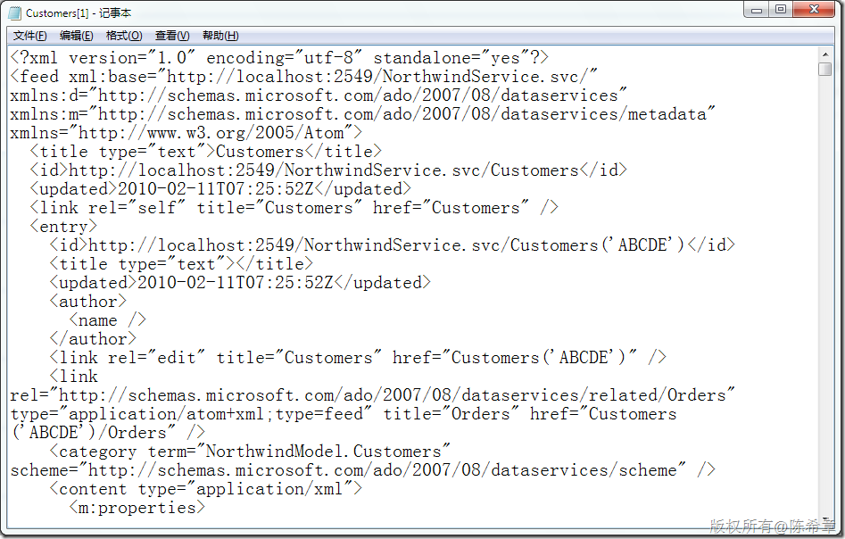
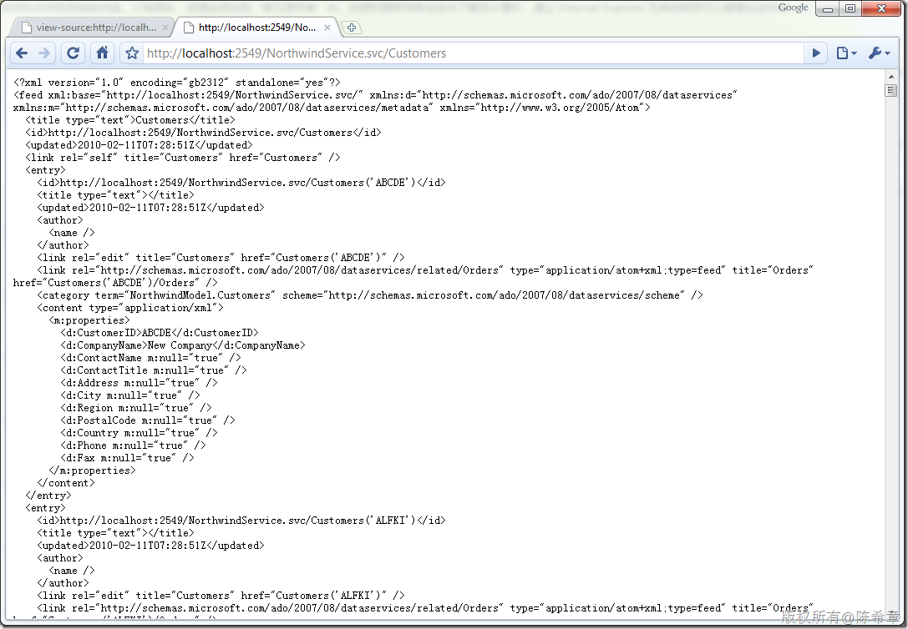
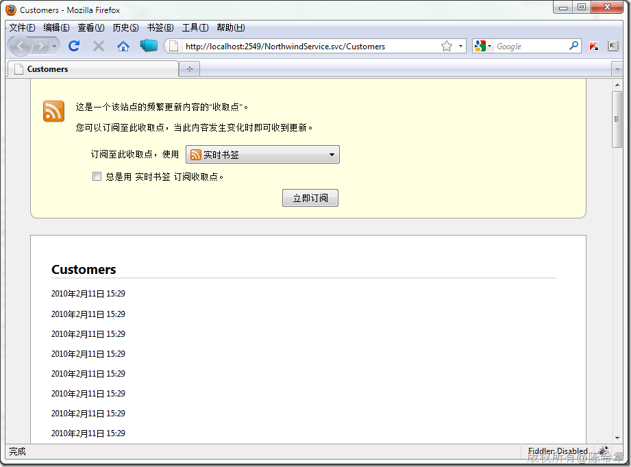
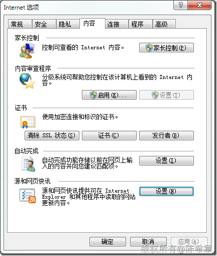
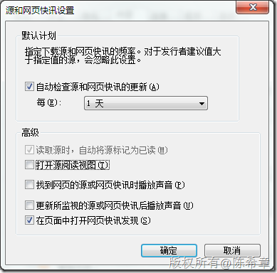
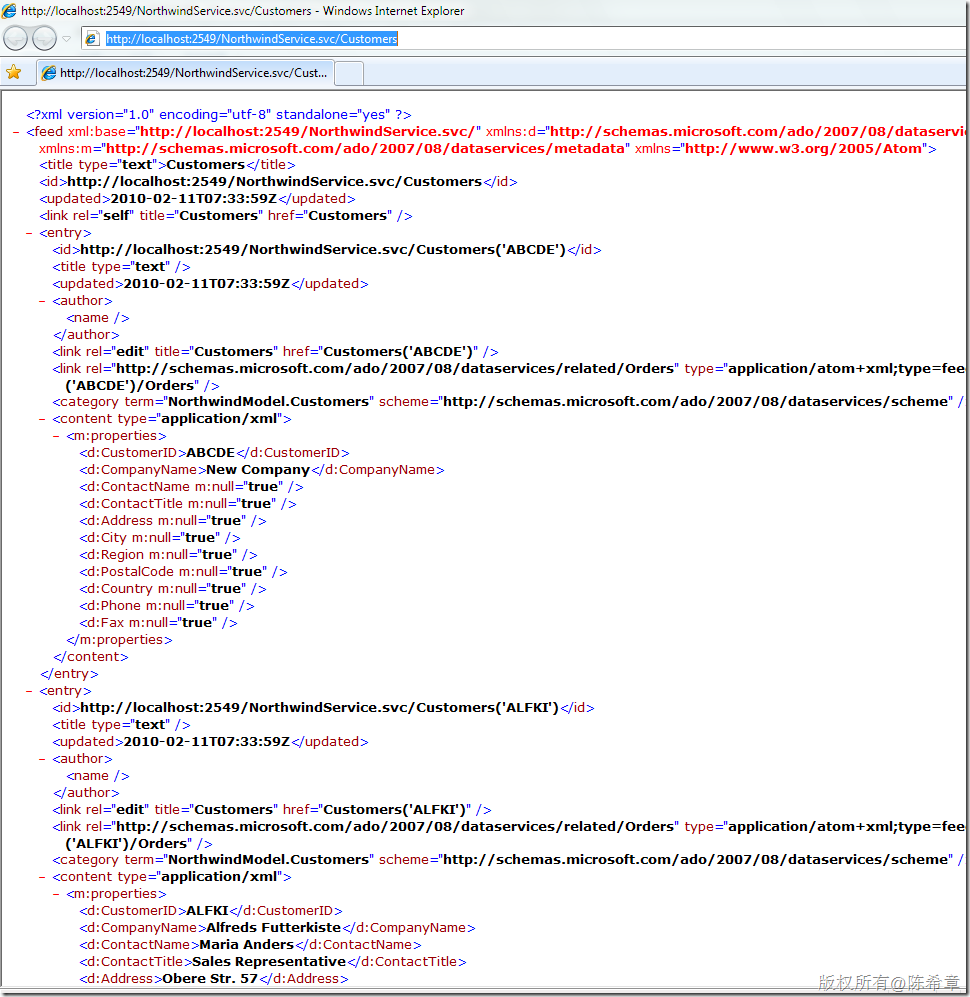

# 关闭IE浏览器的自动RSS阅读功能 
> 原文发表于 2010-02-28, 地址: http://www.cnblogs.com/chenxizhang/archive/2010/02/28/1675267.html 

这个小问题是在调试Data Service时想到的，其实这个功能本来还是不错的，IE7开始自动就能针对RSS资源进行阅读，如下图所示

  

 这个功能虽好，但是在Data Service这种场合下就显得很糟糕，因为它所给我们看到的简直就是不知所云。当然，我们可以通过右键菜单中，查看源文件了解到到底这个请求返回了什么

  

 但这样其实很麻烦，在Chrome浏览器就直接可以看到内容。（因为它没有自做主张地进行RSS阅读）

  

 在Firefox则是下面这样

  

 好吧，讲了这么多，我还是讲解一下如何关闭IE的自动阅读RSS吧，我认为这种功能并不是那么有必要

  

 点击上图中的“源和网页快讯”=〉“设置”

  

  

 勾除掉上图中的“打开源阅读视图”，然后点击“确定”

  

 呃。。。整个世界清净了

