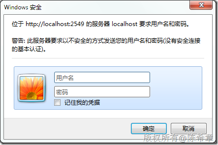
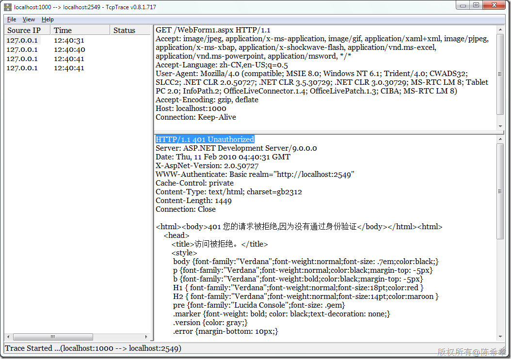
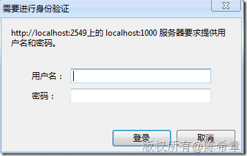
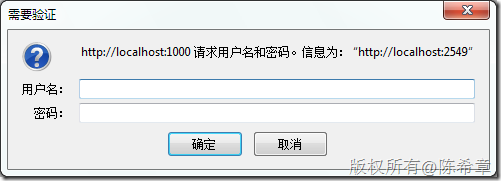
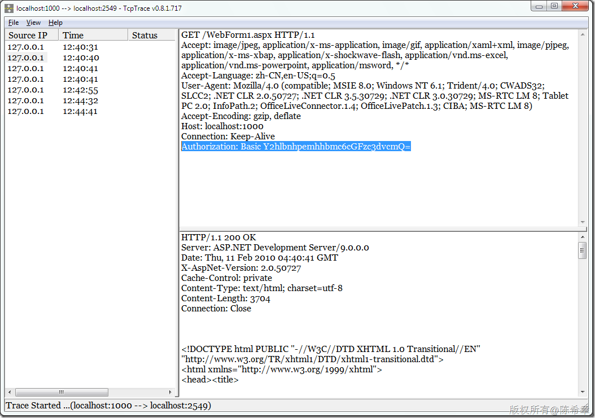
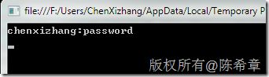

# 如何在Web应用程序中实现自定义身份验证对话框 
> 原文发表于 2010-02-28, 地址: http://www.cnblogs.com/chenxizhang/archive/2010/02/28/1675303.html 


这个标题可能并不太准确，我这样来描述一下我们的意图吧：

 我们知道在Web应用程序中有几种主要的身份验证方式，典型的就是Windows验证和Forms验证。如果设置为Windows验证的话，那么既可以自动使用用户当前身份登录（如果在一个可信任的环境中），也可以弹出一个对话框要求用户输入用户名和密码。

 再来Forms验证，顾名思义，它是有一个表单来进行验证的，在web.config中，我们通常需要指定一个loginUrl。这样用户如果没有得到授权，则需要转到这个页面输入用户名和密码。

 但是，也有的朋友跟我提到，如果我们使用Forms验证，能不能也弹出一个对话框让用户输入用户名和密码呢？这的确是一个不错的问题。

 可惜的是,Forms验证无法提供这样的功能，但我们确实可以通过自定义验证来实现


```
using System;
using System.Text;
using System.Web;
using System.Security.Principal;

namespace DataServiceAuthenticationModule
{
    public class AuthenticationModule : IHttpModule
    {
        const string accessDeniedStatus = "拒绝访问";
        const string accessDeniedHtml = "<html><body>401 您的请求被拒绝,因为没有通过身份验证</body></html>";
        const string realmFormatString = "Basic realm=\"{0}\"";
        const string authServerHeader = "WWW-Authenticate";
        const string authClientHeader = "Authorization";
        const string basicAuth = "Basic";

        #region IHttpModule 成员

        public void Dispose()
        {

        }

        public void Init(HttpApplication context)
        {
            context.AuthenticateRequest += new EventHandler(context\_AuthenticateRequest);
        }

        void context\_AuthenticateRequest(object sender, EventArgs e)
        {
            HttpApplication context = (HttpApplication)sender;

            if (context.Request.Headers["Authorization"] == null)
            {
                UnAuthorization(context);

            }

            else
            {

                string credential = ASCIIEncoding.ASCII.GetString(Convert.FromBase64String(GetBase64CredentialsFromHeader()));
                string[] usernameandpassword = credential.Split(':');
                bool isAuthenticate=Authenticate(usernameandpassword[0], usernameandpassword[1]);

                if (!isAuthenticate)
                {
                    UnAuthorization(context);
                }
                context.Context.User= new MyPrinciple(
                    new MyIdentity(usernameandpassword[0], isAuthenticate ));
            }

        }

        private static void UnAuthorization(HttpApplication context)
        {
            context.Response.ContentEncoding = Encoding.GetEncoding("GB2312");
            context.Response.StatusCode = 401;
            context.Response.StatusDescription = accessDeniedStatus;
            context.Response.Write(accessDeniedHtml);
            // TODO: not sure this is quite right wrt realm.
            context.Response.AddHeader(authServerHeader,
                string.Format(realmFormatString, context.Request.Url.GetLeftPart(UriPartial.Authority)));
        }

        bool Authenticate(string username, string password)
        {
            //your code logic here to authenticate user

            if (username !="chenxizhang" || password!="password") return false;
            else
                return true;


        }

        string GetBase64CredentialsFromHeader()
        {

            string credsHeader =HttpContext.Current.Request.Headers[authClientHeader];

            string creds = null;


            int credsPosition =

              credsHeader.IndexOf(basicAuth, StringComparison.OrdinalIgnoreCase);


            if (credsPosition != -1)
            {

                credsPosition += basicAuth.Length + 1;


                creds = credsHeader.Substring(credsPosition,

                  credsHeader.Length - credsPosition);

            }

            return (creds);

        }


        #endregion
    }

    public class MyPrinciple : IPrincipal
    {

        private IIdentity \_id;

        public MyPrinciple(IIdentity id)
        {

            \_id = id;

        }

        public IIdentity Identity
        {

            get { return \_id; }

        }


        public bool IsInRole(string role)
        {

            throw new NotImplementedException();

        }


    }


    public class MyIdentity : IIdentity
    {

        private bool \_isAuthenticated = false;

        private string \_name;

        public MyIdentity(string name, bool isAuthenticated)
        {

            \_isAuthenticated = isAuthenticated;

            \_name = name;

        }

        public string AuthenticationType
        {

            get { throw new NotImplementedException(); }

        }


        public bool IsAuthenticated
        {

            get { return \_isAuthenticated; }

        }

        public string Name
        {

            get { return \_name; }

        }


    }

}

```

[](http://images.cnblogs.com/cnblogs_com/chenxizhang/WindowsLiveWriter/Web_B468/image_2.png) 


那么，在后面到底发生了什么呢？是怎么弹出这个对话框的呢？


[](http://images.cnblogs.com/cnblogs_com/chenxizhang/WindowsLiveWriter/Web_B468/image_4.png)
.csharpcode, .csharpcode pre
{
 font-size: small;
 color: black;
 font-family: consolas, "Courier New", courier, monospace;
 background-color: #ffffff;
 /*white-space: pre;*/
}
.csharpcode pre { margin: 0em; }
.csharpcode .rem { color: #008000; }
.csharpcode .kwrd { color: #0000ff; }
.csharpcode .str { color: #006080; }
.csharpcode .op { color: #0000c0; }
.csharpcode .preproc { color: #cc6633; }
.csharpcode .asp { background-color: #ffff00; }
.csharpcode .html { color: #800000; }
.csharpcode .attr { color: #ff0000; }
.csharpcode .alt 
{
 background-color: #f4f4f4;
 width: 100%;
 margin: 0em;
}
.csharpcode .lnum { color: #606060; }


这个对话框其实是浏览器弹出来的。浏览器收到了一个Response，内容为Unauthorized，所以它知道服务器端需要进行验证，所以它弹出了这个对话框。为了说明这一点，我们可以来看一下其他的浏览器弹出的对话框。下面这个是Google chrome浏览器弹出的


[](http://images.cnblogs.com/cnblogs_com/chenxizhang/WindowsLiveWriter/Web_B468/image_8.png) 


下面这个是Mozilla Firefox浏览器弹出的


[](http://images.cnblogs.com/cnblogs_com/chenxizhang/WindowsLiveWriter/Web_B468/image_10.png) 


那么，接下来我们看看，我们输入的用户名和密码是怎么发送给服务器的呢


[](http://images.cnblogs.com/cnblogs_com/chenxizhang/WindowsLiveWriter/Web_B468/image_12.png) 


我们看到了这样一串文本：


Y2hlbnhpemhhbmc6cGFzc3dvcmQ=


这里就是包含了我们输入的用户名和密码。注意，它并没有被加密。我们可以通过下面的几行代码很容易地将其还原为明文的字符串


```
using System;
using System.Text;

namespace ConsoleApplication1
{
    class Program
    {
        static void Main(string[] args)
        {
            string token = "Y2hlbnhpemhhbmc6cGFzc3dvcmQ=";
            byte[] buffer = Convert.FromBase64String(token);
            string output = Encoding.ASCII.GetString(buffer);
            Console.WriteLine(output);
            Console.Read();
        }
    }
}
[](http://images.cnblogs.com/cnblogs_com/chenxizhang/WindowsLiveWriter/Web_B468/image_14.png) 
```

```
这是用冒号隔开的字符串。
```

```
 
```

.csharpcode, .csharpcode pre
{
 font-size: small;
 color: black;
 font-family: consolas, "Courier New", courier, monospace;
 background-color: #ffffff;
 /*white-space: pre;*/
}
.csharpcode pre { margin: 0em; }
.csharpcode .rem { color: #008000; }
.csharpcode .kwrd { color: #0000ff; }
.csharpcode .str { color: #006080; }
.csharpcode .op { color: #0000c0; }
.csharpcode .preproc { color: #cc6633; }
.csharpcode .asp { background-color: #ffff00; }
.csharpcode .html { color: #800000; }
.csharpcode .attr { color: #ff0000; }
.csharpcode .alt 
{
 background-color: #f4f4f4;
 width: 100%;
 margin: 0em;
}
.csharpcode .lnum { color: #606060; }
