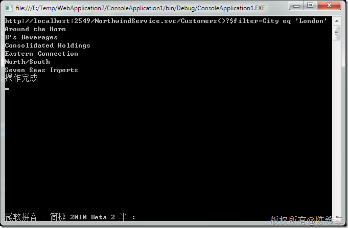
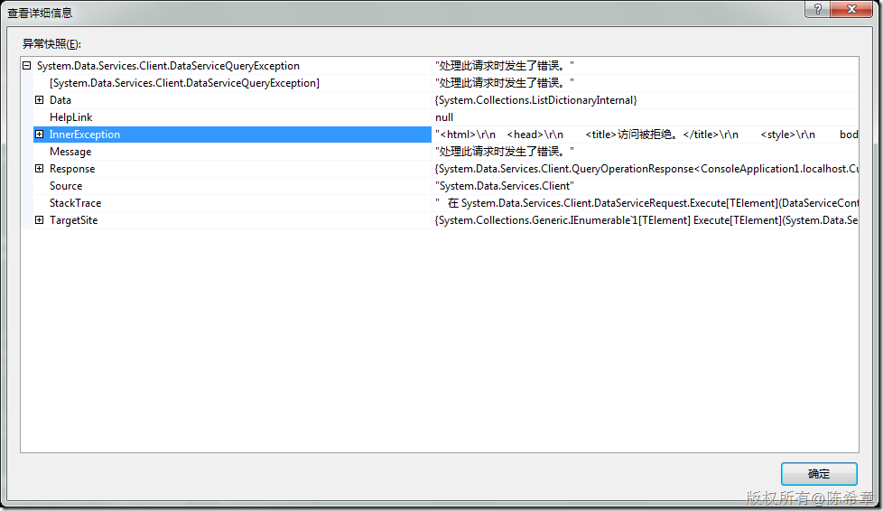
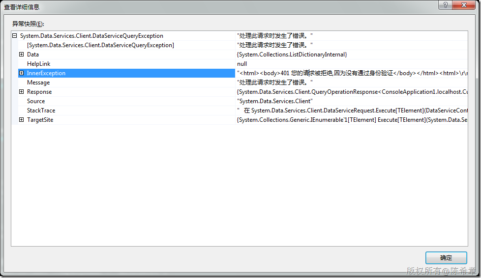
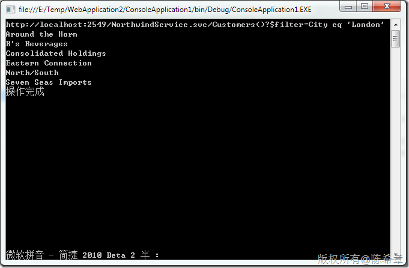

# ADO.NET Data Service:如何做身份验证 
> 原文发表于 2010-02-28, 地址: http://www.cnblogs.com/chenxizhang/archive/2010/02/28/1675307.html 


ADO.NET Data Service是基于WCF的一套REST风格的服务，但是它在很多方面又与WCF很不一样，典型的情况就是在身份验证方面。这篇文章专门来说一说如何为其实现身份验证。

 1. 采用Windows验证方式。

 这种方式总是最简单也是最安全的。基本上我们也无需做太多事情。

 web.config中配置


```
<authentication mode="Windows"/>
    <authorization>
      <allow users="Chenxizhang-pc\chenxizhang"/>
      <deny users="*"/>
</authorization>
```


.csharpcode, .csharpcode pre
{
 font-size: small;
 color: black;
 font-family: consolas, "Courier New", courier, monospace;
 background-color: #ffffff;
 /*white-space: pre;*/
}
.csharpcode pre { margin: 0em; }
.csharpcode .rem { color: #008000; }
.csharpcode .kwrd { color: #0000ff; }
.csharpcode .str { color: #006080; }
.csharpcode .op { color: #0000c0; }
.csharpcode .preproc { color: #cc6633; }
.csharpcode .asp { background-color: #ffff00; }
.csharpcode .html { color: #800000; }
.csharpcode .attr { color: #ff0000; }
.csharpcode .alt 
{
 background-color: #f4f4f4;
 width: 100%;
 margin: 0em;
}
.csharpcode .lnum { color: #606060; }


Data Service里面，我们要通过所谓的QueryInterceptor进行拦截


```
        [QueryInterceptor("Customers")]
        public Expression<Func<Customers, bool>> OnQueryCustomers()
        {
            if (!HttpContext.Current.User.Identity.IsAuthenticated)
                throw new AuthenticationException();
            else
                return (c) => true;
        }
```

.csharpcode, .csharpcode pre
{
 font-size: small;
 color: black;
 font-family: consolas, "Courier New", courier, monospace;
 background-color: #ffffff;
 /*white-space: pre;*/
}
.csharpcode pre { margin: 0em; }
.csharpcode .rem { color: #008000; }
.csharpcode .kwrd { color: #0000ff; }
.csharpcode .str { color: #006080; }
.csharpcode .op { color: #0000c0; }
.csharpcode .preproc { color: #cc6633; }
.csharpcode .asp { background-color: #ffff00; }
.csharpcode .html { color: #800000; }
.csharpcode .attr { color: #ff0000; }
.csharpcode .alt 
{
 background-color: #f4f4f4;
 width: 100%;
 margin: 0em;
}
.csharpcode .lnum { color: #606060; }

这样，我们就实现了目的：该服务（或者说其他的网站资源），只允许Chenxizhang-pc\chenxizhang这个账号能访问到。


 


接下来，客户端中应该怎么做呢？


```
            localhost.NorthwindEntities context = new localhost.NorthwindEntities(
                new Uri("http://localhost:2549/NorthwindService.svc/"));

            ***context.Credentials = System.Net.CredentialCache.DefaultNetworkCredentials;***
            ////查询
            var query = from c in context.Customers
                        where c.City.Equals("London")
                        select c;


            Console.WriteLine(query.ToString());
            foreach (var item in query)
            {
                Console.WriteLine(item.CompanyName);
            }
```

```
现在我的身份是合法的，所以能看到结果
```

```
[](http://images.cnblogs.com/cnblogs_com/chenxizhang/WindowsLiveWriter/ADO.NETDataService_76BA/image_2.png) 
```

```
但是如果我把下面这一句去除掉
```

```
<allow users="Chenxizhang-pc\chenxizhang"/>
```


.csharpcode, .csharpcode pre
{
 font-size: small;
 color: black;
 font-family: consolas, "Courier New", courier, monospace;
 background-color: #ffffff;
 /*white-space: pre;*/
}
.csharpcode pre { margin: 0em; }
.csharpcode .rem { color: #008000; }
.csharpcode .kwrd { color: #0000ff; }
.csharpcode .str { color: #006080; }
.csharpcode .op { color: #0000c0; }
.csharpcode .preproc { color: #cc6633; }
.csharpcode .asp { background-color: #ffff00; }
.csharpcode .html { color: #800000; }
.csharpcode .attr { color: #ff0000; }
.csharpcode .alt 
{
 background-color: #f4f4f4;
 width: 100%;
 margin: 0em;
}
.csharpcode .lnum { color: #606060; }

就会发生一个错误


[](http://images.cnblogs.com/cnblogs_com/chenxizhang/WindowsLiveWriter/ADO.NETDataService_76BA/image_4.png) 


```
很好，我们这样就实现了身份验证了。
```

```
等一下，这样是否就真的万事大吉了呢？大家要知道，不是任何场合都有机会使用Windows验证的，例如在internet上，可能就无法使用Windows验证方式。
```

```
那么，是不是可以使用传统的Forms验证呢？如果在一个网站内部，那么看起来确实可以：先让用户去一个页面(Login.aspx)进行登录，此时它的凭据会保存起来，然后再访问服务的话就拥有了身份。
```

```
但是，问题是，如果仅仅在网站内部使用，那么有什么必要用Data Service呢？为什么不直接用EDM去存取数据库呢？
```

```
 
```

```
好吧，那么，如果我们既希望在外部能访问到这个Data Service，又不想用Windows 验证，并且我们也无法使用Forms验证，那么该怎么办呢？答案是自定义验证。
```

```
首先，我们编写一个HttpModule
```

```
using System;
using System.Collections.Generic;
using System.Linq;
using System.Text;
using System.Web;
using System.Security.Principal;

namespace DataServiceAuthenticationModule
{
    public class AuthenticationModule : IHttpModule
    {
        const string accessDeniedStatus = "拒绝访问";
        const string accessDeniedHtml = "<html><body>401 您的请求被拒绝,因为没有通过身份验证</body></html>";
        const string realmFormatString = "Basic realm=\"{0}\"";
        const string authServerHeader = "WWW-Authenticate";
        const string authClientHeader = "Authorization";
        const string basicAuth = "Basic";

        #region IHttpModule 成员

        public void Dispose()
        {

        }

        public void Init(HttpApplication context)
        {
            context.AuthenticateRequest += new EventHandler(context\_AuthenticateRequest);
        }

        void context\_AuthenticateRequest(object sender, EventArgs e)
        {
            HttpApplication context = (HttpApplication)sender;
            if (context.Request.Headers["Authorization"] == null)
            {

                context.Response.StatusCode = 401;
                context.Response.StatusDescription = accessDeniedStatus;
                context.Response.Write(accessDeniedHtml);
                // TODO: not sure this is quite right wrt realm.

                context.Response.AddHeader(authServerHeader,string.Format(realmFormatString,context.Request.Url.GetLeftPart(UriPartial.Authority)));


            }

            else
            {

                string credential = ASCIIEncoding.ASCII.GetString(Convert.FromBase64String(GetBase64CredentialsFromHeader()));

                string[] usernameandpassword = credential.Split(':');
                context.Context.User= new MyPrinciple(
                    new MyIdentity(usernameandpassword[0], Authenticate(usernameandpassword[0], usernameandpassword[1])));

            }

        }

        bool Authenticate(string username, string password)
        {
            //your code logic here to authenticate user

            if (username !="chenxizhang" || password!="password") return false;
            else
                return true;

        }

        string GetBase64CredentialsFromHeader()
        {

            string credsHeader =HttpContext.Current.Request.Headers[authClientHeader];

            string creds = null;


            int credsPosition =

              credsHeader.IndexOf(basicAuth, StringComparison.OrdinalIgnoreCase);


            if (credsPosition != -1)
            {

                credsPosition += basicAuth.Length + 1;


                creds = credsHeader.Substring(credsPosition,

                  credsHeader.Length - credsPosition);

            }

            return (creds);

        }


        #endregion
    }

    public class MyPrinciple : IPrincipal
    {

        private IIdentity \_id;

        public MyPrinciple(IIdentity id)
        {

            \_id = id;

        }

        public IIdentity Identity
        {

            get { return \_id; }

        }


        public bool IsInRole(string role)
        {

            throw new NotImplementedException();

        }


    }


    public class MyIdentity : IIdentity
    {

        private bool \_isAuthenticated = false;

        private string \_name;

        public MyIdentity(string name, bool isAuthenticated)
        {

            \_isAuthenticated = isAuthenticated;

            \_name = name;

        }

        public string AuthenticationType
        {

            get { throw new NotImplementedException(); }

        }


        public bool IsAuthenticated
        {

            get { return \_isAuthenticated; }

        }

        public string Name
        {

            get { return \_name; }

        }


    }

}

```


.csharpcode, .csharpcode pre
{
 font-size: small;
 color: black;
 font-family: consolas, "Courier New", courier, monospace;
 background-color: #ffffff;
 /*white-space: pre;*/
}
.csharpcode pre { margin: 0em; }
.csharpcode .rem { color: #008000; }
.csharpcode .kwrd { color: #0000ff; }
.csharpcode .str { color: #006080; }
.csharpcode .op { color: #0000c0; }
.csharpcode .preproc { color: #cc6633; }
.csharpcode .asp { background-color: #ffff00; }
.csharpcode .html { color: #800000; }
.csharpcode .attr { color: #ff0000; }
.csharpcode .alt 
{
 background-color: #f4f4f4;
 width: 100%;
 margin: 0em;
}
.csharpcode .lnum { color: #606060; }


然后，我们将web.config中的身份验证模式改为不验证（也就是说由我们自定义验证）


```
        <authentication mode="None"/>

```


.csharpcode, .csharpcode pre
{
 font-size: small;
 color: black;
 font-family: consolas, "Courier New", courier, monospace;
 background-color: #ffffff;
 /*white-space: pre;*/
}
.csharpcode pre { margin: 0em; }
.csharpcode .rem { color: #008000; }
.csharpcode .kwrd { color: #0000ff; }
.csharpcode .str { color: #006080; }
.csharpcode .op { color: #0000c0; }
.csharpcode .preproc { color: #cc6633; }
.csharpcode .asp { background-color: #ffff00; }
.csharpcode .html { color: #800000; }
.csharpcode .attr { color: #ff0000; }
.csharpcode .alt 
{
 background-color: #f4f4f4;
 width: 100%;
 margin: 0em;
}
.csharpcode .lnum { color: #606060; }

然后，我们将上面这个模块注册到配置文件中


```
      <add name="DataServiceAuthentication" type="DataServiceAuthenticationModule.AuthenticationModule,DataServiceAuthenticationModule"/>
```


.csharpcode, .csharpcode pre
{
 font-size: small;
 color: black;
 font-family: consolas, "Courier New", courier, monospace;
 background-color: #ffffff;
 /*white-space: pre;*/
}
.csharpcode pre { margin: 0em; }
.csharpcode .rem { color: #008000; }
.csharpcode .kwrd { color: #0000ff; }
.csharpcode .str { color: #006080; }
.csharpcode .op { color: #0000c0; }
.csharpcode .preproc { color: #cc6633; }
.csharpcode .asp { background-color: #ffff00; }
.csharpcode .html { color: #800000; }
.csharpcode .attr { color: #ff0000; }
.csharpcode .alt 
{
 background-color: #f4f4f4;
 width: 100%;
 margin: 0em;
}
.csharpcode .lnum { color: #606060; }

配置好之后，我们再次运行一下客户端，收到了如下的错误。这一点都不奇怪，因为我们并没有传递身份过来。


[](http://images.cnblogs.com/cnblogs_com/chenxizhang/WindowsLiveWriter/ADO.NETDataService_76BA/image_6.png) 


那么客户端应该如何传递身份呢


```
            context.Credentials = new System.Net.NetworkCredential("chenxizhang", "password");

```


.csharpcode, .csharpcode pre
{
 font-size: small;
 color: black;
 font-family: consolas, "Courier New", courier, monospace;
 background-color: #ffffff;
 /*white-space: pre;*/
}
.csharpcode pre { margin: 0em; }
.csharpcode .rem { color: #008000; }
.csharpcode .kwrd { color: #0000ff; }
.csharpcode .str { color: #006080; }
.csharpcode .op { color: #0000c0; }
.csharpcode .preproc { color: #cc6633; }
.csharpcode .asp { background-color: #ffff00; }
.csharpcode .html { color: #800000; }
.csharpcode .attr { color: #ff0000; }
.csharpcode .alt 
{
 background-color: #f4f4f4;
 width: 100%;
 margin: 0em;
}
.csharpcode .lnum { color: #606060; }

这样的话，我们就能如愿看到结果了


[](http://images.cnblogs.com/cnblogs_com/chenxizhang/WindowsLiveWriter/ADO.NETDataService_76BA/image_8.png) 


```
写到这里，我想很多朋友就看明白了，我们做了一个自定义的HttpModule，接管了请求的身份验证过程。那么现在的做法是直接比较用户名和密码，是不是很不合理呢？
```

```
当然，正式的环境下我们不能这么做，但是你既然拿到了username,和password，其实你要怎么验证都不重要了。
```

```
 
```

```
 
```

```
.csharpcode, .csharpcode pre
{
 font-size: small;
 color: black;
 font-family: consolas, "Courier New", courier, monospace;
 background-color: #ffffff;
 /*white-space: pre;*/
}
.csharpcode pre { margin: 0em; }
.csharpcode .rem { color: #008000; }
.csharpcode .kwrd { color: #0000ff; }
.csharpcode .str { color: #006080; }
.csharpcode .op { color: #0000c0; }
.csharpcode .preproc { color: #cc6633; }
.csharpcode .asp { background-color: #ffff00; }
.csharpcode .html { color: #800000; }
.csharpcode .attr { color: #ff0000; }
.csharpcode .alt 
{
 background-color: #f4f4f4;
 width: 100%;
 margin: 0em;
}
.csharpcode .lnum { color: #606060; }

```
