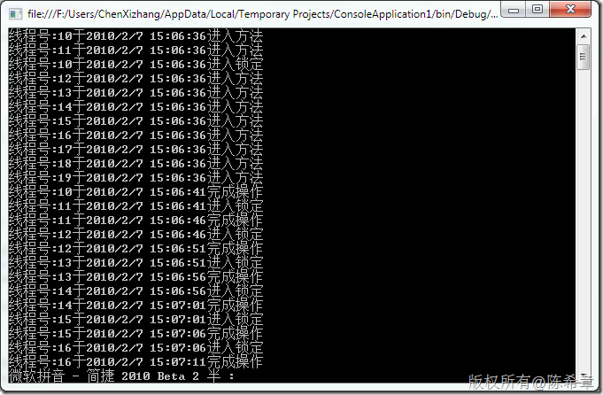

# 单件模式(Singleton)和锁定(lock) 
> 原文发表于 2010-02-28, 地址: http://www.cnblogs.com/chenxizhang/archive/2010/02/28/1675310.html 


利用过年休假的时间，重读《设计模式》一书，做了一些笔记，这是第一篇

 单件模式，或者也可以称为单例模式(singleton)是23种常见模式中最简单的，也是第一个模式。它的目的是保证一个类(class）在应用系统中只有一个实例(instance)，为什么要这么做呢？有两个主要原因

 1. 节省内存（因为只有一个实例了，所以内存自然会更节省） - 保存状态，例如要做整个程序级别的计数统计这一类的工作。

 单例模式的做法，主要是将类型的默认构造函数（无参构造器）的访问级别降低（设置为private）,这样就无法通过new关键字来创建实例，然后在类型中提供一个静态的方法，即所有的调用都必须通过这个方法来取得实例，这时就自然有办法进行一些控制了。

 既然用一个实例，就多多少少会涉及到资源争用的问题，也就是说多个线程可能在同一个时间需要操作实例中的某些资源。.NET中提供的线程同步技术可以保证资源的修改是不会有冲突的。

 对于单件模式，我简要总结如下

 1. 控制实例化 - 并不常用 - 可以由静态类代替

 下面是一个综合例子

  


```
using System;
using System.Collections.Generic;
using System.Linq;
using System.Text;
using System.Threading;

namespace Sample
{
    class Program
    {
        static void Main(string[] args)
        {
            for (int i = 0; i < 10; i++)
            {

                Thread t = new Thread(() =>
                {
                    Singleton.getInstance();
                });
                t.Start();


            }

            Console.Read(); 
        }
    }

    public class Singleton
    {
        private Singleton() { }

        private static Singleton instance = null;
        private static object obj = new object();
        public static Singleton getInstance()
        {
            Console.WriteLine("线程号:{0}于{1}进入方法", Thread.CurrentThread.ManagedThreadId, DateTime.Now);
            lock (obj)
            {

                Console.WriteLine("线程号:{0}于{1}进入锁定", Thread.CurrentThread.ManagedThreadId, DateTime.Now);
                Thread.Sleep(5000);//休眠5秒钟

                //这个方法比上面有所改进，不用每次都进行生成对象，只是第一次 //使用时生成实例，提高了效率！ 
                if (instance == null)
                    instance = new Singleton();

                Console.WriteLine("线程号:{0}于{1}完成操作", Thread.CurrentThread.ManagedThreadId, DateTime.Now);

                return instance;
            }

        }
    }

}

```

```
该程序运行的效果如下
```

```
[](http://images.cnblogs.com/cnblogs_com/chenxizhang/WindowsLiveWriter/Singletonlock_D6AA/image_2.png) 
```

```
也就是说，不同的线程确实可以同时进入一个方法，但如果遇到了lock语句，而且lock语句块没有结束之前，它就需要等待，这样就是依此进入的效果
```

```
 
```

```
 
```

.csharpcode, .csharpcode pre
{
 font-size: small;
 color: black;
 font-family: consolas, "Courier New", courier, monospace;
 background-color: #ffffff;
 /*white-space: pre;*/
}
.csharpcode pre { margin: 0em; }
.csharpcode .rem { color: #008000; }
.csharpcode .kwrd { color: #0000ff; }
.csharpcode .str { color: #006080; }
.csharpcode .op { color: #0000c0; }
.csharpcode .preproc { color: #cc6633; }
.csharpcode .asp { background-color: #ffff00; }
.csharpcode .html { color: #800000; }
.csharpcode .attr { color: #ff0000; }
.csharpcode .alt 
{
 background-color: #f4f4f4;
 width: 100%;
 margin: 0em;
}
.csharpcode .lnum { color: #606060; }
