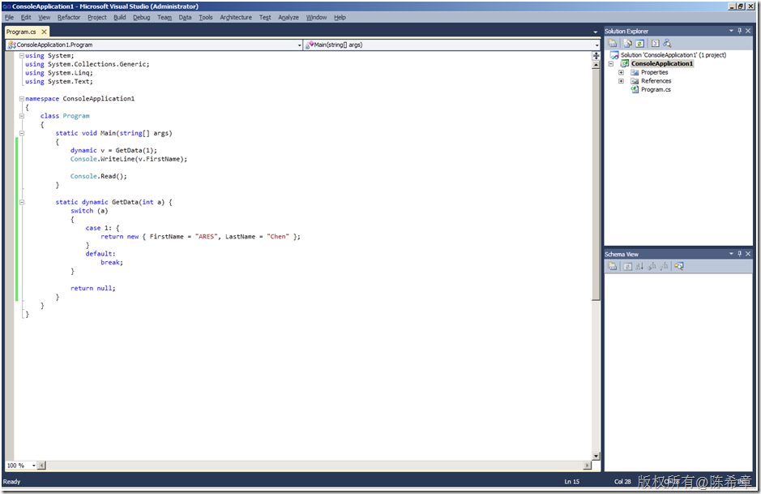

# Dynamic 和 Dynamic Language Runtime（DLR） 
> 原文发表于 2010-03-09, 地址: http://www.cnblogs.com/chenxizhang/archive/2010/03/09/1681331.html 

从 .NET 4开始支持动态语言，所谓动态语言就是很类似于javascript那种语言，它在编译时并不检查对象的类型，而是在运行时动态地决定要用什么类型。

 这样做的好处当然是灵活 ，也确实可以解决很多问题。典型的情况如COM Interop和DOM操作等等 。 当然，他们的问题就是可能会导致运行时错误

 有朋友可能会说，这个与C# 3中的var有什么区别呢？看看下面这个例子就知道了

  

 应该说，虽然C# 3提供了var这个关键字，但其实称不上动态语言。因为var不能作为方法的返回值类型。虽然它确实可以在方法内部作为匿名类型声明的方式。

 老实说，上面这个例子我们当初可是伤透了脑筋啊。

  

 关于dynamic语言的介绍，请参考[http://msdn.microsoft.com/en-us/library/dd264736(VS.100).aspx](http://msdn.microsoft.com/en-us/library/dd264736(VS.100).aspx "http://msdn.microsoft.com/en-us/library/dd264736(VS.100).aspx")

 那么，什么是DLR呢？很显然，既然我们需要支持dynamic这种语言特性，所以当然就需要在Framework中对其进行解析和处理。所谓DLR就是Framework中的一个特殊组件，它就负责这个工作。

 它与CLR的关系如下图所示，其实也就是说CLR这个层面是基于静态类型，或者说强类型的； 而DLR则是基于动态类型的处理引擎。

 .png)

 关于DLR的完整介绍，有兴趣的朋友可以参考[http://msdn.microsoft.com/en-us/library/dd233052(VS.100).aspx](http://msdn.microsoft.com/en-us/library/dd233052(VS.100).aspx "http://msdn.microsoft.com/en-us/library/dd233052(VS.100).aspx")

