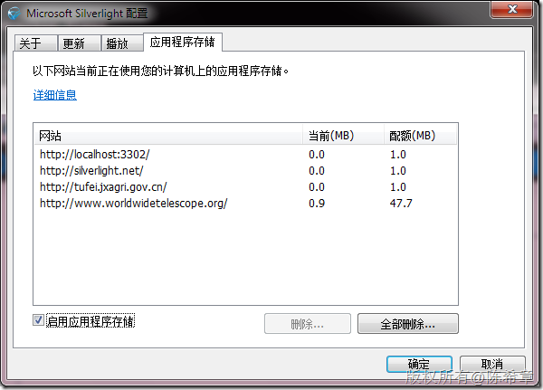
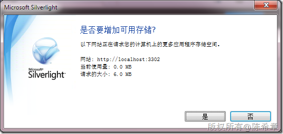
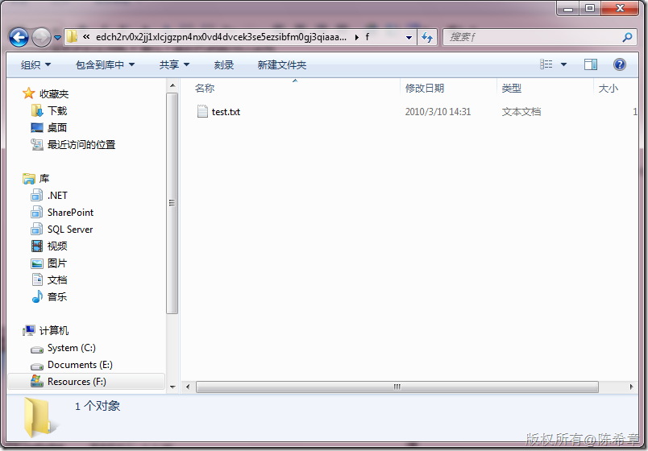

# Silverlight应用程序 的隔离存储 
> 原文发表于 2010-03-10, 地址: http://www.cnblogs.com/chenxizhang/archive/2010/03/10/1682492.html 


我们都知道Silverlight的应用程序其实是属于客户端应用。那么它们如果需要在客户端机器存储一些文件，就自然需要一定特殊的机制 。

 这两天在讲.NET Framework的时候就讲到了隔离存储机制 ，有些朋友对此不甚理解。其实Silverlight就是一个很典型的应用场景。因为Silverlight程序通常权限是很低的。

 首先来看，用户可以通过选项控制是否允许Silverlight程序在本机存储数据

 [](http://images.cnblogs.com/cnblogs_com/chenxizhang/WindowsLiveWriter/Silverlight_CE5C/image_2.png) 

 默认情况下，浏览器中的Silverlight可用的空间为1MB，浏览器外的，则为50MB

 那么，我们如何申请更多的空间呢？通过下面的代码就可以实现


```
            IsolatedStorageFile file = IsolatedStorageFile.GetUserStoreForApplication();
            MessageBox.Show(string.Format("还剩下的空间是:{0}",file.AvailableFreeSpace));

            try//必须用try的方式，否则直接就失败了
            {
                if (file.IncreaseQuotaTo(6 * 1024 * 1024) == true)//申请6MB的数据空间 
                {

                    IsolatedStorageFileStream fs = new IsolatedStorageFileStream("test.txt", System.IO.FileMode.Create, file);
                    StreamWriter sw = new StreamWriter(fs);
                    sw.WriteLine("Hello,world");
                    sw.Close();
                    MessageBox.Show("写入文件成功");
                }
                else
                    MessageBox.Show("申请空间失败");
            }
            catch(Exception ex){
                MessageBox.Show(ex.Message);
            }
```

.csharpcode, .csharpcode pre
{
 font-size: small;
 color: black;
 font-family: consolas, "Courier New", courier, monospace;
 background-color: #ffffff;
 /*white-space: pre;*/
}
.csharpcode pre { margin: 0em; }
.csharpcode .rem { color: #008000; }
.csharpcode .kwrd { color: #0000ff; }
.csharpcode .str { color: #006080; }
.csharpcode .op { color: #0000c0; }
.csharpcode .preproc { color: #cc6633; }
.csharpcode .asp { background-color: #ffff00; }
.csharpcode .html { color: #800000; }
.csharpcode .attr { color: #ff0000; }
.csharpcode .alt 
{
 background-color: #f4f4f4;
 width: 100%;
 margin: 0em;
}
.csharpcode .lnum { color: #606060; }

[](http://images.cnblogs.com/cnblogs_com/chenxizhang/WindowsLiveWriter/Silverlight_CE5C/image_4.png) 


 


其实，虽然同样使用了隔离存储的技术，但Silverlight做了进一步对限制，大家如果有兴趣可以看看IsolatedStorageFile这个类型，很多方法都没有了。


事实上，Silverlight存储文件的路径也非常怪异，它并不在标准的IsolationStorge目录里面


F:\Users\ChenXizhang\AppData\LocalLow\Microsoft\Silverlight\is\45r33qqq.kk0\rmmfg5ux.wwp\1\s\edch2rv0x2jj1xlcjgzpn4nx0vd4dvcek3se5ezsibfm0gj3qiaaahda\f


[](http://images.cnblogs.com/cnblogs_com/chenxizhang/WindowsLiveWriter/Silverlight_CE5C/image_6.png)

