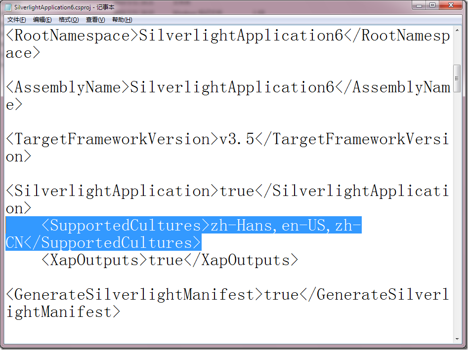

# Silverlight中的多语言支持中几个特殊之处 
> 原文发表于 2010-03-11, 地址: http://www.cnblogs.com/chenxizhang/archive/2010/03/11/1683714.html 

**1. 需要手工修改项目文件才支持多语言，请参考下面文章**

 [http://www.cnblogs.com/KevinYang/archive/2008/11/10/1330305.html](http://www.cnblogs.com/KevinYang/archive/2008/11/10/1330305.html "http://www.cnblogs.com/KevinYang/archive/2008/11/10/1330305.html")

  

 
>  **这不得不说是一个很不好的设计**
> 
> 

 
>  10. 为了编译时能够将语言包打包到Xap包中去，我们需要设置一下工程文件： 　　　　A). 右键工程文件，选择Unload Project，然后再Edit Project。（或者你也可以直接在工程文件夹中直接修改.csproj文件） 　　B). 找到SupportedCultures这个节点，添加文本节点 <SupportedCultures>en-US,zh-CN,zh-TW</SupportedCultures> 
> 
> 
> 
> 
> 
> 
> 
> 

    **2. 另外值得关心一下，zh-Hans是什么东东呢？** 下面这个文章说明了这一点 [http://blogs.msdn.com/jijia/archive/2010/01/08/textblock.aspx](http://blogs.msdn.com/jijia/archive/2010/01/08/textblock.aspx "http://blogs.msdn.com/jijia/archive/2010/01/08/textblock.aspx")   也就是说以后zh-CHS估计会被zh-hans代替 

