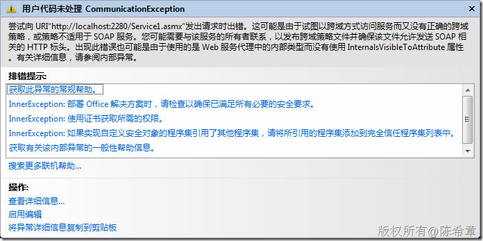
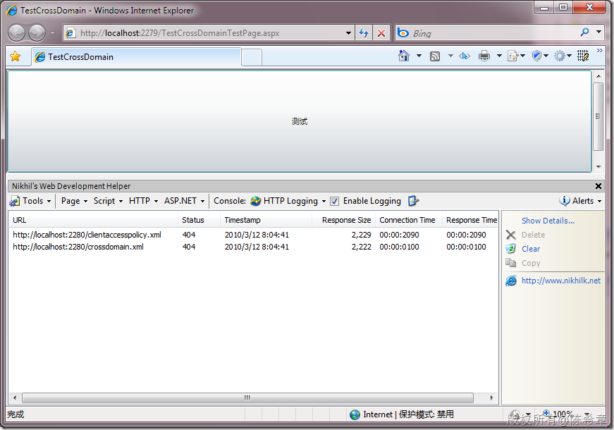

# Silverlight的跨站策略和跨站策略文件 
> 原文发表于 2010-03-12, 地址: http://www.cnblogs.com/chenxizhang/archive/2010/03/12/1683939.html 

如果我们需要在Silverlight中跨站调用Web Service，则可能会遇到这个问题：默认情况下，Silverlight是不允许你这么做的。那么如何来解决该问题呢，请看Tim下面的这篇文章

 [http://timheuer.com/blog/archive/2008/04/06/silverlight-cross-domain-policy-file-snippet-intellisense.aspx](http://timheuer.com/blog/archive/2008/04/06/silverlight-cross-domain-policy-file-snippet-intellisense.aspx "http://timheuer.com/blog/archive/2008/04/06/silverlight-cross-domain-policy-file-snippet-intellisense.aspx")

 简单而言，Silverlight并非不支持跨站调用，而是会首先检查一个文件**clientaccesspolicy.xml** 如果该文件找不到，则查找另外一个文件**crossdomain.xml ，**然后再找不到的话，就报告错误了

  

 这个问题可以通过监视工具很简单地看出来 

  

  

 

 If you are starting to get into integrating web services with **Silverlight**, you'll notice that you have to have a cross domain policy file in place on the **target** server, that is to say, the server hosting the service you want to implement.  There are some public web services (Flickr, YouTube, Digg, etc.) that already have these files in place for Flash, but implement in a slightly different way. When calling a cross-domain service, Silverlight will check for the existence of **clientaccesspolicy.xml** first.  This is the format defined by Silverlight and provides a pretty flexible way to define who can access what services.  If not found, it will then default to look for **crossdomain.xml**, which is the file format implemented for Adobe Flash.  It is important to note that this file will also still work for most public web services. 

