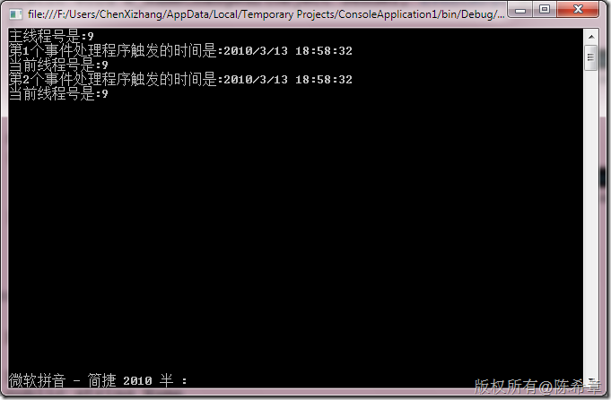

# 事件处理程序的处理顺序问题 
> 原文发表于 2010-03-13, 地址: http://www.cnblogs.com/chenxizhang/archive/2010/03/13/1685198.html 


这也是今天讨论到的一个话题，其实还是比较简单的。因为事件处理程序都是在主线程被执行的，所以主线程肯定是依次执行他们。那么究竟是什么决定了这个顺序呢？


```
using System;
using System.Collections.Generic;
using System.Linq;
using System.Text;
using System.Reflection;

using System.Threading;
namespace ConsoleApplication1
{
    class Program
    {
        static void Main(string[] args)
        {
            ///这个例子解释了如果为一个事件绑定了多个事件处理程序，那么他们处理的顺序与绑定顺序是一致的

            Console.WriteLine("主线程号是:{0}", Thread.CurrentThread.ManagedThreadId);

            Employee e = new Employee();
            e.NameChanged += new EventHandler(e\_NameChanged);
            e.NameChanged += new EventHandler(e\_NameChanged2);
            e.Name = "ares chen";

            Console.Read();
        }

        static void e\_NameChanged2(object sender, EventArgs e)
        {
            
            Console.WriteLine("第2个事件处理程序触发的时间是:{0}", DateTime.Now);
            Console.WriteLine("当前线程号是:{0}", Thread.CurrentThread.ManagedThreadId);
        }

        static void e\_NameChanged(object sender, EventArgs e)
        {
            Console.WriteLine("第1个事件处理程序触发的时间是:{0}", DateTime.Now);
            Console.WriteLine("当前线程号是:{0}", Thread.CurrentThread.ManagedThreadId);            
        }
    }


    class Employee
    {
        public event EventHandler NameChanged;

        private string name;
        public string Name
        {
            get
            {
                return name;
            }
            set
            {
                name = value;
                if (NameChanged != null)
                    NameChanged(this, null);
            }
        }
    }
}

```


.csharpcode, .csharpcode pre
{
 font-size: small;
 color: black;
 font-family: consolas, "Courier New", courier, monospace;
 background-color: #ffffff;
 /*white-space: pre;*/
}
.csharpcode pre { margin: 0em; }
.csharpcode .rem { color: #008000; }
.csharpcode .kwrd { color: #0000ff; }
.csharpcode .str { color: #006080; }
.csharpcode .op { color: #0000c0; }
.csharpcode .preproc { color: #cc6633; }
.csharpcode .asp { background-color: #ffff00; }
.csharpcode .html { color: #800000; }
.csharpcode .attr { color: #ff0000; }
.csharpcode .alt 
{
 background-color: #f4f4f4;
 width: 100%;
 margin: 0em;
}
.csharpcode .lnum { color: #606060; }


[](http://images.cnblogs.com/cnblogs_com/chenxizhang/WindowsLiveWriter/f79fd1bc11ab_10EC0/image_2.png) 


其实要深入看的话，这是因为事件的处理程序是通过一个列表来管理的，就是EventHandlerList


```

[HostProtection(SecurityAction.LinkDemand, SharedState=true)]
public sealed class EventHandlerList : IDisposable
{
    // Fields
    private ListEntry head;
    private Component parent;

    // Methods
    public EventHandlerList()
    {
    }

    internal EventHandlerList(Component parent)
    {
        this.parent = parent;
    }

    public void AddHandler(object key, Delegate value)
    {
        ListEntry entry = this.Find(key);
        if (entry != null)
        {
            entry.handler = **Delegate.Combine**(entry.handler, value);//这里的关键在于Delegate.Combine，所以根据注册顺序不一样，是一个顺序型的组合
        }
        else
        {
            this.head = new ListEntry(key, value, this.head);
        }
    }

    public void AddHandlers(EventHandlerList listToAddFrom)
    {
        for (ListEntry entry = listToAddFrom.head; entry != null; entry = entry.next)
        {
            this.AddHandler(entry.key, entry.handler);
        }
    }

    public void Dispose()
    {
        this.head = null;
    }

    private ListEntry Find(object key)
    {
        ListEntry head = this.head;
        while (head != null)
        {
            if (head.key == key)
            {
                return head;
            }
            head = head.next;
        }
        return head;
    }

    public void RemoveHandler(object key, Delegate value)
    {
        ListEntry entry = this.Find(key);
        if (entry != null)
        {
            entry.handler = Delegate.Remove(entry.handler, value);
        }
    }

    // Properties
    public Delegate this[object key]
    {
        get
        {
            ListEntry entry = null;
            if ((this.parent == null) || this.parent.CanRaiseEventsInternal)
            {
                entry = this.Find(key);
            }
            if (entry != null)
            {
                return entry.handler;
            }
            return null;
        }
        set
        {
            ListEntry entry = this.Find(key);
            if (entry != null)
            {
                entry.handler = value;
            }
            else
            {
                this.head = new ListEntry(key, value, this.head);
            }
        }
    }

    // Nested Types
    private sealed class ListEntry
    {
        // Fields
        internal Delegate handler;
        internal object key;
        internal EventHandlerList.ListEntry next;

        // Methods
        public ListEntry(object key, Delegate handler, EventHandlerList.ListEntry next)
        {
            this.next = next;
            this.key = key;
            this.handler = handler;
        }
    }
}


所以,既然是通过线性表来保存的，那么就有一个先后顺序的情况。其实，一个更好的写法是下面这样的
```

```
 
```

```
using System;
using System.Collections.Generic;
using System.Linq;
using System.Text;
using System.Reflection;

using System.Threading;
using System.ComponentModel;
namespace ConsoleApplication1
{
    class Program
    {
        static void Main(string[] args)
        {
            ///这个例子解释了如果为一个事件绑定了多个事件处理程序，那么他们处理的顺序与绑定顺序是一致的

            Console.WriteLine("主线程号是:{0}", Thread.CurrentThread.ManagedThreadId);

            Employee e = new Employee();
            e.NameChanged += new EventHandler(e\_NameChanged);
            e.NameChanged += new EventHandler(e\_NameChanged2);

            
            e.Name = "ares chen";

            Console.Read();
        }

        static void e\_NameChanged2(object sender, EventArgs e)
        {
            
            Console.WriteLine("第2个事件处理程序触发的时间是:{0}", DateTime.Now);
            Console.WriteLine("当前线程号是:{0}", Thread.CurrentThread.ManagedThreadId);
        }

        static void e\_NameChanged(object sender, EventArgs e)
        {
            Console.WriteLine("第1个事件处理程序触发的时间是:{0}", DateTime.Now);
            Console.WriteLine("当前线程号是:{0}", Thread.CurrentThread.ManagedThreadId);            
        }
    }


    class Employee
    {
        //public event EventHandler NameChanged;

 **protected EventHandlerList listEventDelegates = new EventHandlerList();
 private object NameChangedEventKey = new object();

 public event EventHandler NameChanged {
 add {
 listEventDelegates.AddHandler(NameChangedEventKey, value);
 }
 remove {
 listEventDelegates.RemoveHandler(NameChangedEventKey, value);
 }
 }**

        private string name;
        public string Name
        {
            get
            {
                return name;
            }
            set
            {
                name = value;


 **if (listEventDelegates[NameChangedEventKey] != null) {
 listEventDelegates[NameChangedEventKey].DynamicInvoke(new object[] { this, null });
 }**
            }
        }
    }
}

```

.csharpcode, .csharpcode pre
{
 font-size: small;
 color: black;
 font-family: consolas, "Courier New", courier, monospace;
 background-color: #ffffff;
 /*white-space: pre;*/
}
.csharpcode pre { margin: 0em; }
.csharpcode .rem { color: #008000; }
.csharpcode .kwrd { color: #0000ff; }
.csharpcode .str { color: #006080; }
.csharpcode .op { color: #0000c0; }
.csharpcode .preproc { color: #cc6633; }
.csharpcode .asp { background-color: #ffff00; }
.csharpcode .html { color: #800000; }
.csharpcode .attr { color: #ff0000; }
.csharpcode .alt 
{
 background-color: #f4f4f4;
 width: 100%;
 margin: 0em;
}
.csharpcode .lnum { color: #606060; }

.csharpcode, .csharpcode pre
{
 font-size: small;
 color: black;
 font-family: consolas, "Courier New", courier, monospace;
 background-color: #ffffff;
 /*white-space: pre;*/
}
.csharpcode pre { margin: 0em; }
.csharpcode .rem { color: #008000; }
.csharpcode .kwrd { color: #0000ff; }
.csharpcode .str { color: #006080; }
.csharpcode .op { color: #0000c0; }
.csharpcode .preproc { color: #cc6633; }
.csharpcode .asp { background-color: #ffff00; }
.csharpcode .html { color: #800000; }
.csharpcode .attr { color: #ff0000; }
.csharpcode .alt 
{
 background-color: #f4f4f4;
 width: 100%;
 margin: 0em;
}
.csharpcode .lnum { color: #606060; }

 


为什么使用EventHandlerList？ 这个问题之前就谈论过，默认情况下，客户端程序每为事件绑定一个处理程序，就需要在类型中产生一个delegate的引用，如此一来，如果事件很多的话，不利于较好地控制内存。但如果用EventHandlerList的话，则有利于统一管理所有的delegate

