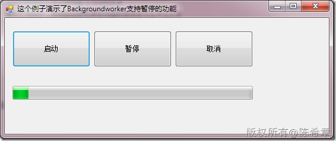
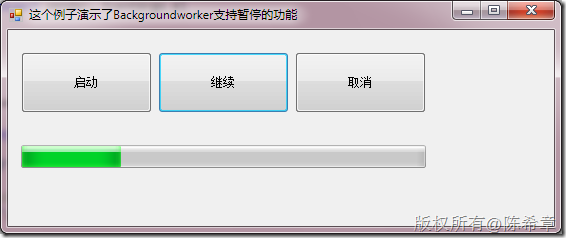
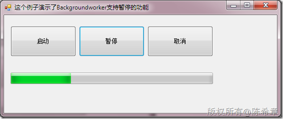

# 支持取消操作和暂停操作的Backgroundworker 
> 原文发表于 2010-03-13, 地址: http://www.cnblogs.com/chenxizhang/archive/2010/03/13/1685209.html 


这也是今天讨论的话题。取消是默认就支持的，而暂停则默认不支持。但通过ManualResetEvent可以对其进行干预。


```
using System;
using System.Collections.Generic;
using System.ComponentModel;
using System.Data;
using System.Drawing;
using System.Linq;
using System.Text;
using System.Windows.Forms;
using System.Threading;

namespace BackgroundWorkderPauseSample
{
    public partial class MainForm : Form
    {
        BackgroundWorker worker = null;

        public MainForm()
        {
            InitializeComponent();
            Load += new EventHandler(Form1\_Load);
        }

        void Form1\_Load(object sender, EventArgs e)
        {
            worker = new BackgroundWorker();
            worker.WorkerReportsProgress = true;
            worker.WorkerSupportsCancellation = true;
            worker.DoWork += new DoWorkEventHandler(worker\_DoWork);
            worker.RunWorkerCompleted += new RunWorkerCompletedEventHandler(worker\_RunWorkerCompleted);
            worker.ProgressChanged += new ProgressChangedEventHandler(worker\_ProgressChanged);
            
        }

        void worker\_ProgressChanged(object sender, ProgressChangedEventArgs e)
        {
            progressBar1.Value = e.ProgressPercentage;
        }

        void worker\_RunWorkerCompleted(object sender, RunWorkerCompletedEventArgs e)
        {
            if (e.Cancelled)
                MessageBox.Show("用户取消了操作");
            else
            {
                MessageBox.Show("正常完成了操作");
            }

        }

        void worker\_DoWork(object sender, DoWorkEventArgs e)
        {
            for (int i = 0; i < 100; i++)
            {
                if (worker.CancellationPending)//如果用户申请取消
                {
                    for (int k = i; k >= 0; k--)
                    {
                        Thread.Sleep(10);
                        worker.ReportProgress(k);//模拟一个回滚的效果
                    }
                    e.Cancel = true;
                    return;
                }

                manualReset.WaitOne();//如果ManualResetEvent的初始化为终止状态（true），那么该方法将一直工作，直到收到Reset信号。然后，直到收到Set信号，就继续工作。
                //反之亦然
                Thread.Sleep(500);
                worker.ReportProgress(i+1);

            }
        }

        private void btStart\_Click(object sender, EventArgs e)
        {
            worker.RunWorkerAsync();
        }

        private void btCancel\_Click(object sender, EventArgs e)
        {
            worker.CancelAsync();
        }


        private ManualResetEvent manualReset = new ManualResetEvent(true);

        private void btPause\_Click(object sender, EventArgs e)
        {
            if (btPause.Text == "暂停")
            {
                manualReset.Reset();//暂停当前线程的工作，发信号给waitOne方法，阻塞
                btPause.Text = "继续";
            }
            else
            {
                manualReset.Set();//继续某个线程的工作
                btPause.Text = "暂停";
            }
        }
    }
}
这个程序运行的效果大致如下
```

```
一。正常状态
```

```
[](http://images.cnblogs.com/cnblogs_com/chenxizhang/WindowsLiveWriter/Backgroundworker_1160D/image_2.png) 
```

```
二。暂停状态
```

.csharpcode, .csharpcode pre
{
 font-size: small;
 color: black;
 font-family: consolas, "Courier New", courier, monospace;
 background-color: #ffffff;
 /*white-space: pre;*/
}
.csharpcode pre { margin: 0em; }
.csharpcode .rem { color: #008000; }
.csharpcode .kwrd { color: #0000ff; }
.csharpcode .str { color: #006080; }
.csharpcode .op { color: #0000c0; }
.csharpcode .preproc { color: #cc6633; }
.csharpcode .asp { background-color: #ffff00; }
.csharpcode .html { color: #800000; }
.csharpcode .attr { color: #ff0000; }
.csharpcode .alt 
{
 background-color: #f4f4f4;
 width: 100%;
 margin: 0em;
}
.csharpcode .lnum { color: #606060; }

[](http://images.cnblogs.com/cnblogs_com/chenxizhang/WindowsLiveWriter/Backgroundworker_1160D/image_4.png) 


三。恢复状态


[](http://images.cnblogs.com/cnblogs_com/chenxizhang/WindowsLiveWriter/Backgroundworker_1160D/image_6.png) 


作为演示，代码比较简单，没有对worker的一些状态进行判断以及按钮相应的设置。仅供参考

