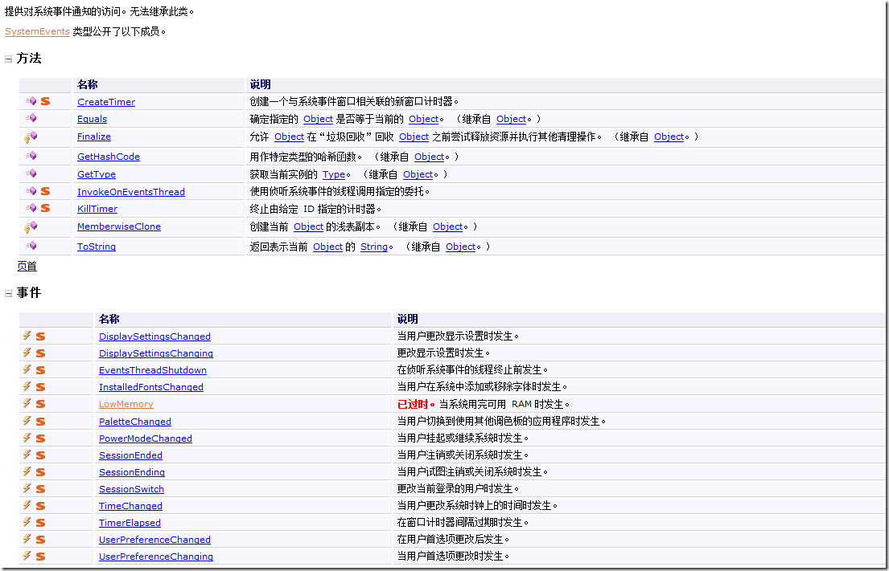
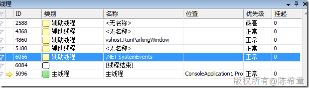
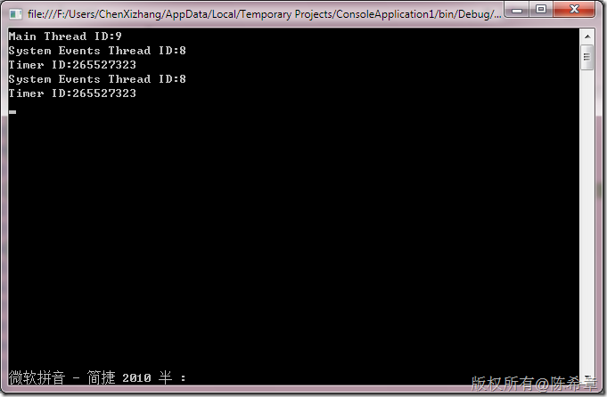

# SystemEvents和SystemEvents线程 
> 原文发表于 2010-03-13, 地址: http://www.cnblogs.com/chenxizhang/archive/2010/03/13/1685257.html 


Microsoft.Win32.SystemEvents类型，简单来说，就是提供了让我们程序监控系统事件的能力，可以参考下面的介绍

 [](http://images.cnblogs.com/cnblogs_com/chenxizhang/WindowsLiveWriter/SystemEventsSystemEvents_130D6/image_2.png) 


```
using System;
using System.Collections.Generic;
using System.Linq;
using System.Text;
using System.Threading;
using Microsoft.Win32;

namespace ConsoleApplication1
{
    class Program
    {
        static void Main(string[] args)
        {
            //这个例子用来理解系统事件(SystemEvents)
            SystemEvents.DisplaySettingsChanged += (o1, e1) =>
            {
                //显示设置更改完后发生
                
            };
            SystemEvents.DisplaySettingsChanging += (o2, e2) =>
            {
                //显示设置更改中发生
                
            };
            SystemEvents.InstalledFontsChanged += (o3, e3) =>
            {
                //安装字体发生变化
            };
            SystemEvents.EventsThreadShutdown += (o4, e4) =>
            {
                //事件线程被关闭
            };
            SystemEvents.PaletteChanged += (o5, e5) =>
            {
                //调色板发生变化
            };

            SystemEvents.PowerModeChanged += (o6, e6) =>
            {
                //用户挂起或者继续时
            };
            SystemEvents.SessionEnded += (o7, e7) =>
            {
                //用户注销或者关闭时
            };
            SystemEvents.SessionEnding += (o8, e8) =>
            {
                //用户注销或者关闭中
            };

            SystemEvents.SessionSwitch += (o9, e9) =>
            {
                //更改当前用户
            };

            SystemEvents.TimeChanged += (o10, e10) =>
            {
                //时间被修改后
            };
            SystemEvents.TimerElapsed += (o11, e11) =>
            {
                //定时器处理事件
                Console.WriteLine("Timer ID:{0}", e11.TimerId);
            };
            SystemEvents.UserPreferenceChanged += (o12, e12) =>
            {
                //用户首选项发生更改后
            };
            SystemEvents.UserPreferenceChanging += (o13, e13) =>
            {
                //用户首选项发生更改中
            };

            IntPtr p = SystemEvents.CreateTimer(2000);//创建一个计时器


            Console.Read();
        }

    }
}

```


.csharpcode, .csharpcode pre
{
 font-size: small;
 color: black;
 font-family: consolas, "Courier New", courier, monospace;
 background-color: #ffffff;
 /*white-space: pre;*/
}
.csharpcode pre { margin: 0em; }
.csharpcode .rem { color: #008000; }
.csharpcode .kwrd { color: #0000ff; }
.csharpcode .str { color: #006080; }
.csharpcode .op { color: #0000c0; }
.csharpcode .preproc { color: #cc6633; }
.csharpcode .asp { background-color: #ffff00; }
.csharpcode .html { color: #800000; }
.csharpcode .attr { color: #ff0000; }
.csharpcode .alt 
{
 background-color: #f4f4f4;
 width: 100%;
 margin: 0em;
}
.csharpcode .lnum { color: #606060; }


那么什么是SystemEvents线程呢？就是说，程序开启之后，默认会有一个线程来处理系统事件。也就是说，系统事件不在主线程处理。


[](http://images.cnblogs.com/cnblogs_com/chenxizhang/WindowsLiveWriter/SystemEventsSystemEvents_130D6/image_4.png) 


[](http://images.cnblogs.com/cnblogs_com/chenxizhang/WindowsLiveWriter/SystemEventsSystemEvents_130D6/image_8.png)

