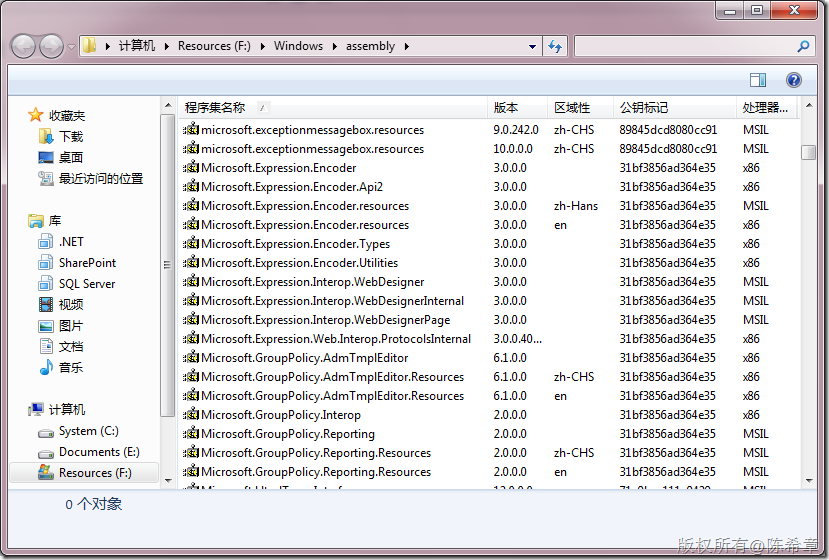
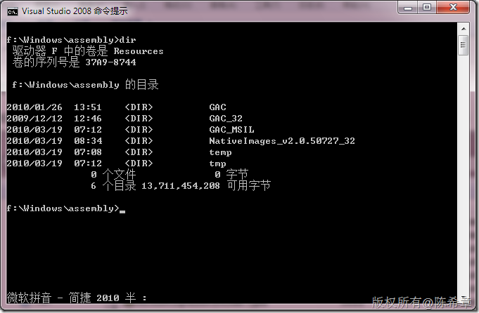
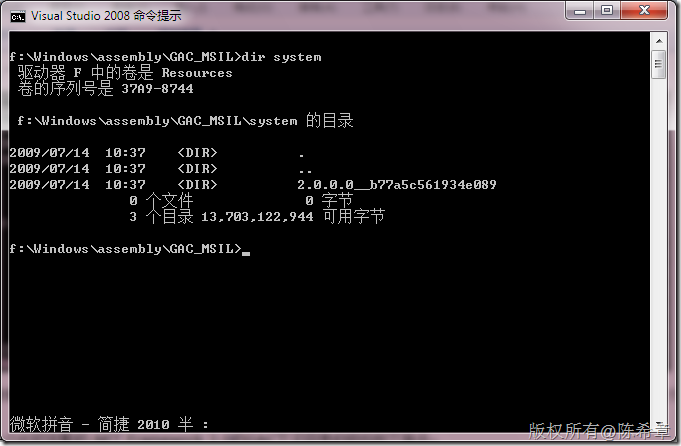
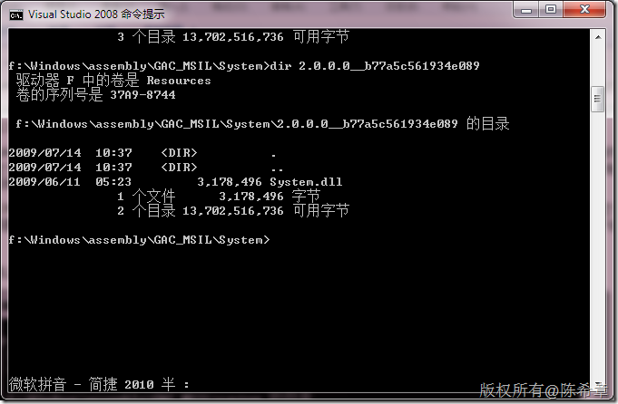
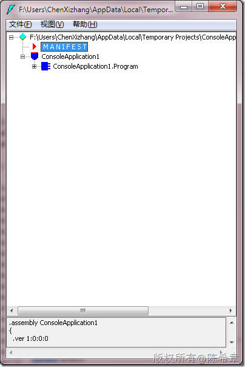
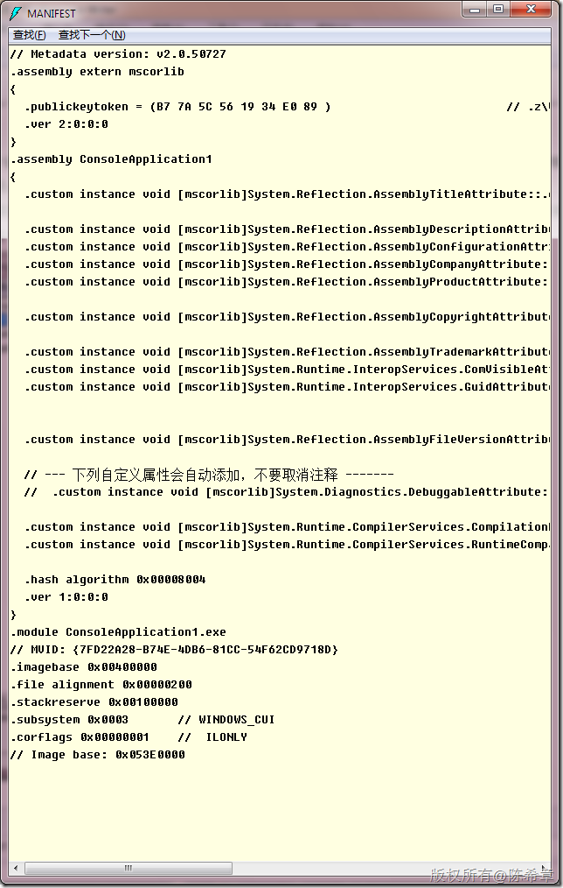

# 再谈CLR：GAC目录的构造 
> 原文发表于 2010-03-19, 地址: http://www.cnblogs.com/chenxizhang/archive/2010/03/19/1689579.html 

我们一般都知道,.NET Framework的GAC（global assembly cache)其实就是一个特殊的目录，如下图所示

  

 但是它内部到底是什么结构呢？

  

 很奇怪对吧？两个图完全不一样。不要惊讶，其实第一个图只是一个特殊的呈现方式。GAC里面确实就只有几个目录而已 。

   
一个比较完整的.NET Framework 2.0的GAC下子目录的结构如下所示： * GAC * GAC\_32 * GAC\_MSIL * GAC\_64 * NativeImages1\_v1.1.4322 * NativeImages\_v2.0.50727\_32 * NativeImages\_v2.0.50727\_64

 其中： GAC是用于存放基于.NET Framework 1.0/1.1创建的Assemblies，这些Assemblies只能运行在32-bit 地址空间。 GAC\_MSIL用于存放基于.NET Framework 2.0上的无特定CPU指定的Assemblies，这些assemblies可以运行在32-bit地址空间或者64-bit地址空间。 GAC\_32也是用于存放基于.NET Framework 2.0创建的基于x86架构的Assemblies，因为这些Assemblies可以拥有32-bit的native CPU代码，所以只能运行在32-bit空间，可以直接在32-bit系统上运行或者使用WOW64技术在64-bit的OS系统上运行。 GAC\_64用于存放.NET Framework 2.0上创建的基于x64或者IA64的Assemblies，这些Assemblies可能含有x64或者IA64的Native Code，所以他们只能运行在64-bit地址空间上。这个目录在32-bit的OS上不存在。值得注意的是，GAC\_64中的Assemblies是根据系统架构决定，在x64系统上，该目录中的Assemblies就必须是基于x64的，IA64的Assemblies无法被装入，反之亦然。 以NativeImages开头的目录存放的通过NGen.exe编译assembly生成的基于当前平台的非managed代码，这个目录不需要Strongly named Assemblies，后面的数字对应了版本号。而基于.NET Framework 2.0的两个NativeImages目录名称最后的两个字符’64’和’ 32’则代表了对应的平台。   那么，如果我们往里面去查看呢？会发现什么呢？

  

 也就是说，在某个目录中（以GAC\_MSIL为例），又按照程序集名称分了目录，例如System是一个程序集名称。它就有一个目录。

 那么，它是怎么区分版本的呢？其实很简单，在程序集内部又按照版本号和公钥分了子目录。然后才可以看到真正的dll

  

 这样做的目的是什么呢？就是说，即便程序集名称和版本都一样，但是签名的密钥是不一样的话，他们仍然是可以区分的。要知道，程序集名称和版本号完全可以设置成一样的，但密钥是不可能模拟出来的。

  

  最后，我们需要谈一个话题，就是CLR在查找程序集时的行为模式？意思就是说，如果一个程序集，它需要引用另外一个程序集，那么CLR到底是怎么查找的

 好吧，有朋友可能会问：等等，CLR是怎么知道一个程序集需要引用另外的程序集呢？

 Good question! 其实这是必须的. 一个程序集不光包含代码,还包含了其他一些东西,例如程序集元数据, 类型元数据,以及资源等等.

 从下面的图形可以看到一个MANIFEST，它里面就有有关引用的信息

  

 查看MAINFEST，我想你就明白了吧 。看下图的assembly extern mscorlib。这说明什么呢？意思就是说目前的这个程序集需要用到mscorlib，而且版本和公钥是什么

  

 Ok，那么如果知道了这些信息，CLR是怎么找到mscorlib的呢？它一般情况下是遵循下面的关系

 1. 程序集的根目录

 2. GAC（应该是先找平台相关的目录，例如GAC\_32,GAC\_64，然后找GAC\_MSIL)

 3.如果上面都找不到，则继续查找当前程序是否设置了特殊的私有路径。这个在下面这个博客中我介绍过

 [http://www.cnblogs.com/chenxizhang/archive/2010/03/14/1685665.html](http://www.cnblogs.com/chenxizhang/archive/2010/03/14/1685665.html "http://www.cnblogs.com/chenxizhang/archive/2010/03/14/1685665.html")

 如果以上都找不到，就报告一个错误，失败了

 以上的过程是发生在运行期间的。

  

 那么在编译的时候，又是怎么样的呢？

 1. 程序集的根目录

 2. CSC程序的目录

 3. GAC

