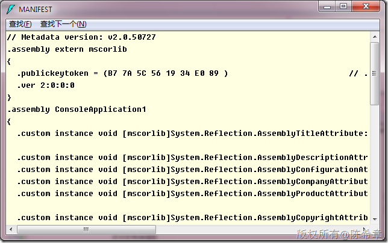
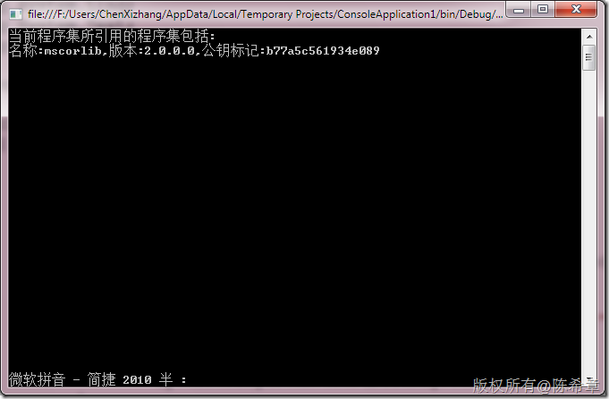

# 再谈CLR：如何通过代码获取程序集所引用的程序集信息 
> 原文发表于 2010-03-19, 地址: http://www.cnblogs.com/chenxizhang/archive/2010/03/19/1689602.html 


上一篇我们提到过程序集引用的问题，通过反编译工具可以很方便地看到他们的引用关系。如下图所示

 [](http://images.cnblogs.com/cnblogs_com/chenxizhang/WindowsLiveWriter/CLR_92BA/image_2.png) 

 那么是否有办法在代码中进行查询得到这些信息呢？答案是肯定的，我们可以通过下面的简单代码就实现了

 我们主要用到了反射技术


```
using System;
using System.Collections.Generic;
using System.Linq;
using System.Text;
using System.Reflection;

namespace ConsoleApplication1
{
    class Program
    {
        static void Main(string[] args)
        {
            Assembly assembly = Assembly.GetExecutingAssembly();
            Console.WriteLine("当前程序集所引用的程序集包括:");

            foreach (var item in assembly.GetReferencedAssemblies())
            {

                Console.WriteLine("名称:{0},版本:{1},公钥标记:{2}",
                    item.Name,
                    item.Version,
                    Byte2String(item.GetPublicKeyToken()));
            }

            Console.Read();
        }

        static string Byte2String(byte[] token) {
            StringBuilder sb = new StringBuilder();
            for (int i = 0; i < token.GetLength(0); i++)
            {
                sb.Append(string.Format("{0:x}",token[i]));
            }
            return sb.ToString();
        }


    }
}
```

```
 
```

```
[](http://images.cnblogs.com/cnblogs_com/chenxizhang/WindowsLiveWriter/CLR_92BA/image_4.png) 

```

.csharpcode, .csharpcode pre
{
 font-size: small;
 color: black;
 font-family: consolas, "Courier New", courier, monospace;
 background-color: #ffffff;
 /*white-space: pre;*/
}
.csharpcode pre { margin: 0em; }
.csharpcode .rem { color: #008000; }
.csharpcode .kwrd { color: #0000ff; }
.csharpcode .str { color: #006080; }
.csharpcode .op { color: #0000c0; }
.csharpcode .preproc { color: #cc6633; }
.csharpcode .asp { background-color: #ffff00; }
.csharpcode .html { color: #800000; }
.csharpcode .attr { color: #ff0000; }
.csharpcode .alt 
{
 background-color: #f4f4f4;
 width: 100%;
 margin: 0em;
}
.csharpcode .lnum { color: #606060; }
