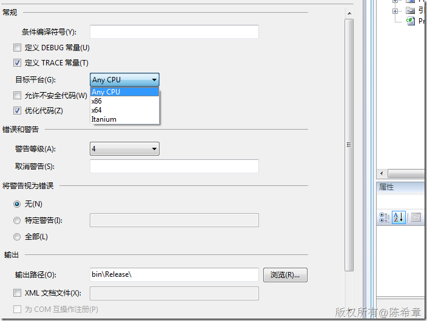
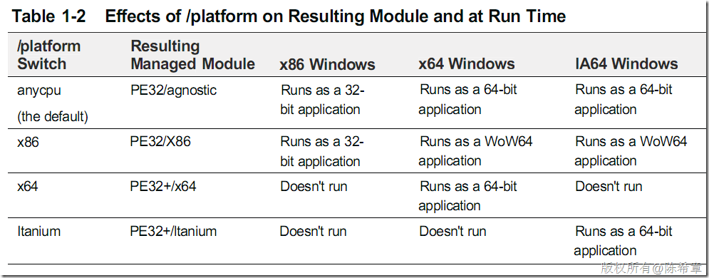

# 再谈CLR：目标平台的问题 
> 原文发表于 2010-03-19, 地址: http://www.cnblogs.com/chenxizhang/archive/2010/03/19/1690132.html 

曾经有朋友问到这样的一个问题：我要开发一个能运行在64位机器上的应用程序，是不是应该使用Visual Studio 的64位版本来做？

 这是一个似是而非的问题，首先其实Visual Studio 并没有所谓的64位版本；然后，其实默认情况下，Visual Studio所编译出来的应用程序就是可以既运行在32位平台，也可以运行在64位平台。

 这是为什么呢？我们来看一下默认情况下Visual Studio编译的选项

  

 我们可以看到这里的“目标平台”设置为“Any CPU”，这就意味着编译出来的程序集将既可以在x86(也就是32位）上运行，也可以在x64(也就是64位）上运行，甚至它还可以在Itanium（安腾）上面运行

 很显然，这种方式是最简单方便的，我想甚至很多开发人员（注意，这里我没有用程序员）都不知道这个选项以及它的意思呢。

 虽然默认的选项是很方便和有用的 ，但是在某些时候，我们可能希望按照特定平台（例如64位）进行编译，尤其是我们会用到不安全代码(unsafe)，或者说我们需要用到较多的COM interop，P-Invoke等等。

 我们可以看到目标平台这个选项其实是有四个的

  

 下面这个表格列出了他们分别代表的含义

  

 需要注意的是，如果你编译了x64的版本（这个操作并不要求你的操作系统本身是x64的），你仍然无法直接在x86的平台上运行它

  

 也就是说，其实针对不同平台编译出来的PE文件，它的PE Header是不一样的。32位平台就是PE 32，而64位平台就是PE 32+

  

 而关于安腾，大家可能比较陌生（我也比较陌生），下面有一个参考链接

 [http://baike.baidu.com/view/102955.htm](http://baike.baidu.com/view/102955.htm "http://baike.baidu.com/view/102955.htm")

  

 一个题外话，原先在.NET Framework 1.x时代，虽然也可以编译出anycpu的应用程序，但其实主要只能运行在x86. 其在x64上的表现就是WOW64模式下运行，此时与32位程序是没有差别的。

 所以说，从.NET Framework 2.0开始才真正支持64位 。这个是由编译器导致的问题。

