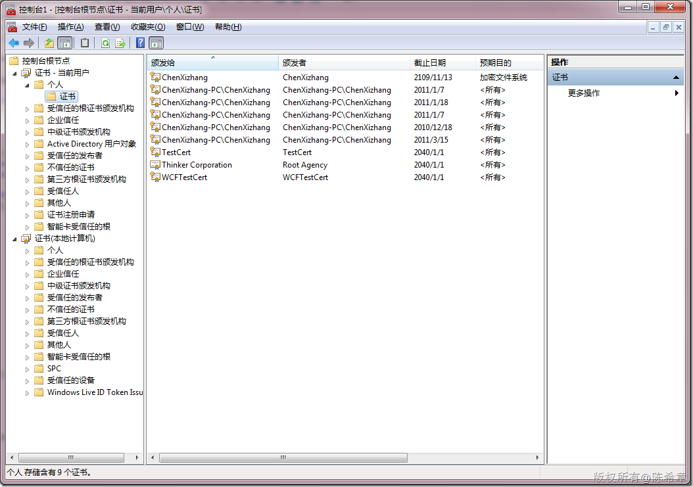
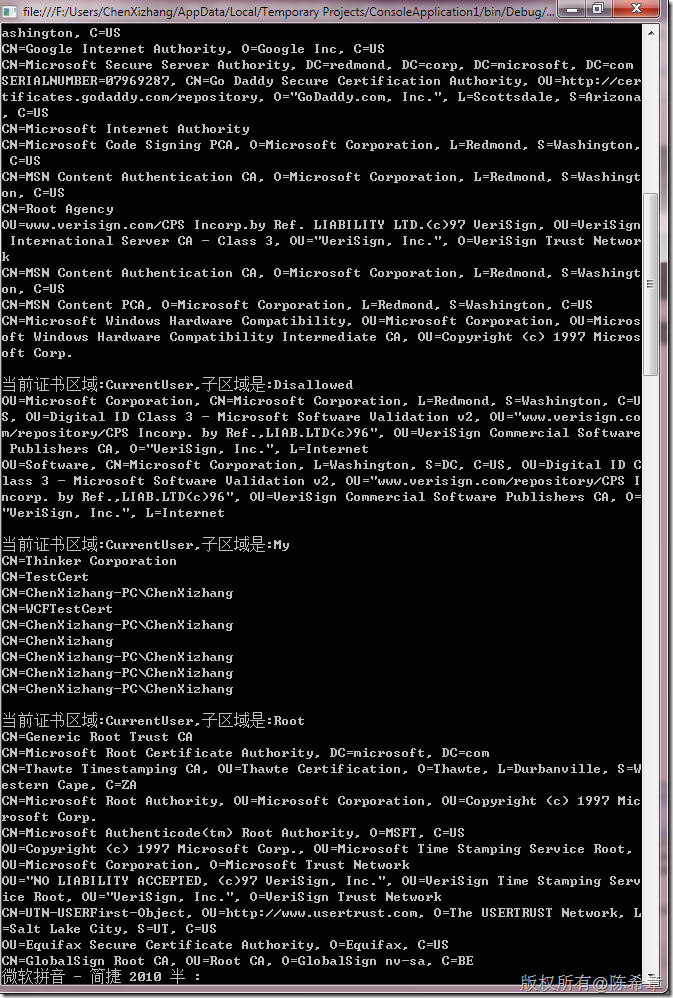

# 如何读取计算机上面所有的证书信息 
> 原文发表于 2010-03-21, 地址: http://www.cnblogs.com/chenxizhang/archive/2010/03/21/1691103.html 


这是昨天课堂上一个问题，如何读取到计算机上所有证书的信息呢？我们首先来看一下到底有哪些证书

 [](http://images.cnblogs.com/cnblogs_com/chenxizhang/WindowsLiveWriter/b12a7a568523_6410/image_2.png) 

  

 下面的代码可以通过三个循环找到所有的证书


```
using System;
using System.Collections.Generic;
using System.Linq;
using System.Text;
using System.Reflection;
using System.Threading;
using System.Security.Cryptography.X509Certificates;

namespace ConsoleApplication1
{
    class Program
    {
        static void Main(string[] args)
        {
            


            //读取所有的证书
            string[] storeName = Enum.GetNames(typeof(StoreName));
            string[] storeLocation = Enum.GetNames(typeof(StoreLocation));

            foreach (var location in storeLocation)
            {
                foreach (var name in storeName)
                {
                    X509Store store = new X509Store(
                        (StoreName)Enum.Parse(typeof(StoreName), name),
                        (StoreLocation)Enum.Parse(typeof(StoreLocation), location));

                    

                    store.Open(OpenFlags.ReadOnly);
                    Console.WriteLine("当前证书区域:{0},子区域是:{1}", location, name);
                    foreach (var cert in store.Certificates)
                    {
                        Console.WriteLine(cert.Subject);
                    }
                    store.Close();
                    Console.WriteLine();
                }
            }

            

            

            Console.Read();
        }


    }

  
}

```

.csharpcode, .csharpcode pre
{
 font-size: small;
 color: black;
 font-family: consolas, "Courier New", courier, monospace;
 background-color: #ffffff;
 /*white-space: pre;*/
}
.csharpcode pre { margin: 0em; }
.csharpcode .rem { color: #008000; }
.csharpcode .kwrd { color: #0000ff; }
.csharpcode .str { color: #006080; }
.csharpcode .op { color: #0000c0; }
.csharpcode .preproc { color: #cc6633; }
.csharpcode .asp { background-color: #ffff00; }
.csharpcode .html { color: #800000; }
.csharpcode .attr { color: #ff0000; }
.csharpcode .alt 
{
 background-color: #f4f4f4;
 width: 100%;
 margin: 0em;
}
.csharpcode .lnum { color: #606060; }

.csharpcode, .csharpcode pre
{
 font-size: small;
 color: black;
 font-family: consolas, "Courier New", courier, monospace;
 background-color: #ffffff;
 /*white-space: pre;*/
}
.csharpcode pre { margin: 0em; }
.csharpcode .rem { color: #008000; }
.csharpcode .kwrd { color: #0000ff; }
.csharpcode .str { color: #006080; }
.csharpcode .op { color: #0000c0; }
.csharpcode .preproc { color: #cc6633; }
.csharpcode .asp { background-color: #ffff00; }
.csharpcode .html { color: #800000; }
.csharpcode .attr { color: #ff0000; }
.csharpcode .alt 
{
 background-color: #f4f4f4;
 width: 100%;
 margin: 0em;
}
.csharpcode .lnum { color: #606060; }

[](http://images.cnblogs.com/cnblogs_com/chenxizhang/WindowsLiveWriter/b12a7a568523_6410/image_4.png)

