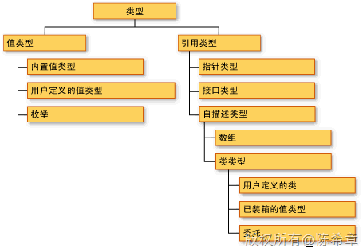

# 再谈CLR:关于类型的拷问 
> 原文发表于 2010-03-21, 地址: http://www.cnblogs.com/chenxizhang/archive/2010/03/21/1691120.html 


**1.到底什么是值类型，什么是引用类型？**

 值类型直接或者间接地继承ValueType类型，它包含的类型主要：内置值类型（除string之外的简单类型，如整型--Int32等）,自定义值类型（结构体，strcut），枚举（enum）

 而引用类型就是除了值类型之外的所有类型。包括class ,interface, delegate, 数组，object，string

 实际上，这两种类型，他们的基类都是object类型。

 [](http://images.cnblogs.com/cnblogs_com/chenxizhang/WindowsLiveWriter/CLR_8858/20083317122390650_2.gif) 

  

 这里最容易产生疑惑的地方就是：既然所有的对象都是从object派生出来的，而object又是一个引用类型，那么为什么又可以区分值类型和引用类型呢？

 这要认真说来，是与ValueType这个类型有关。所有的object都有一个方法，就是equals，这个方法决定了如何判断两个对象（或值）是否相等。

 我们来看看默认情况下object的equals是怎么实现的呢


```
public virtual bool Equals(object obj)
{
    return InternalEquals(this, obj);
}
这个方法调用了一个InternalEquals方法
```

```
[MethodImpl(MethodImplOptions.InternalCall)]
internal static extern bool InternalEquals(object objA, object objB);

```

```
看起来这个方法是直接调用了win 32 API实现的。这一点都不奇怪，其实.NET很多东西的最终都需要调用到API，所以说是“托管”代码嘛
```

```
而ValueType这个的Equals，是经过重写的
```

```
public override bool Equals(object obj)
{
    if (obj == null)
    {
        return false;
    }
    RuntimeType type = (RuntimeType) base.GetType();
    RuntimeType type2 = (RuntimeType) obj.GetType();
    if (type2 != type)
    {
        return false;
    }
    object a = this;
    if (CanCompareBits(this))
    {
        return FastEqualsCheck(a, obj);
    }
    FieldInfo[] fields = type.GetFields(BindingFlags.NonPublic | BindingFlags.Public | BindingFlags.Instance);
    for (int i = 0; i < fields.Length; i++)
    {
        object obj3 = ((RtFieldInfo) fields[i]).InternalGetValue(a, false);
        object obj4 = ((RtFieldInfo) fields[i]).InternalGetValue(obj, false);
        if (obj3 == null)
        {
            if (obj4 != null)
            {
                return false;
            }
        }
        else if (!obj3.Equals(obj4))
        {
            return false;
        }
    }
    return true;
}

 
从上面的代码来看，它是比较所有成员的值，只要值相当就视为相等
```

```
为了减少大家的疑惑，FCL中提供了一个机制（Type.IsValueType)，可以判断某个对象是值类型还是引用类型。
```

```
下面通过一个例子来解释一下
```

```
 
```

```
using System;
using System.Collections.Generic;
using System.Linq;
using System.Text;

namespace ConsoleApplication1
{
    class Program
    {
        //1。CLR调用Main方法，也可以称为Main方法入栈。方法本身是不占空间的，通过栈来管理方法，可以保证先进后出，这是正确的逻辑

        static void Main(string[] args)
        {
            int a = 5;
            //2。这是一个值类型，所以直接放在栈里面，4个字节
            Console.WriteLine(a);
                //3。Console的WriteLine方法入栈。在该方法内部又会申请一个和a一样大的栈空间，并对其进行处理。因为a是值类型，所以在WriteLine方法里面对a的处理与外面这个a已经没有关系了。
                //3。该方法执行结束之后，它会出栈（也就是说一个方法内部是一个小的闭环

            Employee e = new Employee();
            //4。创建一个对象实例。这是引用类型，这是生存在堆里面的。
            //4。虽然Employee里面的EmployeeID是值类型，但并不会在栈中申请空间，而是在堆中。也就是说e 这个对象在堆中至少包含了4个字节的大小。至于两个string类型的属性和有关的字段，则也是引用类型，默认是长度为零的。引用类型中包含的值类型也是放在堆中，这一点要注意。引用类型中的引用类型（包括字段和属性等成员），数据肯定放在堆中。在对象中保存一个引用的地址。
            //4。值得注意的是，e这个对象数据是在堆中，但在栈里面是保存了一个指针的。如果是32位的机器，它需要的空间是4个字节

            Console.Write(e.FirstName);
            //5。Console的Write方法再一次入栈。此时传递的e.First是一个引用，而不是复制的值。所以在该方法中如果对FirstName进行了操作，则实际上就是修改了e这个对象。
            //5。该方法内部也是一个闭环，最后它会出栈。

            Console.Read();
            //6。又一个方法入栈，并进入它的闭环。

        }

        //7。释放e变量在栈中的空间（此时，e所指向堆中的数据已经没有用了，可能进入GC扫描和清理的范围）
        //8。释放a变量在栈中的空间
        //9。Main方法出栈
    }


    class Employee {
        public int EmployeeID { get; set; }
        public string FirstName { get; set; }
        public string LastName { get; set; }
    }
}

```

.csharpcode, .csharpcode pre
{
 font-size: small;
 color: black;
 font-family: consolas, "Courier New", courier, monospace;
 background-color: #ffffff;
 /*white-space: pre;*/
}
.csharpcode pre { margin: 0em; }
.csharpcode .rem { color: #008000; }
.csharpcode .kwrd { color: #0000ff; }
.csharpcode .str { color: #006080; }
.csharpcode .op { color: #0000c0; }
.csharpcode .preproc { color: #cc6633; }
.csharpcode .asp { background-color: #ffff00; }
.csharpcode .html { color: #800000; }
.csharpcode .attr { color: #ff0000; }
.csharpcode .alt 
{
 background-color: #f4f4f4;
 width: 100%;
 margin: 0em;
}
.csharpcode .lnum { color: #606060; }


```
 

```

.csharpcode, .csharpcode pre
{
 font-size: small;
 color: black;
 font-family: consolas, "Courier New", courier, monospace;
 background-color: #ffffff;
 /*white-space: pre;*/
}
.csharpcode pre { margin: 0em; }
.csharpcode .rem { color: #008000; }
.csharpcode .kwrd { color: #0000ff; }
.csharpcode .str { color: #006080; }
.csharpcode .op { color: #0000c0; }
.csharpcode .preproc { color: #cc6633; }
.csharpcode .asp { background-color: #ffff00; }
.csharpcode .html { color: #800000; }
.csharpcode .attr { color: #ff0000; }
.csharpcode .alt 
{
 background-color: #f4f4f4;
 width: 100%;
 margin: 0em;
}
.csharpcode .lnum { color: #606060; }


.csharpcode, .csharpcode pre
{
 font-size: small;
 color: black;
 font-family: consolas, "Courier New", courier, monospace;
 background-color: #ffffff;
 /*white-space: pre;*/
}
.csharpcode pre { margin: 0em; }
.csharpcode .rem { color: #008000; }
.csharpcode .kwrd { color: #0000ff; }
.csharpcode .str { color: #006080; }
.csharpcode .op { color: #0000c0; }
.csharpcode .preproc { color: #cc6633; }
.csharpcode .asp { background-color: #ffff00; }
.csharpcode .html { color: #800000; }
.csharpcode .attr { color: #ff0000; }
.csharpcode .alt 
{
 background-color: #f4f4f4;
 width: 100%;
 margin: 0em;
}
.csharpcode .lnum { color: #606060; }

.csharpcode, .csharpcode pre
{
 font-size: small;
 color: black;
 font-family: consolas, "Courier New", courier, monospace;
 background-color: #ffffff;
 /*white-space: pre;*/
}
.csharpcode pre { margin: 0em; }
.csharpcode .rem { color: #008000; }
.csharpcode .kwrd { color: #0000ff; }
.csharpcode .str { color: #006080; }
.csharpcode .op { color: #0000c0; }
.csharpcode .preproc { color: #cc6633; }
.csharpcode .asp { background-color: #ffff00; }
.csharpcode .html { color: #800000; }
.csharpcode .attr { color: #ff0000; }
.csharpcode .alt 
{
 background-color: #f4f4f4;
 width: 100%;
 margin: 0em;
}
.csharpcode .lnum { color: #606060; }


  
 


.csharpcode, .csharpcode pre
{
 font-size: small;
 color: black;
 font-family: consolas, "Courier New", courier, monospace;
 background-color: #ffffff;
 /*white-space: pre;*/
}
.csharpcode pre { margin: 0em; }
.csharpcode .rem { color: #008000; }
.csharpcode .kwrd { color: #0000ff; }
.csharpcode .str { color: #006080; }
.csharpcode .op { color: #0000c0; }
.csharpcode .preproc { color: #cc6633; }
.csharpcode .asp { background-color: #ffff00; }
.csharpcode .html { color: #800000; }
.csharpcode .attr { color: #ff0000; }
.csharpcode .alt 
{
 background-color: #f4f4f4;
 width: 100%;
 margin: 0em;
}
.csharpcode .lnum { color: #606060; }


