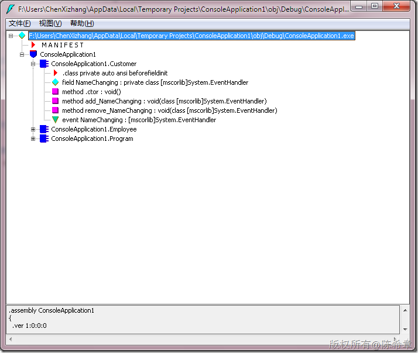

# 再谈CLR：事件定义 
> 原文发表于 2010-03-21, 地址: http://www.cnblogs.com/chenxizhang/archive/2010/03/21/1691129.html 


这是今天课堂上的一个话题。如何定义事件，这好像并不是问题，我们习惯性直接用下面的代码定义，不是吗？


```
    class Customer {
        public event EventHandler NameChanging;

    }
```

.csharpcode, .csharpcode pre
{
 font-size: small;
 color: black;
 font-family: consolas, "Courier New", courier, monospace;
 background-color: #ffffff;
 /*white-space: pre;*/
}
.csharpcode pre { margin: 0em; }
.csharpcode .rem { color: #008000; }
.csharpcode .kwrd { color: #0000ff; }
.csharpcode .str { color: #006080; }
.csharpcode .op { color: #0000c0; }
.csharpcode .preproc { color: #cc6633; }
.csharpcode .asp { background-color: #ffff00; }
.csharpcode .html { color: #800000; }
.csharpcode .attr { color: #ff0000; }
.csharpcode .alt 
{
 background-color: #f4f4f4;
 width: 100%;
 margin: 0em;
}
.csharpcode .lnum { color: #606060; }

这样做的话，大致是会怎么编译呢？


[](http://images.cnblogs.com/cnblogs_com/chenxizhang/WindowsLiveWriter/CLR_11A88/image_2.png) 


其实编译器会帮我们生成两个方法: add\_NameChanging和remove\_NameChanging


还会有一个字段，是EventHandler这个类型的 。


关键就在这里。它每次都会在创建对象的时候准备一个EventHandler，但问题是，并不是每个事件都会被用到。这就意味着，有一部分EventHandler其实是浪费的。


如果类型的事件很多，那么这个问题可能比较明显。


如何改进呢？


请参考下面的代码


 


 


```
using System;
using System.Collections.Generic;
using System.Linq;
using System.Text;
using System.ComponentModel;


namespace ConsoleApplication1
{
    class Program
    {

        static void Main(string[] args)
        {
            Employee e = new Employee();
            e.NameEvent += new EventHandler(e\_NameEvent);
            e.LNameEvent += new EventHandler(e\_LNameEvent);
            e.Name = "ares";
            e.LName = "chen";
            Console.Read();
        }

        static void e\_LNameEvent(object sender, EventArgs e)
        {
            Employee emp = (Employee)sender;
            Console.WriteLine(emp.LName);
        }

        static void e\_NameEvent(object sender, EventArgs e)
        {
            Employee emp = (Employee)sender;
            Console.WriteLine(emp.Name);
        }
    }

    class Employee
    {
        private string name;
        public string Name
        {
            get
            {
                return name;
            }
            set
            {
                name = value;
                
                if (list[nameEventKey] != null)
                    list[nameEventKey].DynamicInvoke(new object[] { this, null });
            }
        }


        private string lname;
        public string LName
        {
            get
            {
                return lname;
            }
            set
            {
                lname = value;

                if (list[lnameEventKey] != null)
                    list[lnameEventKey].DynamicInvoke(new object[] { this, null });
            }
        }

        private EventHandlerList list = new EventHandlerList();

        private object nameEventKey=null;
        public event EventHandler NameEvent
        {
            add
            {
                if (nameEventKey == null)
                    nameEventKey = new object();

                list.AddHandler(nameEventKey, value);
            }
            remove
            {

                if (nameEventKey == null)
                    nameEventKey = new object();
                list.RemoveHandler(nameEventKey, value);
            }
        }

        private object lnameEventKey=null;
        public event EventHandler LNameEvent
        {
            add
            {
                if (lnameEventKey == null)
                    lnameEventKey = new object();

                list.AddHandler(lnameEventKey, value);
            }
            remove
            {
                if (lnameEventKey == null)
                    lnameEventKey = new object();

                list.RemoveHandler(lnameEventKey, value);
            }
        }
    }
}

```

.csharpcode, .csharpcode pre
{
 font-size: small;
 color: black;
 font-family: consolas, "Courier New", courier, monospace;
 background-color: #ffffff;
 /*white-space: pre;*/
}
.csharpcode pre { margin: 0em; }
.csharpcode .rem { color: #008000; }
.csharpcode .kwrd { color: #0000ff; }
.csharpcode .str { color: #006080; }
.csharpcode .op { color: #0000c0; }
.csharpcode .preproc { color: #cc6633; }
.csharpcode .asp { background-color: #ffff00; }
.csharpcode .html { color: #800000; }
.csharpcode .attr { color: #ff0000; }
.csharpcode .alt 
{
 background-color: #f4f4f4;
 width: 100%;
 margin: 0em;
}
.csharpcode .lnum { color: #606060; }
