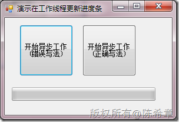
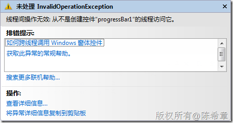
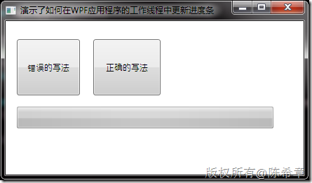
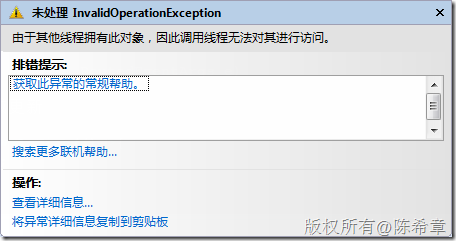
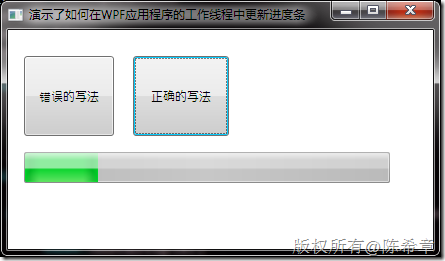
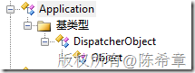
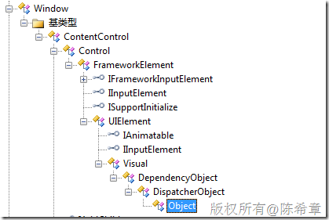
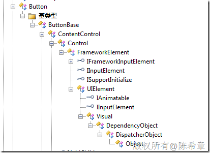

# WPF：如何在工作线程中更新窗体的UI元素（Dispatcher机制） 
> 原文发表于 2010-03-25, 地址: http://www.cnblogs.com/chenxizhang/archive/2010/03/25/1694604.html 


这是一个普遍的问题：如果我们再程序中使用了多线程技术，而工作线程（后台线程）如果需要更新界面上的元素（例如进度条等），就会有一个线程安全性问题，因为进度条是由主线程创建出来的。

 关于这一点，大致上看，WPF的机制与Windows Forms是没有差别的。我们在Windows Forms中需要按照下面的方式更新窗体元素。

 [](http://images.cnblogs.com/cnblogs_com/chenxizhang/WindowsLiveWriter/WPFUIDispatcher_7A73/image_2.png) 


```
using System;
using System.Windows.Forms;
using System.Threading;

namespace WindowsFormsApplication1
{
    public partial class Form1 : Form
    {
        public Form1()
        {
            InitializeComponent();
        }

        private void button1\_Click(object sender, EventArgs e)
        {
            //错误的写法：直接更新
            new Thread(() =>
            {
                progressBar1.Value = 10;
            }).Start();


        }

        private void button2\_Click(object sender, EventArgs e)
        {
            //正确的写法，通知主线程更新
            new Thread(()=>{
                this.Invoke(new Action(() =>
                {
                    progressBar1.Value = 10;
                }));
            }).Start();
        }
    }
}

```


.csharpcode, .csharpcode pre
{
 font-size: small;
 color: black;
 font-family: consolas, "Courier New", courier, monospace;
 background-color: #ffffff;
 /*white-space: pre;*/
}
.csharpcode pre { margin: 0em; }
.csharpcode .rem { color: #008000; }
.csharpcode .kwrd { color: #0000ff; }
.csharpcode .str { color: #006080; }
.csharpcode .op { color: #0000c0; }
.csharpcode .preproc { color: #cc6633; }
.csharpcode .asp { background-color: #ffff00; }
.csharpcode .html { color: #800000; }
.csharpcode .attr { color: #ff0000; }
.csharpcode .alt 
{
 background-color: #f4f4f4;
 width: 100%;
 margin: 0em;
}
.csharpcode .lnum { color: #606060; }

第一种是错误的写法，它将导致一个运行时错误


[](http://images.cnblogs.com/cnblogs_com/chenxizhang/WindowsLiveWriter/WPFUIDispatcher_7A73/image_4.png) 


 


了解了这些，我们来看看WPF是怎么做的？


[](http://images.cnblogs.com/cnblogs_com/chenxizhang/WindowsLiveWriter/WPFUIDispatcher_7A73/image_6.png) 


点击第一个按钮的话，我们同样会收到一个错误


[](http://images.cnblogs.com/cnblogs_com/chenxizhang/WindowsLiveWriter/WPFUIDispatcher_7A73/image_8.png) 


点击第二个按钮，则工作正常


[](http://images.cnblogs.com/cnblogs_com/chenxizhang/WindowsLiveWriter/WPFUIDispatcher_7A73/image_10.png) 


我们看看代码有什么区别


```
using System;
using System.Windows;
using System.Threading;

namespace WpfApplication1
{
    /// <summary>
    /// Window1.xaml 的交互逻辑
    /// </summary>
    public partial class Window1 : Window
    {
        public Window1()
        {
            InitializeComponent();
        }

        private void button1\_Click(object sender, RoutedEventArgs e)
        {
            //错误的写法：直接更新
            new Thread(() =>
            {
                progressBar1.Value = 20;
            }).Start();

        }

        private void button2\_Click(object sender, RoutedEventArgs e)
        {
            //正确的写法：通知主线程去完成更新
            new Thread(()=>{
                this.Dispatcher.Invoke(new Action(()=>{
                    progressBar1.Value=20;
                }));
            }).Start();
        }
    }
}

```


.csharpcode, .csharpcode pre
{
 font-size: small;
 color: black;
 font-family: consolas, "Courier New", courier, monospace;
 background-color: #ffffff;
 /*white-space: pre;*/
}
.csharpcode pre { margin: 0em; }
.csharpcode .rem { color: #008000; }
.csharpcode .kwrd { color: #0000ff; }
.csharpcode .str { color: #006080; }
.csharpcode .op { color: #0000c0; }
.csharpcode .preproc { color: #cc6633; }
.csharpcode .asp { background-color: #ffff00; }
.csharpcode .html { color: #800000; }
.csharpcode .attr { color: #ff0000; }
.csharpcode .alt 
{
 background-color: #f4f4f4;
 width: 100%;
 margin: 0em;
}
.csharpcode .lnum { color: #606060; }

请注意，Window类并没有Invoke方法，这是与Form不一样的。取而代之的是，我们需要通过访问Window.Dispatcher属性，然后调用Invoke方法 。仅此而已


 


好吧，那么到底什么是Dispatcher呢？从字面上来说，它是所谓的接线员，或者调度员的意思。这说明什么呢？每个线程都有一个唯一的调度员，我们在代码中所做的工作其实是向这个调度员发出指令，然后它再帮我们做。这样理解就对了。


我们的窗体是在主线程创建出来的，里面的控件自然也是如此。我们之前解释过WPF的应用程序也是单线程模型的(STAThread)，所以整个应用程序里面会有一个默认的Dispatcher，它负责调度主线程的工作。


其实，如果大家真有兴趣，可以看看Application.Run这个方法的实现，就能理解上面所说的话了


```
[SecurityCritical]
internal int RunInternal(Window window)
{
    base.VerifyAccess();
    EventTrace.NormalTraceEvent(EventTraceGuidId.APPRUNGUID, 0);
    if (this.\_appIsShutdown)
    {
        throw new InvalidOperationException(SR.Get("CannotCallRunMultipleTimes", new object[] { base.GetType().FullName }));
    }
    if (window != null)
    {
        if (!window.CheckAccess())
        {
            throw new ArgumentException(SR.Get("WindowPassedShouldBeOnApplicationThread", new object[] { window.GetType().FullName, base.GetType().FullName }));
        }
        if (!this.WindowsInternal.HasItem(window))
        {
            this.WindowsInternal.Add(window);
        }
        if (this.MainWindow == null)
        {
            this.MainWindow = window;
        }
        if (window.Visibility != Visibility.Visible)
        {
            base.Dispatcher.BeginInvoke(DispatcherPriority.Send, delegate (object obj) {
                (obj as Window).Show();
                return null;
            }, window);
        }
    }
    this.EnsureHwndSource();
    if (!BrowserInteropHelper.IsBrowserHosted)
    {
        this.RunDispatcher(null);
    }
    return this.\_exitCode;
}

 

```

.csharpcode, .csharpcode pre
{
 font-size: small;
 color: black;
 font-family: consolas, "Courier New", courier, monospace;
 background-color: #ffffff;
 /*white-space: pre;*/
}
.csharpcode pre { margin: 0em; }
.csharpcode .rem { color: #008000; }
.csharpcode .kwrd { color: #0000ff; }
.csharpcode .str { color: #006080; }
.csharpcode .op { color: #0000c0; }
.csharpcode .preproc { color: #cc6633; }
.csharpcode .asp { background-color: #ffff00; }
.csharpcode .html { color: #800000; }
.csharpcode .attr { color: #ff0000; }
.csharpcode .alt 
{
 background-color: #f4f4f4;
 width: 100%;
 margin: 0em;
}
.csharpcode .lnum { color: #606060; }


```
[SecurityCritical]
private object RunDispatcher(object ignore)
{
    Invariant.Assert(!this.\_ownDispatcherStarted);
    this.\_ownDispatcherStarted = true;
    Dispatcher.Run();
    return null;
}

 
那么，为什么在Window中可以调用到Dispatcher属性呢？或者说在那些对象上面可以采用这种机制呢？大致上说，几乎所有的控件都可以，因为他们的基类一般都可以追溯到一个DispatcherObject
```

```
[](http://images.cnblogs.com/cnblogs_com/chenxizhang/WindowsLiveWriter/WPFUIDispatcher_7A73/image_12.png)  

```

.csharpcode, .csharpcode pre
{
 font-size: small;
 color: black;
 font-family: consolas, "Courier New", courier, monospace;
 background-color: #ffffff;
 /*white-space: pre;*/
}
.csharpcode pre { margin: 0em; }
.csharpcode .rem { color: #008000; }
.csharpcode .kwrd { color: #0000ff; }
.csharpcode .str { color: #006080; }
.csharpcode .op { color: #0000c0; }
.csharpcode .preproc { color: #cc6633; }
.csharpcode .asp { background-color: #ffff00; }
.csharpcode .html { color: #800000; }
.csharpcode .attr { color: #ff0000; }
.csharpcode .alt 
{
 background-color: #f4f4f4;
 width: 100%;
 margin: 0em;
}
.csharpcode .lnum { color: #606060; }

[](http://images.cnblogs.com/cnblogs_com/chenxizhang/WindowsLiveWriter/WPFUIDispatcher_7A73/image_14.png) 


 


[](http://images.cnblogs.com/cnblogs_com/chenxizhang/WindowsLiveWriter/WPFUIDispatcher_7A73/image_16.png) 


从这个角度来说，如果我们自己编写一个用于WPF的控件，那么也是需要按照这样的层次结构去继承的。这样在控件内部，才可以通过this.Dispatcher来更新一些界面元素了。


那么，如果我们是一个类库项目，就是一个标准的类型，它也需要更新到主线程中的一些元素怎么办？


此时可以通过Application.Current.Dispacther来实现，例如下面的例子


```
using System;
using System.Windows;

namespace WpfApplication1
{
    public class WindowHelper
    {
        public static void SomeMethod() {
            Application.Current.Dispatcher.Invoke(new Action(() => {
                Application.Current.MainWindow.Title = "我修改过的窗体标题";
            }));
        }
    }
}

```


.csharpcode, .csharpcode pre
{
 font-size: small;
 color: black;
 font-family: consolas, "Courier New", courier, monospace;
 background-color: #ffffff;
 /*white-space: pre;*/
}
.csharpcode pre { margin: 0em; }
.csharpcode .rem { color: #008000; }
.csharpcode .kwrd { color: #0000ff; }
.csharpcode .str { color: #006080; }
.csharpcode .op { color: #0000c0; }
.csharpcode .preproc { color: #cc6633; }
.csharpcode .asp { background-color: #ffff00; }
.csharpcode .html { color: #800000; }
.csharpcode .attr { color: #ff0000; }
.csharpcode .alt 
{
 background-color: #f4f4f4;
 width: 100%;
 margin: 0em;
}
.csharpcode .lnum { color: #606060; }

其实，要认真讲的话，Application的这个Dispatcher与我们刚才用到的Window的Dispatcher是同一个对象。也就是说，每个线程只有一个。


而其实，使用Window的Dispatcher，与使用Button的Dispatcher也没有区别的


 


最后要说一点的是，Dispatcher除了Invoke方法之外，还有BeginInvoke方法。区别在于后者是异步执行的。如何使用异步的机制呢？


```
using System;
using System.Windows;
using System.Windows.Threading;

namespace WpfApplication1
{
    public class WindowHelper
    {
        public static void SomeMethod() {
            //Application.Current.Dispatcher.Invoke(new Action(() => {
            // Application.Current.MainWindow.Title = "我修改过的窗体标题";
            //}));


            var task = Application.Current.Dispatcher.BeginInvoke(new Action(() => { Application.Current.MainWindow.Title = "我修改过的窗体标题"; }));
            task.Completed += new EventHandler(task\_Completed);
            
        }

        static void task\_Completed(object sender, EventArgs e)
        {
            MessageBox.Show("任务已经完成");
        }
    }
}

```

.csharpcode, .csharpcode pre
{
 font-size: small;
 color: black;
 font-family: consolas, "Courier New", courier, monospace;
 background-color: #ffffff;
 /*white-space: pre;*/
}
.csharpcode pre { margin: 0em; }
.csharpcode .rem { color: #008000; }
.csharpcode .kwrd { color: #0000ff; }
.csharpcode .str { color: #006080; }
.csharpcode .op { color: #0000c0; }
.csharpcode .preproc { color: #cc6633; }
.csharpcode .asp { background-color: #ffff00; }
.csharpcode .html { color: #800000; }
.csharpcode .attr { color: #ff0000; }
.csharpcode .alt 
{
 background-color: #f4f4f4;
 width: 100%;
 margin: 0em;
}
.csharpcode .lnum { color: #606060; }
