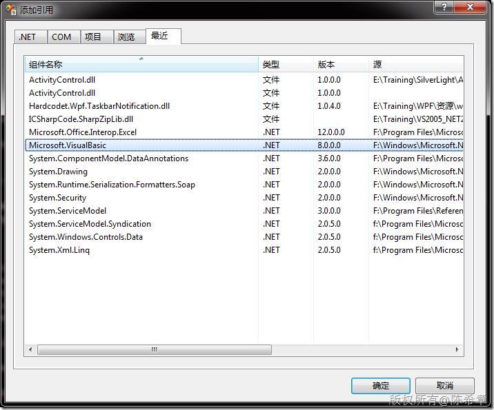

# WPF：如何实现单实例的应用程序（Single Instance） 
> 原文发表于 2010-03-25, 地址: http://www.cnblogs.com/chenxizhang/archive/2010/03/25/1694605.html 


好吧，这是我将WPF与Windows Forms进行比较的系列文章的第四篇，讨论一下如何实现单实例(single instance)

 先来看第一种最简单粗暴的做法:

 **检测进程名**,如果名称一样,则表示程序已经启动了,就不再启动.


```
    protected override void OnStartup(StartupEventArgs e)
    {
        // Get Reference to the current Process
        Process thisProc = Process.GetCurrentProcess();
        // Check how many total processes have the same name as the current one
        if (Process.GetProcessesByName(thisProc.ProcessName).Length > 1)
        {
            // If ther is more than one, than it is already running.
            MessageBox.Show("Application is already running.");
            Application.Current.Shutdown();
            return;
        }

        base.OnStartup(e);
    }
很简单,不是吗?但简单有什么错呢? 它很实用.
```

```
[注意]这个代码如果在visual studio中调试则无效，因为visual studio调试用的进程是加了一个vshost的后缀的。
```

```
 
```

```
第二种方案我觉得应该还是可以用**mutex**来实现嘛，看看下面的代码
```

```
using System;
using System.Collections.Generic;
using System.Configuration;
using System.Data;
using System.Linq;
using System.Windows;
using System.Diagnostics;
using System.Threading;

namespace WpfApplication1
{
    /// <summary>
    /// App.xaml 的交互逻辑
    /// </summary>
    public partial class App : Application
    {
        protected override void OnStartup(StartupEventArgs e)
        {
            bool createNew;
            Mutex mutex = new Mutex(true, "MyApplication", out createNew);
            if (createNew)
                base.OnStartup(e);
            else
            {
                MessageBox.Show("程序已经启动了");
                Application.Current.Shutdown();
            } 
        }

    }
}

```


.csharpcode, .csharpcode pre
{
 font-size: small;
 color: black;
 font-family: consolas, "Courier New", courier, monospace;
 background-color: #ffffff;
 /*white-space: pre;*/
}
.csharpcode pre { margin: 0em; }
.csharpcode .rem { color: #008000; }
.csharpcode .kwrd { color: #0000ff; }
.csharpcode .str { color: #006080; }
.csharpcode .op { color: #0000c0; }
.csharpcode .preproc { color: #cc6633; }
.csharpcode .asp { background-color: #ffff00; }
.csharpcode .html { color: #800000; }
.csharpcode .attr { color: #ff0000; }
.csharpcode .alt 
{
 background-color: #f4f4f4;
 width: 100%;
 margin: 0em;
}
.csharpcode .lnum { color: #606060; }

这一种做法的结果与第一种很类似，或者说没有任何区别。


 


看起来解决问题了，但仍然不是很理想的。最好的情况是，当用户开启第二个实例的时候，如果第一个实例没有处于活动状态，则应该激活它。


我们很自然还是联想到了原先在Windows Forms时代的**WindowsFormsApplicationBase**，那里面做这个事情太简单了。


首先，添加Microsoft.VisualBasic的引用


[](http://images.cnblogs.com/cnblogs_com/chenxizhang/WindowsLiveWriter/WPF_E576/image_2.png) 


```
namespace WpfApplication1
{
    public class EntryPoint
    {
        [STAThread]
        public static void Main(string[] args)
        {
            SingleInstanceManager manager = new SingleInstanceManager();
            manager.Run(args);
        }
    }

    // Using VB bits to detect single instances and process accordingly:
    // * OnStartup is fired when the first instance loads
    // * OnStartupNextInstance is fired when the application is re-run again
    // NOTE: it is redirected to this instance thanks to IsSingleInstance
    public class SingleInstanceManager : WindowsFormsApplicationBase
    {
        SingleInstanceApplication app;

        public SingleInstanceManager()
        {
            this.IsSingleInstance = true;
        }

        protected override bool OnStartup(Microsoft.VisualBasic.ApplicationServices.StartupEventArgs e)
        {
            // First time app is launched
            app = new SingleInstanceApplication();
            app.Run();
            return false;
        }

        protected override void OnStartupNextInstance(StartupNextInstanceEventArgs eventArgs)
        {
            // Subsequent launches
            base.OnStartupNextInstance(eventArgs);
            app.Activate();
        }
    }

    public class SingleInstanceApplication : Application
    {
        protected override void OnStartup(System.Windows.StartupEventArgs e)
        {
            base.OnStartup(e);

            // Create and show the application's main window
            //MainWindow window = new MainWindow();
            Window1 window = new Window1();
            window.Show();
        }

        public void Activate()
        {
            // Reactivate application's main window
            this.MainWindow.Show();
            this.MainWindow.Activate();
        }
    }
} 

```

.csharpcode, .csharpcode pre
{
 font-size: small;
 color: black;
 font-family: consolas, "Courier New", courier, monospace;
 background-color: #ffffff;
 /*white-space: pre;*/
}
.csharpcode pre { margin: 0em; }
.csharpcode .rem { color: #008000; }
.csharpcode .kwrd { color: #0000ff; }
.csharpcode .str { color: #006080; }
.csharpcode .op { color: #0000c0; }
.csharpcode .preproc { color: #cc6633; }
.csharpcode .asp { background-color: #ffff00; }
.csharpcode .html { color: #800000; }
.csharpcode .attr { color: #ff0000; }
.csharpcode .alt 
{
 background-color: #f4f4f4;
 width: 100%;
 margin: 0em;
}
.csharpcode .lnum { color: #606060; }
