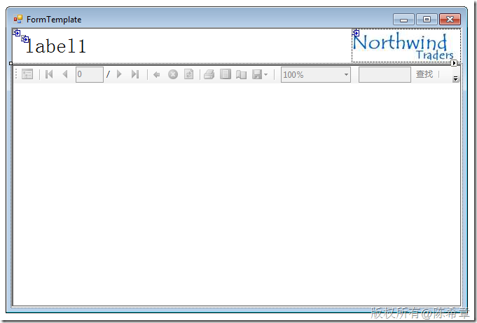
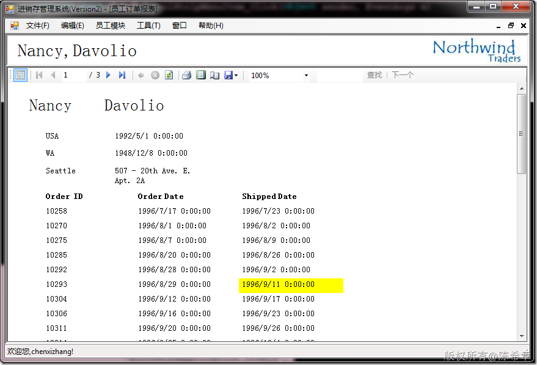

# 一个通用的报表显示窗口（WindowsForms) 
> 原文发表于 2010-03-29, 地址: http://www.cnblogs.com/chenxizhang/archive/2010/03/29/1699401.html 


这也是这两天课堂上的一个范例。我们考虑到有很多报表，不可能为所有的报表单独定义一个窗口来显示，所以最后重构成一个通用的窗口

 [](http://images.cnblogs.com/cnblogs_com/chenxizhang/WindowsLiveWriter/WindowsForms_A5C0/image_6.png) 

 后台代码


```
using System;
using Microsoft.Reporting.WinForms;

namespace NorthwindApplication
{
    public partial class ReportForm : NorthwindApplication.FormTemplate
    {
        public ReportForm()
        {
            InitializeComponent();
        }

        public ReportForm(
            string formTitle,
            string reportTitle,
            string reportPath,
            params ReportDataSource[] datasource)
            : this()
        {
            this.Text = formTitle;
            this.FormTitle.Text = reportTitle;
            this.reportViewer1.LocalReport.ReportPath = reportPath;
            this.reportViewer1.LocalReport.DataSources.Clear();
            foreach (var item in datasource)
            {
                this.reportViewer1.LocalReport.DataSources.Add(item);
            }

        }

        private void ReportForm\_Load(object sender, EventArgs e)
        {

            this.reportViewer1.RefreshReport();
        }
    }
}

```


.csharpcode, .csharpcode pre
{
 font-size: small;
 color: black;
 font-family: consolas, "Courier New", courier, monospace;
 background-color: #ffffff;
 /*white-space: pre;*/
}
.csharpcode pre { margin: 0em; }
.csharpcode .rem { color: #008000; }
.csharpcode .kwrd { color: #0000ff; }
.csharpcode .str { color: #006080; }
.csharpcode .op { color: #0000c0; }
.csharpcode .preproc { color: #cc6633; }
.csharpcode .asp { background-color: #ffff00; }
.csharpcode .html { color: #800000; }
.csharpcode .attr { color: #ff0000; }
.csharpcode .alt 
{
 background-color: #f4f4f4;
 width: 100%;
 margin: 0em;
}
.csharpcode .lnum { color: #606060; }


主窗体调用代码


```
           //这里读取数据，然后实例化报表，然后显示报表
            var formTitle = "员工订单报表";
            var context = new NorthwindDataContext();

            var employee =
                context.Employees.Where(
                    emp => emp.EmployeeID == 1);

            

            if (employee != null)
            {
                var temp = employee.FirstOrDefault();
                var reportTitle = temp.FirstName + "," + temp.LastName;
                var reportPath = "EmployeeOrderReport.rdlc";

                ReportForm report = new ReportForm(
                    formTitle,
                    reportTitle,
                    reportPath,
                    new ReportDataSource(
                        "NorthwindApplication\_Employees",
                        employee),
                    new ReportDataSource(
                        "NorthwindApplication\_Orders",
                        temp.Orders.ToArray()));


                report.MdiParent = this;
                report.WindowState = FormWindowState.Maximized;
                report.Show();

            }
```


.csharpcode, .csharpcode pre
{
 font-size: small;
 color: black;
 font-family: consolas, "Courier New", courier, monospace;
 background-color: #ffffff;
 /*white-space: pre;*/
}
.csharpcode pre { margin: 0em; }
.csharpcode .rem { color: #008000; }
.csharpcode .kwrd { color: #0000ff; }
.csharpcode .str { color: #006080; }
.csharpcode .op { color: #0000c0; }
.csharpcode .preproc { color: #cc6633; }
.csharpcode .asp { background-color: #ffff00; }
.csharpcode .html { color: #800000; }
.csharpcode .attr { color: #ff0000; }
.csharpcode .alt 
{
 background-color: #f4f4f4;
 width: 100%;
 margin: 0em;
}
.csharpcode .lnum { color: #606060; }


窗体显示的大致效果如下


```
 
```

```
[](http://images.cnblogs.com/cnblogs_com/chenxizhang/WindowsLiveWriter/WindowsForms_A5C0/image_4.png) 
```

.csharpcode, .csharpcode pre
{
 font-size: small;
 color: black;
 font-family: consolas, "Courier New", courier, monospace;
 background-color: #ffffff;
 /*white-space: pre;*/
}
.csharpcode pre { margin: 0em; }
.csharpcode .rem { color: #008000; }
.csharpcode .kwrd { color: #0000ff; }
.csharpcode .str { color: #006080; }
.csharpcode .op { color: #0000c0; }
.csharpcode .preproc { color: #cc6633; }
.csharpcode .asp { background-color: #ffff00; }
.csharpcode .html { color: #800000; }
.csharpcode .attr { color: #ff0000; }
.csharpcode .alt 
{
 background-color: #f4f4f4;
 width: 100%;
 margin: 0em;
}
.csharpcode .lnum { color: #606060; }
