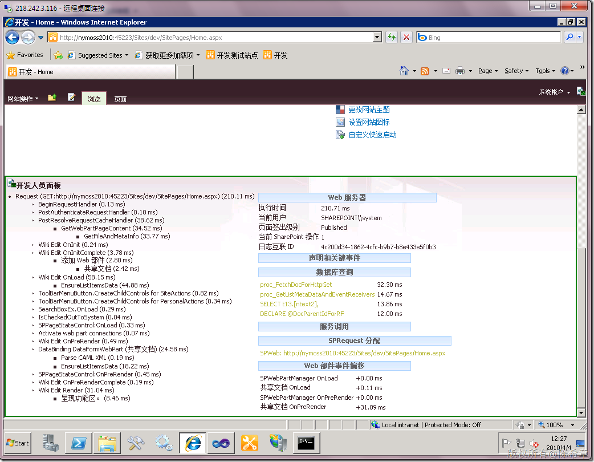

# MOSS 2010 新特性之 开发人员仪表盘 Development Deshboard 
> 原文发表于 2010-04-04, 地址: http://www.cnblogs.com/chenxizhang/archive/2010/04/04/1704106.html 

该文参考 ： <http://www.cnblogs.com/by1455/archive/2010/01/04/1639189.html>

 简单而言，这个工具可以让开发人员可以理解页面上的组件工作的情况，包括它们分别占用的时间。这让我想起原先在ASP.NET里面的Trace工具

  

 启用该功能有三种做法：

 1. 通过对象模型启用

 2. 通过Powershell

 3. 通过stsadm

 我推荐使用第三种方法

 ***stsadm -o setproperty -pn developer-dashboard -pv* On  或者** ***stsadm –o setproperty –pn developer-dashboard -pv  OnDemand.***   选择OnDemand 会在页面的右上角出现一个小小的按钮来控制developer dashboard的显示与否。 

