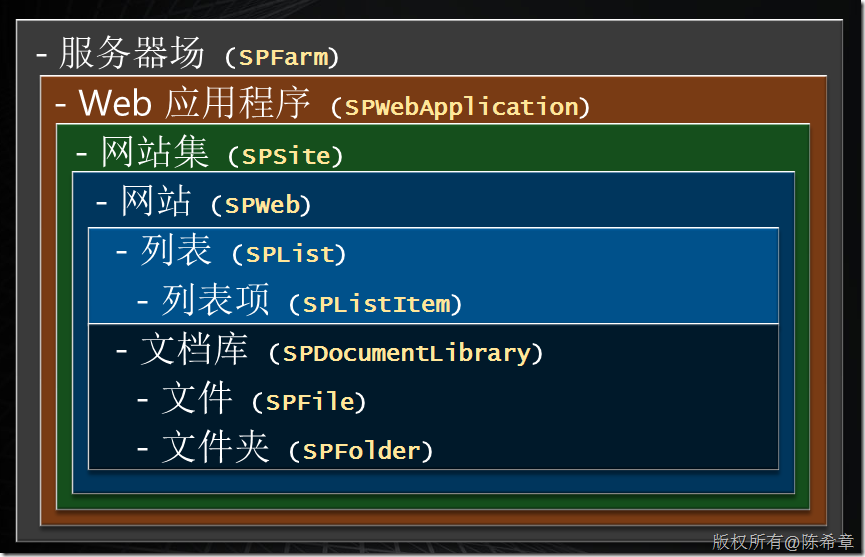
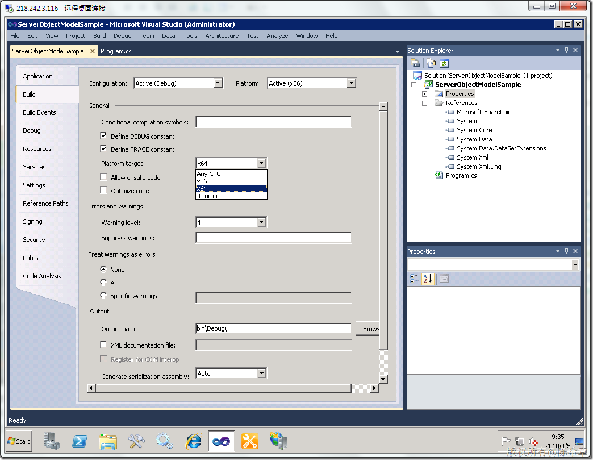
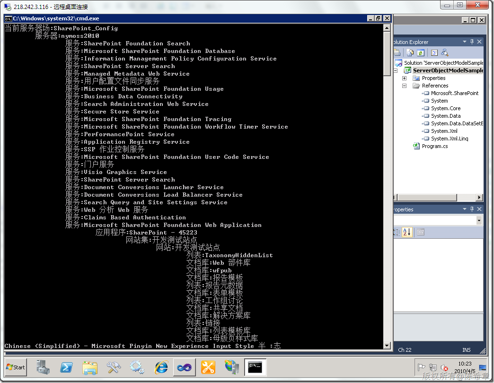

# MOSS 2010服务器对象模型（Object Model） 
> 原文发表于 2010-04-05, 地址: http://www.cnblogs.com/chenxizhang/archive/2010/04/05/1704550.html 


虽然从界面上有了很大的变化，但其实MOSS 2010的服务器对象模型并没有大的变化。请看下面的图形

 [](http://images.cnblogs.com/cnblogs_com/chenxizhang/WindowsLiveWriter/MOSS2010ObjectModel_92E1/image_4.png) 

 当然，MOSS 2010的对象模型确实有了一些变动，这体现在它增加了客户端对象模型和所谓的一个运行时。（这个在后面再介绍）

 这一篇，我们依然来看看服务器对象模型

 这里再提一下，必须设置为目标平台为x64，否则下面的代码会出错，因为找不到SPFarm

 [](http://images.cnblogs.com/cnblogs_com/chenxizhang/WindowsLiveWriter/MOSS2010ObjectModel_92E1/image_6.png) 

 其实，每次都修改我也觉得很烦，但这个选项默认设置为x86，好像改不了，请参考下面这个讨论

 <https://connect.microsoft.com/VisualStudio/feedback/ViewFeedback.aspx?FeedbackID=455333&wa=wsignin1.0>

  

  
```
using System;
using System.Collections.Generic;
using System.Linq;
using System.Text;
using Microsoft.SharePoint;
using Microsoft.SharePoint.Administration;


namespace ServerObjectModelSample
{
    class Program
    {
        /// <summary>
        /// 这个程序演示了如何使用MOSS 2010服务器对象模型
        /// 作者：陈希章
        /// </summary>
        /// <param name="args"></param>
        static void Main(string[] args)
        {
            

            SPFarm farm = SPFarm.Local;
            Console.WriteLine("当前服务器场:{0}", farm.Name);
            
            foreach (var server in farm.Servers)
            {
                Console.Write(new string('\t',1));
                Console.WriteLine("服务器:{0} ", server.Name);
                foreach (var serviceInstance in server.ServiceInstances)
                {
                    Console.Write(new string('\t', 2));

                    Console.WriteLine("服务:{0}", serviceInstance.TypeName);
                    if (serviceInstance.Service.GetType() == typeof(SPWebService)) {
                        var service = (SPWebService)serviceInstance.Service;


                        foreach (var app in service.WebApplications)
                        {
                            Console.Write(new string('\t', 3));
                            Console.WriteLine("应用程序:{0}", app.Name);

                            foreach (SPSite site in app.Sites)
                            {
                                Console.Write(new string('\t', 4));
                                Console.WriteLine("网站集:{0}", site.RootWeb.Title);
                                foreach (SPWeb web in site.AllWebs)
                                {
                                    ShowWebContent(web,5);
                                }
                            }
                        }
                    }
                }
            }


        }

        private static void ShowWebContent(SPWeb web, int level)
        {
            Console.Write(new string('\t', level));
            Console.WriteLine("网站:{0}", web.Title);

            foreach (SPList list in web.Lists)
            {
                Console.Write(new string('\t', level + 1));
                if (list.GetType() == typeof(SPDocumentLibrary))
                    Console.WriteLine("文档库:{0}", list.Title);
                else
                    Console.WriteLine("列表:{0}", list.Title);


            }

            foreach (SPWeb subweb in web.Webs)
            {
                ShowWebContent(subweb, level + 1);
            }
        }
    }
}

```

```
[](http://images.cnblogs.com/cnblogs_com/chenxizhang/WindowsLiveWriter/MOSS2010ObjectModel_92E1/image_8.png) 
```

.csharpcode, .csharpcode pre
{
 font-size: small;
 color: black;
 font-family: consolas, "Courier New", courier, monospace;
 background-color: #ffffff;
 /*white-space: pre;*/
}
.csharpcode pre { margin: 0em; }
.csharpcode .rem { color: #008000; }
.csharpcode .kwrd { color: #0000ff; }
.csharpcode .str { color: #006080; }
.csharpcode .op { color: #0000c0; }
.csharpcode .preproc { color: #cc6633; }
.csharpcode .asp { background-color: #ffff00; }
.csharpcode .html { color: #800000; }
.csharpcode .attr { color: #ff0000; }
.csharpcode .alt 
{
 background-color: #f4f4f4;
 width: 100%;
 margin: 0em;
}
.csharpcode .lnum { color: #606060; }

完整的输出结构如下


```
当前服务器场:SharePoint\_Config
    服务器:nymoss2010 
        服务:SharePoint Foundation Search
        服务:Microsoft SharePoint Foundation Database
        服务:Information Management Policy Configuration Service
        服务:SharePoint Server Search
        服务:Managed Metadata Web Service
        服务:用户配置文件同步服务
        服务:Microsoft SharePoint Foundation Usage
        服务:Business Data Connectivity
        服务:Search Administration Web Service
        服务:Secure Store Service
        服务:Microsoft SharePoint Foundation Tracing
        服务:Microsoft SharePoint Foundation Workflow Timer Service
        服务:PerformancePoint Service
        服务:Application Registry Service
        服务:SSP 作业控制服务
        服务:Microsoft SharePoint Foundation User Code Service
        服务:门户服务
        服务:Visio Graphics Service
        服务:SharePoint Server Search
        服务:Document Conversions Launcher Service
        服务:Document Conversions Load Balancer Service
        服务:Search Query and Site Settings Service
        服务:Web 分析 Web 服务
        服务:Claims Based Authentication
        服务:Microsoft SharePoint Foundation Web Application
            应用程序:SharePoint - 45223
                网站集:开发测试站点
                    网站:开发测试站点
                        列表:TaxonomyHiddenList
                        文档库:Web 部件库
                        文档库:wfpub
                        文档库:报告模板
                        列表:报告元数据
                        文档库:表单模板
                        列表:工作组讨论
                        文档库:共享文档
                        文档库:解决方案库
                        列表:链接
                        文档库:列表模板库
                        文档库:母版页样式库
                        列表:内容类型发布错误日志
                        列表:任务
                        列表:日历
                        列表:通知
                        文档库:网站页面
                        文档库:网站资产
                        文档库:样式库
                        文档库:已转换表单
                        列表:用户信息列表
                        文档库:主题库
                        文档库:自定义报表
                网站集:开发
                    网站:开发
                        列表:TaxonomyHiddenList
                        文档库:Web 部件库
                        文档库:wfpub
                        文档库:报告模板
                        列表:报告元数据
                        文档库:表单模板
                        列表:工作组讨论
                        文档库:共享文档
                        文档库:解决方案库
                        列表:链接
                        文档库:列表模板库
                        文档库:母版页样式库
                        列表:内容类型发布错误日志
                        列表:任务
                        列表:日历
                        列表:通知
                        文档库:网站页面
                        文档库:网站资产
                        文档库:样式库
                        文档库:已转换表单
                        列表:用户信息列表
                        文档库:主题库
                        文档库:自定义报表
            应用程序:SharePoint - 80
                网站集:我的网站
                    网站:我的网站
                        列表:TaxonomyHiddenList
                        文档库:Web 部件库
                        文档库:表单模板
                        文档库:解决方案库
                        文档库:列表模板库
                        文档库:母版页样式库
                        列表:内容类型发布错误日志
                        文档库:样式库
                        文档库:已转换表单
                        列表:用户信息列表
                        列表:用户照片
                        文档库:主题库
                        文档库:自定义报表
                        列表:组织徽标
        服务:Central Administration
            应用程序:
                网站集:管理中心
                    网站:管理中心
                        列表:SSA1266586a56f24727bf188b22746c631b
                        文档库:Web 部件库
                        列表:复查问题和解决方案
                        文档库:共享文档
                        文档库:管理报告库
                        列表:管理员任务
                        文档库:解决方案库
                        文档库:列表模板库
                        文档库:母版页样式库
                        列表:内容部署路径
                        列表:内容部署作业
                        列表:日历
                        列表:通讯组
                        列表:通知
                        文档库:样式库
                        列表:用户信息列表
                        列表:运行状况分析器规则定义
                        文档库:主题库
                        列表:资源
                        列表:作业报告
                网站集:产品帮助网站
                    网站:产品帮助网站
                        列表:TaxonomyHiddenList
                        文档库:Web 部件库
                        文档库:wfpub
                        文档库:报告模板
                        列表:报告元数据
                        文档库:表单模板
                        文档库:产品帮助
                        列表:工作组讨论
                        文档库:共享文档
                        文档库:解决方案库
                        列表:链接
                        文档库:列表模板库
                        文档库:母版页样式库
                        列表:任务
                        列表:日历
                        列表:通知
                        文档库:网站页面
                        文档库:网站资产
                        文档库:样式库
                        文档库:已转换表单
                        列表:用户信息列表
                        文档库:主题库
                        文档库:自定义报表
        服务:Excel Calculation Services
        服务:Microsoft SharePoint Foundation Incoming E-Mail
        服务:User Profile Service
        服务:Access Database Service
        服务:Microsoft SharePoint Foundation Subscription Settings Service
        服务:Microsoft SharePoint Foundation Administration
        服务:SharePoint Foundation Search
        服务:Microsoft SharePoint Foundation Timer
        服务:Lotus Notes Connector
        服务:Web 分析数据处理服务
        服务:Word Automation Services
        服务:Application Discovery and Load Balancer Service

```

.csharpcode, .csharpcode pre
{
 font-size: small;
 color: black;
 font-family: consolas, "Courier New", courier, monospace;
 background-color: #ffffff;
 /*white-space: pre;*/
}
.csharpcode pre { margin: 0em; }
.csharpcode .rem { color: #008000; }
.csharpcode .kwrd { color: #0000ff; }
.csharpcode .str { color: #006080; }
.csharpcode .op { color: #0000c0; }
.csharpcode .preproc { color: #cc6633; }
.csharpcode .asp { background-color: #ffff00; }
.csharpcode .html { color: #800000; }
.csharpcode .attr { color: #ff0000; }
.csharpcode .alt 
{
 background-color: #f4f4f4;
 width: 100%;
 margin: 0em;
}
.csharpcode .lnum { color: #606060; }
