# MOSS 2010：Visual Studio 2010开发体验（2）——项目模板和结构 
> 原文发表于 2010-04-05, 地址: http://www.cnblogs.com/chenxizhang/archive/2010/04/05/1704701.html 

这是让人感到很舒服的一个改进，现在的项目模板和结构变得很清晰。

 首先来看项目模板列表

 [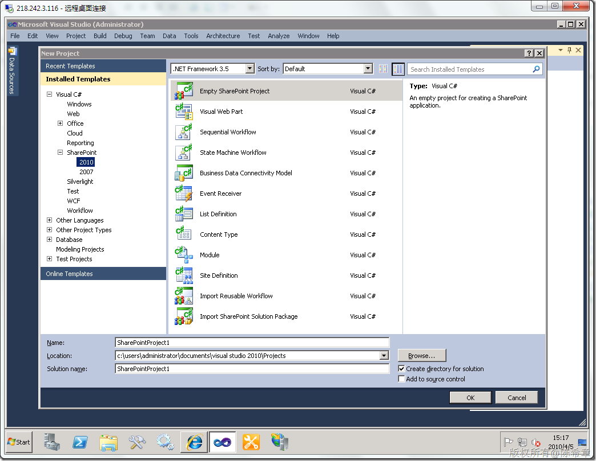](http://images.cnblogs.com/cnblogs_com/chenxizhang/WindowsLiveWriter/MOSS2010VisualStudio20102_DBA6/image_2.png) 

 选择一个项目模板之后，点击“Ok”，一般都会有一个向导

 [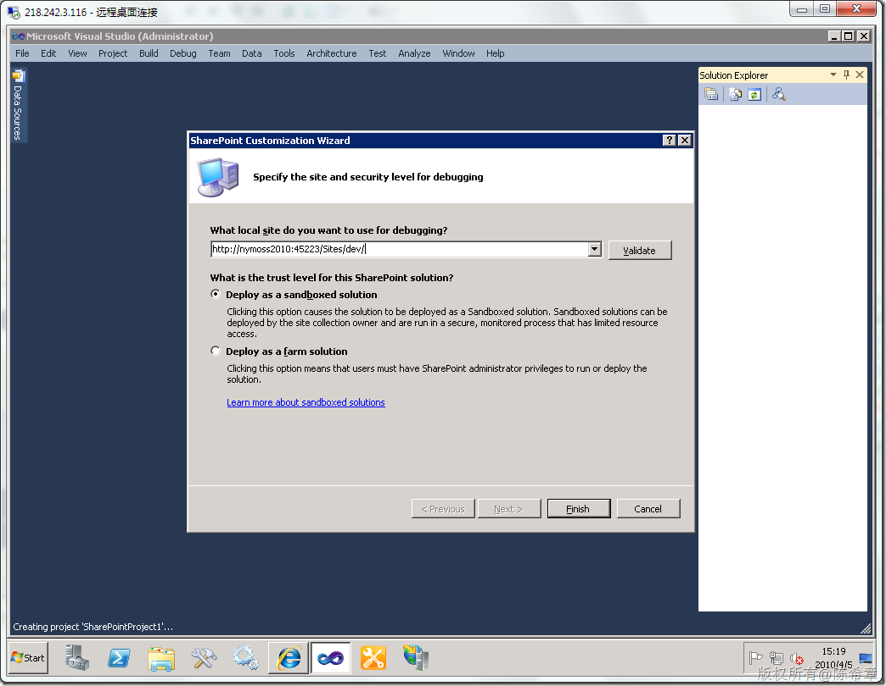](http://images.cnblogs.com/cnblogs_com/chenxizhang/WindowsLiveWriter/MOSS2010VisualStudio20102_DBA6/image_4.png) 

 这里的Sandboxed solution也是一个新特性，我在下面这个文章中做了介绍。以及对两种Solution做了比较

 <http://www.cnblogs.com/chenxizhang/archive/2010/04/05/1704505.html>

  

 然后，我们可以看到如下的一个项目结构

 [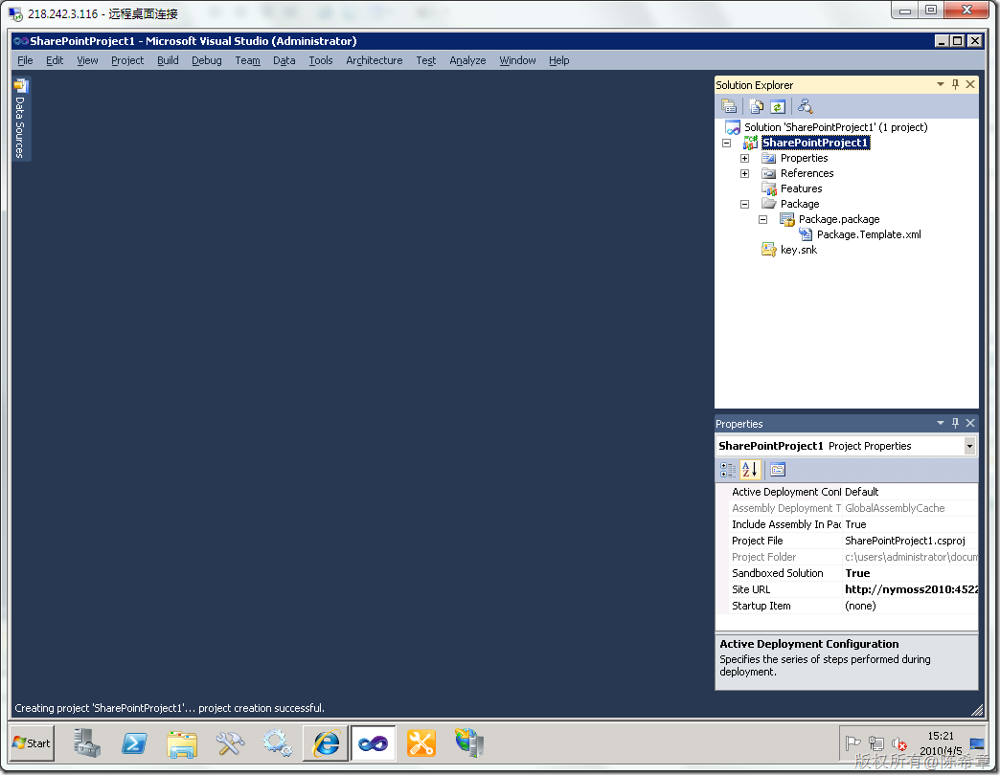](http://images.cnblogs.com/cnblogs_com/chenxizhang/WindowsLiveWriter/MOSS2010VisualStudio20102_DBA6/image_6.png) 

 也就是说，现在每个项目都自动会打包为一个Package(其实就是Solution)，里面包含了Feature。这种结构当然很清晰，作为开发人员不需要再那么费尽脑筋去自己打包这些东西了。

 下面，我们添加一个我们需要的功能，例如添加一个WebPart

 [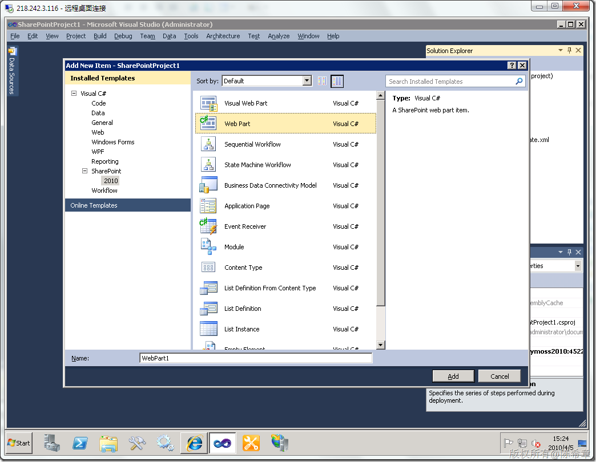](http://images.cnblogs.com/cnblogs_com/chenxizhang/WindowsLiveWriter/MOSS2010VisualStudio20102_DBA6/image_8.png) 

    [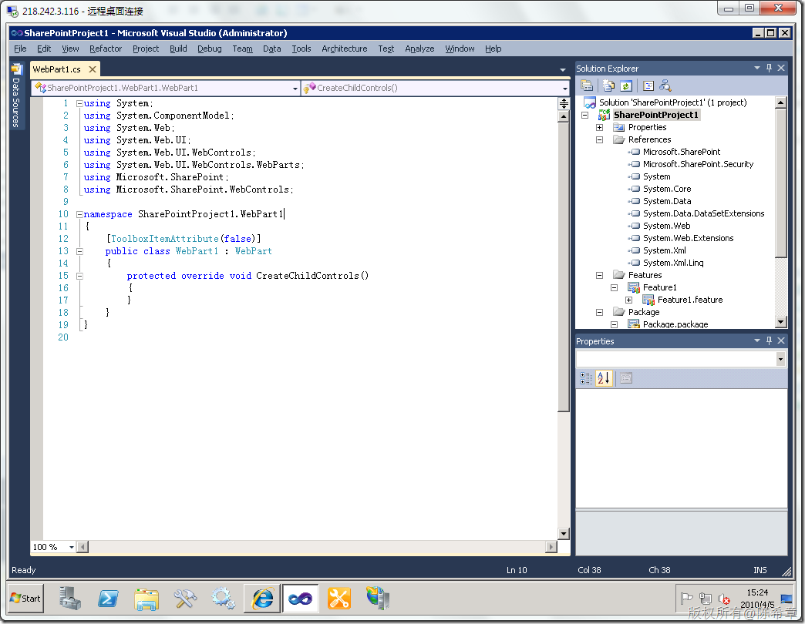](http://images.cnblogs.com/cnblogs_com/chenxizhang/WindowsLiveWriter/MOSS2010VisualStudio20102_DBA6/image_10.png) 

 除了增加一个Webpart1.cs之外，其实还增加了很多东西

 [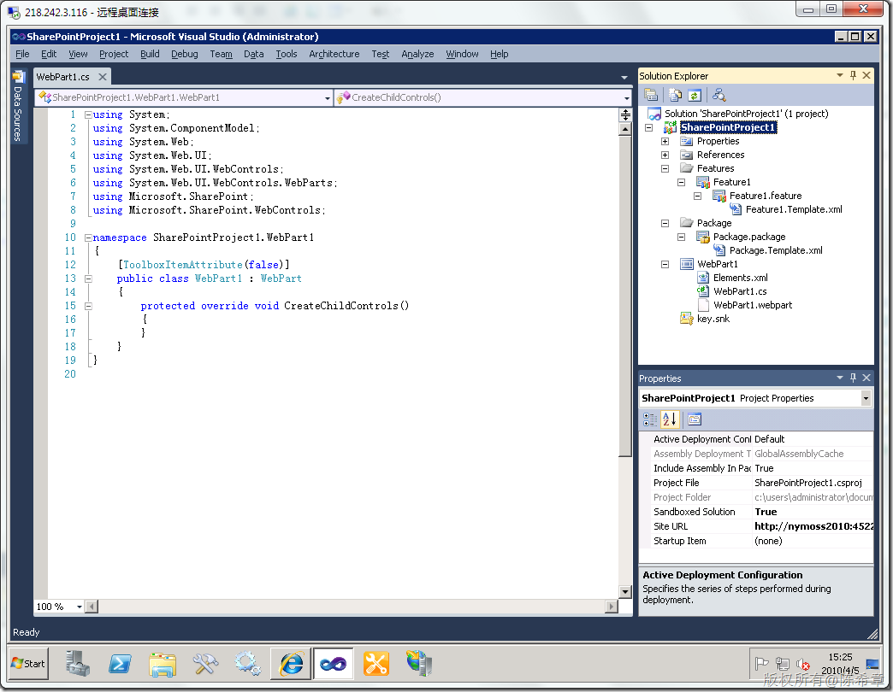](http://images.cnblogs.com/cnblogs_com/chenxizhang/WindowsLiveWriter/MOSS2010VisualStudio20102_DBA6/image_12.png) 

  首先来看webpart1.webpart文件 

 [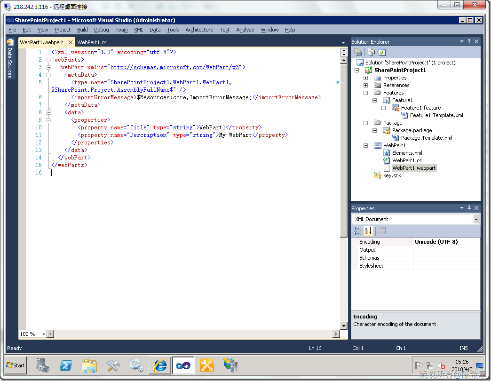](http://images.cnblogs.com/cnblogs_com/chenxizhang/WindowsLiveWriter/MOSS2010VisualStudio20102_DBA6/image_14.png) 

 然后来看Elements.xml

 [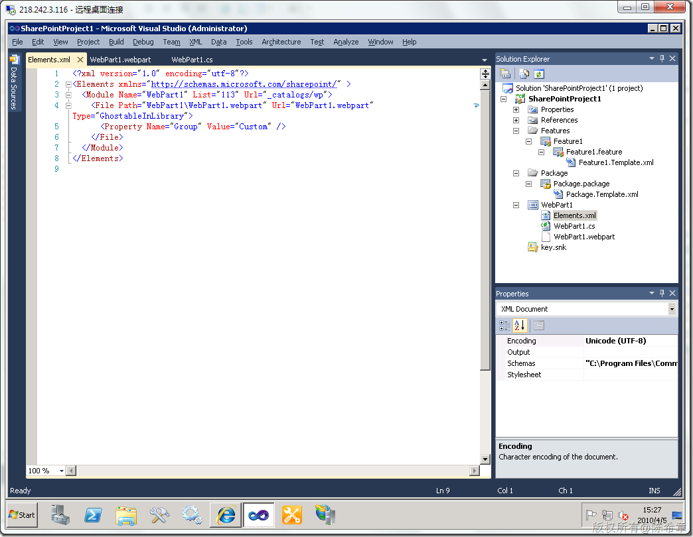](http://images.cnblogs.com/cnblogs_com/chenxizhang/WindowsLiveWriter/MOSS2010VisualStudio20102_DBA6/image_16.png) 

 看到这里，我们没有理由不热泪盈眶，因为在MOSS 2007的时候，我们就真的需要自己去编写这些文件。

 再来看看Feature1.feature,双击Feature1这个节点

 [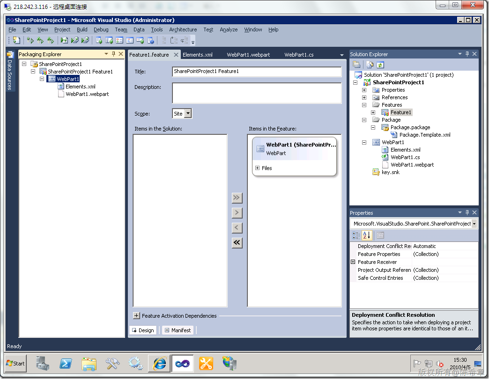](http://images.cnblogs.com/cnblogs_com/chenxizhang/WindowsLiveWriter/MOSS2010VisualStudio20102_DBA6/image_18.png) 

 是不是很激动啊？请冷静，继续往下看，解决方案也有一个专门的设计器

 [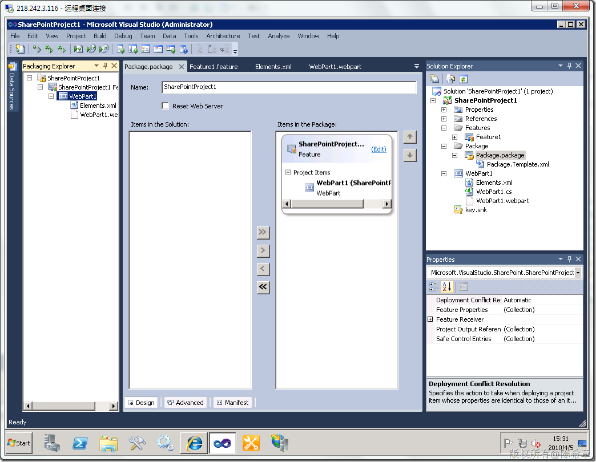](http://images.cnblogs.com/cnblogs_com/chenxizhang/WindowsLiveWriter/MOSS2010VisualStudio20102_DBA6/image_20.png) 

  

 其实这些东西对于专业开发人员来说没有什么大问题，我们以前也可以自己编写，或者通过一个wspbuilder工具来辅助 。但现在Visual Studio自带这一些，真是不服不行啊。

 [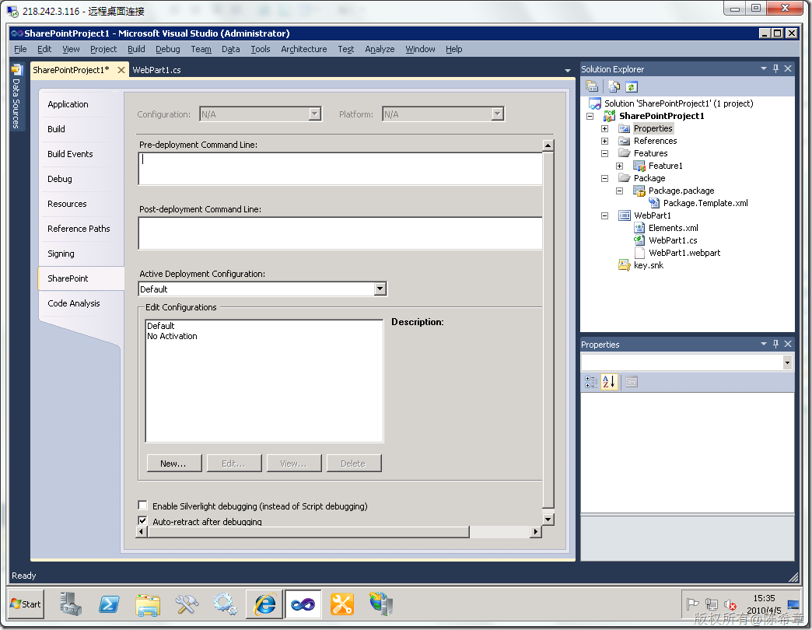](http://images.cnblogs.com/cnblogs_com/chenxizhang/WindowsLiveWriter/MOSS2010VisualStudio20102_DBA6/image_22.png) 

 这里默认会有两种配置，这些还可以自己定制

 [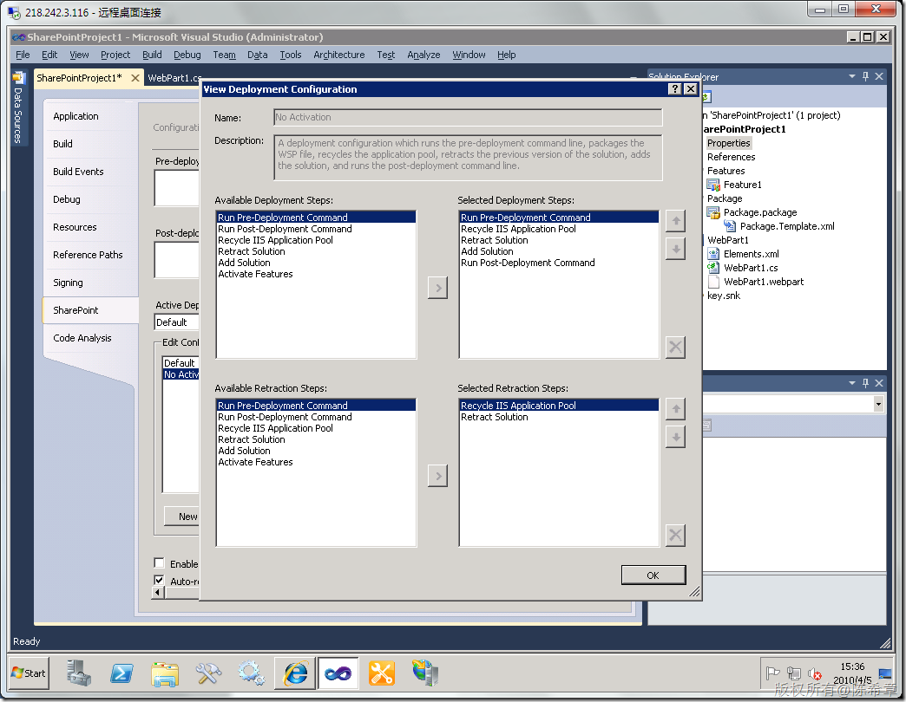](http://images.cnblogs.com/cnblogs_com/chenxizhang/WindowsLiveWriter/MOSS2010VisualStudio20102_DBA6/image_24.png) 

 项目模板自带的几个菜单，很有用Deploy,Package,Retract

 [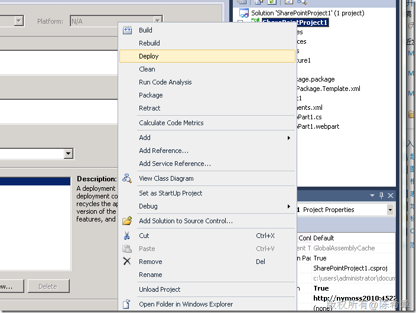](http://images.cnblogs.com/cnblogs_com/chenxizhang/WindowsLiveWriter/MOSS2010VisualStudio20102_DBA6/image_26.png)

