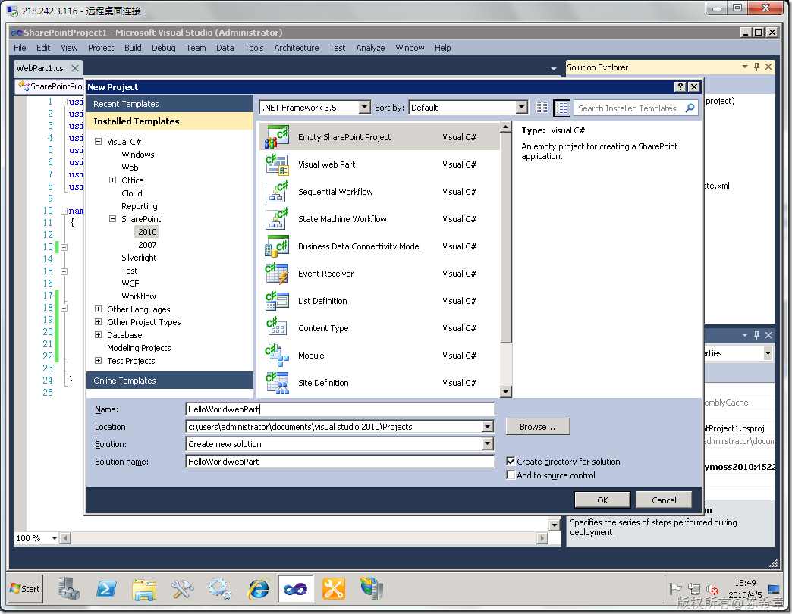

# MOSS 2010: Visual Studio 2010开发体验(3)——调试代码 
> 原文发表于 2010-04-05, 地址: http://www.cnblogs.com/chenxizhang/archive/2010/04/05/1704735.html 

这一篇来谈谈在Visual Studio 2010中直接进行代码调试的功能。我们可以简单地做一个WebPart来实验这个功能

 关于VS2010的项目模板和结构，请参考上一篇<http://www.cnblogs.com/chenxizhang/archive/2010/04/05/1704701.html>

 我们来快速创建一个WebPart项目吧

  

  

  

  

 为了看到调试的效果，我们可以设置一个断点

  

  

 现在，好戏开始了，请按下F5键

  

 它接着会自动打开浏览器，定位到我们的网站

  

 下面，我们尝试将那个WebPart添加到页面上

  

 点击“添加”之后 ，我们发现Visual Studio居然捕捉到了

  

          再次按下F5

  

 看起来的确不错，不是吗？就那么简单地按下了F5，到底发生了什么事情呢？

 * F5 键暗含哪些动作？  
构建新版本的 .wsp 文件  
反激活/卸载功能  
撤销/删除旧版本的 .wsp 文件  
添加/部署新的 .wsp 文件  
激活目标网站中的功能（通过网站 URL）  
将调试程序附加到 W3WP.EXE 工作者进程（通过网站 URL）

 我们退出调试模式，然后刷新页面，看看是否还有效果呢？当然没有，此时Visual Studio已经与网站断开了联系，那么有什么方法再次进行调试呢？

 答案很简单，我们可以自己进行附加嘛

  

 等等，这里有好几个w3wp.exe进程呢，我们怎么知道那个是我们需要的呢？

  

  

   

  

 另外，MOSS 2010还有一个新特性，就是所谓的开发人员仪表盘，我之前有一个文章介绍了

 <http://www.cnblogs.com/chenxizhang/archive/2010/04/04/1704106.html>

  

 可以看出，现在开发和调试都相对方便多了

