# MOSS 2010：Visual Studio 2010开发体验（8）——Silverlight应用 
> 原文发表于 2010-04-06, 地址: http://www.cnblogs.com/chenxizhang/archive/2010/04/06/1705132.html 


好吧，Silverlight现在已经是妇孺皆知了，所以MOSS 没有道理不支持它。其实说实在话，支持Silverlight并没有什么太难的事情，因为它主要依赖的是一个浏览器插件，其实与SharePoint没有什么关系的。

 anyway，我们还是来看一下MOSS 2010中如何使用Silverlight吧

 MOSS 2010默认提供了一个Web Part，是用来展现Silverlight的。

 [](http://images.cnblogs.com/cnblogs_com/chenxizhang/WindowsLiveWriter/MOSS2010VisualStudio20108Silverlight_9002/image_2.png) 

 [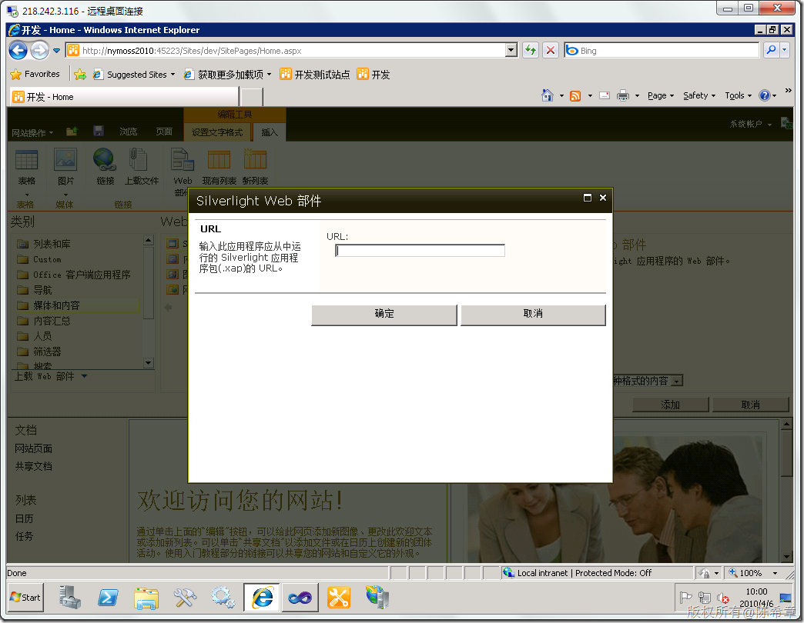](http://images.cnblogs.com/cnblogs_com/chenxizhang/WindowsLiveWriter/MOSS2010VisualStudio20108Silverlight_9002/image_4.png) 

 它当然需要我们提供一个xap文件的地址。所以i，我们现在要开始做一个最简单的Silverlight应用程序，然后将它的结果放在一个可以访问的地方。

 1. 创建Silverlight应用程序

 [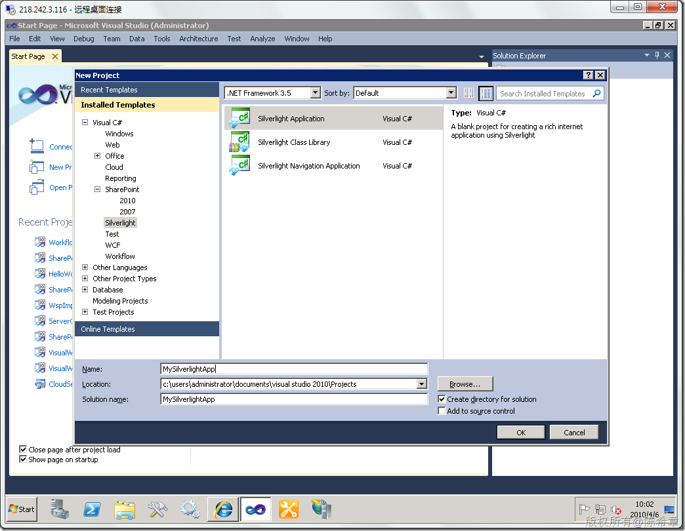](http://images.cnblogs.com/cnblogs_com/chenxizhang/WindowsLiveWriter/MOSS2010VisualStudio20108Silverlight_9002/image_6.png) 

 [](http://images.cnblogs.com/cnblogs_com/chenxizhang/WindowsLiveWriter/MOSS2010VisualStudio20108Silverlight_9002/image_8.png) 

 [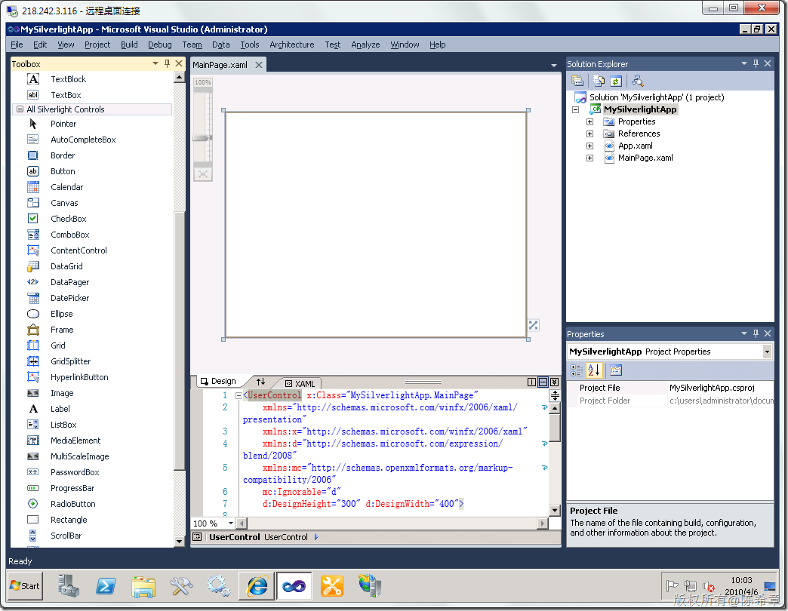](http://images.cnblogs.com/cnblogs_com/chenxizhang/WindowsLiveWriter/MOSS2010VisualStudio20108Silverlight_9002/image_10.png) 

 我们这个应用程序只需要实现最简单的功能，就是一个按钮，点击之后，显示一个“Hello,world”的消息即可

 [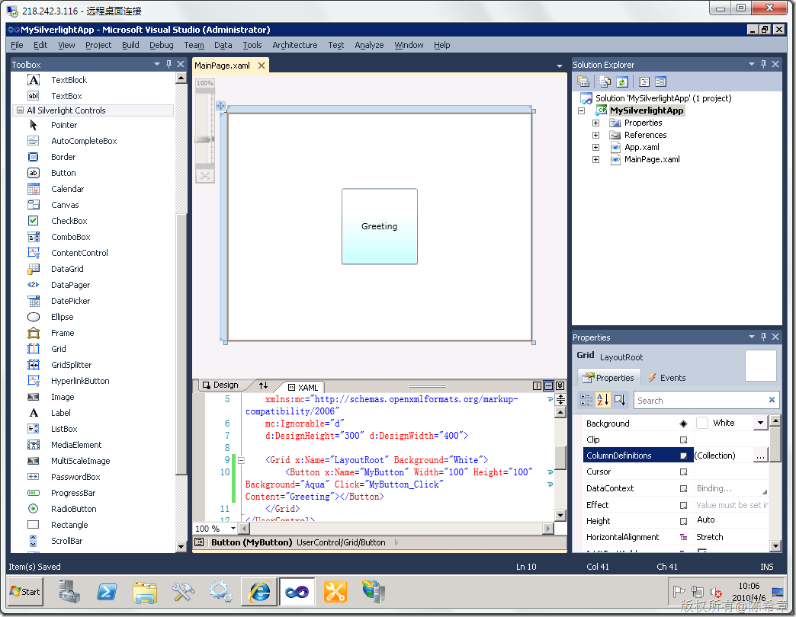](http://images.cnblogs.com/cnblogs_com/chenxizhang/WindowsLiveWriter/MOSS2010VisualStudio20108Silverlight_9002/image_12.png) 

 [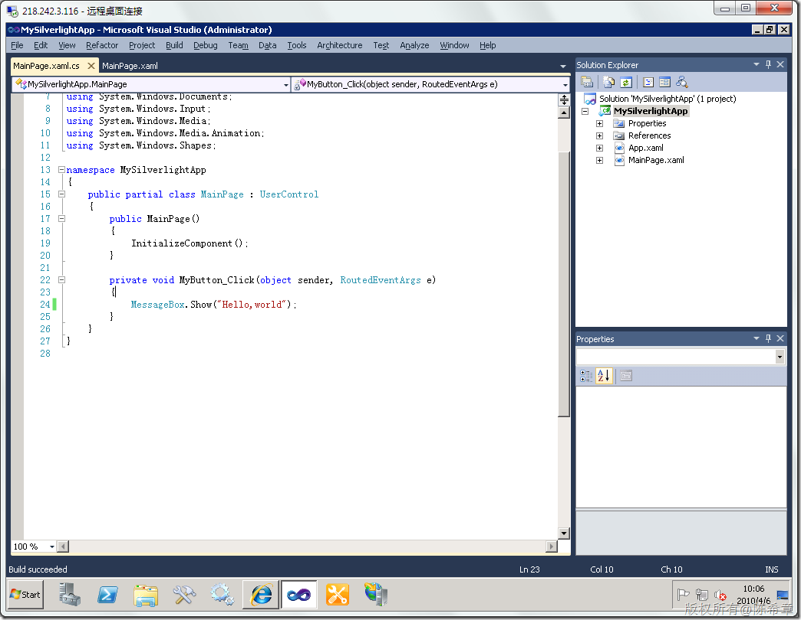](http://images.cnblogs.com/cnblogs_com/chenxizhang/WindowsLiveWriter/MOSS2010VisualStudio20108Silverlight_9002/image_14.png) 

 编译该解决方案会生成一个xap文件

 [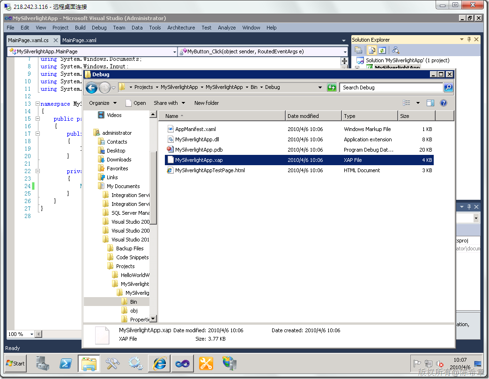](http://images.cnblogs.com/cnblogs_com/chenxizhang/WindowsLiveWriter/MOSS2010VisualStudio20108Silverlight_9002/image_16.png) 

 我们甚至可以直接通过它生成的一个测试页面进行测试

  [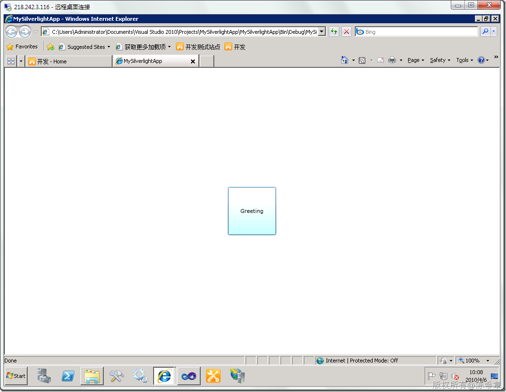](http://images.cnblogs.com/cnblogs_com/chenxizhang/WindowsLiveWriter/MOSS2010VisualStudio20108Silverlight_9002/image_18.png) 

 [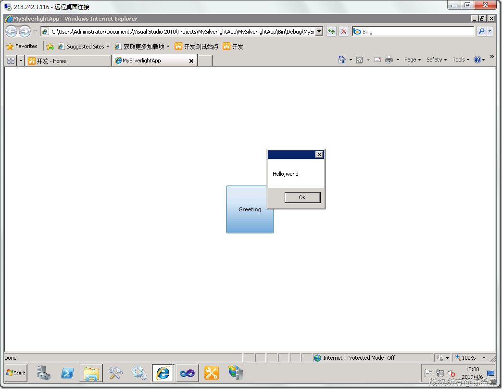](http://images.cnblogs.com/cnblogs_com/chenxizhang/WindowsLiveWriter/MOSS2010VisualStudio20108Silverlight_9002/image_20.png)

  

 2。 部署这个xap包，我们首先可以定位到下面这个目录。其实里面已经有一些xap了，说明MOSS 2010是希望我们能将自己的xap也放进来

 [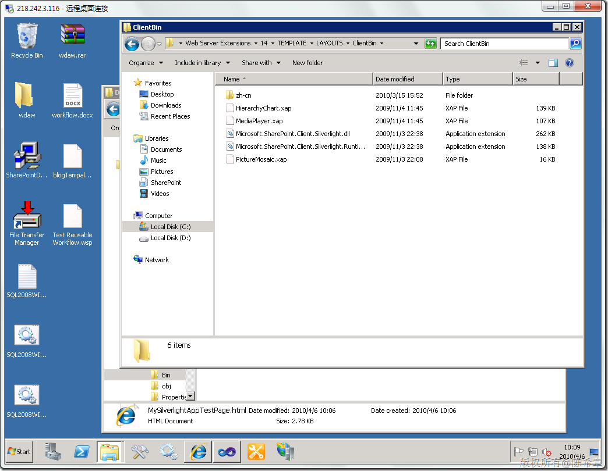](http://images.cnblogs.com/cnblogs_com/chenxizhang/WindowsLiveWriter/MOSS2010VisualStudio20108Silverlight_9002/image_22.png) 

 [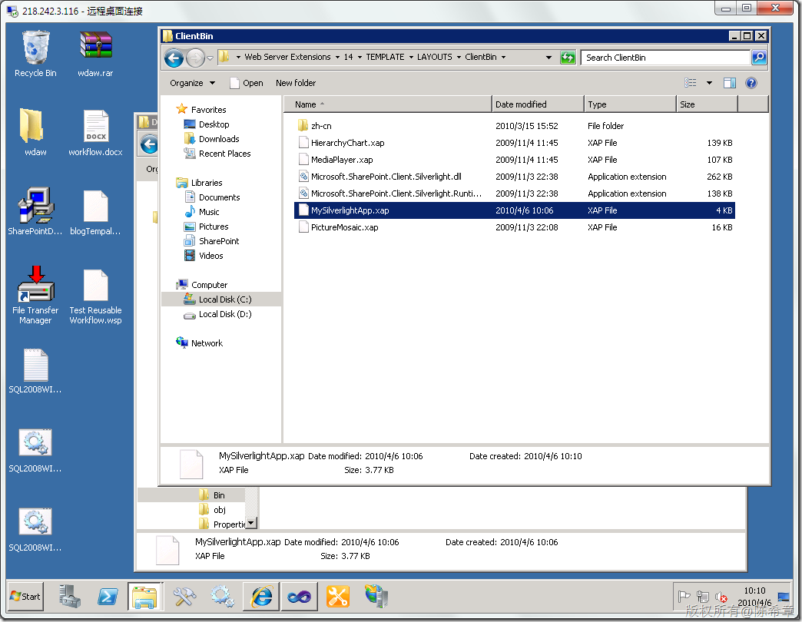](http://images.cnblogs.com/cnblogs_com/chenxizhang/WindowsLiveWriter/MOSS2010VisualStudio20108Silverlight_9002/image_24.png) 

  

 3.使用这个xap文件

 [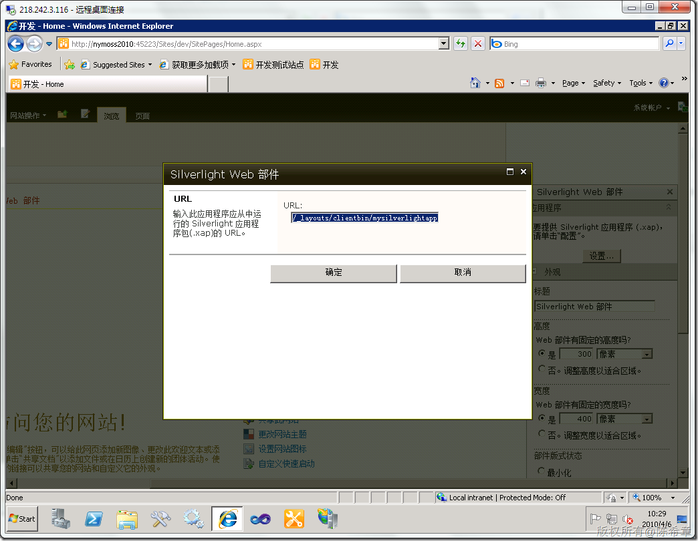](http://images.cnblogs.com/cnblogs_com/chenxizhang/WindowsLiveWriter/MOSS2010VisualStudio20108Silverlight_9002/image_28.png) 

 这个地址格式大致是这样的 

 /\_layouts/clientbin/mysilverlightapp.xap

 [](http://images.cnblogs.com/cnblogs_com/chenxizhang/WindowsLiveWriter/MOSS2010VisualStudio20108Silverlight_9002/image_30.png) 

 [](http://images.cnblogs.com/cnblogs_com/chenxizhang/WindowsLiveWriter/MOSS2010VisualStudio20108Silverlight_9002/image_32.png) 

 我们看到，它工作得很好，不是吗？

  

 4。我是比较推荐用这个内置的WebPart，但是如果你真的想自己开发一个WebPart，让他可以显示Silverlight应用的话，也很简单。我们可以打开那个测试页面来看一下就明白了

  


```
<!DOCTYPE html PUBLIC "-//W3C//DTD XHTML 1.0 Transitional//EN" "http://www.w3.org/TR/xhtml1/DTD/xhtml1-transitional.dtd">
<html xmlns="http://www.w3.org/1999/xhtml" >
<!-- saved from url=(0014)about:internet -->
<head>
    <title>MySilverlightApp</title>
    <style type="text/css">
    html, body {
        height: 100%;
        overflow: auto;
    }
    body {
        padding: 0;
        margin: 0;
    }
    #silverlightControlHost {
        height: 100%;
        text-align:center;
    }
    </style>
    
    <script type="text/javascript">
        function onSilverlightError(sender, args) {
            var appSource = "";
            if (sender != null && sender != 0) {
              appSource = sender.getHost().Source;
            }
            
            var errorType = args.ErrorType;
            var iErrorCode = args.ErrorCode;

            if (errorType == "ImageError" || errorType == "MediaError") {
              return;
            }

            var errMsg = "Unhandled Error in Silverlight Application " +  appSource + "\n" ;

            errMsg += "Code: "+ iErrorCode + " \n";
            errMsg += "Category: " + errorType + " \n";
            errMsg += "Message: " + args.ErrorMessage + " \n";

            if (errorType == "ParserError") {
                errMsg += "File: " + args.xamlFile + " \n";
                errMsg += "Line: " + args.lineNumber + " \n";
                errMsg += "Position: " + args.charPosition + " \n";
            }
            else if (errorType == "RuntimeError") {           
                if (args.lineNumber != 0) {
                    errMsg += "Line: " + args.lineNumber + " \n";
                    errMsg += "Position: " +  args.charPosition + " \n";
                }
                errMsg += "MethodName: " + args.methodName + " \n";
            }

            throw new Error(errMsg);
        }
    </script>
</head>
<body>
    <form id="form1" runat="server" style="height:100%">
    <div id="silverlightControlHost">
        <object data="data:application/x-silverlight-2," type="application/x-silverlight-2" width="100%" height="100%">
          <param name="source" value="MySilverlightApp.xap"/>
          <param name="onError" value="onSilverlightError" />
          <param name="background" value="white" />
          <param name="minRuntimeVersion" value="3.0.40818.0" />
          <param name="autoUpgrade" value="true" />
          <a href="http://go.microsoft.com/fwlink/?LinkID=149156&v=3.0.40818.0" style="text-decoration:none">
               
          </a>
        </object><iframe id="\_sl\_historyFrame" style="visibility:hidden;height:0px;width:0px;border:0px"></iframe></div>
    </form>
</body>
</html>

```

.csharpcode, .csharpcode pre
{
 font-size: small;
 color: black;
 font-family: consolas, "Courier New", courier, monospace;
 background-color: #ffffff;
 /*white-space: pre;*/
}
.csharpcode pre { margin: 0em; }
.csharpcode .rem { color: #008000; }
.csharpcode .kwrd { color: #0000ff; }
.csharpcode .str { color: #006080; }
.csharpcode .op { color: #0000c0; }
.csharpcode .preproc { color: #cc6633; }
.csharpcode .asp { background-color: #ffff00; }
.csharpcode .html { color: #800000; }
.csharpcode .attr { color: #ff0000; }
.csharpcode .alt 
{
 background-color: #f4f4f4;
 width: 100%;
 margin: 0em;
}
.csharpcode .lnum { color: #606060; }
