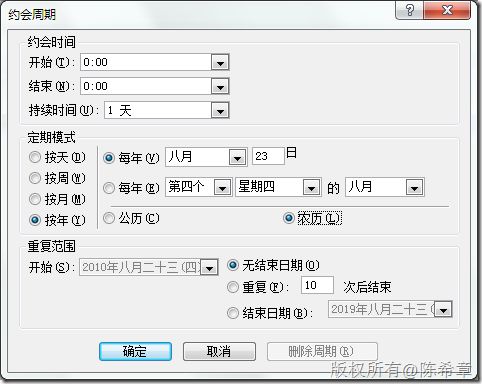
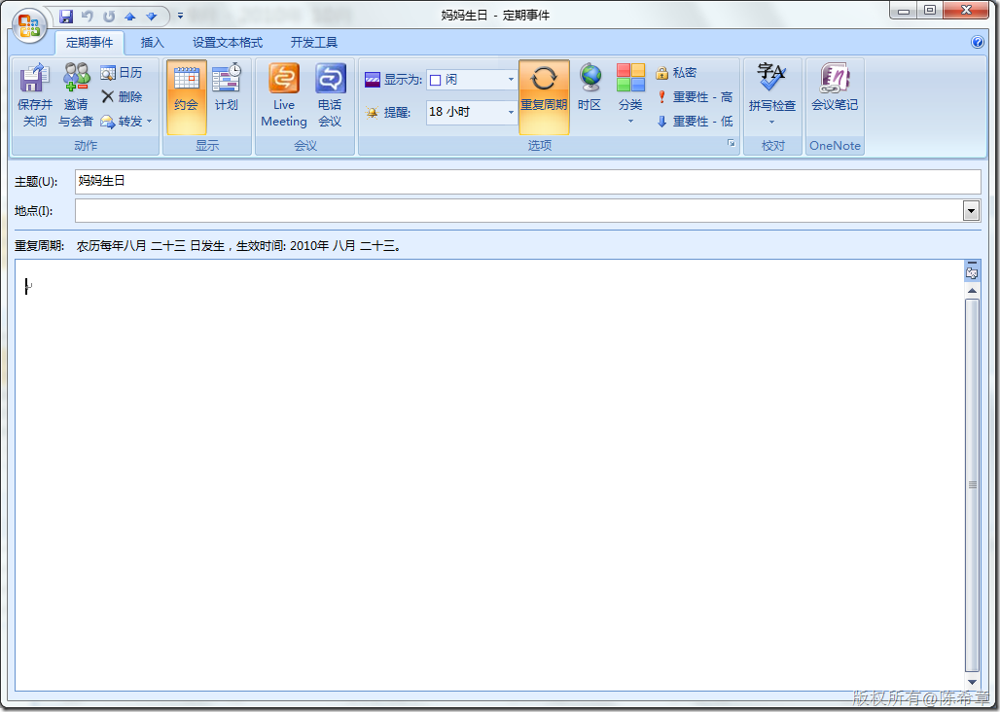

# 在Outlook中设置农历生日周期性事件 
> 原文发表于 2010-04-08, 地址: http://www.cnblogs.com/chenxizhang/archive/2010/04/08/1707767.html 

俺们农村人一般还是习惯按照农历过生日，但由于工作使用公历，所以经常有记不住的情况。研究了一下Outlook，其实是有这样的功能的，请看下面的设置

  

 

