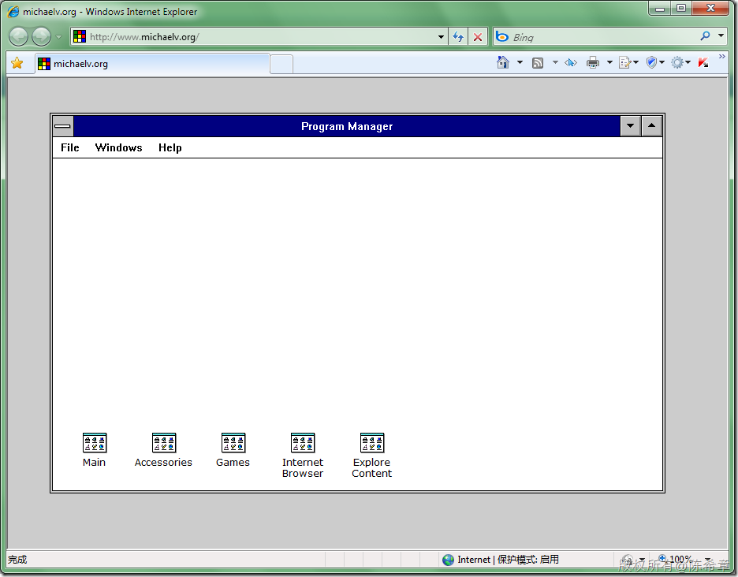
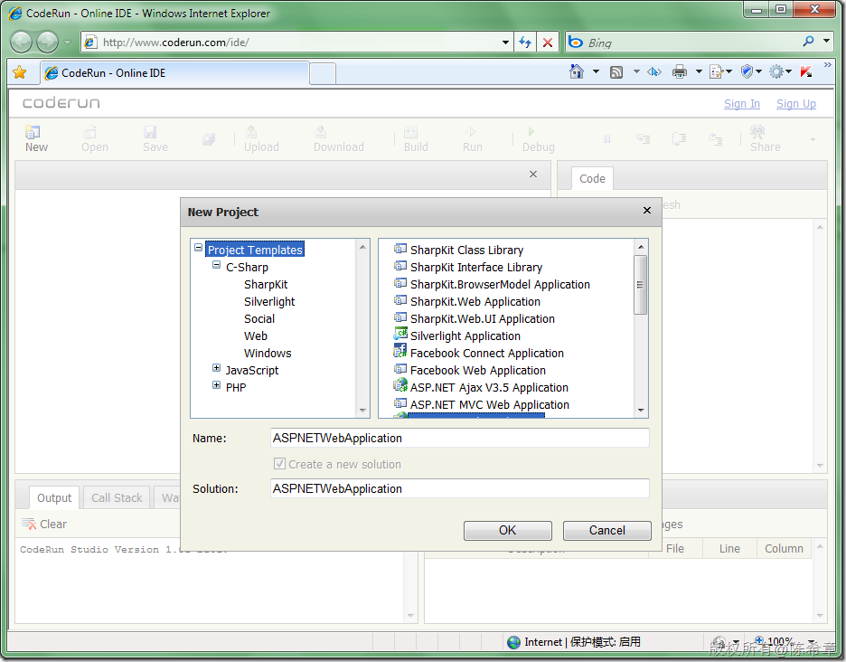

# 两个很好玩的网站 
> 原文发表于 2010-04-15, 地址: http://www.cnblogs.com/chenxizhang/archive/2010/04/15/1712915.html 

第一个网站模拟了Windows 3的界面。请注意不只是界面，里面的程序是可以运行的，包括可以扫雷，以及使用内部的Internet Explorer去上网

 

 第二个模拟了Visual Studio的界面和功能，请注意不只是界面，是包含功能，而且有智能感知

 

