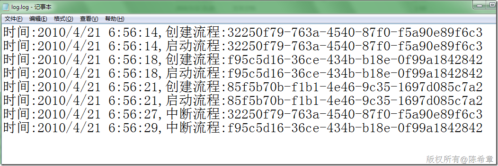
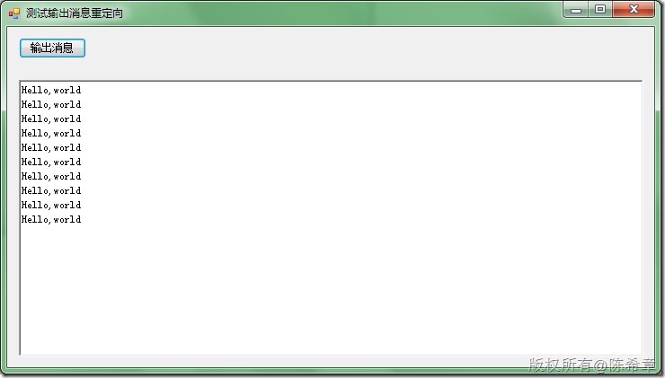

# 如何在Windows Service或者Windows Forms输出Console.Write的信息 
> 原文发表于 2010-04-21, 地址: http://www.cnblogs.com/chenxizhang/archive/2010/04/21/1716773.html 


我们很多人都喜欢在一些代码中使用Console.Write或者Console.WriteLine的方式输出一些信息，这种做法，如果用到控制台程序中，是很方便的。但是如果用到了Windows Service或者Windows Forms程序中，那么就不是那么好了，因为它们并没有所谓的Console。（如果我们是在Visual Studio中进行调试的话，会输出到一个Output窗口）

 先来看Windows Service的做法。我们可以将这个输出流重定向到一个文件。


```
            StreamWriter sw = new StreamWriter("e:\\temp\\log.log");
            sw.AutoFlush = true;
            Console.SetOut(sw);
```

```
 
```

```
[](http://images.cnblogs.com/cnblogs_com/chenxizhang/WindowsLiveWriter/WindowsServiceWindowsFormsConsole.Write_63A7/image_2.png) 
```

```
而在Windows Forms中呢，当然也可以像上面这样做，但是我们可能希望现在在窗体的一个文本框中，看下面的例子
```

```
首先可以编写一个特殊的TextWriter
```

```

        public class TextBoxWriter : TextWriter
        {
            TextBoxBase \_textbox;
            public TextBoxWriter(TextBoxBase textbox) {
                \_textbox = textbox;
            }

            public override Encoding Encoding
            {
                get { return Encoding.UTF8; }
            }

            public override void WriteLine(string value)
            {
                base.WriteLine(value);
                \_textbox.AppendText(value + Environment.NewLine);
            }
        }
```


.csharpcode, .csharpcode pre
{
 font-size: small;
 color: black;
 font-family: consolas, "Courier New", courier, monospace;
 background-color: #ffffff;
 /*white-space: pre;*/
}
.csharpcode pre { margin: 0em; }
.csharpcode .rem { color: #008000; }
.csharpcode .kwrd { color: #0000ff; }
.csharpcode .str { color: #006080; }
.csharpcode .op { color: #0000c0; }
.csharpcode .preproc { color: #cc6633; }
.csharpcode .asp { background-color: #ffff00; }
.csharpcode .html { color: #800000; }
.csharpcode .attr { color: #ff0000; }
.csharpcode .alt 
{
 background-color: #f4f4f4;
 width: 100%;
 margin: 0em;
}
.csharpcode .lnum { color: #606060; }

然后使用该TextWriter来输出消息到窗体的一个文本框中


```
            TextBoxWriter tw = new TextBoxWriter(richTextBox1);
            Console.SetOut(tw);
```


.csharpcode, .csharpcode pre
{
 font-size: small;
 color: black;
 font-family: consolas, "Courier New", courier, monospace;
 background-color: #ffffff;
 /*white-space: pre;*/
}
.csharpcode pre { margin: 0em; }
.csharpcode .rem { color: #008000; }
.csharpcode .kwrd { color: #0000ff; }
.csharpcode .str { color: #006080; }
.csharpcode .op { color: #0000c0; }
.csharpcode .preproc { color: #cc6633; }
.csharpcode .asp { background-color: #ffff00; }
.csharpcode .html { color: #800000; }
.csharpcode .attr { color: #ff0000; }
.csharpcode .alt 
{
 background-color: #f4f4f4;
 width: 100%;
 margin: 0em;
}
.csharpcode .lnum { color: #606060; }


[](http://images.cnblogs.com/cnblogs_com/chenxizhang/WindowsLiveWriter/WindowsServiceWindowsFormsConsole.Write_63A7/image_4.png) 


 


当然，如果仅仅是为了做一些跟踪性的输出，则更推荐使用Trace，结合TraceListener来实现。因为Trace是可以有多个输出的，事实上，确实也有一个ConsoleTraceListener可以输出到屏幕上。


 


 


 


```
 
```

```
 
```

.csharpcode, .csharpcode pre
{
 font-size: small;
 color: black;
 font-family: consolas, "Courier New", courier, monospace;
 background-color: #ffffff;
 /*white-space: pre;*/
}
.csharpcode pre { margin: 0em; }
.csharpcode .rem { color: #008000; }
.csharpcode .kwrd { color: #0000ff; }
.csharpcode .str { color: #006080; }
.csharpcode .op { color: #0000c0; }
.csharpcode .preproc { color: #cc6633; }
.csharpcode .asp { background-color: #ffff00; }
.csharpcode .html { color: #800000; }
.csharpcode .attr { color: #ff0000; }
.csharpcode .alt 
{
 background-color: #f4f4f4;
 width: 100%;
 margin: 0em;
}
.csharpcode .lnum { color: #606060; }
