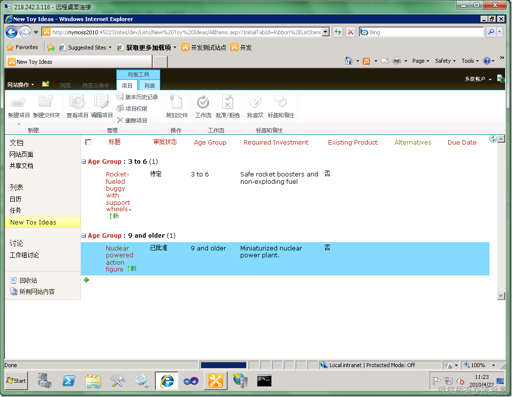
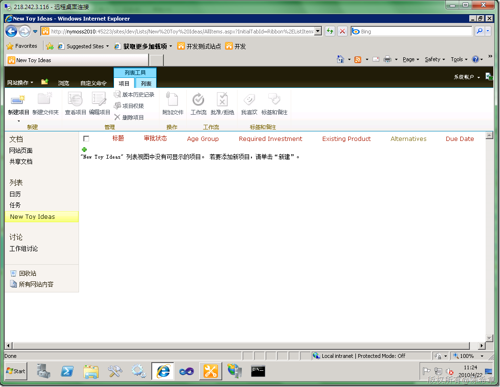
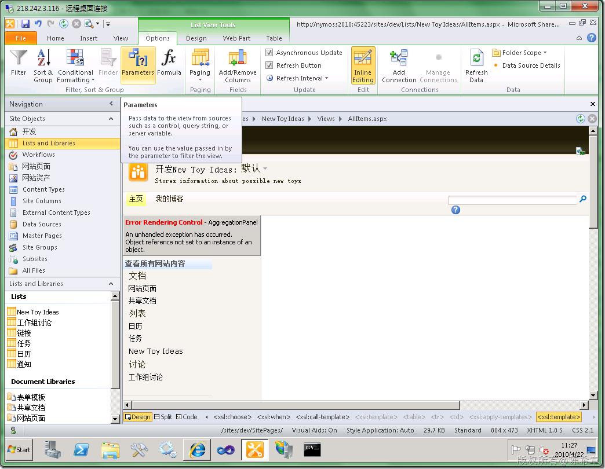
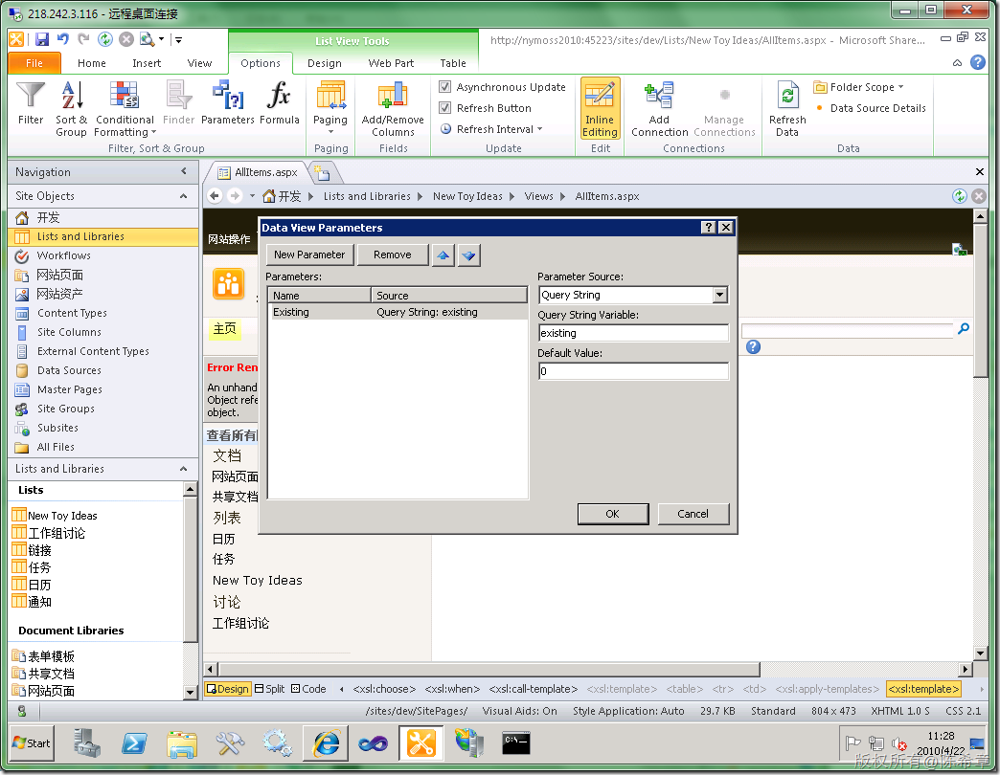
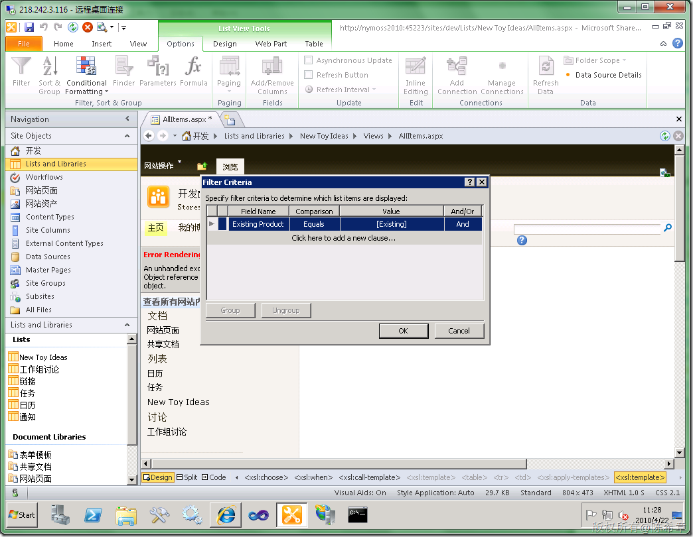
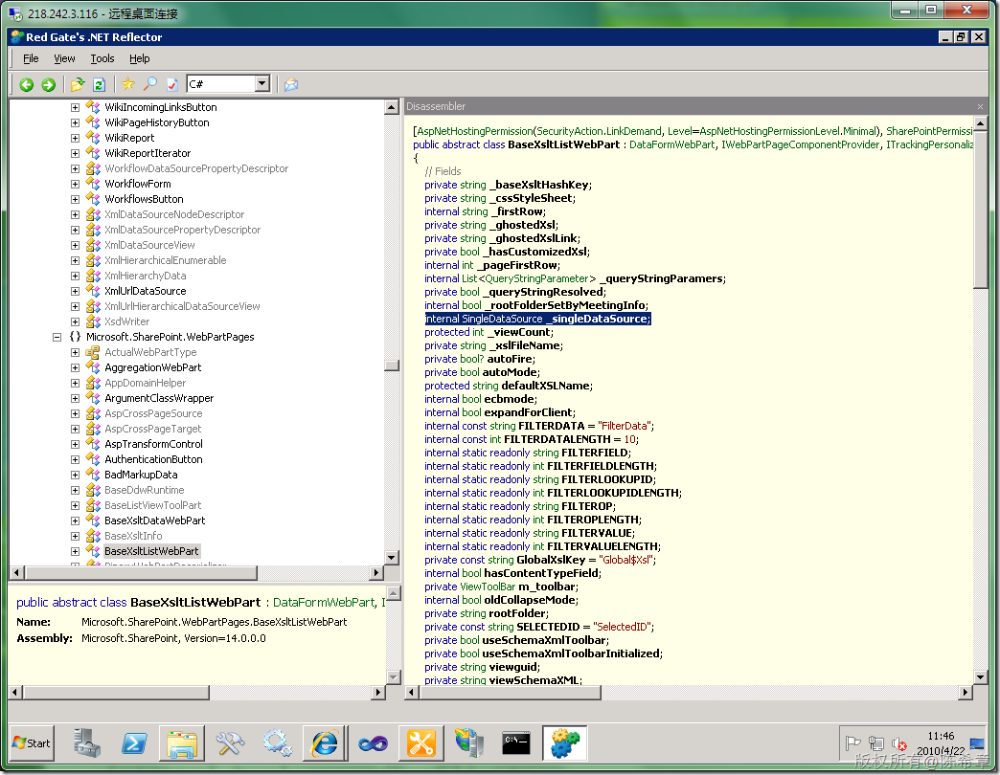

# MOSS 2010:为视图添加参数显示的功能 
> 原文发表于 2010-04-22, 地址: http://www.cnblogs.com/chenxizhang/archive/2010/04/22/1717912.html 


我们现在还可以根据一些参数来决定某个视图显示的数据。例如我们需要实现这样的场景：用户可以通过在地址栏中添加一些特殊的参数来对数据进行筛选

 首先仍然是来看一下效果先

 下面这个页面地址是：[http://nymoss2010:45223/sites/dev/Lists/New%20Toy%20Ideas/AllItems.aspx?InitialTabId=Ribbon%2EListItem&VisibilityContext=WSSTabPersistence](http://nymoss2010:45223/sites/dev/Lists/New%20Toy%20Ideas/AllItems.aspx?InitialTabId=Ribbon%2EListItem&VisibilityContext=WSSTabPersistence "http://nymoss2010:45223/sites/dev/Lists/New%20Toy%20Ideas/AllItems.aspx?InitialTabId=Ribbon%2EListItem&VisibilityContext=WSSTabPersistence")

 [](http://images.cnblogs.com/cnblogs_com/chenxizhang/WindowsLiveWriter/MOSS2010_A4F3/image_2.png) 

 下面这个地址是

 [http://nymoss2010:45223/sites/dev/Lists/New%20Toy%20Ideas/AllItems.aspx?InitialTabId=Ribbon%2EListItem&VisibilityContext=WSSTabPersistence&existing=1](http://nymoss2010:45223/sites/dev/Lists/New%20Toy%20Ideas/AllItems.aspx?InitialTabId=Ribbon%2EListItem&VisibilityContext=WSSTabPersistence&existing=1 "http://nymoss2010:45223/sites/dev/Lists/New%20Toy%20Ideas/AllItems.aspx?InitialTabId=Ribbon%2EListItem&VisibilityContext=WSSTabPersistence")

 [](http://images.cnblogs.com/cnblogs_com/chenxizhang/WindowsLiveWriter/MOSS2010_A4F3/image_4.png) 

 我们看到第二个界面上没有数据的.而他们地址栏的区别就在于第二个地址的最后面有&exising=1，这表示要查找那些Existing Product为true（或1）的记录

  

 我们是如何让地址栏的这些参数影响到视图的呢？

 [](http://images.cnblogs.com/cnblogs_com/chenxizhang/WindowsLiveWriter/MOSS2010_A4F3/image_6.png) 

 [](http://images.cnblogs.com/cnblogs_com/chenxizhang/WindowsLiveWriter/MOSS2010_A4F3/image_8.png) 

 [](http://images.cnblogs.com/cnblogs_com/chenxizhang/WindowsLiveWriter/MOSS2010_A4F3/image_10.png) 

 就是这么容易。这让我想起了我们刚学ASP.NET 2的时候，不是有一个SqlDataSource控件么，也有这个特性的。

 难道他们之间有什么千丝万缕的关系么？大家根据下面的这些文本先琢磨一下

  


```
        <WebPartPages:XsltListViewWebPart runat="server" Description="Stores information about possible new toys" 
```

```
ListDisplayName="" ImportErrorMessage="无法导入此 Web 部件。" PartOrder="2" Default="TRUE" HelpLink="" AllowRemove="True" IsVisible="True" AllowHide="True" 
```

```
**UseSQLDataSourcePaging="True"** ExportControlledProperties="False" IsIncludedFilter="" DataSourceID="" 
```

```
Title="New Toy Ideas" ViewFlag="25165829" NoDefaultStyle="" AllowConnect="True" DisplayName="所有项目" PageType="PAGE\_DEFAULTVIEW" 
```

```
FrameState="Normal" PageSize="-1" PartImageLarge="" AsyncRefresh="True" ExportMode="NonSensitiveData" 
```

```
Dir="Default" DetailLink="/sites/dev/Lists/New Toy Ideas" ShowWithSampleData="False" 
```

```
ListId="726db811-0ef0-4fc2-863d-8ffd504f54ec" ListName="{726DB811-0EF0-4FC2-863D-8FFD504F54EC}" 
```

```
FrameType="Default" PartImageSmall="" IsIncluded="True" SuppressWebPartChrome="False" AllowEdit="True" 
```

```
ViewGuid="{CE919B7F-878A-4789-BE21-F7CB8356B56F}" AutoRefresh="False" AutoRefreshInterval="60" AllowMinimize="True" 
```

```
WebId="00000000-0000-0000-0000-000000000000" ViewContentTypeId="0x" InitialAsyncDataFetch="False" 
```

```
GhostedXslLink="main.xsl" MissingAssembly="无法导入此 Web 部件。" HelpMode="Modeless" 
```

```
ListUrl="" ID="g\_ce919b7f\_878a\_4789\_be21\_f7cb8356b56f" ConnectionID="00000000-0000-0000-0000-000000000000" 
```

```
AllowZoneChange="True" TitleUrl="/sites/dev/Lists/New Toy Ideas" ManualRefresh="True" \_\_MarkupType="vsattributemarkup" 
```

```
\_\_WebPartId="{CE919B7F-878A-4789-BE21-F7CB8356B56F}" \_\_AllowXSLTEditing="true" 
```

```
\_\_designer:CustomXsl="fldtypes\_Ratings.xsl" WebPart="true" Height="" Width=""><ParameterBindings>
            <ParameterBinding Name="dvt\_sortdir" Location="Postback;Connection"/>
            <ParameterBinding Name="dvt\_sortfield" Location="Postback;Connection"/>
            <ParameterBinding Name="dvt\_firstrow" Location="Postback;Connection"/>
            <ParameterBinding Name="OpenMenuKeyAccessible" Location="Resource(wss,OpenMenuKeyAccessible)"/>
            <ParameterBinding Name="open\_menu" Location="Resource(wss,open\_menu)"/>
            <ParameterBinding Name="select\_deselect\_all" Location="Resource(wss,select\_deselect\_all)"/>
            <ParameterBinding Name="idPresEnabled" Location="Resource(wss,idPresEnabled)"/>
            <ParameterBinding Name="NoAnnouncements" Location="Resource(wss,noXinviewofY\_LIST)"/>
            <ParameterBinding Name="NoAnnouncementsHowTo" Location="Resource(wss,noXinviewofY\_DEFAULT)"/>
            <ParameterBinding Name="UserID" Location="CAMLVariable" DefaultValue="CurrentUserName"/>
            <ParameterBinding Name="dvt\_startposition" Location="Postback" DefaultValue=""/>
            **<ParameterBinding Name="Existing" Location="QueryString(existing)" DefaultValue="0"/>**
        </ParameterBindings>

```

.csharpcode, .csharpcode pre
{
 font-size: small;
 color: black;
 font-family: consolas, "Courier New", courier, monospace;
 background-color: #ffffff;
 /*white-space: pre;*/
}
.csharpcode pre { margin: 0em; }
.csharpcode .rem { color: #008000; }
.csharpcode .kwrd { color: #0000ff; }
.csharpcode .str { color: #006080; }
.csharpcode .op { color: #0000c0; }
.csharpcode .preproc { color: #cc6633; }
.csharpcode .asp { background-color: #ffff00; }
.csharpcode .html { color: #800000; }
.csharpcode .attr { color: #ff0000; }
.csharpcode .alt 
{
 background-color: #f4f4f4;
 width: 100%;
 margin: 0em;
}
.csharpcode .lnum { color: #606060; }


[](http://images.cnblogs.com/cnblogs_com/chenxizhang/WindowsLiveWriter/MOSS2010_A4F3/image_12.png)

