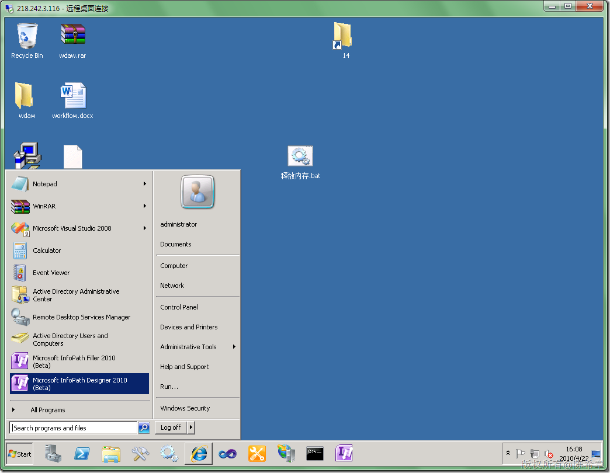
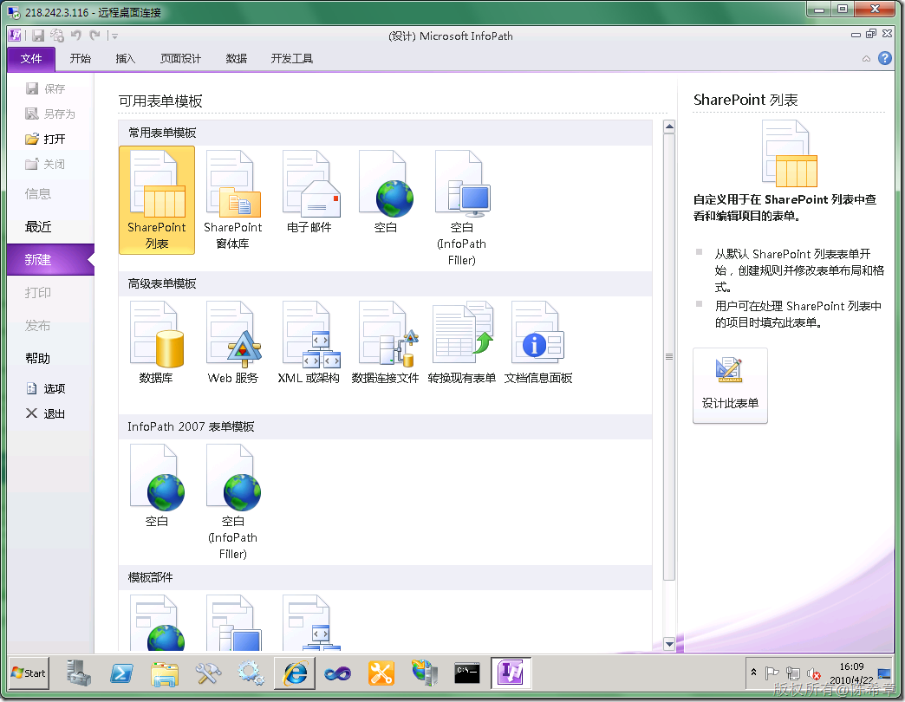
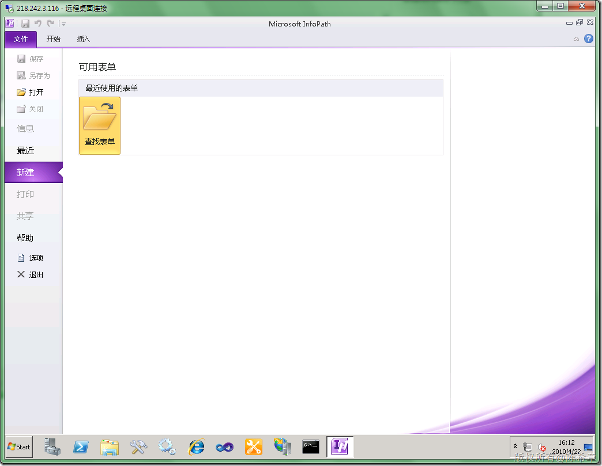
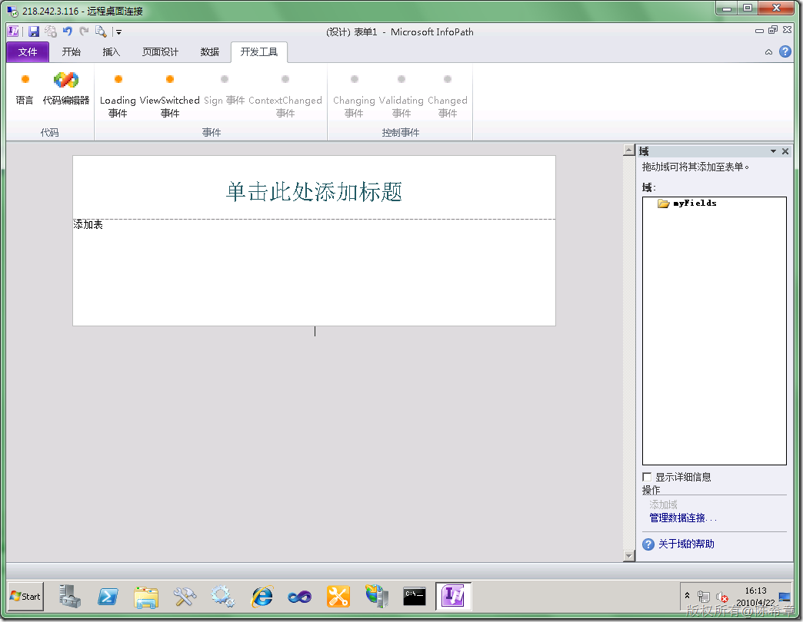
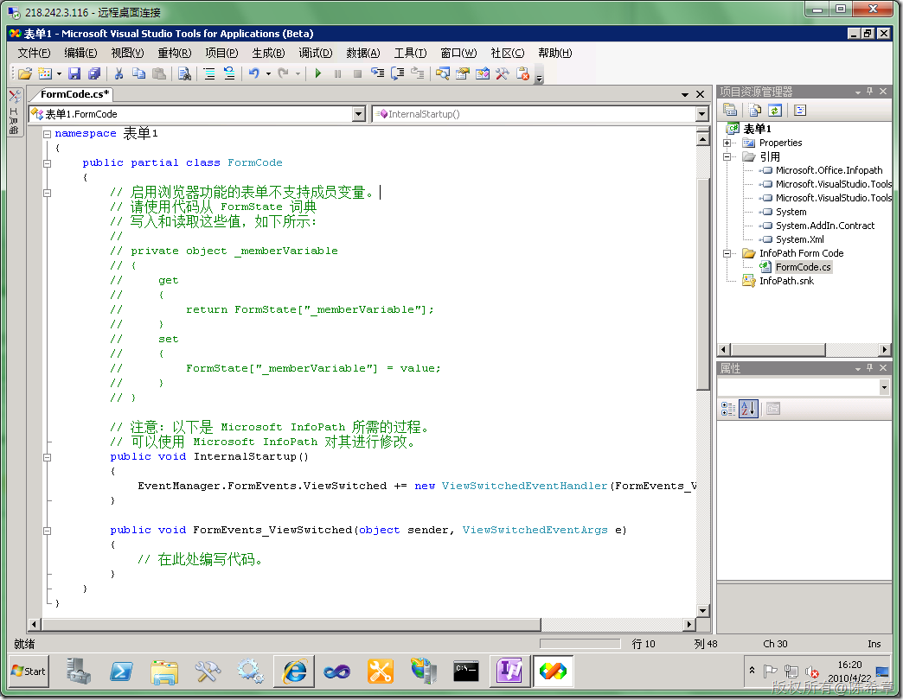
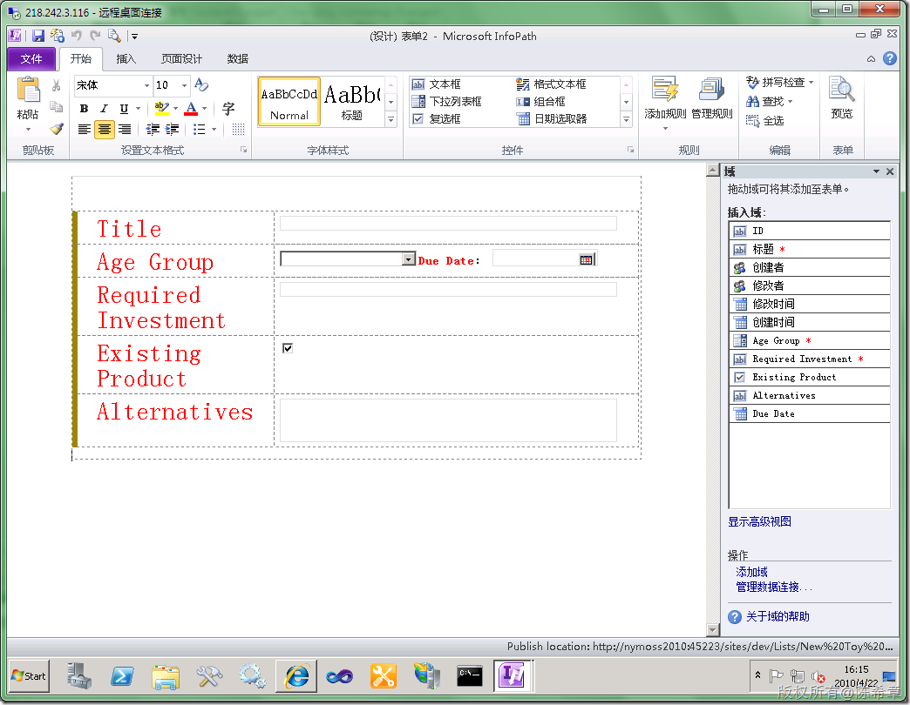
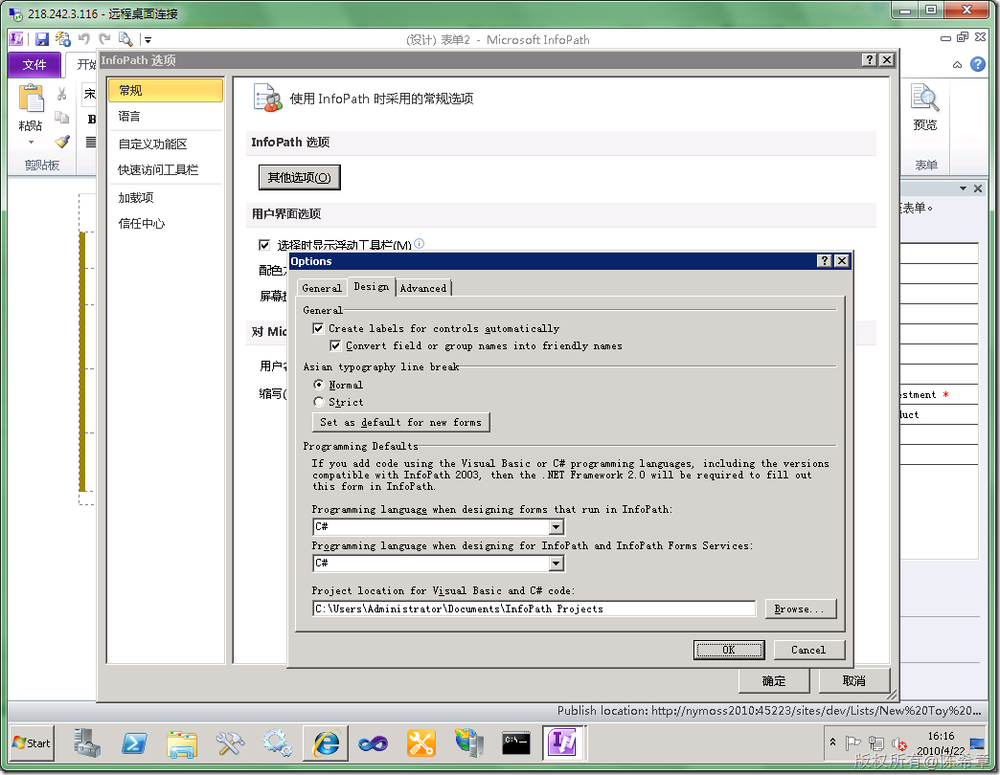

# Infopath 2010的变化 
> 原文发表于 2010-04-22, 地址: http://www.cnblogs.com/chenxizhang/archive/2010/04/22/1718098.html 

首先，现在分为两个软件，一个是Designer,一个是Filler

  

 顾名思义，Designer 是设计表单的，而Filler是填写表单的。下面这个是Designer

  

 下面这个是Filler

  

 然后我们来看看Designer中不同模版是不一样的

 普通表单模板仍然可以编写代码

  

  

 而特殊模板，例如SharePoint列表，因为是与某个列表关联的，用于填写表单，是不允许代码的

  

 最后提示一下，如果要编写代码，可能需要先设置一下如下的选项

  

 因为现在Office 2010还是beta版，所有看起来有点乱，有些是中文，有些还是英文

