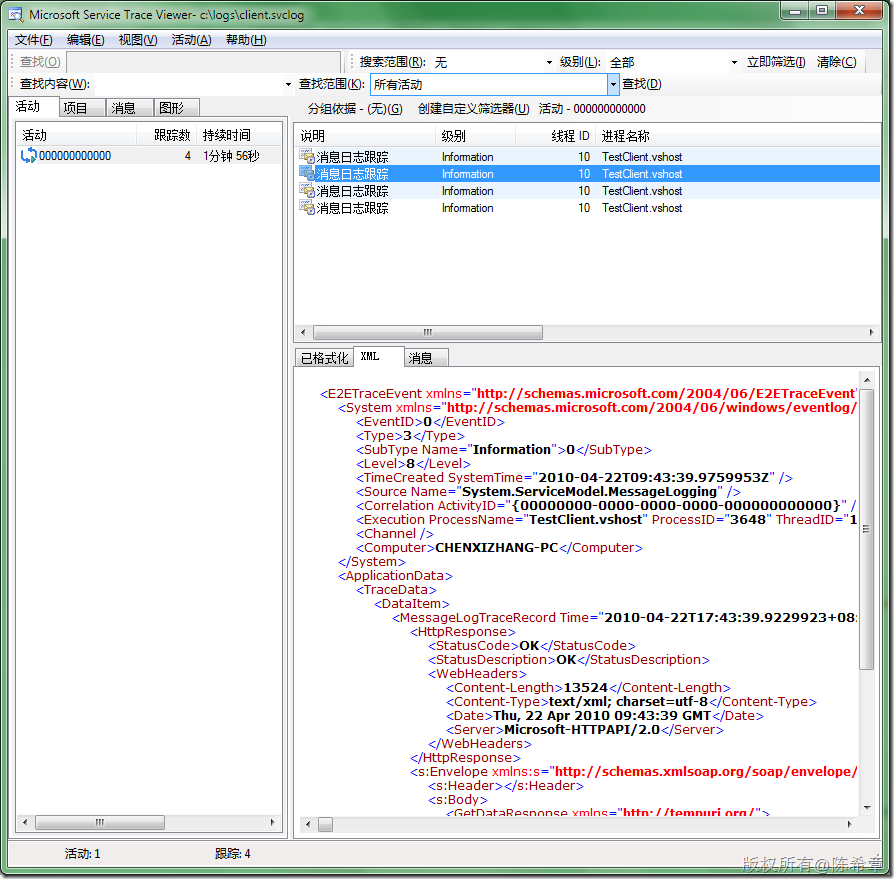
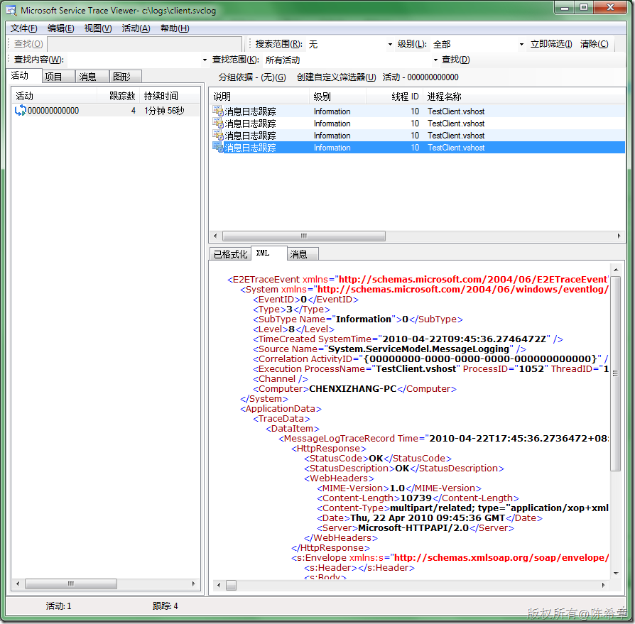
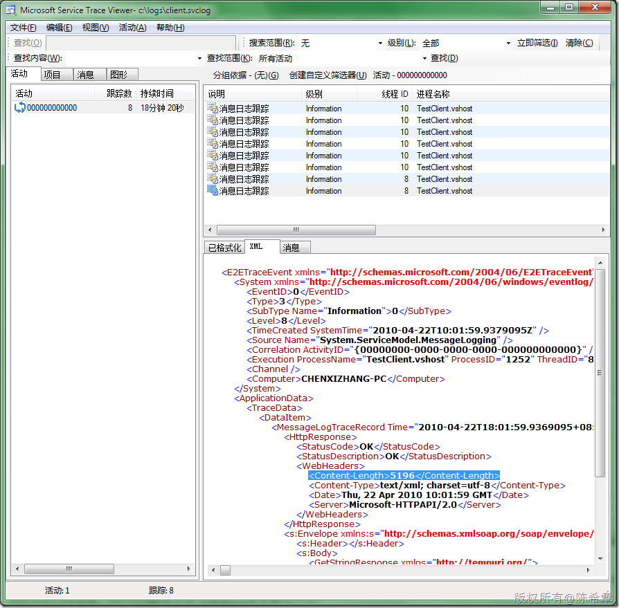
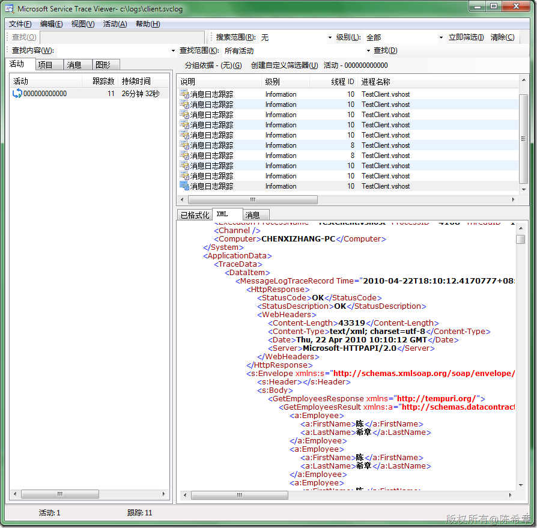
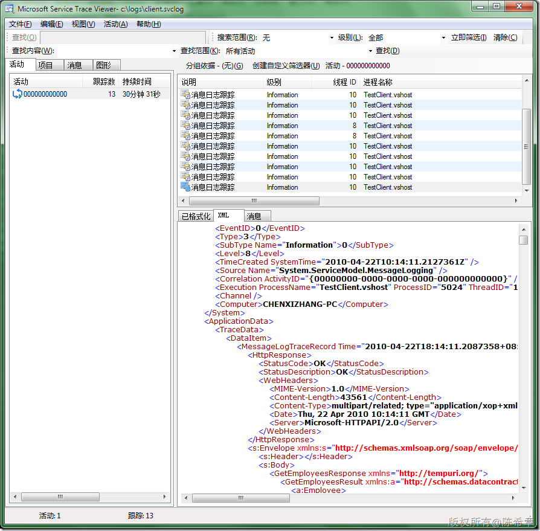
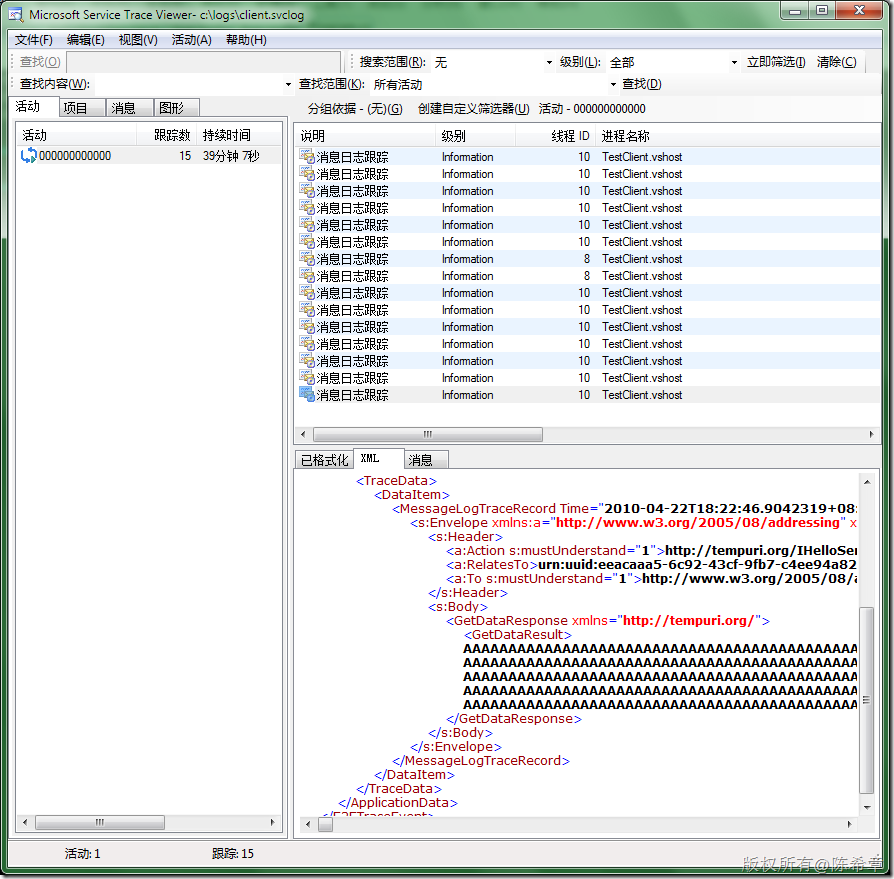

# MTOM效率测试 
> 原文发表于 2010-04-22, 地址: http://www.cnblogs.com/chenxizhang/archive/2010/04/22/1718159.html 


MTOM是一种消息编码方式，它的目的是优化SOAP消息的编码，以减小体积，提高传输速度。如果你对其不清楚，可以参考另外一篇文章

 <http://www.cnblogs.com/chenxizhang/archive/2010/04/09/1708621.html>

  

 这一篇，我们主要用实例来看看到底它在性能方面有何表现

 我们先做一些准备工作，编写了一个接口和服务

 1. 接口


```
using System.ServiceModel;

namespace Services
{
    [ServiceContract]
    public interface IHelloService
    {

        [OperationContract]
        byte[] GetData();

        

    }
}

```


.csharpcode, .csharpcode pre
{
 font-size: small;
 color: black;
 font-family: consolas, "Courier New", courier, monospace;
 background-color: #ffffff;
 /*white-space: pre;*/
}
.csharpcode pre { margin: 0em; }
.csharpcode .rem { color: #008000; }
.csharpcode .kwrd { color: #0000ff; }
.csharpcode .str { color: #006080; }
.csharpcode .op { color: #0000c0; }
.csharpcode .preproc { color: #cc6633; }
.csharpcode .asp { background-color: #ffff00; }
.csharpcode .html { color: #800000; }
.csharpcode .attr { color: #ff0000; }
.csharpcode .alt 
{
 background-color: #f4f4f4;
 width: 100%;
 margin: 0em;
}
.csharpcode .lnum { color: #606060; }


```
2.服务
namespace Services
{
    public class HelloWorldService:IHelloService
    {
        #region IHelloService 成员

        byte[] IHelloService.GetData()
        {
            return new byte[10000];
        }

        #endregion
    }
}

```

.csharpcode, .csharpcode pre
{
 font-size: small;
 color: black;
 font-family: consolas, "Courier New", courier, monospace;
 background-color: #ffffff;
 /*white-space: pre;*/
}
.csharpcode pre { margin: 0em; }
.csharpcode .rem { color: #008000; }
.csharpcode .kwrd { color: #0000ff; }
.csharpcode .str { color: #006080; }
.csharpcode .op { color: #0000c0; }
.csharpcode .preproc { color: #cc6633; }
.csharpcode .asp { background-color: #ffff00; }
.csharpcode .html { color: #800000; }
.csharpcode .attr { color: #ff0000; }
.csharpcode .alt 
{
 background-color: #f4f4f4;
 width: 100%;
 margin: 0em;
}
.csharpcode .lnum { color: #606060; }

注意，我们这里的服务很简单，就是直接返回一个长度为10000的字节数组。


 


接下来编写宿主和客户端


3.宿主


```
using System;
using System.ServiceModel;
using Services;

namespace Host
{
    class Program
    {
        static void Main(string[] args)
        {
            using (ServiceHost host = new ServiceHost(typeof(HelloWorldService)))
            {
                host.Open();
                Console.WriteLine("服务器已经准备好");
                Console.Read();
            }
        }
    }
}

```


.csharpcode, .csharpcode pre
{
 font-size: small;
 color: black;
 font-family: consolas, "Courier New", courier, monospace;
 background-color: #ffffff;
 /*white-space: pre;*/
}
.csharpcode pre { margin: 0em; }
.csharpcode .rem { color: #008000; }
.csharpcode .kwrd { color: #0000ff; }
.csharpcode .str { color: #006080; }
.csharpcode .op { color: #0000c0; }
.csharpcode .preproc { color: #cc6633; }
.csharpcode .asp { background-color: #ffff00; }
.csharpcode .html { color: #800000; }
.csharpcode .attr { color: #ff0000; }
.csharpcode .alt 
{
 background-color: #f4f4f4;
 width: 100%;
 margin: 0em;
}
.csharpcode .lnum { color: #606060; }


宿主的配置文件


```
<?xml version="1.0" encoding="utf-8" ?>
<configuration>
  <system.serviceModel>
    <services>
      <service name="Services.HelloWorldService">
        <host>
          <baseAddresses>
            <add baseAddress="http://localhost:8080/HelloService"/>
          </baseAddresses>
        </host>
        <endpoint address="" contract="Services.IHelloService" binding="basicHttpBinding" bindingConfiguration="mtom"></endpoint>
      </service>
    </services>

    <bindings>
      <basicHttpBinding>
        <binding name="mtom" messageEncoding="Mtom"></binding>
      </basicHttpBinding>
    </bindings>
  </system.serviceModel>
</configuration>
```


.csharpcode, .csharpcode pre
{
 font-size: small;
 color: black;
 font-family: consolas, "Courier New", courier, monospace;
 background-color: #ffffff;
 /*white-space: pre;*/
}
.csharpcode pre { margin: 0em; }
.csharpcode .rem { color: #008000; }
.csharpcode .kwrd { color: #0000ff; }
.csharpcode .str { color: #006080; }
.csharpcode .op { color: #0000c0; }
.csharpcode .preproc { color: #cc6633; }
.csharpcode .asp { background-color: #ffff00; }
.csharpcode .html { color: #800000; }
.csharpcode .attr { color: #ff0000; }
.csharpcode .alt 
{
 background-color: #f4f4f4;
 width: 100%;
 margin: 0em;
}
.csharpcode .lnum { color: #606060; }


4. 客户端


```
using System;
using System.ServiceModel;
using Services;

namespace TestClient
{
    class Program
    {
        static void Main(string[] args)
        {
            IHelloService proxy =
                (new ChannelFactory<IHelloService>("local")).CreateChannel();

            byte[] buffer=proxy.GetData();
            Console.WriteLine(buffer.Length);

            Console.Read();
        }
    }
}

```

.csharpcode, .csharpcode pre
{
 font-size: small;
 color: black;
 font-family: consolas, "Courier New", courier, monospace;
 background-color: #ffffff;
 /*white-space: pre;*/
}
.csharpcode pre { margin: 0em; }
.csharpcode .rem { color: #008000; }
.csharpcode .kwrd { color: #0000ff; }
.csharpcode .str { color: #006080; }
.csharpcode .op { color: #0000c0; }
.csharpcode .preproc { color: #cc6633; }
.csharpcode .asp { background-color: #ffff00; }
.csharpcode .html { color: #800000; }
.csharpcode .attr { color: #ff0000; }
.csharpcode .alt 
{
 background-color: #f4f4f4;
 width: 100%;
 margin: 0em;
}
.csharpcode .lnum { color: #606060; }


 


客户端的配置文件


```
<?xml version="1.0" encoding="utf-8" ?>
<configuration>
  
    <system.diagnostics>
    <sources>
      <source name="System.ServiceModel.MessageLogging"
      switchValue="Verbose">
        <listeners>
          <add name="xml"
          type="System.Diagnostics.XmlWriterTraceListener"
          initializeData="c:\logs\client.svclog" />
        </listeners>
      </source>
    </sources>
    <trace autoflush="true" />
  </system.diagnostics>


  
  
  <system.serviceModel>

    <diagnostics>
      <messageLogging logEntireMessage="true"
      maxMessagesToLog="300"
      logMessagesAtServiceLevel="false"
      logMalformedMessages="true"
      logMessagesAtTransportLevel="true" />
    </diagnostics>
    <client>
      <endpoint address="http://localhost:8080/HelloService" binding="basicHttpBinding" contract="Services.IHelloService" name="local" bindingConfiguration="mtom"></endpoint>
    </client>
    <bindings>
      <basicHttpBinding>
        <binding name="mtom" messageEncoding="Mtom"></binding>
      </basicHttpBinding>
    </bindings>
  </system.serviceModel>
</configuration>
```


.csharpcode, .csharpcode pre
{
 font-size: small;
 color: black;
 font-family: consolas, "Courier New", courier, monospace;
 background-color: #ffffff;
 /*white-space: pre;*/
}
.csharpcode pre { margin: 0em; }
.csharpcode .rem { color: #008000; }
.csharpcode .kwrd { color: #0000ff; }
.csharpcode .str { color: #006080; }
.csharpcode .op { color: #0000c0; }
.csharpcode .preproc { color: #cc6633; }
.csharpcode .asp { background-color: #ffff00; }
.csharpcode .html { color: #800000; }
.csharpcode .attr { color: #ff0000; }
.csharpcode .alt 
{
 background-color: #f4f4f4;
 width: 100%;
 margin: 0em;
}
.csharpcode .lnum { color: #606060; }


 


说明，上面的配置文件中，已经配置好了messageEncoding为Mtom. 但我们在运行程序时会分两次运行，一次是标准的编码，一次则是Mtom编码


我们通过下面的日志文件可以比较出来MTOM编码的效率优势


下图是标准编码的结果，请注意Content-length为13524


[](http://images.cnblogs.com/cnblogs_com/chenxizhang/WindowsLiveWriter/MTOM_50F0/image_2.png) 


下图是Mtom编码的结果，请注意Content-Length为10739


[](http://images.cnblogs.com/cnblogs_com/chenxizhang/WindowsLiveWriter/MTOM_50F0/image_4.png) 


 


最后有一点要提示的是，MTOM编码主要针对二进制结果有优势。原因在于，标准编码(Text）在对二进制数据编码的时候会采取Base64编码，使得数据平白地多出来了1/3左右。


而针对纯文本的数据，则MTOM编码的长度 总是会大于标准编码的长度。


例如我们有如下的一个方法，返回一些字符


```
        public string GetString()
        {
            StringBuilder sb = new StringBuilder();
            for (int i = 0; i < 1000; i++)
            {
                sb.Append("Hello");
            }
            return sb.ToString();
        }

```

.csharpcode, .csharpcode pre
{
 font-size: small;
 color: black;
 font-family: consolas, "Courier New", courier, monospace;
 background-color: #ffffff;
 /*white-space: pre;*/
}
.csharpcode pre { margin: 0em; }
.csharpcode .rem { color: #008000; }
.csharpcode .kwrd { color: #0000ff; }
.csharpcode .str { color: #006080; }
.csharpcode .op { color: #0000c0; }
.csharpcode .preproc { color: #cc6633; }
.csharpcode .asp { background-color: #ffff00; }
.csharpcode .html { color: #800000; }
.csharpcode .attr { color: #ff0000; }
.csharpcode .alt 
{
 background-color: #f4f4f4;
 width: 100%;
 margin: 0em;
}
.csharpcode .lnum { color: #606060; }

首先看标准编码的长度，为5196


[](http://images.cnblogs.com/cnblogs_com/chenxizhang/WindowsLiveWriter/MTOM_50F0/image_7.png) 


而MTOM编码的长度则为


[](http://images.cnblogs.com/cnblogs_com/chenxizhang/WindowsLiveWriter/MTOM_50F0/image_9.png) 


我们再来测试一下复杂类型的情况。为了演示，我们添加了一个Employee类型在客户端和服务器之间传递。


```
    [DataContract]
    public class Employee {
        [DataMember]
        public string FirstName { get; set; }
        [DataMember]
        public string LastName { get; set; }

        public override string ToString()
        {
            return string.Format("{0},{1}", FirstName, LastName);
        }
    }
```


.csharpcode, .csharpcode pre
{
 font-size: small;
 color: black;
 font-family: consolas, "Courier New", courier, monospace;
 background-color: #ffffff;
 /*white-space: pre;*/
}
.csharpcode pre { margin: 0em; }
.csharpcode .rem { color: #008000; }
.csharpcode .kwrd { color: #0000ff; }
.csharpcode .str { color: #006080; }
.csharpcode .op { color: #0000c0; }
.csharpcode .preproc { color: #cc6633; }
.csharpcode .asp { background-color: #ffff00; }
.csharpcode .html { color: #800000; }
.csharpcode .attr { color: #ff0000; }
.csharpcode .alt 
{
 background-color: #f4f4f4;
 width: 100%;
 margin: 0em;
}
.csharpcode .lnum { color: #606060; }


然后在服务中实现了一个方法


```
        Employee[] IHelloService.GetEmployees()
        {
            List<Employee> result = new List<Employee>();
            for (int i = 0; i < 500; i++)
            {
                result.Add(new Employee()
                {
                    FirstName = "陈",
                    LastName = "希章"
                });
            }

            return result.ToArray();
        }
```

.csharpcode, .csharpcode pre
{
 font-size: small;
 color: black;
 font-family: consolas, "Courier New", courier, monospace;
 background-color: #ffffff;
 /*white-space: pre;*/
}
.csharpcode pre { margin: 0em; }
.csharpcode .rem { color: #008000; }
.csharpcode .kwrd { color: #0000ff; }
.csharpcode .str { color: #006080; }
.csharpcode .op { color: #0000c0; }
.csharpcode .preproc { color: #cc6633; }
.csharpcode .asp { background-color: #ffff00; }
.csharpcode .html { color: #800000; }
.csharpcode .attr { color: #ff0000; }
.csharpcode .alt 
{
 background-color: #f4f4f4;
 width: 100%;
 margin: 0em;
}
.csharpcode .lnum { color: #606060; }

我们看到，发送500个员工的数据，如果按照标准编码的话，长度大致需要43319


[](http://images.cnblogs.com/cnblogs_com/chenxizhang/WindowsLiveWriter/MTOM_50F0/image_11.png) 


如果改成mtom呢，长度为43561，还是稍微大一些。这是因为MTOM这种编码本身会有一些额外的开销


[](http://images.cnblogs.com/cnblogs_com/chenxizhang/WindowsLiveWriter/MTOM_50F0/image_13.png) 


 


好的，这里需要总结一下了


1. MTOM是一个编码方式


2. MTOM是针对较大的二进制数据有优化作用，相比较默认的Text编码，它传输的是接近于数据原本的格式，而Text编码方式则采用了Base64的方式进行编码。


3. 针对标准文本或者对象，MTOM并没有优化作用。


 


最后，有没有朋友想到了这样一个问题：既然是二进制的数据，能不能直接就采用二进制的方式传递呢？干嘛要去编码成文本呢？


是的，这是一个很好的问题，我们当然也可以直接采用netTcpBinding，它默认就是直接使用二进制编码


 


我们从下图是看不到长度的


[](http://images.cnblogs.com/cnblogs_com/chenxizhang/WindowsLiveWriter/MTOM_50F0/image_15.png) 


 


但如果我们真的有兴趣，可以通过下面的代码计算得到不同的编码方式到底会有多长


```
        static void CompareMessageSize(int dataSize)
        {
            // Create and buffer a message with a binary payload
            byte[] binaryData = new byte[dataSize];
            Message message = Message.CreateMessage(MessageVersion.Soap12WSAddressing10, "action", binaryData);
            MessageBuffer buffer = message.CreateBufferedCopy(int.MaxValue);

            // Print the size of a text encoded copy
            int size = SizeOfTextMessage(buffer.CreateMessage());
            Console.WriteLine("Text encoding with a {0} byte payload: {1}", binaryData.Length, size);

            // Print the size of an MTOM encoded copy
            size = SizeOfMtomMessage(buffer.CreateMessage());
            Console.WriteLine("MTOM encoding with a {0} byte payload: {1}", binaryData.Length, size);

            Console.WriteLine();
            message.Close();
        }

        static int SizeOfTextMessage(Message message)
        {
            // Create a text encoder
            MessageEncodingBindingElement element = new TextMessageEncodingBindingElement();
            MessageEncoderFactory factory = element.CreateMessageEncoderFactory();
            MessageEncoder encoder = factory.Encoder;

            // Write the message and return its length
            MemoryStream stream = new MemoryStream();
            encoder.WriteMessage(message, stream);
            int size = (int)stream.Length;
            
            message.Close();
            stream.Close();
            return size;
        }

        static int SizeOfMtomMessage(Message message)
        {
            // Create an MTOM encoder
            MessageEncodingBindingElement element = new MtomMessageEncodingBindingElement();
            MessageEncoderFactory factory = element.CreateMessageEncoderFactory();
            MessageEncoder encoder = factory.Encoder;

            // Write the message and return its length
            MemoryStream stream = new MemoryStream();
            encoder.WriteMessage(message, stream);
            int size = (int)stream.Length;
            
            stream.Close();
            message.Close();
            return size;
        }
```

.csharpcode, .csharpcode pre
{
 font-size: small;
 color: black;
 font-family: consolas, "Courier New", courier, monospace;
 background-color: #ffffff;
 /*white-space: pre;*/
}
.csharpcode pre { margin: 0em; }
.csharpcode .rem { color: #008000; }
.csharpcode .kwrd { color: #0000ff; }
.csharpcode .str { color: #006080; }
.csharpcode .op { color: #0000c0; }
.csharpcode .preproc { color: #cc6633; }
.csharpcode .asp { background-color: #ffff00; }
.csharpcode .html { color: #800000; }
.csharpcode .attr { color: #ff0000; }
.csharpcode .alt 
{
 background-color: #f4f4f4;
 width: 100%;
 margin: 0em;
}
.csharpcode .lnum { color: #606060; }


