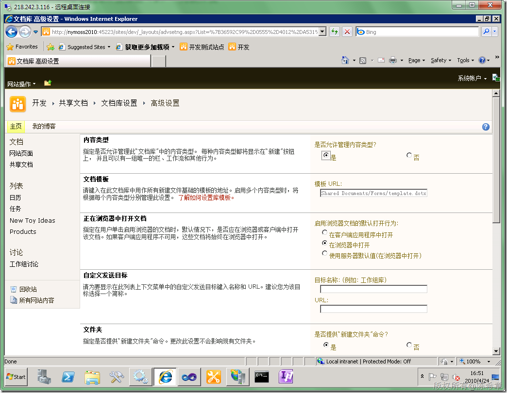

# MOSS 2010：Visual Studio 2010开发体验（9）—列表开发之基本概念 
> 原文发表于 2010-04-24, 地址: http://www.cnblogs.com/chenxizhang/archive/2010/04/24/1719467.html 

要做列表的开发，首先需要搞清楚几个概念

 1. 内容类型(**Content Type**)
-------------------------

 这是MOSS 2007提出的一个新概念，通过内容类型(Content Type)可以让网站或者列表定制更加方便。简而言之，内容类型代表了一种数据组织的方式，内容类型可能是文档，也可能是一个列表格式，可能包含一个字段，也可能包含多个。

 下面列出了当前网站所有的内容类型

  

 我们还可以新增一个内容类型，通过点击“创建”按钮

  

 我们看到，创建内容类型并不是很难。它需要选择一个父内容类型。就好比我们在C#中定义一个Class的时候，需要选择一个基类一样。

 等等，你是不是说大部分时候你在定义Class的时候并没有指定基类吗？真的是这样吗？其实你指定了，那就是Object类型嘛

  

 好，创建好的内容类型大致看起来像下面这样

  

 我们还可以进一步添加栏(**Field**)。暂时不做了。

  

 2. 列表定义(**List Definition**)
============================

 我们比较关注的列表和文档库，它们都可以有一个或者多个内容类型，也就是说在列表或文档库中，可能有多种数据组织方式。下面我们就来实际看一下内容类型到底是怎么被使用的

 首先，要允许管理内容类型（否则的话，就只能有一个）

  、

 然后，就可以看到一个内容类型的列表。

  

 然后，我们还可以继续添加内容类型，通过点击“从现有网站内容类型添加”

  

 这样，我们在文档库中创建新条目的话，就有两种选择了

  

 那么，到底什么是列表定义呢？

 列表定义，就是定义一个列表，指定它的一些属性，以及它可用的内容类型的信息。所以从这个意义上说，列表定义其实是一个抽象的概念。虽然每个列表都可以手工地去指定内容类型或者说修改属性，但为了复用，我们会将有共同特性的一些列表抽象成一个列表定义的形式。

  

  

 3. 列表实例(**List Instance**)
==========================

 理解了上面的概念，再来谈列表实例就很好理解了。什么是列表实例？其实上图的这个“共享文档”文档库就是一个列表实例，它是一个我们看得见摸得着的列表的具体例子。就好比，我们有一个Class，叫做DocumentLibrary，我们规定它允许有两种内容类型，然后我们创建了一个实例，叫做SharedDocument，很显然，SharedDocument肯定也是有两个内容类型的啦。

