# MOSS 2010:Visual Studio 2010开发体验（10）——列表开发之内容类型 
> 原文发表于 2010-04-25, 地址: http://www.cnblogs.com/chenxizhang/archive/2010/04/25/1719694.html 


上一篇，我讲到了列表的一些基本概念

 [http://www.cnblogs.com/chenxizhang/archive/2010/04/24/1719467.html](http://www.cnblogs.com/chenxizhang/archive/2010/04/24/1719467.html "http://www.cnblogs.com/chenxizhang/archive/2010/04/24/1719467.html")

 1. 内容类型(Content Type)

 
>  里面会包含栏位定义（Field）
> 
> 

 2. 列表定义（List Definition)

 3. 列表实例（List Instance）

  

 接下来，我们先来看一下内容类型，应该如何在Visual Studio中来定义和实现。

 我们的目的是定义这样一个内容类型，它是用来填写订单信息的，它包含了如下三个栏位

 1.订购编号（数字）

 2.客户编号（文字）

 3.订购日期（日期）

 为了易于大家理解和学习，我预先通过在网站中手工添加的方式已经做出来了该内容类型，如下图所示 

 [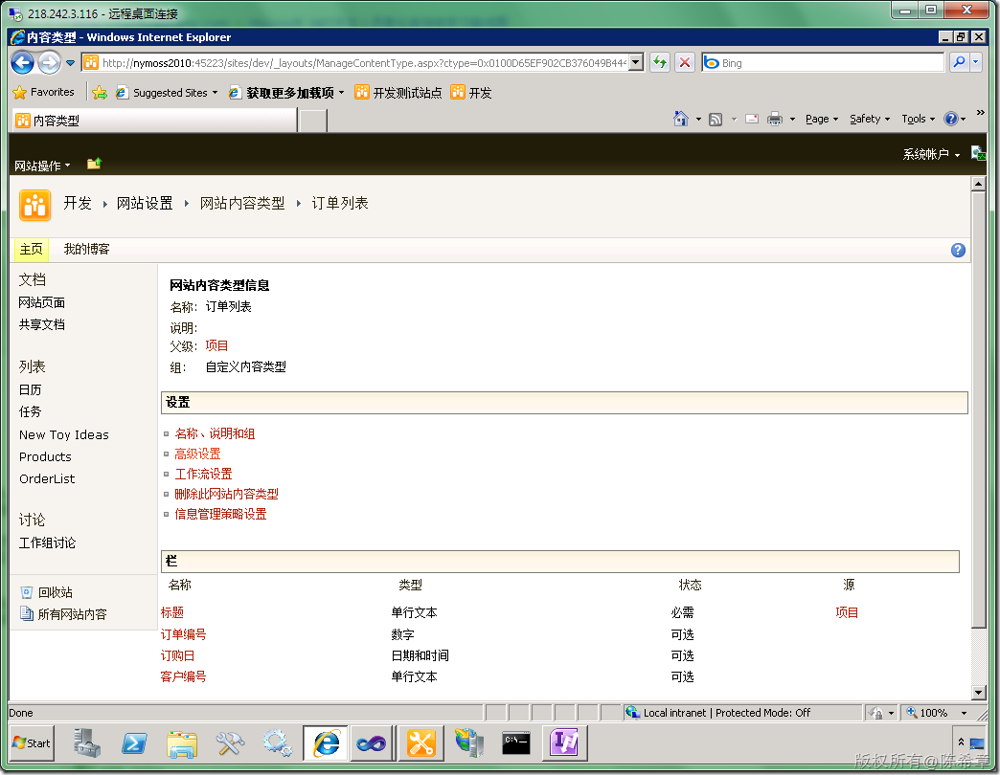](http://images.cnblogs.com/cnblogs_com/chenxizhang/WindowsLiveWriter/MOSS2010VisualStudio201010_5F73/image_2.png) 

 我们接下来，通过编程的方式查看一下这个类型的具体定义是怎么样的

 【注意】目前我并没有发现有什么内置工具可以直接导出内容类型的定义。虽然确实有第三方的一个工具（Solution Generator)可以做，但我还是自己写了几句代码

 [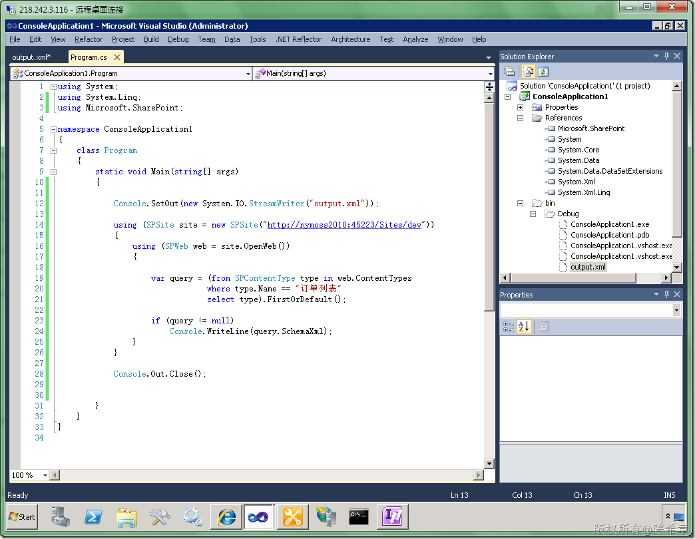](http://images.cnblogs.com/cnblogs_com/chenxizhang/WindowsLiveWriter/MOSS2010VisualStudio201010_5F73/image_4.png) 


```
using System;
using System.Linq;
using Microsoft.SharePoint;

namespace ConsoleApplication1
{
    class Program
    {
        static void Main(string[] args)
        {

            Console.SetOut(new System.IO.StreamWriter("output.xml"));

            using (SPSite site = new SPSite("http://nymoss2010:45223/Sites/dev"))
            {
                using (SPWeb web = site.OpenWeb())
                {

                    var query = (from SPContentType type in web.ContentTypes
                                where type.Name == "订单列表"
                                select type).FirstOrDefault();

                    if (query != null)
                        Console.WriteLine(query.SchemaXml);
                }
            }

            Console.Out.Close();


        }
    }
}

```

.csharpcode, .csharpcode pre
{
 font-size: small;
 color: black;
 font-family: consolas, "Courier New", courier, monospace;
 background-color: #ffffff;
 /*white-space: pre;*/
}
.csharpcode pre { margin: 0em; }
.csharpcode .rem { color: #008000; }
.csharpcode .kwrd { color: #0000ff; }
.csharpcode .str { color: #006080; }
.csharpcode .op { color: #0000c0; }
.csharpcode .preproc { color: #cc6633; }
.csharpcode .asp { background-color: #ffff00; }
.csharpcode .html { color: #800000; }
.csharpcode .attr { color: #ff0000; }
.csharpcode .alt 
{
 background-color: #f4f4f4;
 width: 100%;
 margin: 0em;
}
.csharpcode .lnum { color: #606060; }

这个小程序，可以返回如下一个XML文件


```
<ContentType ID="0x0100D65EF902CB376049B444A07F18A80074" Name="订单列表" Group="自定义内容类型" Version="3">
  <Folder TargetName="\_cts/订单列表" />
  <Fields>
    <Field ID="{c042a256-787d-4a6f-8a8a-cf6ab767f12d}" Name="ContentType" SourceID="http://schemas.microsoft.com/sharepoint/v3" StaticName="ContentType" Group="\_Hidden" Type="Computed" DisplayName="内容类型" ReadOnly="TRUE" Sealed="TRUE" Sortable="FALSE" RenderXMLUsingPattern="TRUE" PITarget="MicrosoftWindowsSharePointServices" PIAttribute="ContentTypeID" Customization="">
      <FieldRefs>
        <FieldRef ID="{03e45e84-1992-4d42-9116-26f756012634}" Name="ContentTypeId" />
      </FieldRefs>
      <DisplayPattern>
        <MapToContentType>
          <Column Name="ContentTypeId" />
        </MapToContentType>
      </DisplayPattern>
    </Field>
    <Field ID="{fa564e0f-0c70-4ab9-b863-0177e6ddd247}" Name="Title" SourceID="http://schemas.microsoft.com/sharepoint/v3" StaticName="Title" Group="\_Hidden" Type="Text" DisplayName="标题" Required="TRUE" FromBaseType="TRUE" Customization="" ShowInNewForm="TRUE" ShowInEditForm="TRUE" />
    <Field Type="Number" DisplayName="订单编号" Required="FALSE" EnforceUniqueValues="FALSE" Indexed="FALSE" Group="自定义栏" IMEMode="inactive" ID="{6951653a-c02e-4440-a918-54dc6c6b4ad4}" SourceID="{bc8f77ac-9814-448d-9c64-159c9680ecfd}" StaticName="\_x008ba2\_\_x005355\_\_x007f16\_\_x0053f7\_" Name="\_x008ba2\_\_x005355\_\_x007f16\_\_x0053f7\_" Customization="" />
    <Field Type="DateTime" DisplayName="订购日" Required="FALSE" EnforceUniqueValues="FALSE" Indexed="FALSE" Format="DateOnly" Group="自定义栏" IMEMode="inactive" ID="{308eac8d-86ca-49e9-a65c-43bac42bb9c4}" SourceID="{bc8f77ac-9814-448d-9c64-159c9680ecfd}" StaticName="\_x008ba2\_\_x008d2d\_\_x0065e5\_" Name="\_x008ba2\_\_x008d2d\_\_x0065e5\_" Customization="">
      <Default>[today]</Default>
    </Field>
    <Field Type="Text" DisplayName="客户编号" Required="FALSE" EnforceUniqueValues="FALSE" Indexed="FALSE" MaxLength="255" Group="自定义栏" ID="{442bcf2b-554b-4f53-8877-8612d85cbb8e}" SourceID="{bc8f77ac-9814-448d-9c64-159c9680ecfd}" StaticName="\_x005ba2\_\_x006237\_\_x007f16\_\_x0053f7\_" Name="\_x005ba2\_\_x006237\_\_x007f16\_\_x0053f7\_" Customization="" />
  </Fields>
  <XmlDocuments>
    <XmlDocument NamespaceURI="http://schemas.microsoft.com/sharepoint/v3/contenttype/forms">
      <FormTemplates xmlns="http://schemas.microsoft.com/sharepoint/v3/contenttype/forms">
        <Display>ListForm</Display>
        <Edit>ListForm</Edit>
        <New>ListForm</New>
      </FormTemplates>
    </XmlDocument>
  </XmlDocuments>
</ContentType>

```

.csharpcode, .csharpcode pre
{
 font-size: small;
 color: black;
 font-family: consolas, "Courier New", courier, monospace;
 background-color: #ffffff;
 /*white-space: pre;*/
}
.csharpcode pre { margin: 0em; }
.csharpcode .rem { color: #008000; }
.csharpcode .kwrd { color: #0000ff; }
.csharpcode .str { color: #006080; }
.csharpcode .op { color: #0000c0; }
.csharpcode .preproc { color: #cc6633; }
.csharpcode .asp { background-color: #ffff00; }
.csharpcode .html { color: #800000; }
.csharpcode .attr { color: #ff0000; }
.csharpcode .alt 
{
 background-color: #f4f4f4;
 width: 100%;
 margin: 0em;
}
.csharpcode .lnum { color: #606060; }

【注意】你可能会说，这样做是不是太麻烦了呢？的确不是很方便，我下面会做一个工具来改善这一点。


 


好了，到这里为止，我们就大致明白了，一个内容类型其实是一个XML定义，那么我们如何来在Visual Studio中来定义它呢


1. 首先创建一个Empty Project


[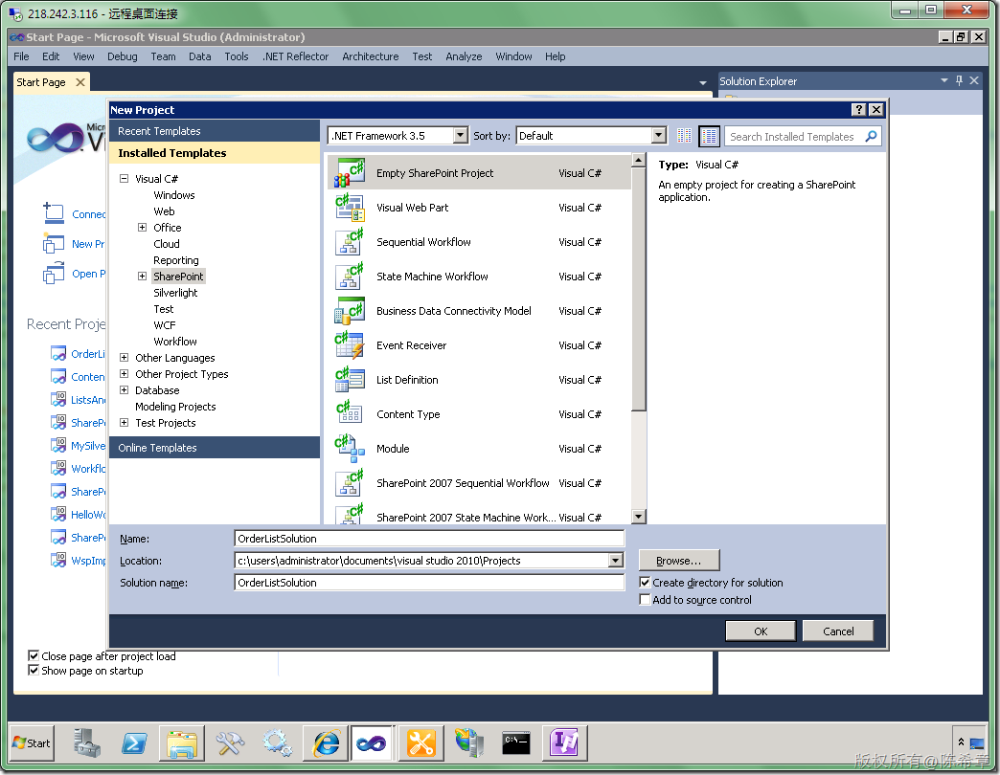](http://images.cnblogs.com/cnblogs_com/chenxizhang/WindowsLiveWriter/MOSS2010VisualStudio201010_5F73/image_6.png) 


[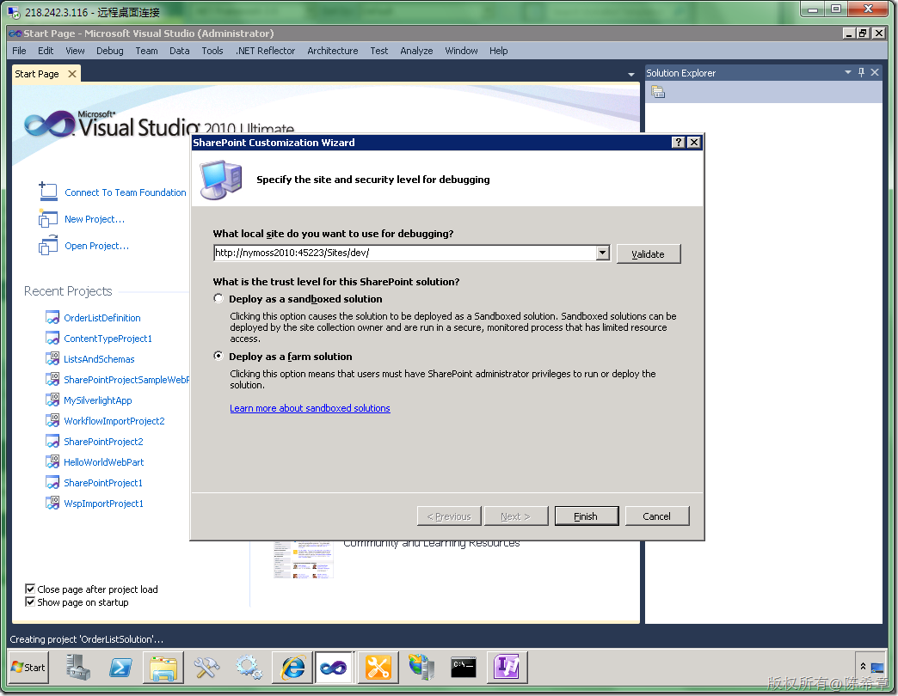](http://images.cnblogs.com/cnblogs_com/chenxizhang/WindowsLiveWriter/MOSS2010VisualStudio201010_5F73/image_8.png) 


[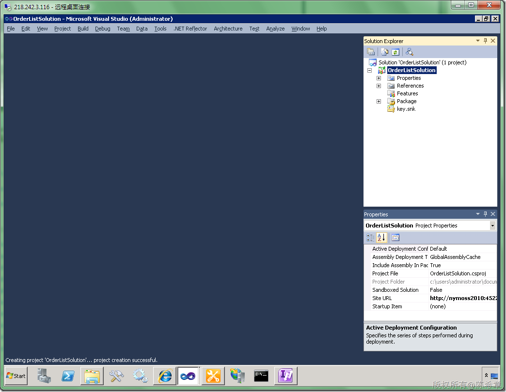](http://images.cnblogs.com/cnblogs_com/chenxizhang/WindowsLiveWriter/MOSS2010VisualStudio201010_5F73/image_10.png) 


2. 添加一个内容类型


[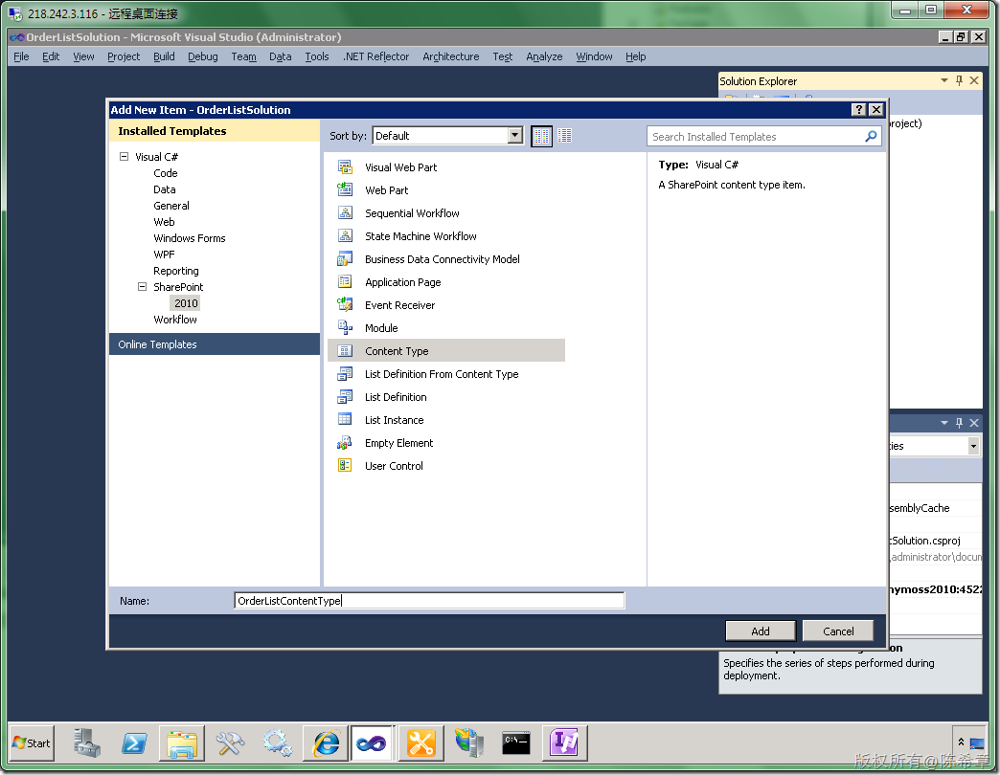](http://images.cnblogs.com/cnblogs_com/chenxizhang/WindowsLiveWriter/MOSS2010VisualStudio201010_5F73/image_12.png) 


将父内容类型设置为“项目”


[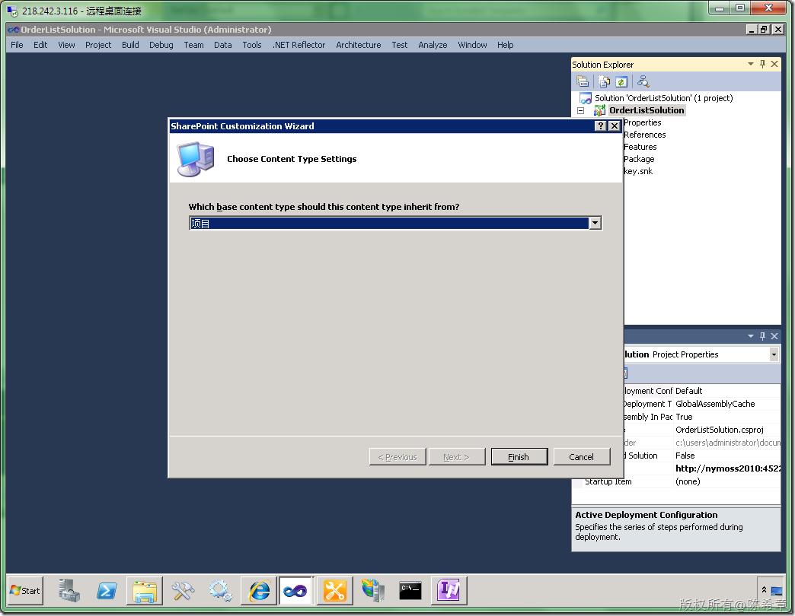](http://images.cnblogs.com/cnblogs_com/chenxizhang/WindowsLiveWriter/MOSS2010VisualStudio201010_5F73/image_14.png) 


[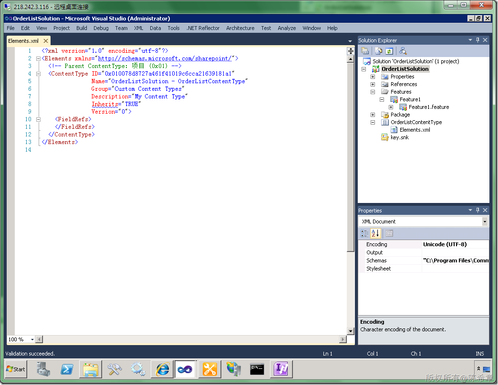](http://images.cnblogs.com/cnblogs_com/chenxizhang/WindowsLiveWriter/MOSS2010VisualStudio201010_5F73/image_16.png) 


【注意】上面默认生成的XML定义中，inherits确实会出错，我们干脆删除它先


[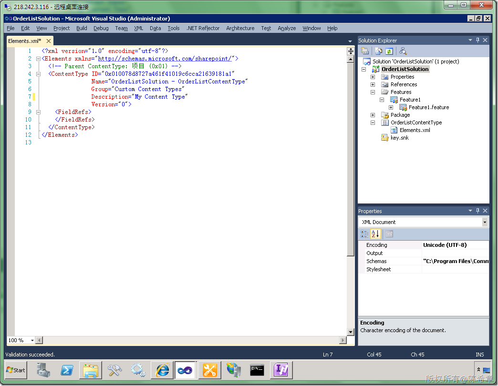](http://images.cnblogs.com/cnblogs_com/chenxizhang/WindowsLiveWriter/MOSS2010VisualStudio201010_5F73/image_18.png) 


 


3. 修改内容类型栏位定义


还记得之前那段XML吗？我们需要类似下面的语法定义栏位即可


```
    <Field Type="Number" DisplayName="订单编号" Required="FALSE" EnforceUniqueValues="FALSE" Indexed="FALSE" Group="自定义栏" IMEMode="inactive" ID="{6951653a-c02e-4440-a918-54dc6c6b4ad4}" SourceID="{bc8f77ac-9814-448d-9c64-159c9680ecfd}" StaticName="\_x008ba2\_\_x005355\_\_x007f16\_\_x0053f7\_" Name="\_x008ba2\_\_x005355\_\_x007f16\_\_x0053f7\_" Customization="" />
    <Field Type="DateTime" DisplayName="订购日" Required="FALSE" EnforceUniqueValues="FALSE" Indexed="FALSE" Format="DateOnly" Group="自定义栏" IMEMode="inactive" ID="{308eac8d-86ca-49e9-a65c-43bac42bb9c4}" SourceID="{bc8f77ac-9814-448d-9c64-159c9680ecfd}" StaticName="\_x008ba2\_\_x008d2d\_\_x0065e5\_" Name="\_x008ba2\_\_x008d2d\_\_x0065e5\_" Customization="">
      <Default>[today]</Default>
    </Field>
    <Field Type="Text" DisplayName="客户编号" Required="FALSE" EnforceUniqueValues="FALSE" Indexed="FALSE" MaxLength="255" Group="自定义栏" ID="{442bcf2b-554b-4f53-8877-8612d85cbb8e}" SourceID="{bc8f77ac-9814-448d-9c64-159c9680ecfd}" StaticName="\_x005ba2\_\_x006237\_\_x007f16\_\_x0053f7\_" Name="\_x005ba2\_\_x006237\_\_x007f16\_\_x0053f7\_" Customization="" />
```

.csharpcode, .csharpcode pre
{
 font-size: small;
 color: black;
 font-family: consolas, "Courier New", courier, monospace;
 background-color: #ffffff;
 /*white-space: pre;*/
}
.csharpcode pre { margin: 0em; }
.csharpcode .rem { color: #008000; }
.csharpcode .kwrd { color: #0000ff; }
.csharpcode .str { color: #006080; }
.csharpcode .op { color: #0000c0; }
.csharpcode .preproc { color: #cc6633; }
.csharpcode .asp { background-color: #ffff00; }
.csharpcode .html { color: #800000; }
.csharpcode .attr { color: #ff0000; }
.csharpcode .alt 
{
 background-color: #f4f4f4;
 width: 100%;
 margin: 0em;
}
.csharpcode .lnum { color: #606060; }


我们如法炮制，添加到Elements文件中去


[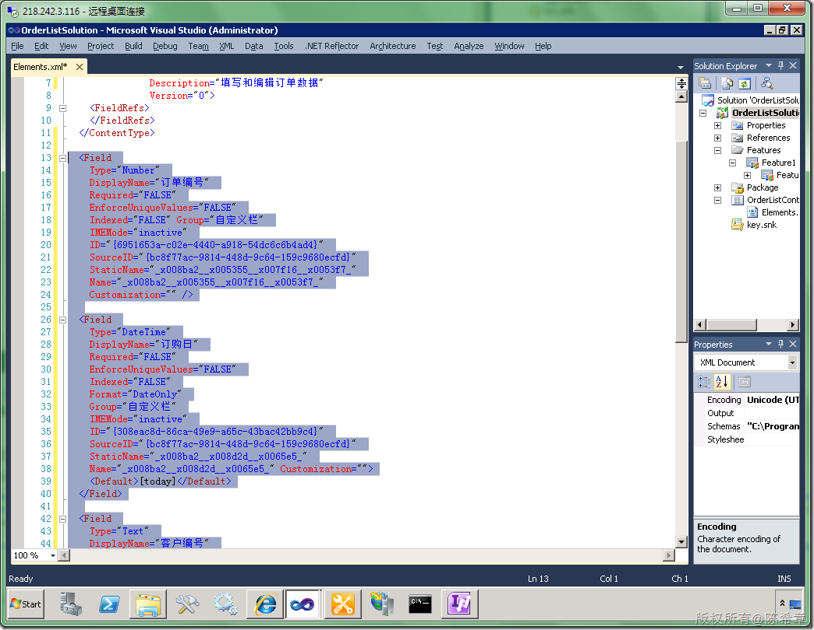](http://images.cnblogs.com/cnblogs_com/chenxizhang/WindowsLiveWriter/MOSS2010VisualStudio201010_5F73/image_20.png) 


【注意】要添加在ContentType元素的外面，而不是里面


【注意】你可能需要修改一下有关的ID，这个可以通过Tools==>Create GUID这个工具来做到


 


接下来，我们建立内容类型与栏位的关系（称为所有的引用）


```
    <FieldRefs>
      <FieldRef ID="{6951653a-c02e-4440-a918-54dc6c6b4ad4}"/>
      <FieldRef ID="{308eac8d-86ca-49e9-a65c-43bac42bb9c4}"/>
      <FieldRef ID="{442bcf2b-554b-4f53-8877-8612d85cbb8e}"/>
    </FieldRefs>
```

.csharpcode, .csharpcode pre
{
 font-size: small;
 color: black;
 font-family: consolas, "Courier New", courier, monospace;
 background-color: #ffffff;
 /*white-space: pre;*/
}
.csharpcode pre { margin: 0em; }
.csharpcode .rem { color: #008000; }
.csharpcode .kwrd { color: #0000ff; }
.csharpcode .str { color: #006080; }
.csharpcode .op { color: #0000c0; }
.csharpcode .preproc { color: #cc6633; }
.csharpcode .asp { background-color: #ffff00; }
.csharpcode .html { color: #800000; }
.csharpcode .attr { color: #ff0000; }
.csharpcode .alt 
{
 background-color: #f4f4f4;
 width: 100%;
 margin: 0em;
}
.csharpcode .lnum { color: #606060; }

[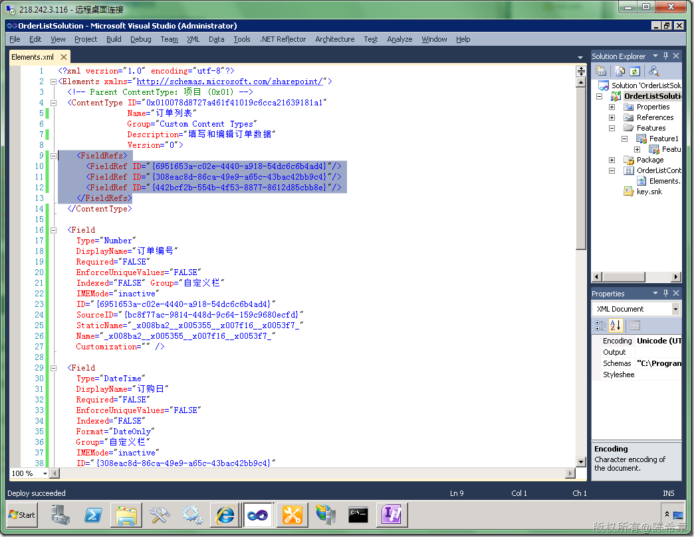](http://images.cnblogs.com/cnblogs_com/chenxizhang/WindowsLiveWriter/MOSS2010VisualStudio201010_5F73/image_22.png) 


 


4. 部署内容类型


完成上面的操作之后，就可以来部署看看效果了。请按下CTRL+F5键，部署将产生如下的一些输出


------ Build started: Project: OrderListSolution, Configuration: Debug Any CPU ------  
  OrderListSolution -> c:\users\administrator\documents\visual studio 2010\Projects\OrderListSolution\OrderListSolution\bin\Debug\OrderListSolution.dll  
  Successfully created package at: c:\users\administrator\documents\visual studio 2010\Projects\OrderListSolution\OrderListSolution\bin\Debug\OrderListSolution.wsp  
------ Deploy started: Project: OrderListSolution, Configuration: Debug Any CPU ------  
Active Deployment Configuration: Default  
Run Pre-Deployment Command:  
  Skipping deployment step because a pre-deployment command is not specified.  
Recycle IIS Application Pool:  
  Skipping application pool recycle because no matching package on the server was found.  
Retract Solution:  
  Skipping package retraction because no matching package on the server was found.  
Add Solution:  
  Adding solution 'OrderListSolution.wsp'...  
  Deploying solution 'OrderListSolution.wsp'...  
Activate Features:  
  Activating feature 'Feature1' ...  
Run Post-Deployment Command:  
  Skipping deployment step because a post-deployment command is not specified.  
========== Build: 1 succeeded or up-to-date, 0 failed, 0 skipped ==========  
========== Deploy: 1 succeeded, 0 failed, 0 skipped ==========
 


部署如果成功的话，会自动打开我们的网站。为了作为测试，我单独创建了一个OrderList的列表（此步骤略过）


[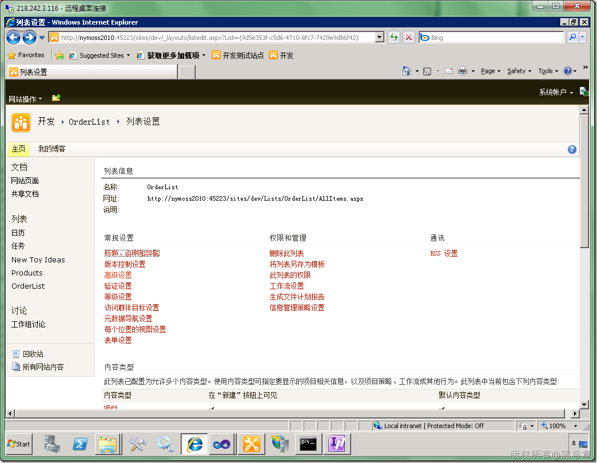](http://images.cnblogs.com/cnblogs_com/chenxizhang/WindowsLiveWriter/MOSS2010VisualStudio201010_5F73/image_24.png) 


添加内容类型


[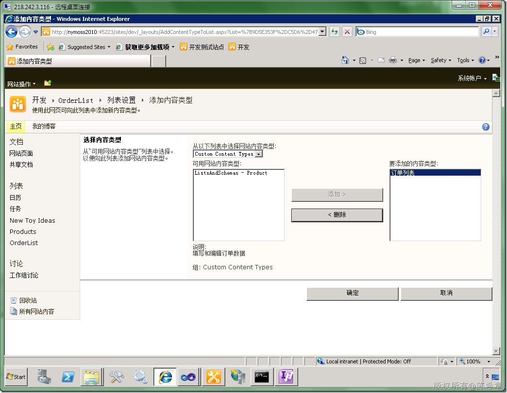](http://images.cnblogs.com/cnblogs_com/chenxizhang/WindowsLiveWriter/MOSS2010VisualStudio201010_5F73/image_26.png) 


[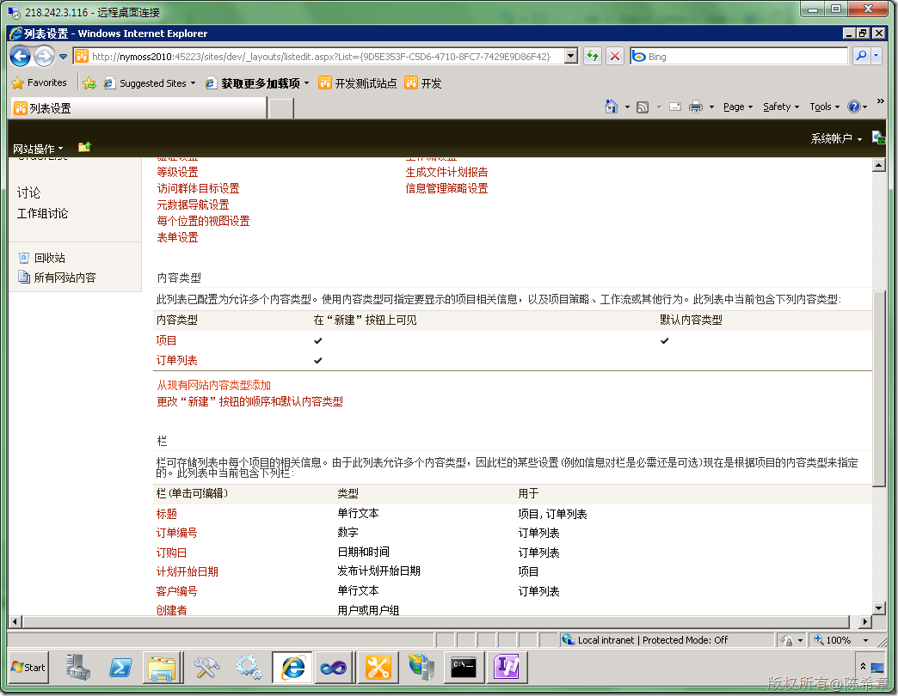](http://images.cnblogs.com/cnblogs_com/chenxizhang/WindowsLiveWriter/MOSS2010VisualStudio201010_5F73/image_28.png) 


下面我们来看看如何使用该内容类型


[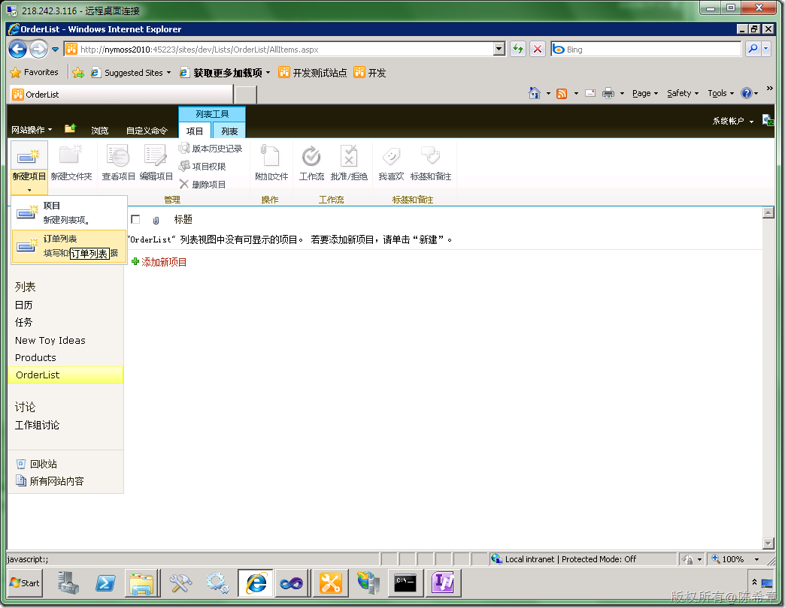](http://images.cnblogs.com/cnblogs_com/chenxizhang/WindowsLiveWriter/MOSS2010VisualStudio201010_5F73/image_30.png) 


[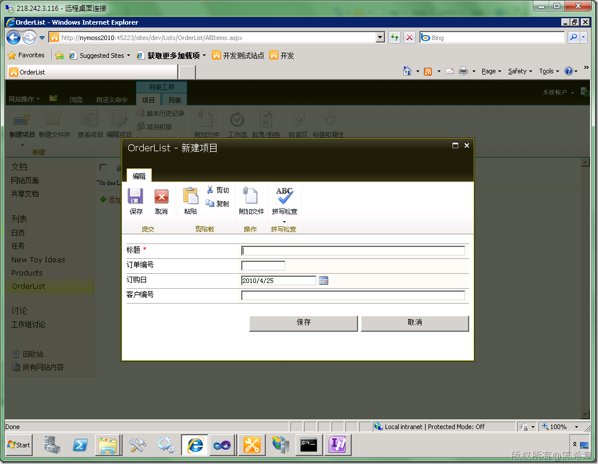](http://images.cnblogs.com/cnblogs_com/chenxizhang/WindowsLiveWriter/MOSS2010VisualStudio201010_5F73/image_32.png) 


好，到这里为止，我们就在Visual Studio中实现了一个自定义内容类型，而且将它部署到了网站，然后在一个列表中使用了它。


但是，问题是，如果每次都需要我们手工来建立列表与内容类型的联系，其实还是比较繁琐的。有没有办法让一个列表自动地就关联到某个内容类型呢？


当然可以的，我们下面就会介绍列表定义和列表实例的实现。


