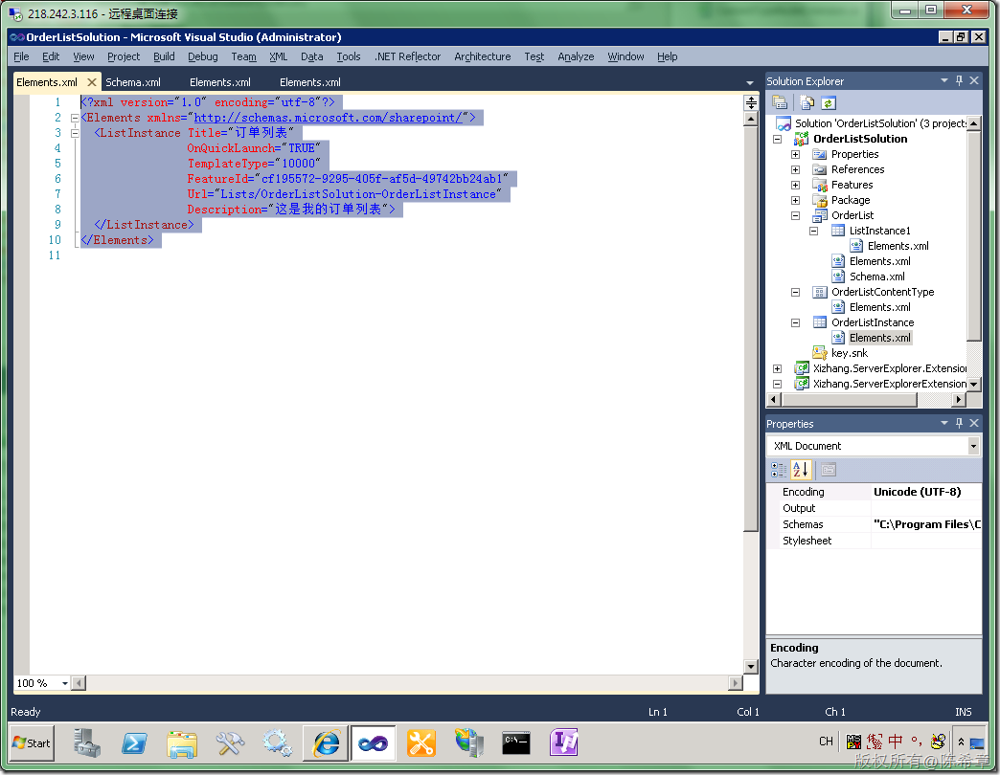

# MOSS 2010:Visual Studio 2010开发体验（13）——列表开发之列表实例 
> 原文发表于 2010-04-25, 地址: http://www.cnblogs.com/chenxizhang/archive/2010/04/25/1719811.html 

上一篇我们讲到了如何创建列表定义，那个操作相当于是设计了一个Class。现在来看看如何使用这个定义，实际上就是基于这个Class去创建Instance的概念。

  

 1.添加一个ListInstance

  

  

   我们看看默认生成的定义

 <?xml version="1.0" encoding="utf-8"?>  
<Elements xmlns="<http://schemas.microsoft.com/sharepoint/">>  
  <ListInstance Title="订单列表"  
                OnQuickLaunch="TRUE"  
                TemplateType="10000"  
                FeatureId="cf195572-9295-405f-af5d-49742bb24ab1"  
                Url="Lists/OrderListSolution-OrderListInstance"  
                Description="这是我的订单列表">  
  </ListInstance>  
</Elements>  

 不管三七二十一，部署是王道

  

 是的，这样就做好了。

 当然，我们还可以进一步对列表实例进行一些定制

  

  

 这里就不再过于展开了，大家有兴趣的可以查阅有关的资料。

 下一篇讲解列表事件的定义

