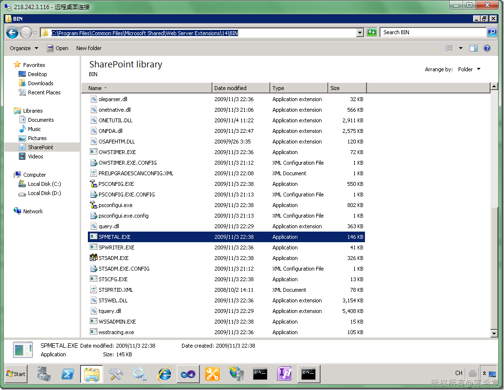
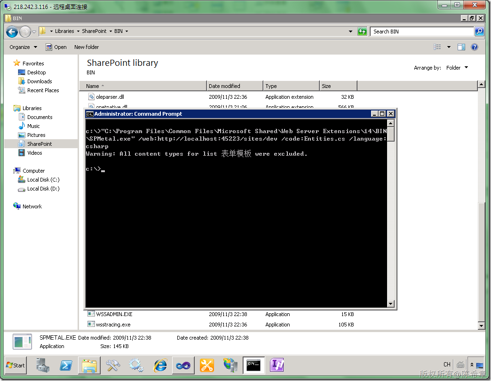

# MOSS 2010:Visual Studio 2010开发体验（15）——LINQ to SharePoint 
> 原文发表于 2010-04-26, 地址: http://www.cnblogs.com/chenxizhang/archive/2010/04/26/1721573.html 


这一篇我们来讨论的是,如何通过LINQ的技术实现对SharePoint 2010列表的读取。我还记得当年.NET Framework 3.5发布，第一次接触到Linq的时候那种不可思议的感觉。现在，SharePoint的开发也支持Linq啦，这真是一件值得欢欣鼓舞的事情。

  

 这篇文章的所有练习都基于下面这样列表。这个列表显示了员工的信息。作为演示目的，我只是添加了三个范例数据

 [](http://images.cnblogs.com/cnblogs_com/chenxizhang/WindowsLiveWriter/MOSS2010VisualStudio201015LINQtoSharePoi_D4C8/image_4.png) 

 目前针对MOSS 2010的开发，需要使用框架.NET Framework 3.5 而不是.NET Framework 4.0，而且编译的目标必须设置为Any CPU，或者X64。否则会出现一些莫名其妙的情况。这些是需要注意的，详细的介绍请参考我在下面这个博客文章

 <http://www.cnblogs.com/chenxizhang/archive/2010/04/04/1704116.html>

  

 在讲LINQ to SharePoint之前，我们稍微回顾一下之前是怎么访问SharePoint 列表的。我们会用到SharePoint所提供的组件对象模型（Object Model）去做，具体来说，我们大致有下面两种常见的做法

 【注意】如果你对SharePoint的对象模型不清楚，下面这篇文章可以帮助你理解 <http://www.cnblogs.com/chenxizhang/archive/2010/04/05/1704550.html>

  

 1. 通过读取SPList.Items
-------------------


```
using System;
using System.Collections.Generic;
using System.Linq;
using System.Text;

using Microsoft.SharePoint;

namespace ConsoleApplication1
{
    class Program
    {
        static void Main(string[] args)
        {
            var url = "http://localhost:45223/sites/dev";
            
            using (SPSite site = new SPSite(url))
            {
                using (SPWeb web = site.OpenWeb())
                {
                    SPList list = web.Lists["Employees"];
                    foreach (SPListItem item in list.Items)
                    {
                        Console.WriteLine("FullName:{0},{1} Age:{2}",
                            item["FirstName"],
                            item["LastName"],
                            item["Age"]);
                    }

                }
            }
        }
    }
}
```

以上的代码是读取所有的员工的，假设我们要做筛选呢，例如我们只想看到那些年龄小于60岁的员工资料，我们会怎么做呢？


```
using System;
using System.Collections.Generic;
using System.Linq;
using System.Text;

using Microsoft.SharePoint;

namespace ConsoleApplication1
{
    class Program
    {
        static void Main(string[] args)
        {
            var url = "http://localhost:45223/sites/dev";
            
            using (SPSite site = new SPSite(url))
            {
                using (SPWeb web = site.OpenWeb())
                {
                    SPList list = web.Lists["Employees"];
                    foreach (SPListItem item in list.Items)
                    {
 **if(int.Parse(item["Age"].ToString())<60)**                        Console.WriteLine("FullName:{0},{1} Age:{2}",
                            item["FirstName"],
                            item["LastName"],
                            item["Age"]);
                    }

                }
            }
        }
    }
}

```

.csharpcode, .csharpcode pre
{
 font-size: small;
 color: black;
 font-family: consolas, "Courier New", courier, monospace;
 background-color: #ffffff;
 /*white-space: pre;*/
}
.csharpcode pre { margin: 0em; }
.csharpcode .rem { color: #008000; }
.csharpcode .kwrd { color: #0000ff; }
.csharpcode .str { color: #006080; }
.csharpcode .op { color: #0000c0; }
.csharpcode .preproc { color: #cc6633; }
.csharpcode .asp { background-color: #ffff00; }
.csharpcode .html { color: #800000; }
.csharpcode .attr { color: #ff0000; }
.csharpcode .alt 
{
 background-color: #f4f4f4;
 width: 100%;
 margin: 0em;
}
.csharpcode .lnum { color: #606060; }

.csharpcode, .csharpcode pre
{
 font-size: small;
 color: black;
 font-family: consolas, "Courier New", courier, monospace;
 background-color: #ffffff;
 /*white-space: pre;*/
}
.csharpcode pre { margin: 0em; }
.csharpcode .rem { color: #008000; }
.csharpcode .kwrd { color: #0000ff; }
.csharpcode .str { color: #006080; }
.csharpcode .op { color: #0000c0; }
.csharpcode .preproc { color: #cc6633; }
.csharpcode .asp { background-color: #ffff00; }
.csharpcode .html { color: #800000; }
.csharpcode .attr { color: #ff0000; }
.csharpcode .alt 
{
 background-color: #f4f4f4;
 width: 100%;
 margin: 0em;
}
.csharpcode .lnum { color: #606060; }

没错，这可以实现我们的目的。其实如何结合LINQ to Object的技术，我们还可以像下面这样写代码


```
using System;
using System.Collections.Generic;
using System.Linq;
using System.Text;

using Microsoft.SharePoint;

namespace ConsoleApplication1
{
    class Program
    {
        static void Main(string[] args)
        {
            var url = "http://localhost:45223/sites/dev";
            
            using (SPSite site = new SPSite(url))
            {
                using (SPWeb web = site.OpenWeb())
                {
                    SPList list = web.Lists["Employees"];


 **var query = from SPListItem item in list.Items
 where int.Parse(item["Age"].ToString()) < 60
 select item;**

                    foreach (SPListItem item in query)
                    {
                        
                        Console.WriteLine("FullName:{0},{1} Age:{2}",
                            item["FirstName"],
                            item["LastName"],
                            item["Age"]);
                    }

                }
            }
        }
    }
}
```

```

[](http://images.cnblogs.com/cnblogs_com/chenxizhang/WindowsLiveWriter/MOSS2010VisualStudio201015LINQtoSharePoi_D4C8/image_5.png) 
```

看起来不错，而且我们这里其实也用到了Linq的语法，不是吗？但大家要注意一下，上面三种写法，不管有没有进行筛选，也不管是否用到了LINQ语法，它们都有一个很大的问题，就是：他们都是把所有的SPListItem读取过来，然后再做处理的（例如做筛选），这意味着什么呢？


 


假设列表的项目很多，例如有成千上万个员工记录，然而我们这个程序其实只要用到其中的一个员工，大家可以试想一下会是多大的一个资源浪费的操作。基于这样的理由，所以以前我们用得更多的可能是下面这种做法


 


.csharpcode, .csharpcode pre
{
 font-size: small;
 color: black;
 font-family: consolas, "Courier New", courier, monospace;
 background-color: #ffffff;
 /*white-space: pre;*/
}
.csharpcode pre { margin: 0em; }
.csharpcode .rem { color: #008000; }
.csharpcode .kwrd { color: #0000ff; }
.csharpcode .str { color: #006080; }
.csharpcode .op { color: #0000c0; }
.csharpcode .preproc { color: #cc6633; }
.csharpcode .asp { background-color: #ffff00; }
.csharpcode .html { color: #800000; }
.csharpcode .attr { color: #ff0000; }
.csharpcode .alt 
{
 background-color: #f4f4f4;
 width: 100%;
 margin: 0em;
}
.csharpcode .lnum { color: #606060; }

2. 通过CAML语法
-----------


CAML是一个特殊的标记语言吧，它的全称是Collaborative Application Markup Language（协作应用程序标记语言）。这里有一个链接，如果有兴趣的朋友可以了解一下


<http://msdn.microsoft.com/zh-cn/library/ms426449.aspx>


这篇文章中，我们的重点当然不是介绍CAML，只是演示一下如何使用它来定义查询语法，对列表进行筛选。


【注意】CAML的功能不仅仅限于列表查询，它甚至可以定义列表，和网站结构等等。


```
using System;
using System.Collections.Generic;
using System.Linq;
using System.Text;

using Microsoft.SharePoint;

namespace ConsoleApplication1
{
    class Program
    {
        static void Main(string[] args)
        {
            var url = "http://localhost:45223/sites/dev";
            
            using (SPSite site = new SPSite(url))
            {
                using (SPWeb web = site.OpenWeb())
                {
                    SPList list = web.Lists["Employees"];


                    SPQuery query = new SPQuery();
 **query.Query = "<Where><Lt><FieldRef Name='Age' /><Value Type='Number'>60</Value></Lt></Where>";**
                    foreach (SPListItem item in list.GetItems(query))
                    {
                        Console.WriteLine("FullName:{0},{1} Age:{2}",
                            item["FirstName"],
                            item["LastName"],
                            item["Age"]);
                    }

                }


            }

            Console.Read();
        }
    }
}

```


这个例子中，我们使用了一个全新的类型，SPQuery。它可以定义一串查询的语句。而SPList的GetItems方法就可以使用这个Query对象进行过滤。注意，这是在服务器端就过滤掉了数据，而不会把所有的SPListItem读取到我们的程序中来了。


很显然的一个问题是，如果让你手工编写这个查询语句，恐怕是一件很困难的事情。所以以前我们一般都需要借助一些外部工具。其中最出名的一个工具就是U2U提供的CAML Query builder。


关于如何使用U2U这个工具，以及有关注意事项，我之前也有一篇文章介绍


<http://www.cnblogs.com/chenxizhang/archive/2009/10/23/1588415.html>


 


CAML确实可以帮助我们实现灵活的查询，但无论如何，它的语法还是相对来说晦涩难懂的。所以，有一位叫bdesmet的开发人员实现了一套LINQ Provider，名称就是linqtoSharepoint,你可以通过下面的网站了解到有关信息


<http://linqtosharepoint.codeplex.com/>


【注意】这是一个开源项目，虽然名称很接近，但我们这篇博客文章并不是讨论它的使用。事实上，如果你还在使用MOSS 2007的话，它可能对你有些帮助。但我们现在如果使用MOSS 2010的话，就没有必要了。因为现在是内置了这个支持。


【注意】我曾经在MOSS 2007的使用用过这个插件，但效果不尽如人意，尤其是如果你的网站中的列表是用中文命名的话。所以，如果你遇到了一些问题，也不必感到特别的诧异。


 


3. 使用MOSS 2010全新的 LINQ 支持特性
---------------------------


我们终于要切入正题了：如何使用MOSS 2010的LINQ特性来改善开发体验，以及它与之前的方法有何差别呢？


为了使用LINQ的功能，我们第一步需要用一个工具生成一个代码文件，这个文件包含了所有列表的一个实体类。


该工具叫SPMetal.exe，它的位置一般是在C:\Program Files\Common Files\Microsoft Shared\Web Server Extensions\14\BIN目录中。


[](http://images.cnblogs.com/cnblogs_com/chenxizhang/WindowsLiveWriter/MOSS2010VisualStudio201015LINQtoSharePoi_D4C8/image_7.png) 


通过类似下面这样的方式执行该工具


[](http://images.cnblogs.com/cnblogs_com/chenxizhang/WindowsLiveWriter/MOSS2010VisualStudio201015LINQtoSharePoi_D4C8/image_9.png) 


该工具所生成的实体类文件大致如下


[](http://images.cnblogs.com/cnblogs_com/chenxizhang/WindowsLiveWriter/MOSS2010VisualStudio201015LINQtoSharePoi_D4C8/image_11.png) 


有了这个文件，接下来我们就可以将它添加到项目中，并且基于它编写代码来实现对列表的查询了。


[](http://images.cnblogs.com/cnblogs_com/chenxizhang/WindowsLiveWriter/MOSS2010VisualStudio201015LINQtoSharePoi_D4C8/image_13.png) 


在该文件中，你发现有很多错误的提示。这是因为我们还没有添加一个程序集的引用。


添加Microsoft.SharePoint.Linq.dll的引用，该程序集一般在c:\Program Files\Common Files\Microsoft Shared\web server extensions\14\ISAPI目录中


[](http://images.cnblogs.com/cnblogs_com/chenxizhang/WindowsLiveWriter/MOSS2010VisualStudio201015LINQtoSharePoi_D4C8/image_15.png) 


添加完引用之后，编译该项目，确保没有任何错误。


 


接下来，我们看看代码应该如何修改


```
using System;
using System.Collections.Generic;
using System.Linq;
using System.Text;

using Microsoft.SharePoint;

namespace ConsoleApplication1
{
    class Program
    {
        static void Main(string[] args)
        {
            var url = "http://localhost:45223/sites/dev";

            EntitiesDataContext ctx = new EntitiesDataContext(url);
            var query = from item in ctx.Employees
                        where item.Age < 60
                        select item;


            foreach (var item in query)
            {

                Console.WriteLine("FullName:{0},{1} Age:{2}",
                    item.FirstName,
                    item.LastName,
                    item.Age);
            }

            Console.Read();
        }
    }
}

```

.csharpcode, .csharpcode pre
{
 font-size: small;
 color: black;
 font-family: consolas, "Courier New", courier, monospace;
 background-color: #ffffff;
 /*white-space: pre;*/
}
.csharpcode pre { margin: 0em; }
.csharpcode .rem { color: #008000; }
.csharpcode .kwrd { color: #0000ff; }
.csharpcode .str { color: #006080; }
.csharpcode .op { color: #0000c0; }
.csharpcode .preproc { color: #cc6633; }
.csharpcode .asp { background-color: #ffff00; }
.csharpcode .html { color: #800000; }
.csharpcode .attr { color: #ff0000; }
.csharpcode .alt 
{
 background-color: #f4f4f4;
 width: 100%;
 margin: 0em;
}
.csharpcode .lnum { color: #606060; }


 


WOW, 我只能说，这样写代码的感觉是非常棒的：强类型、有智能感知支持、没有类型转换问题、更不需要记住那些晦涩难懂的CAML语句。。。。。。


这就是LINQ的魅力吧，你也赶紧试试吧

