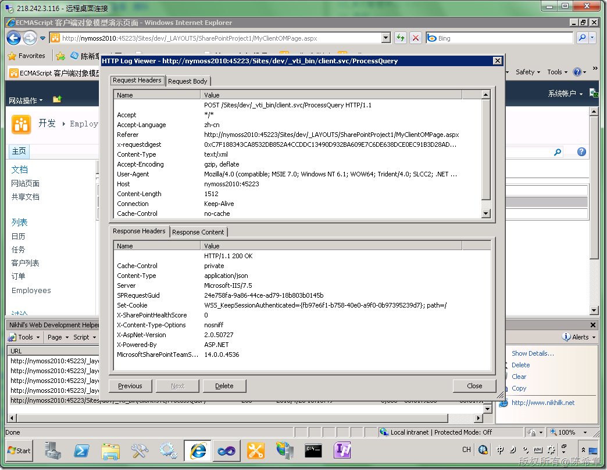

# MOSS 2010:Visual Studio 2010开发体验（19）——ECMAScript Object Model 
> 原文发表于 2010-04-28, 地址: http://www.cnblogs.com/chenxizhang/archive/2010/04/28/1723196.html 


这篇文章部分材料摘自下面这个地址，我做了翻译，并且按照我的案例场景做了补充

 <http://www.codeproject.com/Articles/60348/SharePoint-2010-Client-Object-Model-for-JavaScript.aspx>

  

 ECMAScript Client OM is SharePoint 2010 client object model extension for using with JavaScript or JScript. Few points to notice about ECMAScript Client OM: * ECMAScript object model can only be used in SharePoint sites. So you can’t use this object model in an asp.net site to access SharePoint resources deployed in another url as this is cross-site scripting and not allowed. （**这个对象模型是只能用在SharePoint页面内部，不能用在单独的网站中。而且也不能跨站访问外部资源**） * You can’t use this object model in a SharePoint site to access resources in different SharePoint sites(i.e., different urls). For example, from mysite.mysp.com you can access resources in yoursite.yoursp.com using ECMAScript client OM. This is also cross-site scripting. （**即便是在SharePoint的不同站点中，也不能互相访问，其实这也是一种跨站访问**） * You can use JQuery with ECMAScript Client OM and for this you don’t need to do some extra work. All you need to do to use JQuery is to add reference to JQuery.js file and start using JQuery. （**可以配合jquery使用该对象模型**） * You can use this ECMAScript Client OM in web part pages or application pages (aspx pages) by referencing a javascript file (SP.js). You don’t need to add reference to the file manually rather use <SharePoint:ScriptLink Name=”sp.js” ………. />. The file is located on the path “Program Files\Common Files\Microsoft Shared\Web Server Extensions\14\TEMPLATE\LAYOUTS”（**我们可以在WebPart页面或者Application页面中使用该模型，但无需直接添加对其脚本文件SP.JS的引用，而是可以通过一个所谓的链接即可**）

 其实该脚本文件是在下面的位置

 [](http://images.cnblogs.com/cnblogs_com/chenxizhang/WindowsLiveWriter/MOSS2010VisualStudio201019ECMAScriptObje_F66F/image_18.png) 

 这套客户端对象模型的详细资料，可以参考<http://msdn.microsoft.com/en-us/library/ee538253(office.14).aspx>

  

 好了，上面几点我之所以保留中英文，是因为原作者总结得很不错。下面开始我们的ECMAScript Object Model之旅了

  

  

 1. 为什么需要这个对象模型
--------------

 这个答案是显而易见的，它提供了在javascript或者Jscript中对SharePoint对象进行存取的机制，例如创建一个列表，或者更新一个列表条目。这个以前可只能通过服务器对象模型，通过C#或者VB.NET这样的语言才能做的。

  

 2. 现在内置的功能中哪些是用到了这个模型？
----------------------

 很多朋友第一次用MOSS 2010的时候都会赞叹说现在的界面体验比以前好多了，一个最明显的区别就是现在不要老是从一个页面跳到另外一个页面，取而代之的是，现在提供了一种弹出对话框的方式进行操作。如下图所示

 [](http://images.cnblogs.com/cnblogs_com/chenxizhang/WindowsLiveWriter/MOSS2010VisualStudio201019ECMAScriptObje_F66F/image_2.png) 

 以上图为例，我们可以通过这样的界面来新建一个项目。当点击保存的时候，其实是需要用javasript的方式去保存该项目的数据。不是吗？此时，基于javascript的对象模型就很重要了。

 事实上，MOSS 2010很多的地方都用到了这套ECMAScript 对象模型，用于很多页面的异步操作和刷新等功能。

  

 3. 如何使用该模型？
-----------

 好的，介绍完如上的这些基本概念后，我们就来动手做一个例子吧。还是很前面几篇文章一样，我们需要访问到当前站点的一个Employees列表，然后将其中的年龄小于60岁的员工筛选出来。

 关于其他几篇文章，如果你没有看过，请参考下面的链接

 * <http://www.cnblogs.com/chenxizhang/archive/2010/04/26/1721653.html>
* <http://www.cnblogs.com/chenxizhang/archive/2010/04/28/1722759.html>

  

 我们准备这样来实现这个例子：

 1. 用一个专门的Application Page来做，以便理解
2. 使用jquery来开发

  

 我们还等什么，马上开始吧

 首先，创建一个空白的SharePoint项目

 [](http://images.cnblogs.com/cnblogs_com/chenxizhang/WindowsLiveWriter/MOSS2010VisualStudio201019ECMAScriptObje_F66F/image_4.png) 

 [](http://images.cnblogs.com/cnblogs_com/chenxizhang/WindowsLiveWriter/MOSS2010VisualStudio201019ECMAScriptObje_F66F/image_6.png) 

 然后，我们添加一个Application Page

 [](http://images.cnblogs.com/cnblogs_com/chenxizhang/WindowsLiveWriter/MOSS2010VisualStudio201019ECMAScriptObje_F66F/image_8.png) 

 [](http://images.cnblogs.com/cnblogs_com/chenxizhang/WindowsLiveWriter/MOSS2010VisualStudio201019ECMAScriptObje_F66F/image_10.png) 

 接下来，添加SP.js的引用，并且对其他几个区域做一些初始化工作


```
<%@ Assembly Name="$SharePoint.Project.AssemblyFullName$" %>
<%@ Import Namespace="Microsoft.SharePoint.ApplicationPages" %>
<%@ Register Tagprefix="SharePoint" Namespace="Microsoft.SharePoint.WebControls" Assembly="Microsoft.SharePoint, Version=14.0.0.0, Culture=neutral, PublicKeyToken=71e9bce111e9429c" %>
<%@ Register Tagprefix="Utilities" Namespace="Microsoft.SharePoint.Utilities" Assembly="Microsoft.SharePoint, Version=14.0.0.0, Culture=neutral, PublicKeyToken=71e9bce111e9429c" %>
<%@ Register Tagprefix="asp" Namespace="System.Web.UI" Assembly="System.Web.Extensions, Version=3.5.0.0, Culture=neutral, PublicKeyToken=31bf3856ad364e35" %>
<%@ Import Namespace="Microsoft.SharePoint" %>
<%@ Assembly Name="Microsoft.Web.CommandUI, Version=14.0.0.0, Culture=neutral, PublicKeyToken=71e9bce111e9429c" %>
<%@ Page Language="C#" AutoEventWireup="true" CodeBehind="MyClientOMPage.aspx.cs" Inherits="SharePointProject1.Layouts.SharePointProject1.MyClientOMPage" DynamicMasterPageFile="~masterurl/default.master" %>

<asp:Content ID="PageHead" ContentPlaceHolderID="PlaceHolderAdditionalPageHead" runat="server">
    <SharePoint:ScriptLink Name="SP.JS" runat="server" OnDemand="true" Localizable="false"></SharePoint:ScriptLink>
</asp:Content>

<asp:Content ID="Main" ContentPlaceHolderID="PlaceHolderMain" runat="server">
<SharePoint:FormDigest ID="FormDigest1" runat="server" /><!-如果需要修改数据的话，则需要添加这个，以便做身份信息的校验-->

<!--下面这个表格将用来填充员工数据-->

    <table id=”employees” width="100%" border="1">
        <thead>
            <tr>
                <td>FirstName</td>
                <td>LastName</td>
            </tr>
        </thead>
        <tbody>
            <tr id="template">
                <td></td>
                <td></td>
            </tr>
        </tbody>
    </table>

</asp:Content>

<asp:Content ID="PageTitle" ContentPlaceHolderID="PlaceHolderPageTitle" runat="server">
ECMAScript 客户端对象模型演示页面
</asp:Content>

<asp:Content ID="PageTitleInTitleArea" ContentPlaceHolderID="PlaceHolderPageTitleInTitleArea" runat="server" >
Employee List
</asp:Content>

```

.csharpcode, .csharpcode pre
{
 font-size: small;
 color: black;
 font-family: consolas, "Courier New", courier, monospace;
 background-color: #ffffff;
 /*white-space: pre;*/
}
.csharpcode pre { margin: 0em; }
.csharpcode .rem { color: #008000; }
.csharpcode .kwrd { color: #0000ff; }
.csharpcode .str { color: #006080; }
.csharpcode .op { color: #0000c0; }
.csharpcode .preproc { color: #cc6633; }
.csharpcode .asp { background-color: #ffff00; }
.csharpcode .html { color: #800000; }
.csharpcode .attr { color: #ff0000; }
.csharpcode .alt 
{
 background-color: #f4f4f4;
 width: 100%;
 margin: 0em;
}
.csharpcode .lnum { color: #606060; }

 


接下来，我们准备使用jquery来提供更加好的javascript编写体验。（在处理DOM元素方面，jquery的确很棒，我已经不能掩饰对它的喜爱）


关于jquery的官方资料，可以参考<http://jquery.com/>


其实，如果你在用VS 2010做网站开发，就会发现默认就有jquery方面的脚本。你可以随便创建一个空白的Web Application.就可以看到有三个js文件。


[](http://images.cnblogs.com/cnblogs_com/chenxizhang/WindowsLiveWriter/MOSS2010VisualStudio201019ECMAScriptObje_F66F/image_12.png) 


【注意】在VS2010的正式版中，jquery的版本也升级到了1.4.1


好了，不扯太远了。我们需要将这几个js文件添加到之前的那个项目


[](http://images.cnblogs.com/cnblogs_com/chenxizhang/WindowsLiveWriter/MOSS2010VisualStudio201019ECMAScriptObje_F66F/image_14.png) 


然后来编写一点脚本吧


```
<%@ Assembly Name="$SharePoint.Project.AssemblyFullName$" %>
<%@ Import Namespace="Microsoft.SharePoint.ApplicationPages" %>
<%@ Register Tagprefix="SharePoint" Namespace="Microsoft.SharePoint.WebControls" Assembly="Microsoft.SharePoint, Version=14.0.0.0, Culture=neutral, PublicKeyToken=71e9bce111e9429c" %>
<%@ Register Tagprefix="Utilities" Namespace="Microsoft.SharePoint.Utilities" Assembly="Microsoft.SharePoint, Version=14.0.0.0, Culture=neutral, PublicKeyToken=71e9bce111e9429c" %>
<%@ Register Tagprefix="asp" Namespace="System.Web.UI" Assembly="System.Web.Extensions, Version=3.5.0.0, Culture=neutral, PublicKeyToken=31bf3856ad364e35" %>
<%@ Import Namespace="Microsoft.SharePoint" %>
<%@ Assembly Name="Microsoft.Web.CommandUI, Version=14.0.0.0, Culture=neutral, PublicKeyToken=71e9bce111e9429c" %>
<%@ Page Language="C#" AutoEventWireup="true" CodeBehind="MyClientOMPage.aspx.cs" Inherits="SharePointProject1.Layouts.SharePointProject1.MyClientOMPage" DynamicMasterPageFile="~masterurl/default.master" %>

<asp:Content ID="PageHead" ContentPlaceHolderID="PlaceHolderAdditionalPageHead" runat="server">
    <SharePoint:ScriptLink Name="SP.JS" runat="server" OnDemand="true" Localizable="false"></SharePoint:ScriptLink>
    <script src="/\_layouts/jquery-1.3.2.min.js" type="text/javascript"></script>
    
    <script language="javascript" type="text/javascript">
        $(function () {
            //先不读取对象模型，而是尝试填充一点范例数据
            for (var i = 0; i < 10; i++) {
                var data = $("#template").clone();
                data.find("td:first").text("Ares");
                data.find("td:last").text("Chen");
                $("#employees tbody").append(data);
            }

            $("#template").remove();

            $("#employees tbody tr:even").css("background-color", "silver");

        });
    </script>

</asp:Content>

<asp:Content ID="Main" ContentPlaceHolderID="PlaceHolderMain" runat="server">
<SharePoint:FormDigest ID="FormDigest1" runat="server" /><--如果需要修改数据的话，则需要添加这个，以便做身份信息的校验-->

<!--下面这个表格将用来填充员工数据-->

    <table id="employees" width="100%" border="1">
        <thead>
            <tr>
                <td>FirstName</td>
                <td>LastName</td>
            </tr>
        </thead>
        <tbody>
            <tr id="template">
                <td></td>
                <td></td>
            </tr>
        </tbody>
    </table>

</asp:Content>

<asp:Content ID="PageTitle" ContentPlaceHolderID="PlaceHolderPageTitle" runat="server">
ECMAScript 客户端对象模型演示页面
</asp:Content>

<asp:Content ID="PageTitleInTitleArea" ContentPlaceHolderID="PlaceHolderPageTitleInTitleArea" runat="server" >
Employee List
</asp:Content>

```

【注意】你可能会问这些javascript写起来有没有什么好的工具呢？当然，请注意我们刚才添加的几个js文件中，有一个vsdoc文件，这就是用于visual studio的智能感知文件


其实，我只是写好之后，将它拿掉了而已。关于如何使用智能感知，可以参考我之前的文章 <http://www.cnblogs.com/chenxizhang/archive/2009/05/27/1490537.html>
.csharpcode, .csharpcode pre
{
 font-size: small;
 color: black;
 font-family: consolas, "Courier New", courier, monospace;
 background-color: #ffffff;
 /*white-space: pre;*/
}
.csharpcode pre { margin: 0em; }
.csharpcode .rem { color: #008000; }
.csharpcode .kwrd { color: #0000ff; }
.csharpcode .str { color: #006080; }
.csharpcode .op { color: #0000c0; }
.csharpcode .preproc { color: #cc6633; }
.csharpcode .asp { background-color: #ffff00; }
.csharpcode .html { color: #800000; }
.csharpcode .attr { color: #ff0000; }
.csharpcode .alt 
{
 background-color: #f4f4f4;
 width: 100%;
 margin: 0em;
}
.csharpcode .lnum { color: #606060; }


 


现在可以部署该项目，看看效果如何


[](http://images.cnblogs.com/cnblogs_com/chenxizhang/WindowsLiveWriter/MOSS2010VisualStudio201019ECMAScriptObje_F66F/image_16.png) 


【注意】作为演示，我们并没有花很多时间去做样式方面的设置。


 


看起来，已经有些效果了。我们通过javascript的方式动态地生成了10个员工的数据。并且通过交错行的颜色区分，让他们看起来更清楚。


以上的效果确认了之后，我们就进入本篇文章的最后一部分，通过ECMAScript Object Model实现对列表的查询


 


```
<%@ Assembly Name="$SharePoint.Project.AssemblyFullName$" %>
<%@ Import Namespace="Microsoft.SharePoint.ApplicationPages" %>
<%@ Register TagPrefix="SharePoint" Namespace="Microsoft.SharePoint.WebControls"
 Assembly="Microsoft.SharePoint, Version=14.0.0.0, Culture=neutral, PublicKeyToken=71e9bce111e9429c" %>
<%@ Register TagPrefix="Utilities" Namespace="Microsoft.SharePoint.Utilities" Assembly="Microsoft.SharePoint, Version=14.0.0.0, Culture=neutral, PublicKeyToken=71e9bce111e9429c" %>
<%@ Register TagPrefix="asp" Namespace="System.Web.UI" Assembly="System.Web.Extensions, Version=3.5.0.0, Culture=neutral, PublicKeyToken=31bf3856ad364e35" %>
<%@ Import Namespace="Microsoft.SharePoint" %>
<%@ Assembly Name="Microsoft.Web.CommandUI, Version=14.0.0.0, Culture=neutral, PublicKeyToken=71e9bce111e9429c" %>

<%@ Page Language="C#" AutoEventWireup="true" CodeBehind="MyClientOMPage.aspx.cs"
 Inherits="SharePointProject1.Layouts.SharePointProject1.MyClientOMPage" DynamicMasterPageFile="~masterurl/default.master" %>

<asp:Content ID="PageHead" ContentPlaceHolderID="PlaceHolderAdditionalPageHead" runat="server">
    <script src="/\_layouts/jquery-1.3.2.min.js" type="text/javascript"></script>
    <SharePoint:ScriptLink ID="ScriptLink1" Name="SP.JS" runat="server"        Localizable="false" LoadAfterUI="true">
    </SharePoint:ScriptLink>
    <script language="javascript" type="text/javascript">
        var collListItem;
        function LoadEmployees() {
            var clientContext = new SP.ClientContext.get\_current();
            var web = clientContext.get\_web();
            var list = web.get\_lists().getByTitle('Employees');
            var camlQuery = new SP.CamlQuery();
            camlQuery.set\_viewXml("<View><Query><Where><Lt><FieldRef Name='Age' /><Value Type='Number'>60</Value></Lt></Where></Query><RowLimit>100</RowLimit></View>");
            this.collListItem = list.getItems(camlQuery);
            clientContext.load(this.collListItem);
            clientContext.executeQueryAsync(
Function.createDelegate(this, this.onQuerySucceeded),
Function.createDelegate(this, this.onQueryFailed));
        }

        $(function () { LoadEmployees(); });


        function onQuerySucceeded(object, args) {
            var count = this.collListItem.get\_count();
            for (var i = 0; i < count; i++) {
                var item = this.collListItem.itemAt(i);
                var data = $("#template").clone();
                data.find("td:first").text(item.get\_fieldValues()["FirstName"]);
                data.find("td:last").text(item.get\_fieldValues()["LastName"]);
                $("#employees tbody").append(data);

            }

            $("#template").remove();
            $("#employees tbody tr:even").css("background-color", "silver");
        }

        function onQueryFailed(object, args) {
            alert("加载列表出现异常:" + args.message);
        }
    </script>
</asp:Content>
<asp:Content ID="Main" ContentPlaceHolderID="PlaceHolderMain" runat="server">
    <SharePoint:FormDigest ID="FormDigest1" runat="server" />
    <!-如果需要修改数据的话，则需要添加这个，以便做身份信息的校验-->
    <!--下面这个表格将用来填充员工数据-->
    <input type="button" onclick="LoadEmployees()" value="加载数据" /><hr />
    <table id="employees" width="100%" border="1">
        <thead>
            <tr>
                <td>
                    FirstName
                </td>
                <td>
                    LastName
                </td>
            </tr>
        </thead>
        <tbody>
            <tr id="template">
                <td>
                </td>
                <td>
                </td>
            </tr>
        </tbody>
    </table>
</asp:Content>
<asp:Content ID="PageTitle" ContentPlaceHolderID="PlaceHolderPageTitle" runat="server">
    ECMAScript 客户端对象模型演示页面
</asp:Content>
<asp:Content ID="PageTitleInTitleArea" ContentPlaceHolderID="PlaceHolderPageTitleInTitleArea"
    runat="server">
    Employee List
</asp:Content>

```

.csharpcode, .csharpcode pre
{
 font-size: small;
 color: black;
 font-family: consolas, "Courier New", courier, monospace;
 background-color: #ffffff;
 /*white-space: pre;*/
}
.csharpcode pre { margin: 0em; }
.csharpcode .rem { color: #008000; }
.csharpcode .kwrd { color: #0000ff; }
.csharpcode .str { color: #006080; }
.csharpcode .op { color: #0000c0; }
.csharpcode .preproc { color: #cc6633; }
.csharpcode .asp { background-color: #ffff00; }
.csharpcode .html { color: #800000; }
.csharpcode .attr { color: #ff0000; }
.csharpcode .alt 
{
 background-color: #f4f4f4;
 width: 100%;
 margin: 0em;
}
.csharpcode .lnum { color: #606060; }


```
【注意】编写这个脚本没有办法使用智能感知。我同意，这是比较麻烦一些的。目前来说，你还是应该多查<http://msdn.microsoft.com/en-us/library/ee538253(office.14).aspx>
```

```
 
```

.csharpcode, .csharpcode pre
{
 font-size: small;
 color: black;
 font-family: consolas, "Courier New", courier, monospace;
 background-color: #ffffff;
 /*white-space: pre;*/
}
.csharpcode pre { margin: 0em; }
.csharpcode .rem { color: #008000; }
.csharpcode .kwrd { color: #0000ff; }
.csharpcode .str { color: #006080; }
.csharpcode .op { color: #0000c0; }
.csharpcode .preproc { color: #cc6633; }
.csharpcode .asp { background-color: #ffff00; }
.csharpcode .html { color: #800000; }
.csharpcode .attr { color: #ff0000; }
.csharpcode .alt 
{
 background-color: #f4f4f4;
 width: 100%;
 margin: 0em;
}
.csharpcode .lnum { color: #606060; }

.csharpcode, .csharpcode pre
{
 font-size: small;
 color: black;
 font-family: consolas, "Courier New", courier, monospace;
 background-color: #ffffff;
 /*white-space: pre;*/
}
.csharpcode pre { margin: 0em; }
.csharpcode .rem { color: #008000; }
.csharpcode .kwrd { color: #0000ff; }
.csharpcode .str { color: #006080; }
.csharpcode .op { color: #0000c0; }
.csharpcode .preproc { color: #cc6633; }
.csharpcode .asp { background-color: #ffff00; }
.csharpcode .html { color: #800000; }
.csharpcode .attr { color: #ff0000; }
.csharpcode .alt 
{
 background-color: #f4f4f4;
 width: 100%;
 margin: 0em;
}
.csharpcode .lnum { color: #606060; }

[](http://images.cnblogs.com/cnblogs_com/chenxizhang/WindowsLiveWriter/MOSS2010VisualStudio201019ECMAScriptObje_F66F/image_20.png) 


【注意】页面上这个按钮并不是必须的。我只是为了测试方便放在上面的。


 


好了，该庆祝一下了。 


 


 


但是，它到底是怎么工作的呢？


其实，通过工具一监控我们就能看出来，其实它不过也就是调用了一个client.svc的服务，执行有关的操作而已


[](http://images.cnblogs.com/cnblogs_com/chenxizhang/WindowsLiveWriter/MOSS2010VisualStudio201019ECMAScriptObje_F66F/image_22.png) 


[](http://images.cnblogs.com/cnblogs_com/chenxizhang/WindowsLiveWriter/MOSS2010VisualStudio201019ECMAScriptObje_F66F/image_24.png) 


其实它返回的数据是一段json


 


```
[
{
"SchemaVersion":"14.0.0.0","LibraryVersion":"14.0.4536.1000","ErrorInfo":null
},1,{
"IsNull":false
},3,{
"IsNull":false
},5,{
"IsNull":false
},7,{
"IsNull":false
},8,{
"\_ObjectIdentity\_":"740c6a0b-85e2-48a0-a494-e0f1759d4aa7:web:a50d9eca-848c-4f11-9dca-e1a7ddc01cb3:list:a07b5ffe-b6a1-4e0b-aa66-e5ffb7f6f06c"
},10,{
"IsNull":false
},11,{
"\_ObjectType\_":"SP.ListItemCollection","ListItemCollectionPosition":null,"\_Child\_Items\_":[
{
"\_ObjectType\_":"SP.ListItem","\_ObjectIdentity\_":"740c6a0b-85e2-48a0-a494-e0f1759d4aa7:web:a50d9eca-848c-4f11-9dca-e1a7ddc01cb3:list:a07b5ffe-b6a1-4e0b-aa66-e5ffb7f6f06c:item:1,1","\_ObjectVersion\_":"1","Id":1,"FileSystemObjectType":0,"ContentTypeId":{
"\_ObjectType\_":"SP.ContentTypeId","StringValue":"0x0100C28FC2EA6E2236489CE7A12D5313F362"
},"Title":null,"\_ModerationComments":null,"File\_x0020\_Type":null,"EmployeeID":1,"FirstName":"Ares","LastName":"Chen","Age":25,"ID":1,"Modified":"\/Date(1272265389000)\/","Created":"\/Date(1272265389000)\/","Author":{
"\_ObjectType\_":"SP.FieldUserValue","LookupId":1073741823,"LookupValue":"\u7cfb\u7edf\u5e10\u6237"
},"Editor":{
"\_ObjectType\_":"SP.FieldUserValue","LookupId":1073741823,"LookupValue":"\u7cfb\u7edf\u5e10\u6237"
},"\_HasCopyDestinations":null,"\_CopySource":null,"owshiddenversion":1,"WorkflowVersion":1,"\_UIVersion":512,"\_UIVersionString":"1.0","Attachments":false,"\_ModerationStatus":0,"InstanceID":null,"Order":100,"GUID":"\/Guid(e98a7765-5cee-4d4d-b4b5-273a0e2c5d35)\/","WorkflowInstanceID":null,"FileRef":"\u002fsites\u002fdev\u002fLists\u002fEmployees\u002f1\_.000","FileDirRef":"\u002fsites\u002fdev\u002fLists\u002fEmployees","Last\_x0020\_Modified":"2010-04-26T07:03:09Z","Created\_x0020\_Date":"2010-04-26T07:03:09Z","FSObjType":"0","SortBehavior":{
"\_ObjectType\_":"SP.FieldLookupValue","LookupId":1,"LookupValue":"0"
},"FileLeafRef":"1\_.000","UniqueId":"\/Guid(aa56e815-1a5f-4059-80e4-e1122a056222)\/","SyncClientId":{
"\_ObjectType\_":"SP.FieldLookupValue","LookupId":1,"LookupValue":null
},"ProgId":"","ScopeId":"{1DFA4219-116B-4E85-BCAF-8668049B05DF}","MetaInfo":"","\_Level":1,"\_IsCurrentVersion":true,"ItemChildCount":"0","FolderChildCount":"0"
},{
"\_ObjectType\_":"SP.ListItem","\_ObjectIdentity\_":"740c6a0b-85e2-48a0-a494-e0f1759d4aa7:web:a50d9eca-848c-4f11-9dca-e1a7ddc01cb3:list:a07b5ffe-b6a1-4e0b-aa66-e5ffb7f6f06c:item:2,1","\_ObjectVersion\_":"1","Id":2,"FileSystemObjectType":0,"ContentTypeId":{
"\_ObjectType\_":"SP.ContentTypeId","StringValue":"0x0100C28FC2EA6E2236489CE7A12D5313F362"
},"Title":null,"\_ModerationComments":null,"File\_x0020\_Type":null,"EmployeeID":2,"FirstName":"Bill","LastName":"Shan","Age":30,"ID":2,"Modified":"\/Date(1272265422000)\/","Created":"\/Date(1272265422000)\/","Author":{
"\_ObjectType\_":"SP.FieldUserValue","LookupId":1073741823,"LookupValue":"\u7cfb\u7edf\u5e10\u6237"
},"Editor":{
"\_ObjectType\_":"SP.FieldUserValue","LookupId":1073741823,"LookupValue":"\u7cfb\u7edf\u5e10\u6237"
},"\_HasCopyDestinations":null,"\_CopySource":null,"owshiddenversion":1,"WorkflowVersion":1,"\_UIVersion":512,"\_UIVersionString":"1.0","Attachments":false,"\_ModerationStatus":0,"InstanceID":null,"Order":200,"GUID":"\/Guid(dd831bd4-fc64-4491-bd7c-61a7a24c1d08)\/","WorkflowInstanceID":null,"FileRef":"\u002fsites\u002fdev\u002fLists\u002fEmployees\u002f2\_.000","FileDirRef":"\u002fsites\u002fdev\u002fLists\u002fEmployees","Last\_x0020\_Modified":"2010-04-26T07:03:42Z","Created\_x0020\_Date":"2010-04-26T07:03:42Z","FSObjType":"0","SortBehavior":{
"\_ObjectType\_":"SP.FieldLookupValue","LookupId":2,"LookupValue":"0"
},"FileLeafRef":"2\_.000","UniqueId":"\/Guid(7cbffcdb-122f-440e-9d73-9ad952d3a4e0)\/","SyncClientId":{
"\_ObjectType\_":"SP.FieldLookupValue","LookupId":2,"LookupValue":null
},"ProgId":"","ScopeId":"{1DFA4219-116B-4E85-BCAF-8668049B05DF}","MetaInfo":"","\_Level":1,"\_IsCurrentVersion":true,"ItemChildCount":"0","FolderChildCount":"0"
}
]
}
]
```

.csharpcode, .csharpcode pre
{
 font-size: small;
 color: black;
 font-family: consolas, "Courier New", courier, monospace;
 background-color: #ffffff;
 /*white-space: pre;*/
}
.csharpcode pre { margin: 0em; }
.csharpcode .rem { color: #008000; }
.csharpcode .kwrd { color: #0000ff; }
.csharpcode .str { color: #006080; }
.csharpcode .op { color: #0000c0; }
.csharpcode .preproc { color: #cc6633; }
.csharpcode .asp { background-color: #ffff00; }
.csharpcode .html { color: #800000; }
.csharpcode .attr { color: #ff0000; }
.csharpcode .alt 
{
 background-color: #f4f4f4;
 width: 100%;
 margin: 0em;
}
.csharpcode .lnum { color: #606060; }

 


那么这个client.svc到底是何方神圣呢？我们在其他地方能不能使用它呢？这个问题，请听下回分解吧


