# MOSS 2010:Visual Studio 2010开发体验（21）——使用Business Connectivity Service(BCS)集成业务系统 
> 原文发表于 2010-05-01, 地址: http://www.cnblogs.com/chenxizhang/archive/2010/05/01/1725531.html 

趁着放假期间，公司服务器比较空闲，抓紧时间写完这个系列吧

 这一篇开始介绍一个全新的服务，BCS : Business Connectivity Service。从它的字面意思上说，它应该是用来做商业数据集成的。事实上也确实如此。

 什么叫商业数据集成呢？大家可以试想这样一个场景吧

 我们公司内部有各种各样的业务系统，诸如ERP,CRM等等之类，它们各自有不同的界面输入和处理数据，并且各自都工作得很好。现在，老板说，希望能在一个统一的页面中，可以很方便地查看（甚至编辑）到这些系统的数据，而不是要打开很多个浏览器去做事情。

 这就是一般意义上所说的应用程序集成吧。MOSS 可以很好地充当信息中心的角色，那么下面我们就来看看它是通过什么样的方式来实现这样的目的呢？

  

 我们仍然不忘说一下，在MOSS 2010之前是怎么做这个事情的呢

 1. SPS 2003或者更早的版本，我们可以通过自定义Web Part的方式，自己编写SqlConnection之类的代码或者访问Web Service之类的服务来实现。开发相对比较复杂，复用性较小。

 2. MOSS 2007的时候，推出了一个新的组件，叫做BDC(Business Data Catalog)，顾名思义，也是所谓的商业数据目录。BDC已经可以实现比较简单的信息集成了，例如指定一个数据连接，然后定义一个所谓的BDC Application，这个Application里面又可以包含若干个所谓的实体。

 3. MOSS 2007的BDC本身也有一些不如人意的地方，加上BDC是属于共享服务（SSP)的一部分,共享服务本身不易扩展和负载均衡. 所以,在MOSS 2010中，抛弃了SSP的设计，同时BDC也被BCS取而代之了

 关于BCS的简要介绍，请参考 <http://technet.microsoft.com/en-us/library/ee661740(office.14).aspx>

  

 当然，归根结底，叫啥名字其实并不是真的那么重要。我们还是务实一些，来看看现在的BCS到底如何帮助我们做数据集成吧

 让我们来假想这么一个场景吧，我们有一个业务系统，是做进销存的。它可以管理员工、客户、订单和存货等等。该业务系统的界面大致是下面这样的

 [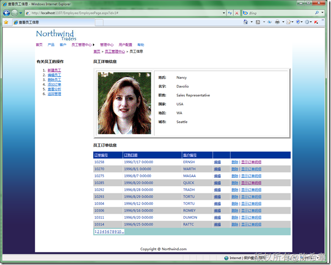](http://images.cnblogs.com/cnblogs_com/chenxizhang/WindowsLiveWriter/MOSS2010VisualStudio201021BusinessConnec_A585/image_2.png) 

  

 我们现在需要实现一个功能就是，希望在SharePoint的页面上可以看到员工的基本信息列表，而且我们不想做复杂的开发，只是希望通过一些配置就能完成。

 好吧，让我们来看看如何实现吧

  

 首先，既然我们不想做复杂的开发，所以，我们会想到能不能直接将数据库的一个表格的数据读取出来作为一个列表呢？

 【注意】这是我们做集成时的最简单原始的做法，直接连数据库。还有另外几种方式，这里先不深入探讨了。

  

 我们可以来看一下这个业务系统的数据库结构

 [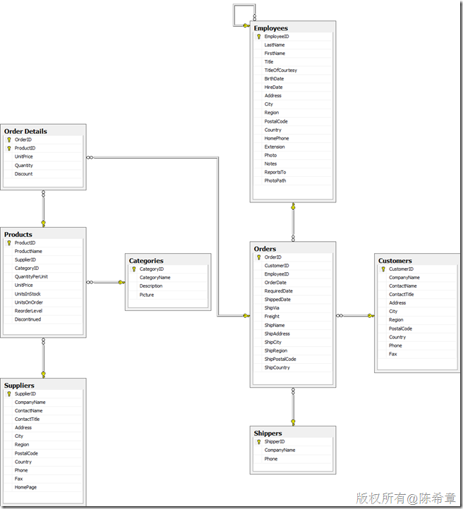](http://images.cnblogs.com/cnblogs_com/chenxizhang/WindowsLiveWriter/MOSS2010VisualStudio201021BusinessConnec_A585/image_4.png) 

  很显然，我们需要使用的是Employees表。

  

 第二步：通过SharePoint Designer(SPD)定义所谓的外部内容类型

 打开SPD,打开某个网站，点击左侧的“External Content Types”

 [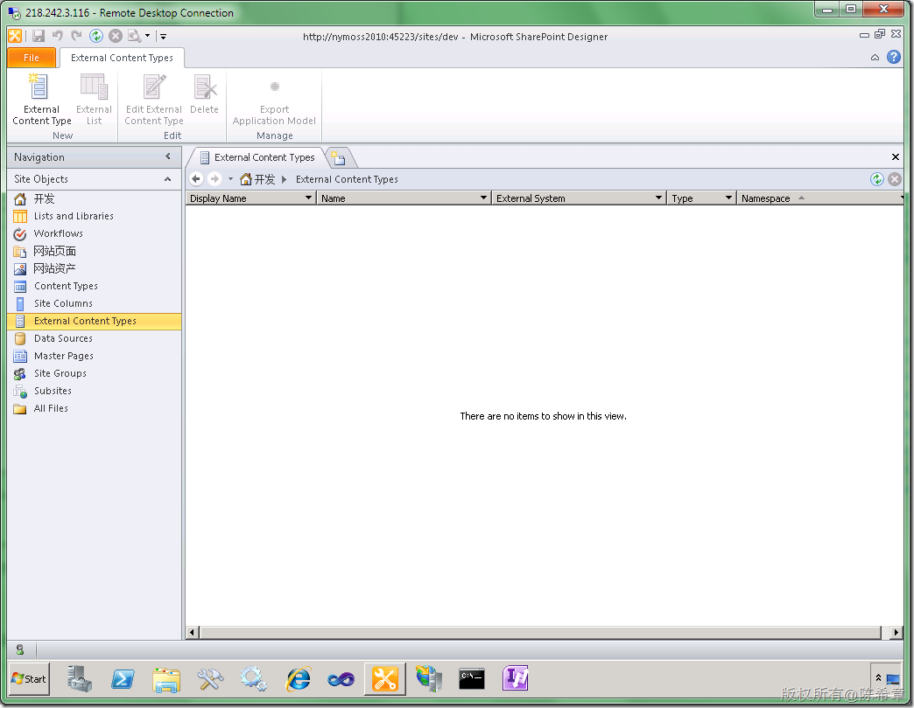](http://images.cnblogs.com/cnblogs_com/chenxizhang/WindowsLiveWriter/MOSS2010VisualStudio201021BusinessConnec_A585/image_6.png) 

 【注意】当前我们还没有定义任何的外部内容类型，所以这里是空白的

 【注意】如果你在这一步问题，请参考

 <http://www.cnblogs.com/chenxizhang/archive/2010/04/29/1723463.html>

  

 点击左上角的“External Content Type”，默认会出现下面这样的界面

 [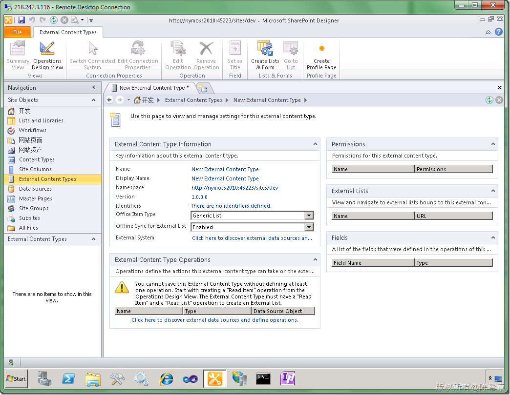](http://images.cnblogs.com/cnblogs_com/chenxizhang/WindowsLiveWriter/MOSS2010VisualStudio201021BusinessConnec_A585/image_8.png) 

 编辑这个页面，使它看起来像下面这样

 [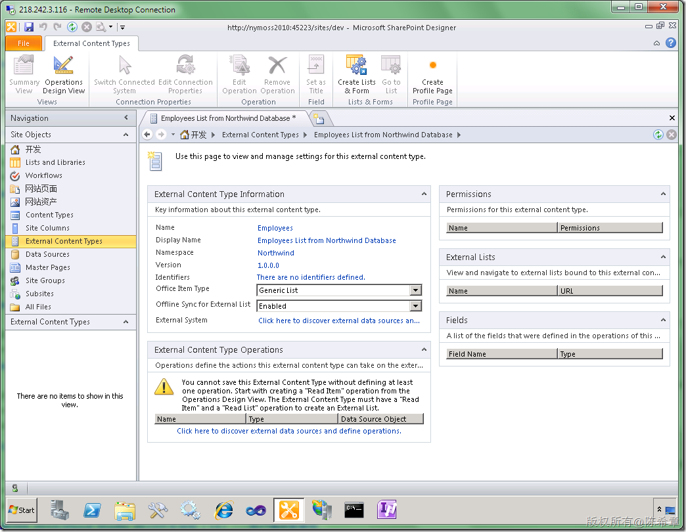](http://images.cnblogs.com/cnblogs_com/chenxizhang/WindowsLiveWriter/MOSS2010VisualStudio201021BusinessConnec_A585/image_10.png) 

 点击“Click here to discover external data sources…”

 [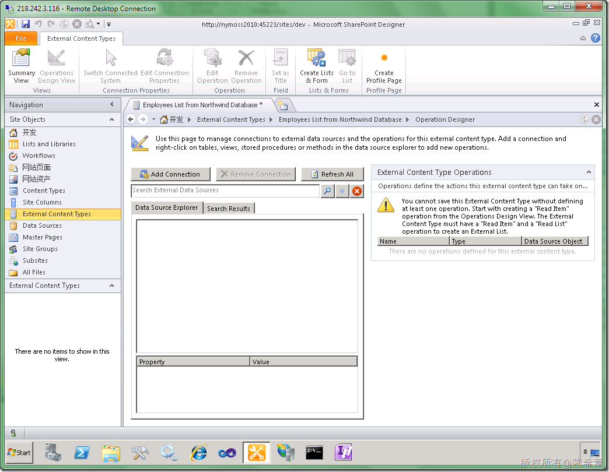](http://images.cnblogs.com/cnblogs_com/chenxizhang/WindowsLiveWriter/MOSS2010VisualStudio201021BusinessConnec_A585/image_12.png) 

 点击"Add Connection"

 [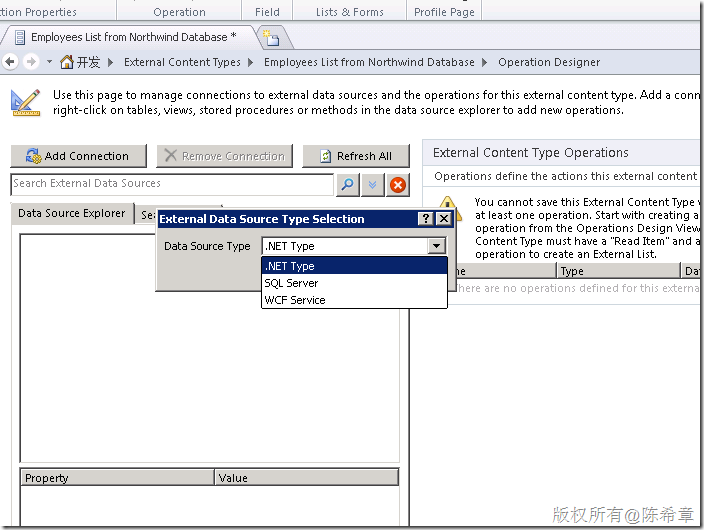](http://images.cnblogs.com/cnblogs_com/chenxizhang/WindowsLiveWriter/MOSS2010VisualStudio201021BusinessConnec_A585/image_14.png) 

 请注意，这里有三种Data Source Type。我们将逐一讲解。这一篇先使用最简单的SQL Server

 [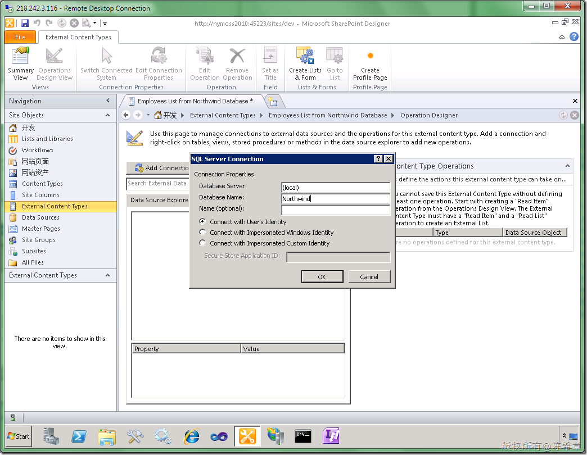](http://images.cnblogs.com/cnblogs_com/chenxizhang/WindowsLiveWriter/MOSS2010VisualStudio201021BusinessConnec_A585/image_16.png) 

     点击“Ok”之后，在Data Source Explorer中会列出该数据库的结构

 [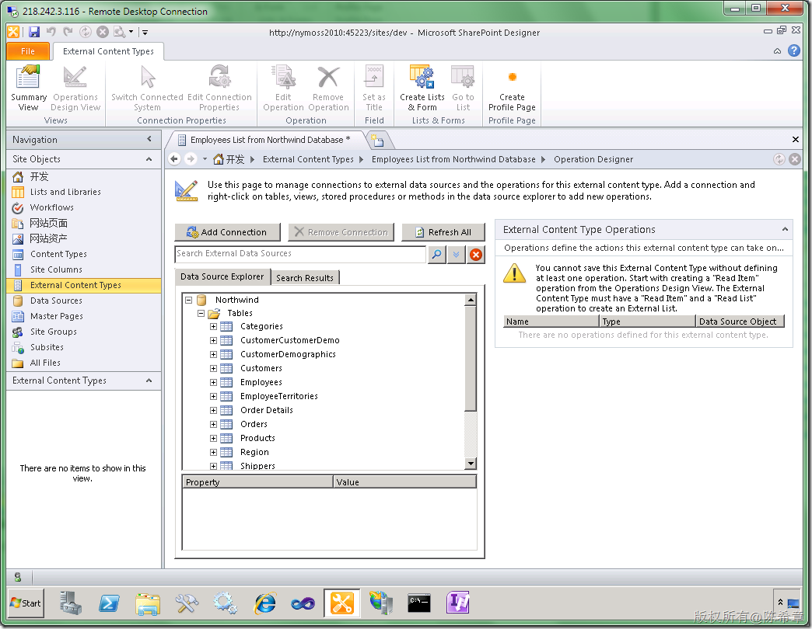](http://images.cnblogs.com/cnblogs_com/chenxizhang/WindowsLiveWriter/MOSS2010VisualStudio201021BusinessConnec_A585/image_18.png) 

 选中“Employees”表，然后点击右键菜单中选择“Create All Operations”

 [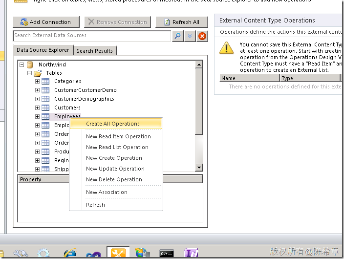](http://images.cnblogs.com/cnblogs_com/chenxizhang/WindowsLiveWriter/MOSS2010VisualStudio201021BusinessConnec_A585/image_20.png) 

 一会儿之后会出现下面这样的窗口

 [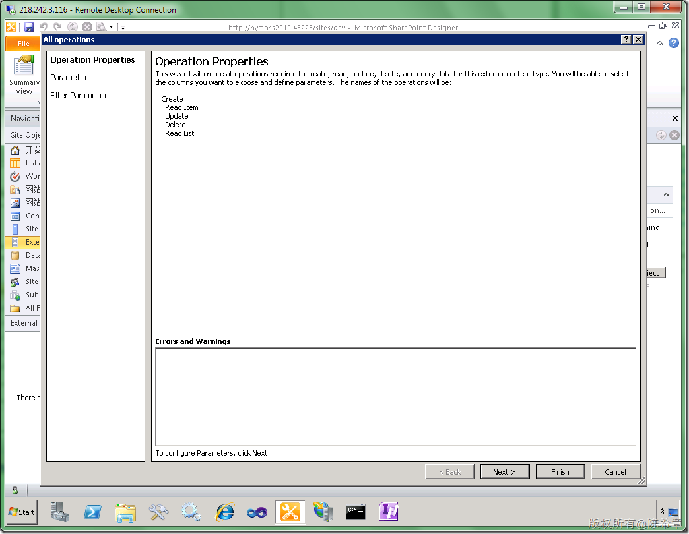](http://images.cnblogs.com/cnblogs_com/chenxizhang/WindowsLiveWriter/MOSS2010VisualStudio201021BusinessConnec_A585/image_22.png) 

 作为第一个演示，我们简单起见，不做其他任何设置了，直接点击“Finish”吧

 [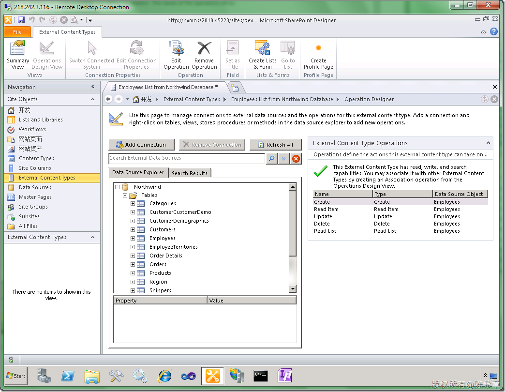](http://images.cnblogs.com/cnblogs_com/chenxizhang/WindowsLiveWriter/MOSS2010VisualStudio201021BusinessConnec_A585/image_24.png) 

 【注意】上图的右侧出现了一些所谓的Operations，其实就是我们经常所说的增删改查。但多了一个，就是ReadItem，这是根据一个ID读取某个特定Item的。

 好，这样，我们这个外部内容类型就做好了。

  

 接下来，我们需要将该内容类型保存起来，并且在页面中使用它。

 要保存当前这个内容类型定义，直接点击SPD顶部的“保存”按钮（或者直接按下CTRL + S ) 即可。只不过，根据服务器性能好坏，这可能会花一些时间。

 【注意】这里插一句话，要玩MOSS 2010，最好真的是8G内存。我现在是4G内存，经常都感觉比较慢。汗一个先  

  

 [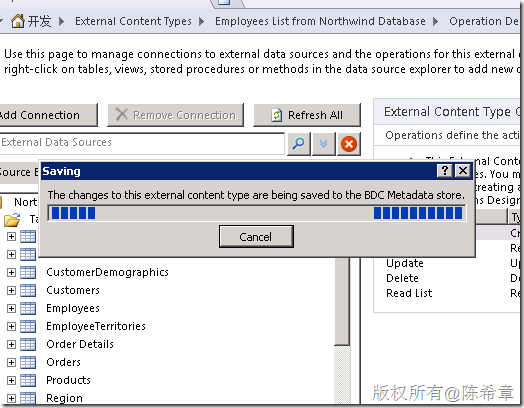](http://images.cnblogs.com/cnblogs_com/chenxizhang/WindowsLiveWriter/MOSS2010VisualStudio201021BusinessConnec_A585/image_26.png) 

      如果保存成功了，就可以进行下一步。我们需要创建一个列表来使用这个内容类型。 

 【注意】关于列表和内容类型之间的关系，如果你不清楚，则可以参考下面这篇文章

 <http://www.cnblogs.com/chenxizhang/archive/2010/04/24/1719467.html>

  

 点击下面的“Create Lists & Form”按钮

 [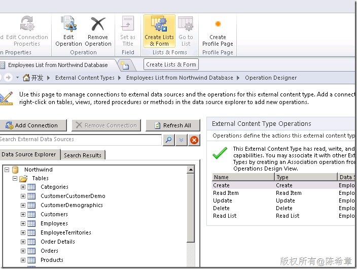](http://images.cnblogs.com/cnblogs_com/chenxizhang/WindowsLiveWriter/MOSS2010VisualStudio201021BusinessConnec_A585/image_28.png)

 [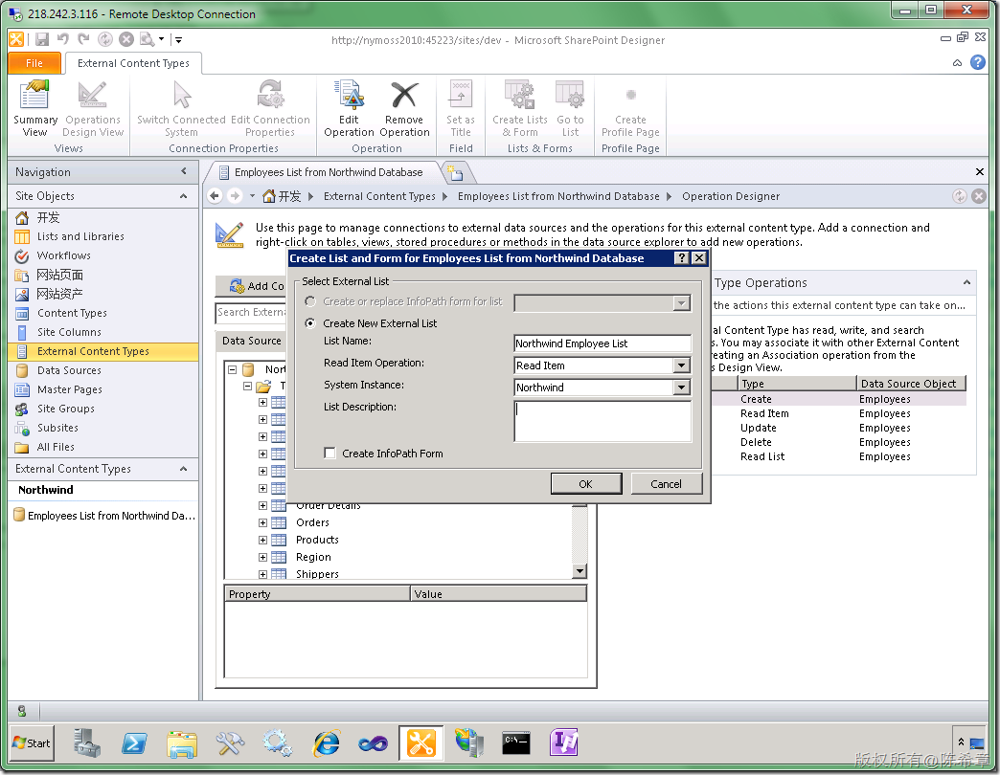](http://images.cnblogs.com/cnblogs_com/chenxizhang/WindowsLiveWriter/MOSS2010VisualStudio201021BusinessConnec_A585/image_30.png) 

 输入List Name，然后点击“OK”，然后又要泡杯咖啡，等它完成即可

 [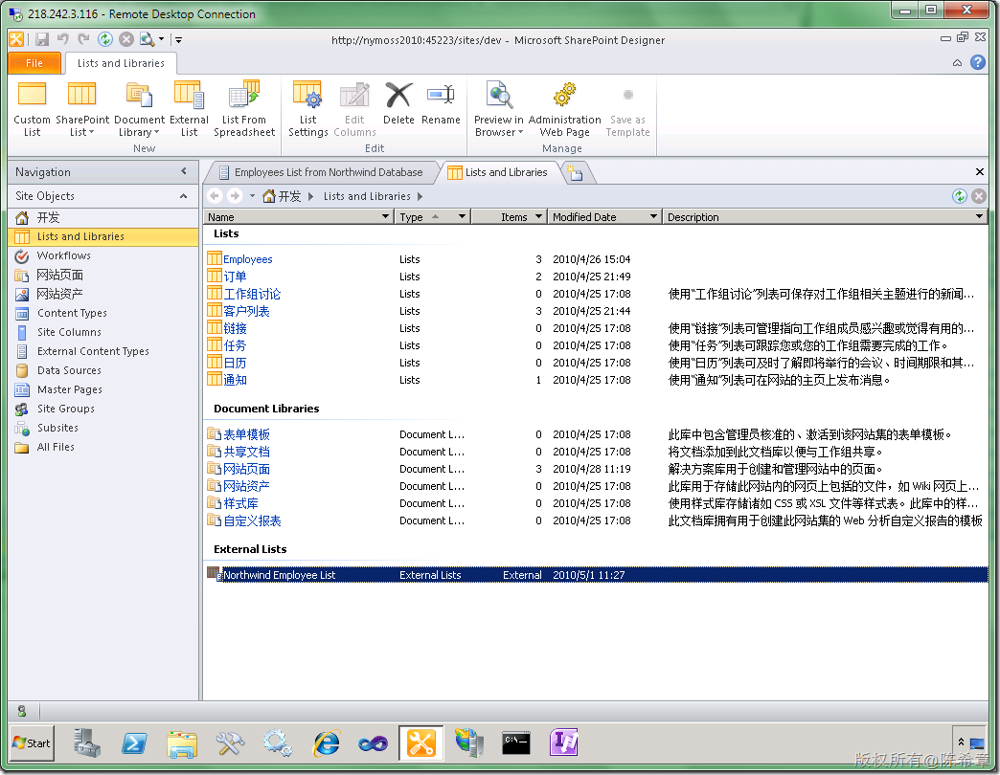](http://images.cnblogs.com/cnblogs_com/chenxizhang/WindowsLiveWriter/MOSS2010VisualStudio201021BusinessConnec_A585/image_32.png) 

 点击“Preview in Broswer”, 这将在浏览器中打开该列表

 [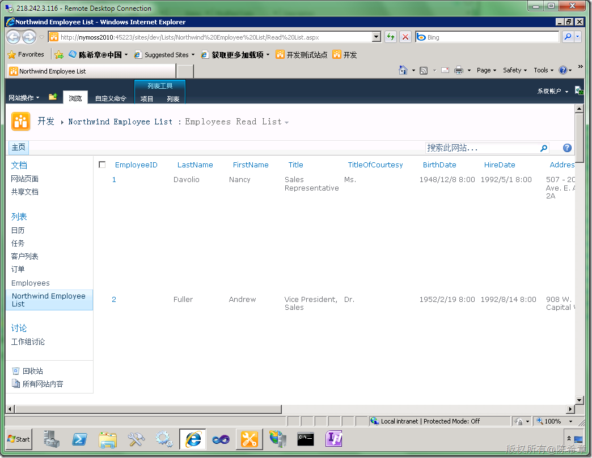](http://images.cnblogs.com/cnblogs_com/chenxizhang/WindowsLiveWriter/MOSS2010VisualStudio201021BusinessConnec_A585/image_34.png) 

 wow，真的读到了我们需要的数据呢，鼓掌～

 我们还可以点击某个员工，查看它的详细信息

 [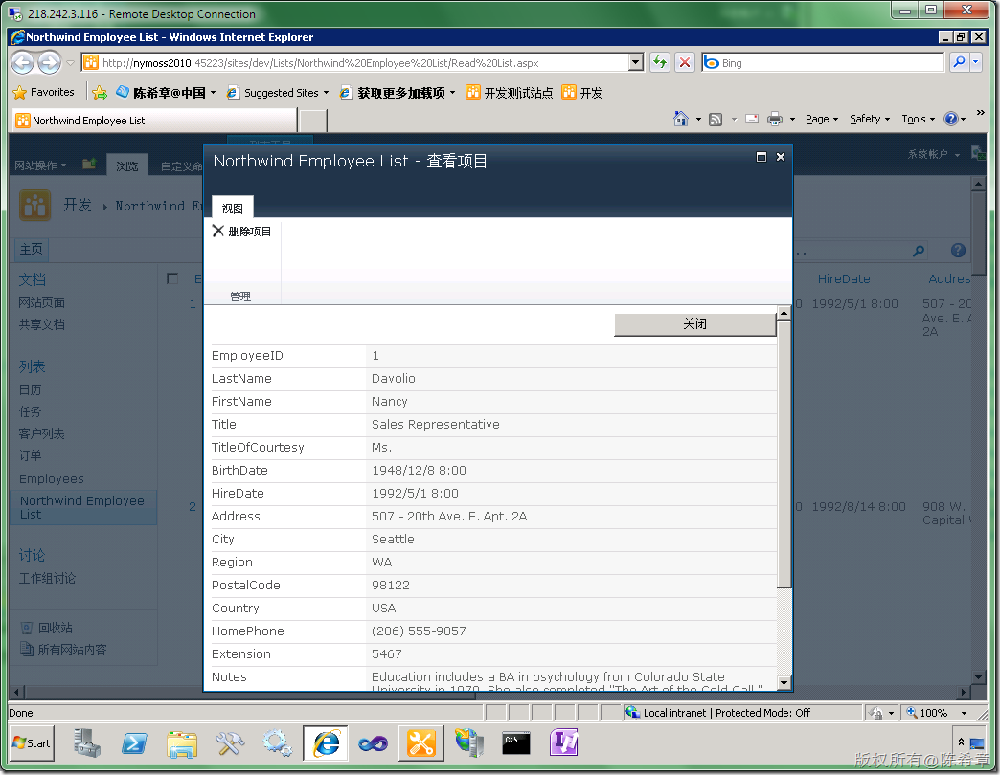](http://images.cnblogs.com/cnblogs_com/chenxizhang/WindowsLiveWriter/MOSS2010VisualStudio201021BusinessConnec_A585/image_36.png) 

 至于其他的操作，例如排序啊，分页啊，创建视图啊，与标准的列表并没有任何差别。例如我们可以将当前视图中变得更加清爽一些（去除掉一些字段，并且按照国家分组）

 [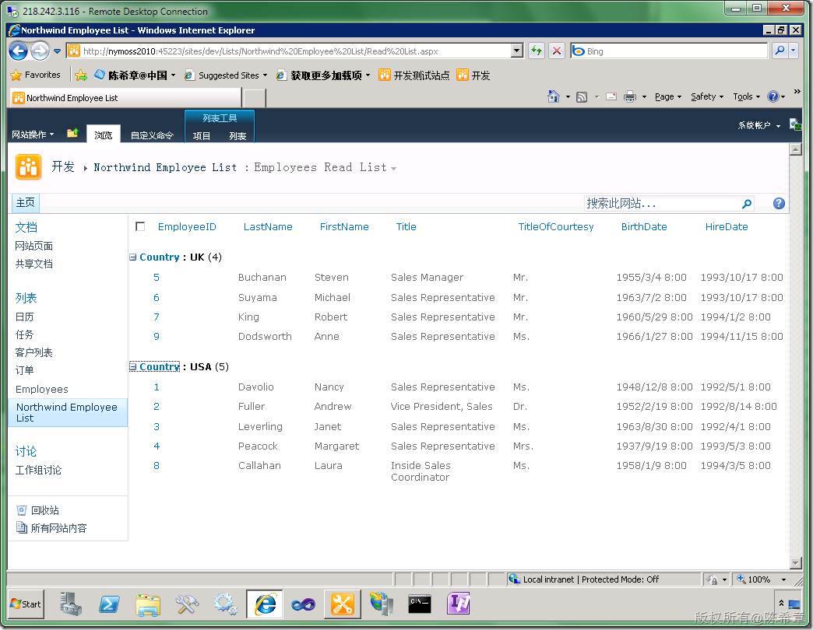](http://images.cnblogs.com/cnblogs_com/chenxizhang/WindowsLiveWriter/MOSS2010VisualStudio201021BusinessConnec_A585/image_38.png) 

 这样看起来是不是很酷呢。你需要做的就是对视图定义做一些修改而已，这个就不赘述了。

  

 还有让你惊奇的在后头呢。在网页中，我们可以查看员工，或者也可以删除（如果你有权限的话）。但是如何创建一个新的员工，或者是编辑一个员工呢？

 这个工作需要通过另外一个工具来实现，就是SharePoint Workspace。这个工具很简单易用，它就是让用户可以在桌面上，而不是网页中访问到SharePoint的内容，而且可以脱机编辑，然后同步等。

 下面是我们在Workspace中打开该列表的样子

 [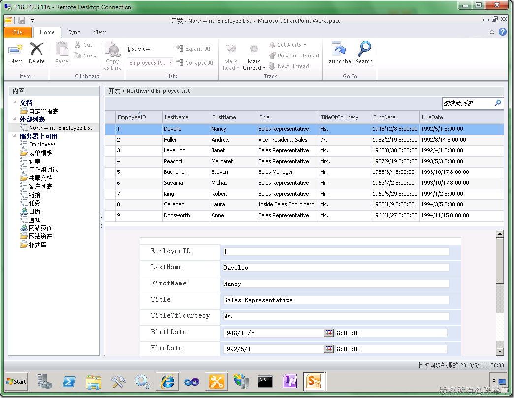](http://images.cnblogs.com/cnblogs_com/chenxizhang/WindowsLiveWriter/MOSS2010VisualStudio201021BusinessConnec_A585/image_40.png) 

 我们可以点击左上角的“New”按钮，添加一个新员工

 [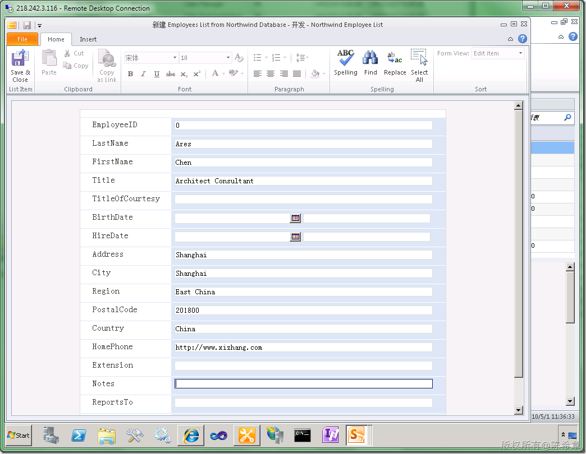](http://images.cnblogs.com/cnblogs_com/chenxizhang/WindowsLiveWriter/MOSS2010VisualStudio201021BusinessConnec_A585/image_42.png) 

 就这么简单，点击“Save &Close”吧

 [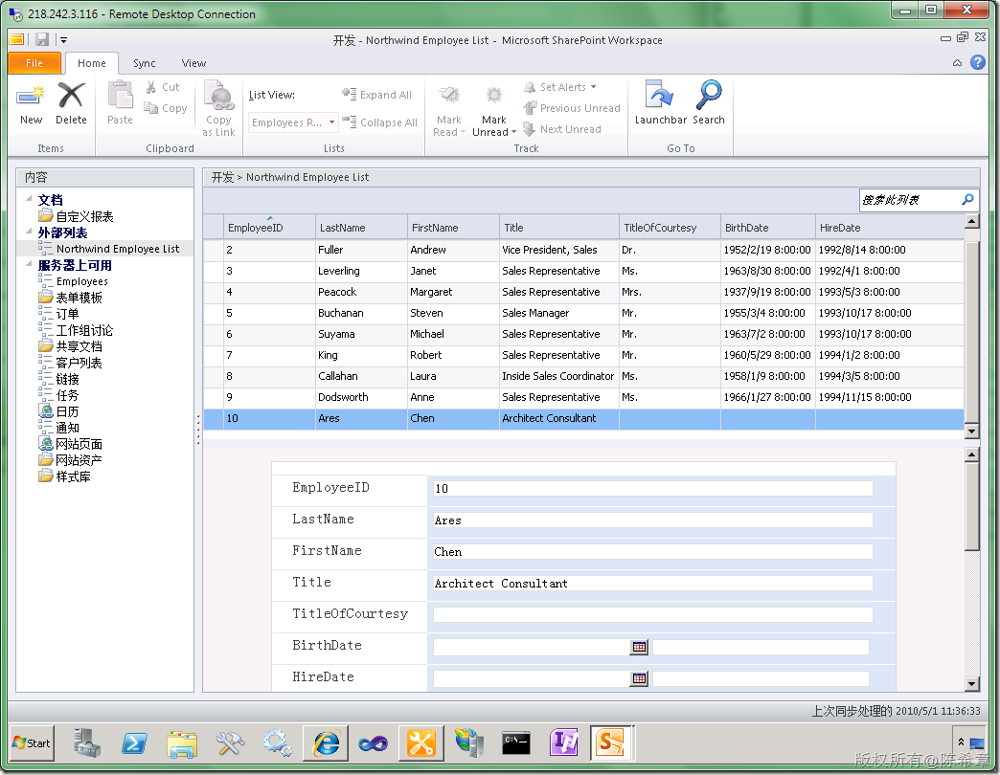](http://images.cnblogs.com/cnblogs_com/chenxizhang/WindowsLiveWriter/MOSS2010VisualStudio201021BusinessConnec_A585/image_44.png) 

 我如果再回到网页中来，就可以看到更新了

 [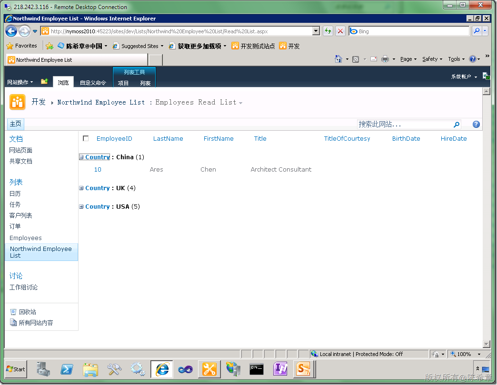](http://images.cnblogs.com/cnblogs_com/chenxizhang/WindowsLiveWriter/MOSS2010VisualStudio201021BusinessConnec_A585/image_46.png) 

 any question? 

 好吧，如果有了BCS，那么以后是不是只要简单地做一个数据库，不需要什么开发，就可以做一个业务系统呢？因为你确实可以看到，增删改查都能实现了。

  

 总结：

 这一篇文章，我们通过一个简单的例子演示了如何使用BCS服务的功能，通过配置而不是编程的方式来实现基于数据库级别的集成。

 从这个例子，你不难看出，BCS确实会带来一些革命，我已经感觉到某些人的心脏在隐隐作痛，而另外一部分人的脸上则露出了意味深长、诡异莫测的淡淡笑容

 【注意】BCS还有很多东西，诸如安全性，筛选等等。以后有机会再逐一展开，本系列不会太过深入到每一个细节。

  

  

 下一篇，我们将介绍如何Visual  Studio来实现自定义的BDC Model，敬请期待吧

