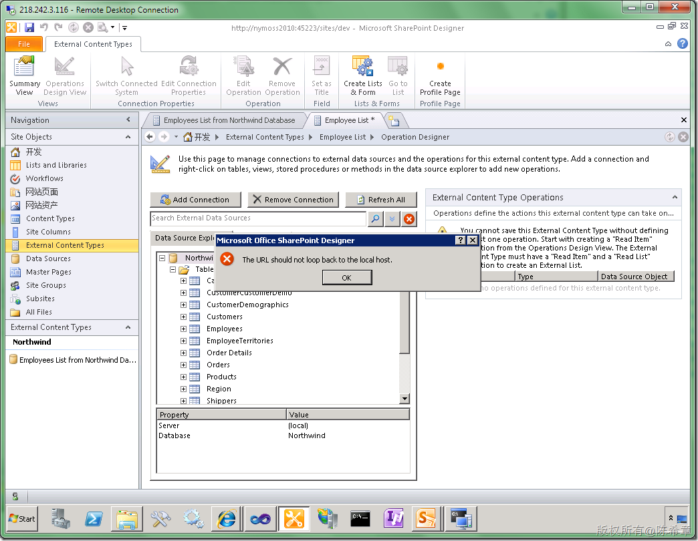

# MOSS 2010:Visual Studio 2010开发体验（22）——利用BCS和WCF进行应用程序集成 
> 原文发表于 2010-05-01, 地址: http://www.cnblogs.com/chenxizhang/archive/2010/05/01/1725576.html 


[上一篇](http://www.cnblogs.com/chenxizhang/archive/2010/05/01/1725531.html)，我们讲到了如何利用BCS服务，直接连接到SQL Server数据库实现一些简单的应用程序集成的场景。看起来很不错，不是吗？

 但是，事实上，直接连接到数据库也许有时候是不可能实现的任务，很多系统并不可能直接将数据库暴露出来的。地球人都知道，那样的风险极高。

 那么，比较可行的是什么方式呢？我觉得很多系统倒是有公开一些服务，这些服务有的使用Web Service实现，有的不是。这都不要紧。总之，由这些服务去连接数据库，而我们做集成的时候，并不需要知道数据库在哪里？以及什么结构等等信息。

  

 这一篇，我们讲解使用WCF作为服务，实现应用程序集成的简单步骤

  

 1. 创建一个测试用的服务
-------------

 为了快速开发，我们会将该服务宿主在一个Web Application中，所以首先我们需要创建这个Application

 [](http://images.cnblogs.com/cnblogs_com/chenxizhang/WindowsLiveWriter/MOSS2010VisualStudio201022BCSWCF_C36F/image_2.png) 

 默认会有下面这样的项目结构

 [](http://images.cnblogs.com/cnblogs_com/chenxizhang/WindowsLiveWriter/MOSS2010VisualStudio201022BCSWCF_C36F/image_4.png) 

  我们无需修改default.aspx.因为我们根本不使用它

 为了读取数据库，我们可以创建一个LINQ to SQL数据模型

 [](http://images.cnblogs.com/cnblogs_com/chenxizhang/WindowsLiveWriter/MOSS2010VisualStudio201022BCSWCF_C36F/image_6.png) 

 [](http://images.cnblogs.com/cnblogs_com/chenxizhang/WindowsLiveWriter/MOSS2010VisualStudio201022BCSWCF_C36F/image_8.png) 

 我们可以将Northwind数据库的连接定义在Server Explorer中，并且将Employees表拖拽到这个设计器中来

 [](http://images.cnblogs.com/cnblogs_com/chenxizhang/WindowsLiveWriter/MOSS2010VisualStudio201022BCSWCF_C36F/image_10.png) 

 保存该模型。下面我们就来添加我们的服务了

 [](http://images.cnblogs.com/cnblogs_com/chenxizhang/WindowsLiveWriter/MOSS2010VisualStudio201022BCSWCF_C36F/image_12.png) 

 [](http://images.cnblogs.com/cnblogs_com/chenxizhang/WindowsLiveWriter/MOSS2010VisualStudio201022BCSWCF_C36F/image_14.png) 

 修改这个IEmployeeService成下面这样


```
using System;
using System.Collections.Generic;
using System.Linq;
using System.Runtime.Serialization;
using System.ServiceModel;
using System.Text;

namespace NorthwindService
{
    // NOTE: You can use the "Rename" command on the "Refactor" menu to change the interface name "IEmployeeService" in both code and config file together.
    [ServiceContract]
    public interface IEmployeeService
    {
        [OperationContract]
        Employee[] GetEmployeeList();

        [OperationContract]
        Employee GetEmployeeItem(int id);
    }
}

```

[](http://images.cnblogs.com/cnblogs_com/chenxizhang/WindowsLiveWriter/MOSS2010VisualStudio201022BCSWCF_C36F/image_16.png) 


接下来修改EmployeeService.svc.cs


```
using System;
using System.Collections.Generic;
using System.Linq;
using System.Runtime.Serialization;
using System.ServiceModel;
using System.Text;

namespace NorthwindService
{
    // NOTE: You can use the "Rename" command on the "Refactor" menu to change the class name "EmployeeService" in code, svc and config file together.
    public class EmployeeService : IEmployeeService
    {

        public Employee[] GetEmployeeList()
        {
            NorthwindDataContext context = new NorthwindDataContext();
            return context.Employees.ToArray();
        }

        public Employee GetEmployeeItem(int id)
        {
            NorthwindDataContext context = new NorthwindDataContext();
            return context.Employees.FirstOrDefault(e => e.EmployeeID == id);
        }
    }
}

```

 


[](http://images.cnblogs.com/cnblogs_com/chenxizhang/WindowsLiveWriter/MOSS2010VisualStudio201022BCSWCF_C36F/image_20.png)
.csharpcode, .csharpcode pre
{
 font-size: small;
 color: black;
 font-family: consolas, "Courier New", courier, monospace;
 background-color: #ffffff;
 /*white-space: pre;*/
}
.csharpcode pre { margin: 0em; }
.csharpcode .rem { color: #008000; }
.csharpcode .kwrd { color: #0000ff; }
.csharpcode .str { color: #006080; }
.csharpcode .op { color: #0000c0; }
.csharpcode .preproc { color: #cc6633; }
.csharpcode .asp { background-color: #ffff00; }
.csharpcode .html { color: #800000; }
.csharpcode .attr { color: #ff0000; }
.csharpcode .alt 
{
 background-color: #f4f4f4;
 width: 100%;
 margin: 0em;
}
.csharpcode .lnum { color: #606060; }


这样就好了，下面我们可以测试该服务了


选中“EmployeeService.svc”这个文件，右键，


[](http://images.cnblogs.com/cnblogs_com/chenxizhang/WindowsLiveWriter/MOSS2010VisualStudio201022BCSWCF_C36F/image_22.png) 


如果看到下面这样的界面，则基本上是表示服务创建没有什么大的问题


[](http://images.cnblogs.com/cnblogs_com/chenxizhang/WindowsLiveWriter/MOSS2010VisualStudio201022BCSWCF_C36F/image_24.png) 


点击<http://localhost:8027/EmployeeService.svc?wsdl>这个链接


 


[](http://images.cnblogs.com/cnblogs_com/chenxizhang/WindowsLiveWriter/MOSS2010VisualStudio201022BCSWCF_C36F/image_26.png) 


我们可以用一个工具来测试一下到底能不能返回正确的结果


[](http://images.cnblogs.com/cnblogs_com/chenxizhang/WindowsLiveWriter/MOSS2010VisualStudio201022BCSWCF_C36F/image_28.png) 


[](http://images.cnblogs.com/cnblogs_com/chenxizhang/WindowsLiveWriter/MOSS2010VisualStudio201022BCSWCF_C36F/image_30.png) 


点击“File”=》”Add Service”,然后输入服务地址


[](http://images.cnblogs.com/cnblogs_com/chenxizhang/WindowsLiveWriter/MOSS2010VisualStudio201022BCSWCF_C36F/image_32.png) 


【注意】你的地址可能和我不一样，主要检查端口号


[](http://images.cnblogs.com/cnblogs_com/chenxizhang/WindowsLiveWriter/MOSS2010VisualStudio201022BCSWCF_C36F/image_34.png) 


双击GetEmployeeItem，输入一个id的值（例如10），然后点击 ”Invoke“按钮


[](http://images.cnblogs.com/cnblogs_com/chenxizhang/WindowsLiveWriter/MOSS2010VisualStudio201022BCSWCF_C36F/image_36.png) 


好，如果是这样的话，则表示该服务是能够正常工作的。


 


2. 创建BCS 内容类型，使用该服务
-------------------


既然服务准备好了，下面我们就来看看如何在BCS外部内容类型中使用该服务


首先，仍然是在下面的界面中，点击左上角的 “External Content Type”按钮


[](http://images.cnblogs.com/cnblogs_com/chenxizhang/WindowsLiveWriter/MOSS2010VisualStudio201022BCSWCF_C36F/image_38.png) 


然后做一些必要的修改，使界面看起来像下面这样


[](http://images.cnblogs.com/cnblogs_com/chenxizhang/WindowsLiveWriter/MOSS2010VisualStudio201022BCSWCF_C36F/image_40.png) 


仍然是点击”Click here to discover external data sources …“


[](http://images.cnblogs.com/cnblogs_com/chenxizhang/WindowsLiveWriter/MOSS2010VisualStudio201022BCSWCF_C36F/image_42.png) 


再次点击 “Add Connection”


[](http://images.cnblogs.com/cnblogs_com/chenxizhang/WindowsLiveWriter/MOSS2010VisualStudio201022BCSWCF_C36F/image_44.png) 


将Type设置为WCF Service


[](http://images.cnblogs.com/cnblogs_com/chenxizhang/WindowsLiveWriter/MOSS2010VisualStudio201022BCSWCF_C36F/image_46.png) 


Ooooop ,我收到了一个错误


[](http://images.cnblogs.com/cnblogs_com/chenxizhang/WindowsLiveWriter/MOSS2010VisualStudio201022BCSWCF_C36F/image_48.png) 


它的意思是说，不能使用localhost这个写法。好吧，我们从善如流吧。我们可以将网站发布到IIS


[](http://images.cnblogs.com/cnblogs_com/chenxizhang/WindowsLiveWriter/MOSS2010VisualStudio201022BCSWCF_C36F/image_54.png)


【注意】这个发布向导是VS2010新增的，还可以


 


发布之后，应该可以看到IIS中如下的效果


[](http://images.cnblogs.com/cnblogs_com/chenxizhang/WindowsLiveWriter/MOSS2010VisualStudio201022BCSWCF_C36F/image_56.png) 


然后，我们确认在浏览器中，可以通过下面的地址访问到服务


[http://nymoss2010/NorthwindServices/EmployeeService.svc](http://nymoss2010/NorthwindServices/EmployeeService.svc "http://nymoss2010/NorthwindServices/EmployeeService.svc")


[](http://images.cnblogs.com/cnblogs_com/chenxizhang/WindowsLiveWriter/MOSS2010VisualStudio201022BCSWCF_C36F/image_58.png) 


修改下面的地址


[](http://images.cnblogs.com/cnblogs_com/chenxizhang/WindowsLiveWriter/MOSS2010VisualStudio201022BCSWCF_C36F/image_60.png) 


但是却仍然是报告错误


[](http://images.cnblogs.com/cnblogs_com/chenxizhang/WindowsLiveWriter/MOSS2010VisualStudio201022BCSWCF_C36F/image_62.png) 


My God ](http://images.cnblogs.com/cnblogs_com/chenxizhang/WindowsLiveWriter/MOSS2010VisualStudio201022BCSWCF_C36F/%E5%A4%AA%E4%BC%A4%E5%BF%83%E4%BA%86_2.gif) 好吧，再大的困难也难不倒英雄的中华儿女们。为了排除到底是不是IIS的问题，我们可以单独来做一个宿主好了。


 


[](http://images.cnblogs.com/cnblogs_com/chenxizhang/WindowsLiveWriter/MOSS2010VisualStudio201022BCSWCF_C36F/image_64.png) 


添加引用


[](http://images.cnblogs.com/cnblogs_com/chenxizhang/WindowsLiveWriter/MOSS2010VisualStudio201022BCSWCF_C36F/image_66.png) 


[](http://images.cnblogs.com/cnblogs_com/chenxizhang/WindowsLiveWriter/MOSS2010VisualStudio201022BCSWCF_C36F/image_68.png) 


在Main方法中编写如下代码


```
using System;
using System.Collections.Generic;
using System.Linq;
using System.Text;
using System.ServiceModel;
using NorthwindService;
using System.ServiceModel.Description;

namespace EmployeeServiceHost
{
    class Program
    {
        static void Main(string[] args)
        {
            using (ServiceHost host = new ServiceHost(
                typeof(EmployeeService), new Uri("http://nymoss2010/NorthwindService")))
            {
                host.AddServiceEndpoint(
                    typeof(IEmployeeService).FullName,
                    new BasicHttpBinding(),
                    "");


                ServiceMetadataBehavior behavior = new ServiceMetadataBehavior();
                behavior.HttpGetEnabled = true;
                host.Description.Behaviors.Add(behavior);

                host.AddServiceEndpoint(
                    "IMetadataExchange",
                    MetadataExchangeBindings.CreateMexHttpBinding(),
                    "mex");

                host.Open();
                Console.WriteLine("Server is ready");
                Console.Read();

            }
        }
    }
}

```

同时，在这个宿主中添加一个配置文件app.config，编辑内容如下
.csharpcode, .csharpcode pre
{
 font-size: small;
 color: black;
 font-family: consolas, "Courier New", courier, monospace;
 background-color: #ffffff;
 /*white-space: pre;*/
}
.csharpcode pre { margin: 0em; }
.csharpcode .rem { color: #008000; }
.csharpcode .kwrd { color: #0000ff; }
.csharpcode .str { color: #006080; }
.csharpcode .op { color: #0000c0; }
.csharpcode .preproc { color: #cc6633; }
.csharpcode .asp { background-color: #ffff00; }
.csharpcode .html { color: #800000; }
.csharpcode .attr { color: #ff0000; }
.csharpcode .alt 
{
 background-color: #f4f4f4;
 width: 100%;
 margin: 0em;
}
.csharpcode .lnum { color: #606060; }


<?xml version="1.0" encoding="utf-8" ?>  
<configuration>  
  <connectionStrings>  
    <add name="NorthwindConnectionString" connectionString="Data Source=(local);Initial Catalog=Northwind;Integrated Security=True"  
        providerName="System.Data.SqlClient" />  
  </connectionStrings>  
</configuration>
 


将该程序启动为调试状态


[](http://images.cnblogs.com/cnblogs_com/chenxizhang/WindowsLiveWriter/MOSS2010VisualStudio201022BCSWCF_C36F/image_70.png) 


然后可以通过下面地址访问到该服务


[](http://images.cnblogs.com/cnblogs_com/chenxizhang/WindowsLiveWriter/MOSS2010VisualStudio201022BCSWCF_C36F/image_72.png) 


然后再去添加该服务吧


[](http://images.cnblogs.com/cnblogs_com/chenxizhang/WindowsLiveWriter/MOSS2010VisualStudio201022BCSWCF_C36F/image_74.png) 


【注意】Service Metadata URL是有一个?wsdl的后缀的


[](http://images.cnblogs.com/cnblogs_com/chenxizhang/WindowsLiveWriter/MOSS2010VisualStudio201022BCSWCF_C36F/image_76.png) 


【注意】我们发现现在是可以了。所以刚才那个应该是IIS某些地方出了问题，也可能是因为beta版的缘故吧。暂时不理会它。


 


选中 “GetEmployeeList”，右键，选择”New Read List Operation“


[](http://images.cnblogs.com/cnblogs_com/chenxizhang/WindowsLiveWriter/MOSS2010VisualStudio201022BCSWCF_C36F/image_82.png) 


[](http://images.cnblogs.com/cnblogs_com/chenxizhang/WindowsLiveWriter/MOSS2010VisualStudio201022BCSWCF_C36F/image_84.png) 


点击Next


[](http://images.cnblogs.com/cnblogs_com/chenxizhang/WindowsLiveWriter/MOSS2010VisualStudio201022BCSWCF_C36F/image_86.png) 


继续Next


[](http://images.cnblogs.com/cnblogs_com/chenxizhang/WindowsLiveWriter/MOSS2010VisualStudio201022BCSWCF_C36F/image_88.png) 


选中”EmployeeId“，将其Map toIdentifier


[](http://images.cnblogs.com/cnblogs_com/chenxizhang/WindowsLiveWriter/MOSS2010VisualStudio201022BCSWCF_C36F/image_90.png) 


点击Finish完成该Operation的定义


[](http://images.cnblogs.com/cnblogs_com/chenxizhang/WindowsLiveWriter/MOSS2010VisualStudio201022BCSWCF_C36F/image_92.png) 


然后，我们再 选中GetEmployeeItem，右键，New Read Item Operation


[](http://images.cnblogs.com/cnblogs_com/chenxizhang/WindowsLiveWriter/MOSS2010VisualStudio201022BCSWCF_C36F/image_94.png) 


[](http://images.cnblogs.com/cnblogs_com/chenxizhang/WindowsLiveWriter/MOSS2010VisualStudio201022BCSWCF_C36F/image_96.png) 


[](http://images.cnblogs.com/cnblogs_com/chenxizhang/WindowsLiveWriter/MOSS2010VisualStudio201022BCSWCF_C36F/image_98.png) 


【注意】这里也需要Map to identifier


[](http://images.cnblogs.com/cnblogs_com/chenxizhang/WindowsLiveWriter/MOSS2010VisualStudio201022BCSWCF_C36F/image_100.png) 


[](http://images.cnblogs.com/cnblogs_com/chenxizhang/WindowsLiveWriter/MOSS2010VisualStudio201022BCSWCF_C36F/image_102.png) 


保存（CTRL+S) ,然后点击“Create Lists & Form”按钮


[](http://images.cnblogs.com/cnblogs_com/chenxizhang/WindowsLiveWriter/MOSS2010VisualStudio201022BCSWCF_C36F/image_104.png) 


 


创建成功之后，我们兴冲冲地去网页中查看这个列表，却发现如下的错误


[](http://images.cnblogs.com/cnblogs_com/chenxizhang/WindowsLiveWriter/MOSS2010VisualStudio201022BCSWCF_C36F/image_106.png) 


这是好事多磨啊，[](http://images.cnblogs.com/cnblogs_com/chenxizhang/WindowsLiveWriter/MOSS2010VisualStudio201022BCSWCF_C36F/%E5%95%8A_2.gif)  focus，focus……. 继续排除错误


我用之前用过的一个工具，来确认一下方法哪里出了问题。我发现果然是那个GetEmployeeList出现了问题


[](http://images.cnblogs.com/cnblogs_com/chenxizhang/WindowsLiveWriter/MOSS2010VisualStudio201022BCSWCF_C36F/image_108.png) 


但是，GetEmployeeitem却是可以返回的


[](http://images.cnblogs.com/cnblogs_com/chenxizhang/WindowsLiveWriter/MOSS2010VisualStudio201022BCSWCF_C36F/image_110.png) 


那么，这说明什么问题呢？我联想到员工表是有一个相片字段的，而相片的长度是很长的，应该是总的数据量超过了WCF的默认限制（64KB）所导致的问题


 


为了验证我的想法，我修改一下源代码


```
        public Employee[] GetEmployeeList()
        {
            //NorthwindDataContext context = new NorthwindDataContext();
            //return context.Employees.ToArray();
            return new Employee[]{
                new Employee(){EmployeeID=1,FirstName="Ares",LastName="Chen"}
            };
        }

```


.csharpcode, .csharpcode pre
{
 font-size: small;
 color: black;
 font-family: consolas, "Courier New", courier, monospace;
 background-color: #ffffff;
 /*white-space: pre;*/
}
.csharpcode pre { margin: 0em; }
.csharpcode .rem { color: #008000; }
.csharpcode .kwrd { color: #0000ff; }
.csharpcode .str { color: #006080; }
.csharpcode .op { color: #0000c0; }
.csharpcode .preproc { color: #cc6633; }
.csharpcode .asp { background-color: #ffff00; }
.csharpcode .html { color: #800000; }
.csharpcode .attr { color: #ff0000; }
.csharpcode .alt 
{
 background-color: #f4f4f4;
 width: 100%;
 margin: 0em;
}
.csharpcode .lnum { color: #606060; }


然后再测试


[](http://images.cnblogs.com/cnblogs_com/chenxizhang/WindowsLiveWriter/MOSS2010VisualStudio201022BCSWCF_C36F/image_112.png) 


现在就可以正常返回了。所以，我们如果回到网页中去，刷新列表，应该也是可以的


[](http://images.cnblogs.com/cnblogs_com/chenxizhang/WindowsLiveWriter/MOSS2010VisualStudio201022BCSWCF_C36F/image_114.png) 


[](http://images.cnblogs.com/cnblogs_com/chenxizhang/WindowsLiveWriter/MOSS2010VisualStudio201022BCSWCF_C36F/image_116.png) 


为了避免图片导致数据太大，我们修改了代码如下。


```
using System;
using System.Collections.Generic;
using System.Linq;
using System.Runtime.Serialization;
using System.ServiceModel;
using System.Text;

namespace NorthwindService
{
    // NOTE: You can use the "Rename" command on the "Refactor" menu to change the class name "EmployeeService" in code, svc and config file together.
    public class EmployeeService : IEmployeeService
    {

        public Employee[] GetEmployeeList()
        {
            NorthwindDataContext ctx = new NorthwindDataContext();
            List<Employee> result = new List<Employee>();
            foreach (var e in ctx.Employees)
            {
                result.Add(new Employee
                        {
                            EmployeeID = e.EmployeeID,
                            FirstName = e.FirstName,
                            LastName = e.LastName,
                            Country = e.Country,
                            Region = e.Region,
                            City = e.City
                        });

            }
            return result.ToArray();

        }

        public Employee GetEmployeeItem(int id)
        {
            NorthwindDataContext context = new NorthwindDataContext();
            var e = context.Employees.FirstOrDefault(emp => emp.EmployeeID == id);

            return new Employee
                        {
                            EmployeeID = e.EmployeeID,
                            FirstName = e.FirstName,
                            LastName = e.LastName,
                            Country = e.Country,
                            Region = e.Region,
                            City = e.City
                        };

                       
            
        }
    }
}

```

.csharpcode, .csharpcode pre
{
 font-size: small;
 color: black;
 font-family: consolas, "Courier New", courier, monospace;
 background-color: #ffffff;
 /*white-space: pre;*/
}
.csharpcode pre { margin: 0em; }
.csharpcode .rem { color: #008000; }
.csharpcode .kwrd { color: #0000ff; }
.csharpcode .str { color: #006080; }
.csharpcode .op { color: #0000c0; }
.csharpcode .preproc { color: #cc6633; }
.csharpcode .asp { background-color: #ffff00; }
.csharpcode .html { color: #800000; }
.csharpcode .attr { color: #ff0000; }
.csharpcode .alt 
{
 background-color: #f4f4f4;
 width: 100%;
 margin: 0em;
}
.csharpcode .lnum { color: #606060; }

 


[](http://images.cnblogs.com/cnblogs_com/chenxizhang/WindowsLiveWriter/MOSS2010VisualStudio201022BCSWCF_C36F/image_118.png) 


[](http://images.cnblogs.com/cnblogs_com/chenxizhang/WindowsLiveWriter/MOSS2010VisualStudio201022BCSWCF_C36F/image_120.png) 


 


【注意】当然，有可以通过调整WCF的binding的一些参数来让它可以传输更多数据量，那属于是WCF本身的技术。大家有兴趣可以参考一下


<http://msdn.microsoft.com/en-us/library/system.servicemodel.basichttpbinding.maxbuffersize.aspx>


 


总结：这一篇文章讲解了如何结合WCF技术实现应用程序集成设计。这是比直接访问数据库要灵活得多的一种方案。


如你所见，我在写这个文档的时候，估计暴露出来了一些错误的场景，这可以帮助大家更好地学习和掌握有关的技术。


