# MOSS 2010:Visual Studio 2010开发体验（23）——编写自定义的BCS连接器 
> 原文发表于 2010-05-01, 地址: http://www.cnblogs.com/chenxizhang/archive/2010/05/01/1725711.html 

前面我们用了两个篇幅比较详细地介绍了BCS结合SQL Srever和WCF实现应用程序集成的场景和典型做法。

 他们的链接分别是

 * BCS & WCF <http://www.cnblogs.com/chenxizhang/archive/2010/05/01/1725576.html>* BCS & SQL <http://www.cnblogs.com/chenxizhang/archive/2010/05/01/1725531.html>

 我们都还记得，在创建所谓外部内容类型的时候，会让我们添加连接，而连接有三种类型，除了上面这两种，还有一种比较特殊的。如下图所示

 [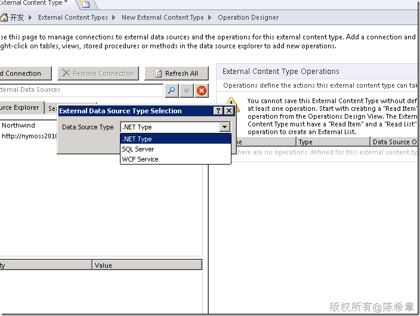](http://images.cnblogs.com/cnblogs_com/chenxizhang/WindowsLiveWriter/MOSS2010VisualStudio201023BCS_FD50/image_2.png) 

 对，就是所谓的.NET Type。这到底是什么意思，然后又是怎么使用的呢？

 我们不妨就选中它，然后点击Ok

 [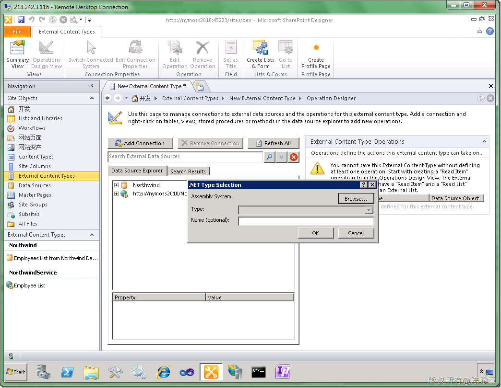](http://images.cnblogs.com/cnblogs_com/chenxizhang/WindowsLiveWriter/MOSS2010VisualStudio201023BCS_FD50/image_4.png) 

 哦，它是让我们选择一个程序集。尝试点击“Browse”

  

 我们发现，虽然确实会出来一个窗口，但下拉列表中并没有任何可以选择的Assembly。这一点都不奇怪，因为我们确实没有为它编写任何的东西。而这正是这篇文章要讲解的内容。

 那就让我们开始吧

  

 1. 创建一个Business Data Conectivity Model
--------------------------------------

 [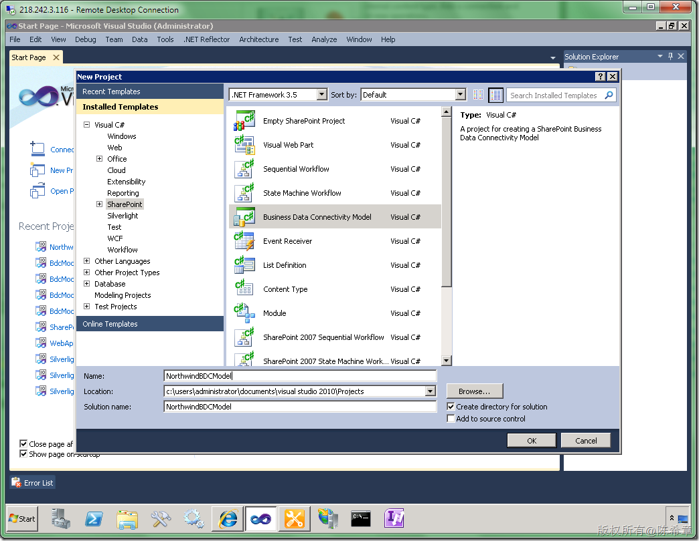](http://images.cnblogs.com/cnblogs_com/chenxizhang/WindowsLiveWriter/MOSS2010VisualStudio201023BCS_FD50/image_8.png) 

 [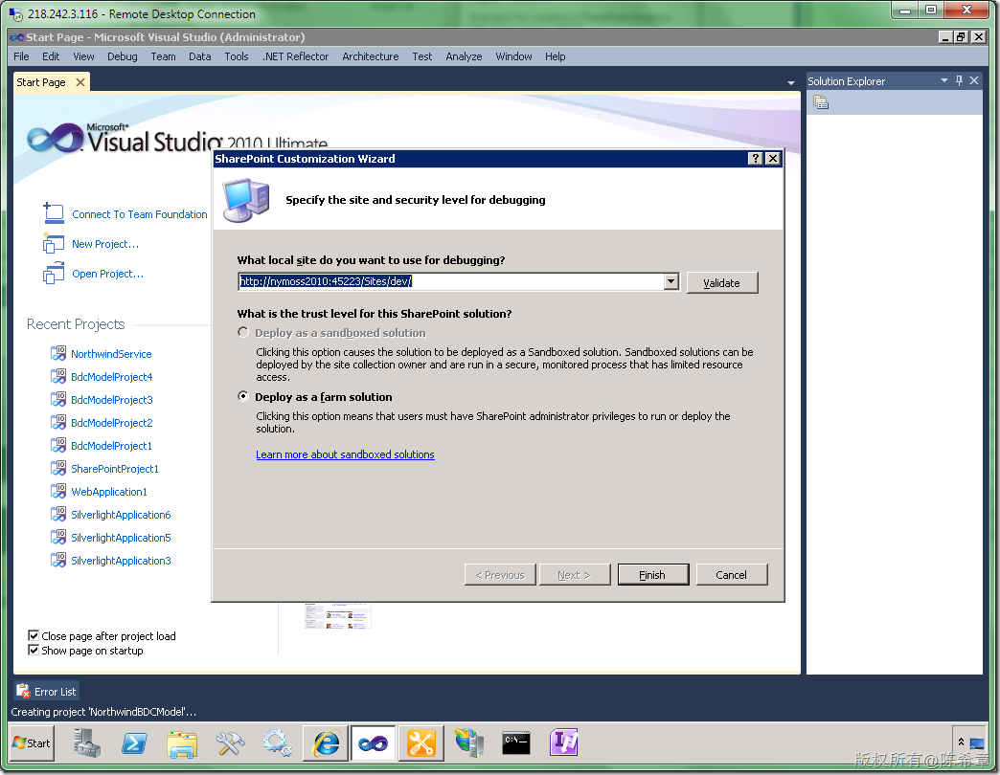](http://images.cnblogs.com/cnblogs_com/chenxizhang/WindowsLiveWriter/MOSS2010VisualStudio201023BCS_FD50/image_10.png) 

 这个项目模板默认会生成下面的一些文件

 [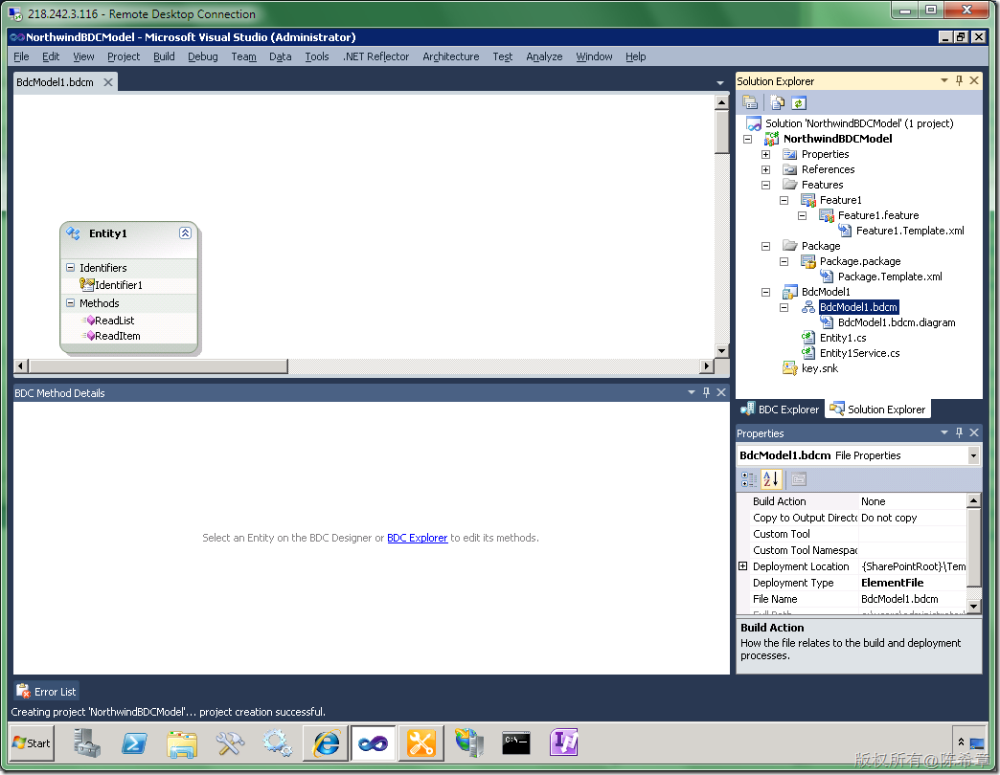](http://images.cnblogs.com/cnblogs_com/chenxizhang/WindowsLiveWriter/MOSS2010VisualStudio201023BCS_FD50/image_14.png) 

 2. 修改实体的友好名称
------------

 所谓实体就是BCS服务要传输的数据载体。它包含了一些属性，和一些方法定义。例如上面所显示的那个 Entity1就是一个实体

 作为演示方便，我们先不要做太多的修改，只是修改一下它的名称，让它看起来更加友好。

 选中Entity1，在属性窗口中将Name修改为Employee

 [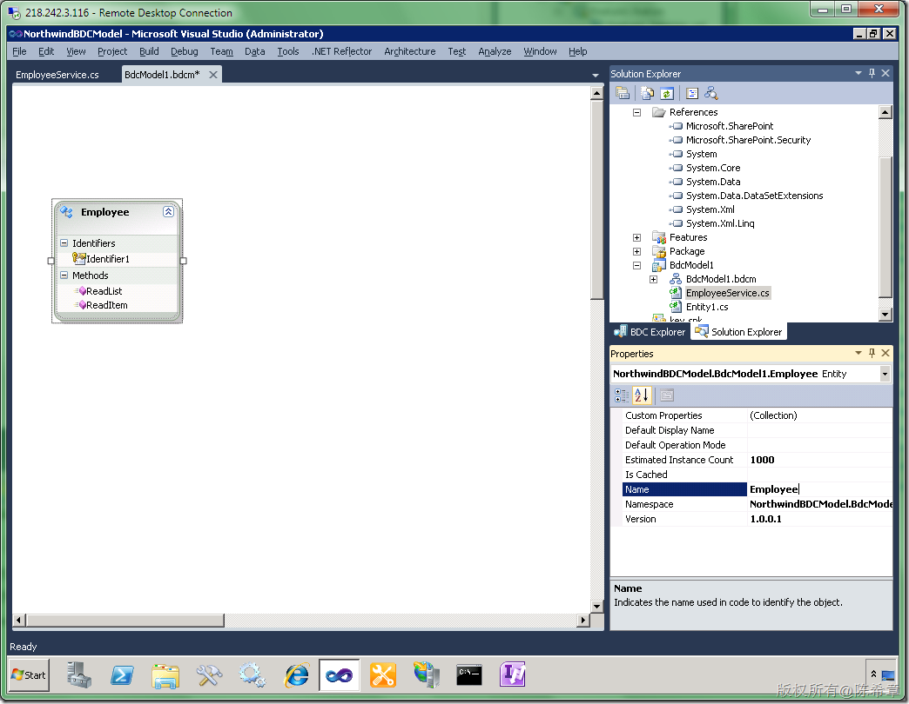](http://images.cnblogs.com/cnblogs_com/chenxizhang/WindowsLiveWriter/MOSS2010VisualStudio201023BCS_FD50/image_38.png) 

 3. 部署该模型并且进行测试使用
----------------

 选中项目,右键,deploy

 [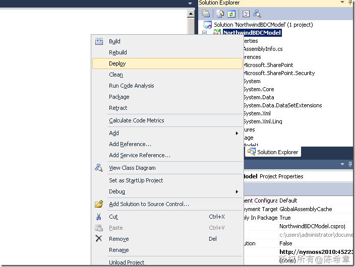](http://images.cnblogs.com/cnblogs_com/chenxizhang/WindowsLiveWriter/MOSS2010VisualStudio201023BCS_FD50/image_40.png) 

 部署成功之后,我们就可以使用这个BDC 模型了.

 我们在SPD中可以看到这个模型

 [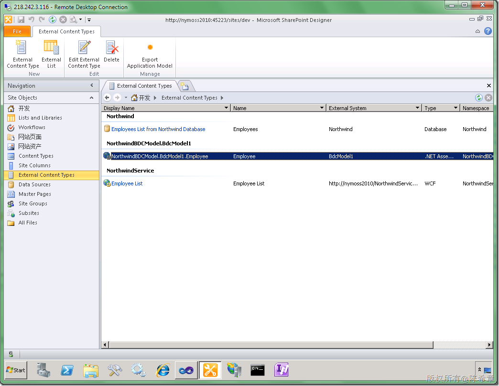](http://images.cnblogs.com/cnblogs_com/chenxizhang/WindowsLiveWriter/MOSS2010VisualStudio201023BCS_FD50/image_42.png) 

 [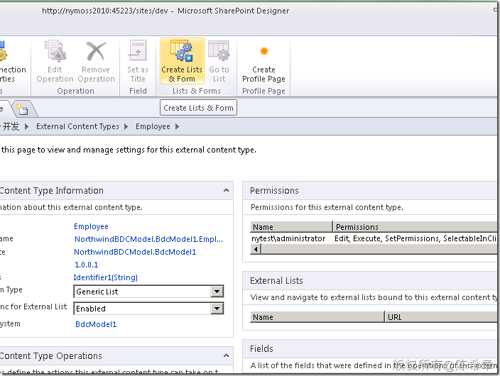](http://images.cnblogs.com/cnblogs_com/chenxizhang/WindowsLiveWriter/MOSS2010VisualStudio201023BCS_FD50/image_44.png) 

 我们和使用其他两种内容类型一样,点击"Create Lists & Form"即可

 [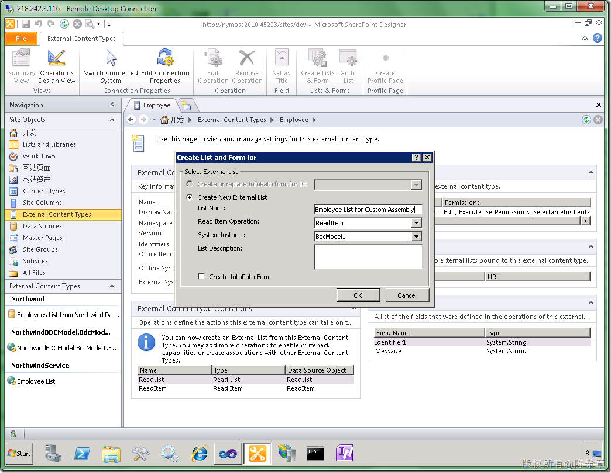](http://images.cnblogs.com/cnblogs_com/chenxizhang/WindowsLiveWriter/MOSS2010VisualStudio201023BCS_FD50/image_46.png) 

 [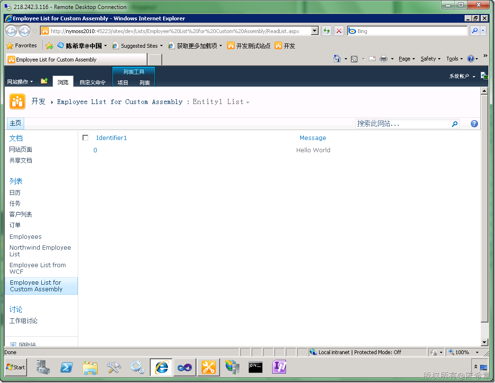](http://images.cnblogs.com/cnblogs_com/chenxizhang/WindowsLiveWriter/MOSS2010VisualStudio201023BCS_FD50/image_48.png) 

 [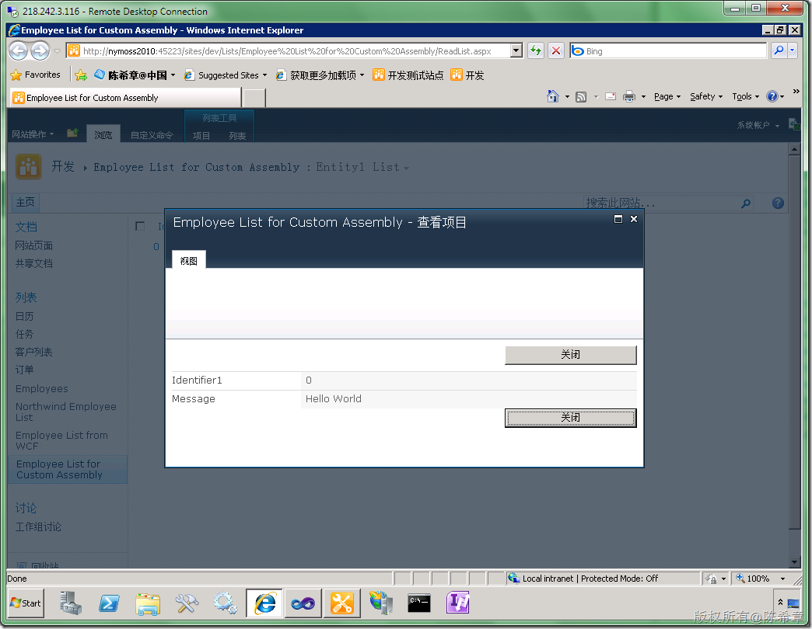](http://images.cnblogs.com/cnblogs_com/chenxizhang/WindowsLiveWriter/MOSS2010VisualStudio201023BCS_FD50/image_50.png) 

 好，到这里为止，我们就通过一个标准模板创建了一个BDC 模型，我们只是修改了它的友好名称，然后将其部署到了服务器，并且使用该模型创建了一个列表。到目前为止，看起来它工作得没有什么问题。

  

 其实要使用这种外部内容类型(不管是SQL, WCF或者.NET自定义程序集),除了上面的方法之外, 还有下面的做法

 打开网站，在网站操作中，选择“更多选项”

 [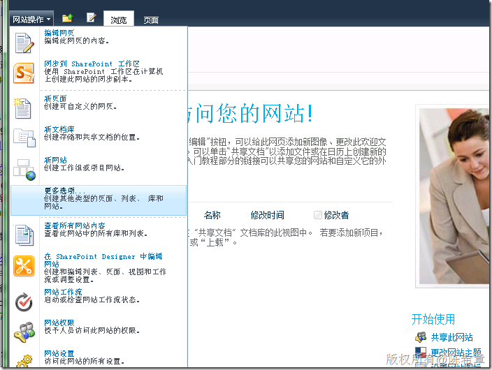](http://images.cnblogs.com/cnblogs_com/chenxizhang/WindowsLiveWriter/MOSS2010VisualStudio201023BCS_FD50/image_52.png) 

 [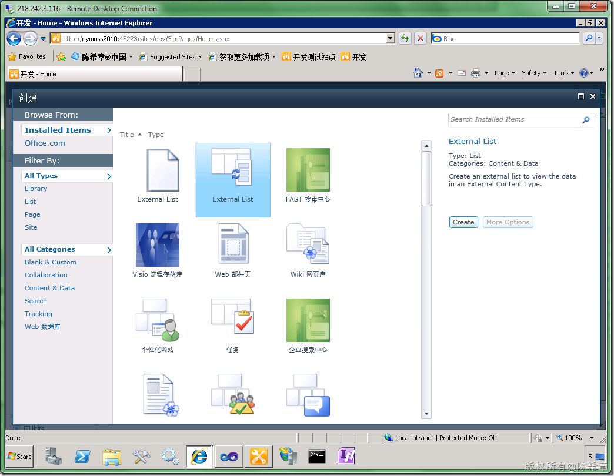](http://images.cnblogs.com/cnblogs_com/chenxizhang/WindowsLiveWriter/MOSS2010VisualStudio201023BCS_FD50/image_54.png) 

 选择“External List”，然后单击“Create”,然后在下面的界面中输入一个名称，并且选择一个类型

 [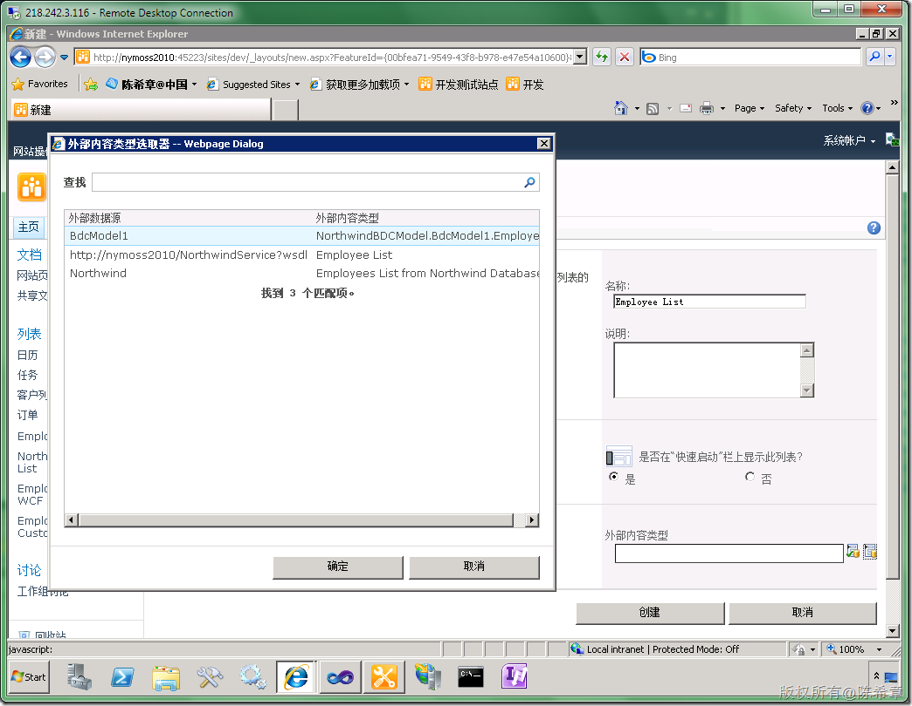](http://images.cnblogs.com/cnblogs_com/chenxizhang/WindowsLiveWriter/MOSS2010VisualStudio201023BCS_FD50/image_56.png) 

 [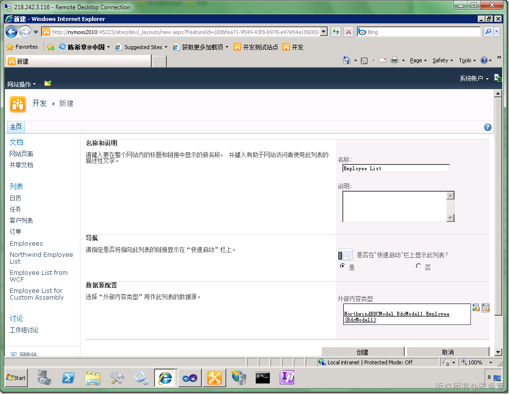](http://images.cnblogs.com/cnblogs_com/chenxizhang/WindowsLiveWriter/MOSS2010VisualStudio201023BCS_FD50/image_58.png) 

 点击“创建”按钮之后，看到的效果和之前的没有什么差别

 [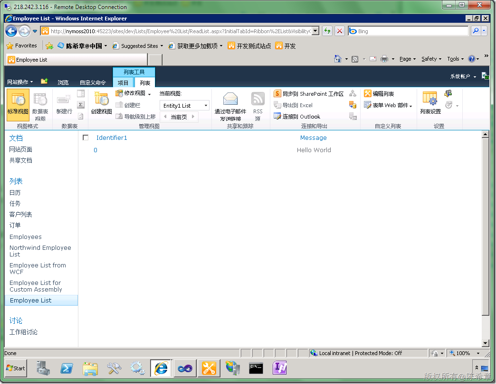](http://images.cnblogs.com/cnblogs_com/chenxizhang/WindowsLiveWriter/MOSS2010VisualStudio201023BCS_FD50/image_60.png) 

  

             4. 修改模型，让它能够有实际应用价值
-------------------

 上面这个例子虽然可以工作，但其实实际意义不大，因为我们的Employee需要包含的数据是特殊的，例如我们需要包含FirstName,LastName,Age等

  

 这一节待续。目前beta版的工具比较有问题，总是报一些奇怪的错误。等装了正式版再专门写一篇来介绍定制模型。

   

  

 总结：

 这一篇，我演示了如何自定义简单的BDC Model，并且部署使用它。

