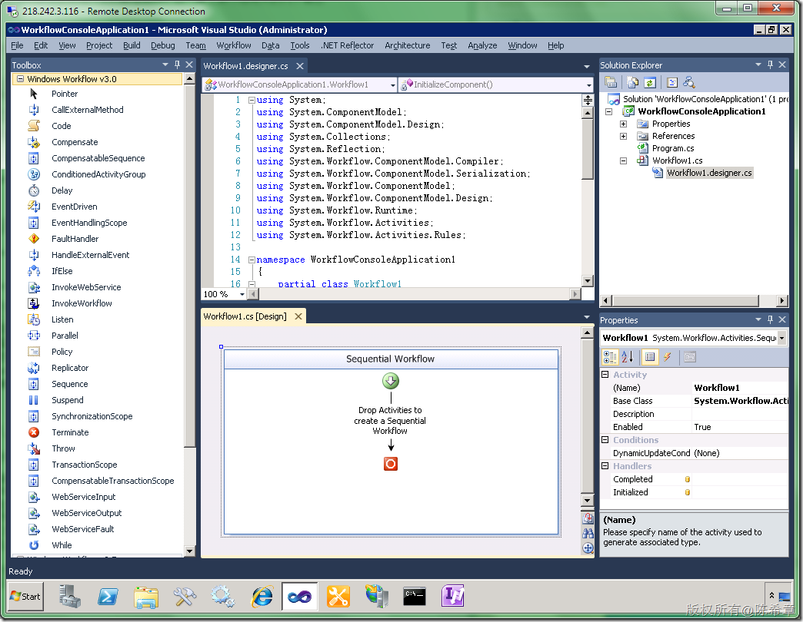
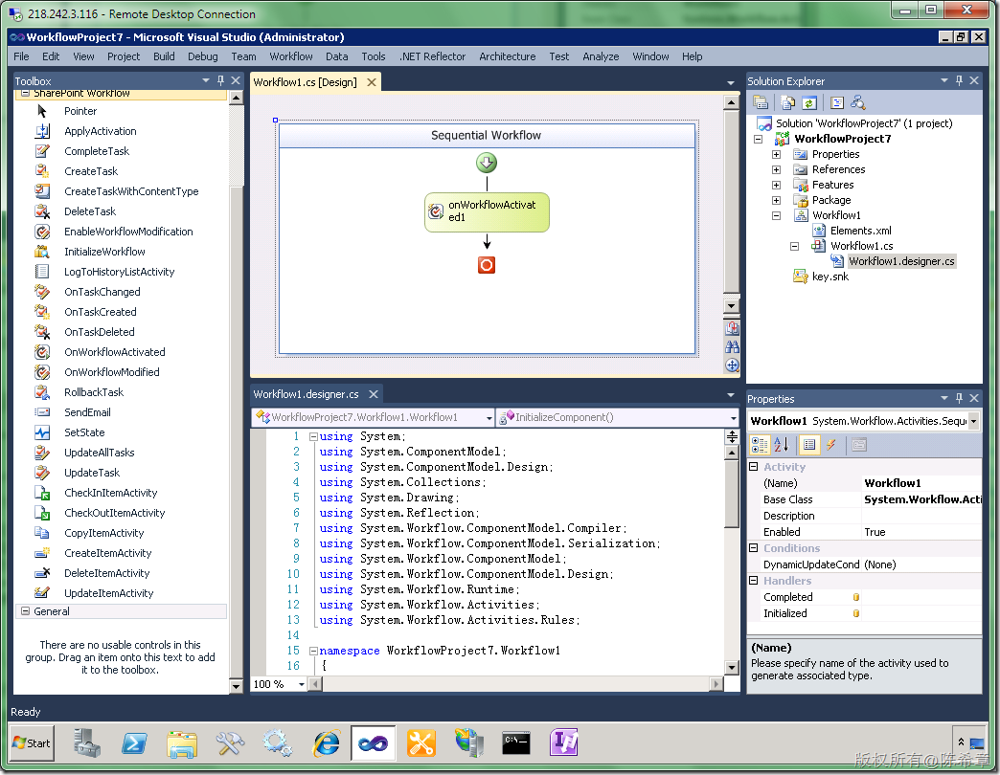
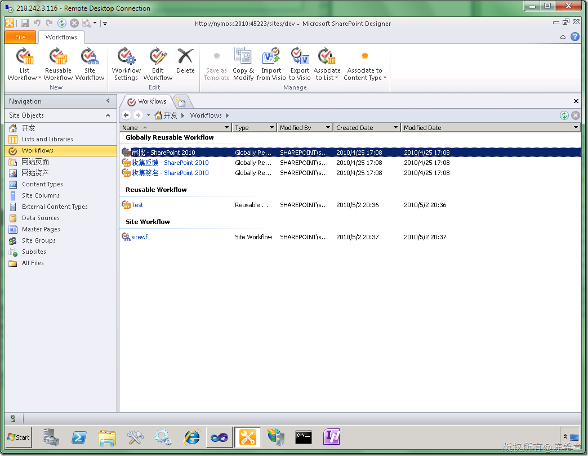

# MOSS 2010:Visual Studio 2010开发体验（26）——工作流开发概述 
> 原文发表于 2010-05-02, 地址: http://www.cnblogs.com/chenxizhang/archive/2010/05/02/1726105.html 

这一篇开始，我将介绍在MOSS 2010中进行工作流开发的最佳实践。这一篇主要介绍有关的几个概念

 1.什么是工作流
--------

 工作流开发是这几年都比较火的一个领域。工作流，顾名思义就是工作的流程，而软件系统所要做的就是解决人们现实工作或者生活中的那些流程。所以从事实上说，任何软件系统都离不开工作流。

 当然，工作流真正被广大开发人员所熟知，是因为.NET Framework 3.0中的Workflow Foundation(WF)。很显然，WF提供了一个前所未有的选择，就是它提供了运行时、可视化设计器、开箱即用的一些活动部件（可以快速组装成一个流程）。

 但是，我要说的是，WF并不是工作流的全部。

 首先，并不意味着要做工作流开发的话，就一定要用它。事实上，我们有的时候也确实不用它。这要根据具体的情况具体分析。

 其次，我们用了WF，它确实可以处理相当一部分事情，但是还有一些部分是我们需要考虑处理的，诸如权限方面的控制，数据的持久化等等。

 下面是标准的Wofkflow Foundation应用程序设计开发的一个截图

  

 【备注】WF 4.0有很多改变，以后有机会我会再专门介绍

 【备注】SharePoint的工作流目前基于WF 3.5, 而不是WF 4.0

  

 2.SharePoint工作流的特点
------------------

 其实，微软在没有公开Workflow Foundation之前，就已经尝试了在Office及有关产品中提供了工作流方面的尝试，例如我们都知道的Biztalk，以及Excel的早期版本中都可以做流程的设计和管理。

 而WSS 3.0 (Windows SharePoint Service)中则内置了对于Workflow Foundation的支持，以提高SharePoint在协作方面的能力。

 为SharePoint开发工作流有如下特点

 * **任务驱动**：几乎所有流程都是基于任务的概念，例如要审批，通常就是给审批者分配一个待办事项
* **一般都与列表文档库绑定。**设计时和运行时都是如此。
* **WF的两种工作流都是支持的：**顺序型和状态机工作流
* **界面有两种选择**：Infopath表单或者aspx表单（前者设计容易，但权限控制相当麻烦；后者则相对来说比较灵活，但开发难度和工作量较大）
* **包含了一套专用的活动项（Activity）**

 下图可以看出,SharePoint的工作流开发基本和标准的WF开发还是比较接近的，只不过多了一些专用的东西吧

  

 3. 在MOSS 2010中，工作流方面主要有什么改进
---------------------------

 MOSS 2010在工作流方面的改进并不是革命性，但却是相当有实际价值的。它主要包括如下方面

 * 提供了**网站级别的工作流**。以前每个工作流都要与某个特定的列表或者文档库绑定，虽然这本身也是合理的，但有时候，我们的流程可能就是一个很简单的审批之类的，那时候就想干嘛一定要搞一个列表呢？现在这个问题不再存在了
* 提出了**可复用工作流**的概念。关于这一点，我之前有一个专门文章介绍。<http://www.cnblogs.com/chenxizhang/archive/2010/04/06/1705021.html> 。 顾名思义，这种流程可以更好地复用，它在设计的时候就没有绑定具体的列表，可以随意部署到其他的站点，或者后期与列表绑定。
* 提出了**全新的设计开发工作流的模式**。业务人员用Visio设计流程的概念模型，然后IT人员可以在SharePoint Designer中导入Visio图形，并且进行一些配置，实现具体的步骤细节。如果流程需要有特殊的功能，则可以由专业的开发人员在Visual Studio 中导入该流程，进行定制开发。这样，就让每个人都能有参与的可能性，而且各自的工作可以直接转换，减少重复劳动。
* **开发，部署和调试相当方便**。发布流程到网站甚至整个服务器场，通过一个按键就可以完成。而在Visual Studio中提供了项目模板，以及部署工具可以大大提高工作效率，让开发人员可以将更多精力集中在流程本身的逻辑上，而不是打包，部署之类的繁琐工作。

  

 下一篇，我们就通过一个简单的实例，来演示如何使用Visio设计概念，用SharePoint Designer实现细节，而用Visual Studio定制特殊功能。

