# MOSS 2010:Visual Studio 2010开发体验（28）——工作流开发最佳实践（二） 
> 原文发表于 2010-05-03, 地址: http://www.cnblogs.com/chenxizhang/archive/2010/05/03/1726281.html 

在之前的两篇文章中，我介绍了有关工作流的概念，以及最佳实践第一篇

 * 工作流开发概述：<http://www.cnblogs.com/chenxizhang/archive/2010/05/02/1726105.html>* 工作流开发最佳实践（一）：<http://www.cnblogs.com/chenxizhang/archive/2010/05/02/1726154.html> (使用visio设计流程概念）

  

 这一篇我们接下去，将visio设计好的流程概念模型，导入到SharePoint Designer中，对其进行具体的实现。根据情况，我们可能还会做一些小的设计上的调整。有意思的是，这些调整又可以导出为Visio的格式，这样就确保了业务单位和IT部门之间的沟通是没有任何障碍的。

 下面开始我们的体验之旅吧

  

 1. 必要的准备工作
----------

 首先，作为IT专业人士，考虑的问题就会明显多一些。例如，我们需要考虑，这些费用报销的数据存放在什么地方呢？审批的人是要通过什么样方式进行定义的呢？流程有关的一些记录应该存放在什么地方呢？

 所以，在导入这个流程之前，我们需要做必要的准备工作。分别如下

 * 准备一个自定义列表，用来存放所有的报销单数据。这个列表很简单，有一个标题，有一个金额。仅此而已

 [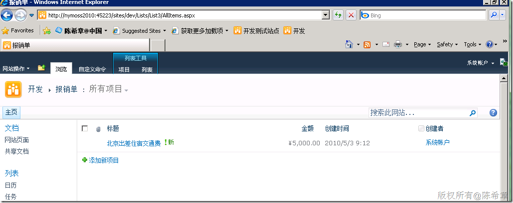](http://images.cnblogs.com/cnblogs_com/chenxizhang/WindowsLiveWriter/MOSS2010VisualStudio201028_146F7/image_6.png) 

 * 作为演示，我们规定由下面的人员充当有关的角色
+ 经理：NYTest\ares
+ 总经理：NYTest\ares

 【注意】通常，我们可以用一个用户组来表示经理，或者总经理。这里只是为了简单起见，直接指定为一个用户。

  

  

 2. 将Visio图形导入到SharePoint Designer
---------------------------------

 我们在SharePoint Designer中切换到工作流中心

 [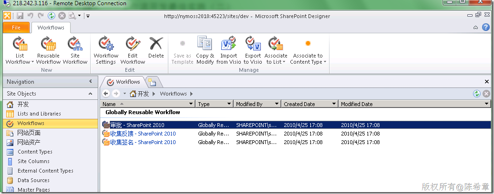](http://images.cnblogs.com/cnblogs_com/chenxizhang/WindowsLiveWriter/MOSS2010VisualStudio201028_146F7/image_2.png) 

 这里可以看到一个“Import from Visio”的按钮，点击之后，就会让我们选择vmi文件的位置，如下图所示

 [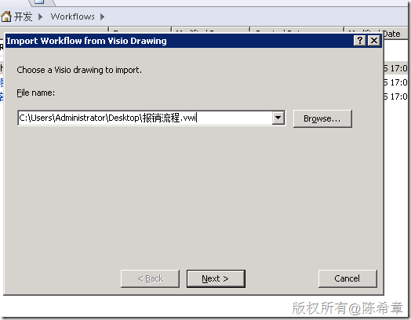](http://images.cnblogs.com/cnblogs_com/chenxizhang/WindowsLiveWriter/MOSS2010VisualStudio201028_146F7/image_4.png) 

 点击“Next”，在下图中选择“List Workflow”，也就是说，我们让这个流程与某个列表绑定。这个列表就是我们刚才创建好的“报销单”

 [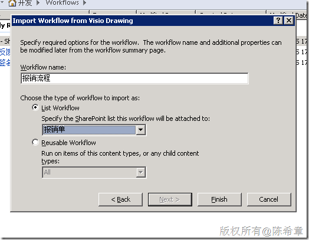](http://images.cnblogs.com/cnblogs_com/chenxizhang/WindowsLiveWriter/MOSS2010VisualStudio201028_146F7/image_8.png) 

 点击“Finish”.我们可以看到下面这样的一个结果。看起来很不错，不是吗？

  

  

 3. 实现流程的具体细节
------------

 【提示】上图中，有很多带下划线的文字，这些都是可以点击的。因为步骤比较多，我就不一一截图了。每个带下划线的地方，都可以点击，然后弹出一个有关的界面，进行设置即可。基本上还是比较简单的，尤其是如果你以前使用过MOSS 2007的SharePoint Designer的话

 修改之后的结果如下

 [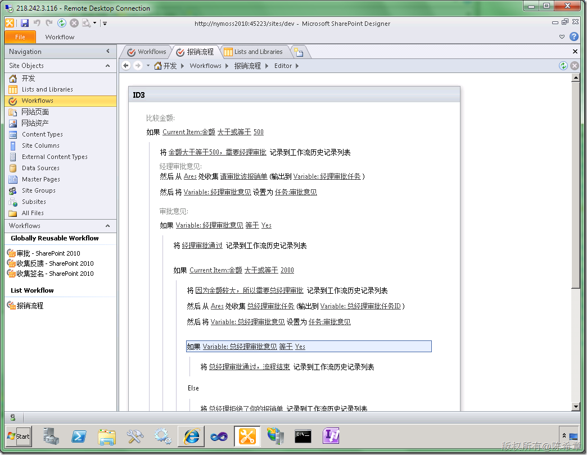](http://images.cnblogs.com/cnblogs_com/chenxizhang/WindowsLiveWriter/MOSS2010VisualStudio201028_146F7/image_14.png) 

 【备注】因为我的服务器没有配置好Email的功能，所以我修改了有关发送邮件的任务，我将它修改为记录任务日志的方式

  

 4. 保存，部署该流程
-----------

 [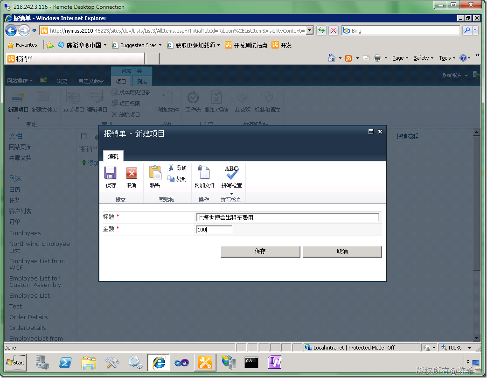](http://images.cnblogs.com/cnblogs_com/chenxizhang/WindowsLiveWriter/MOSS2010VisualStudio201028_146F7/image_18.png) 

  

 [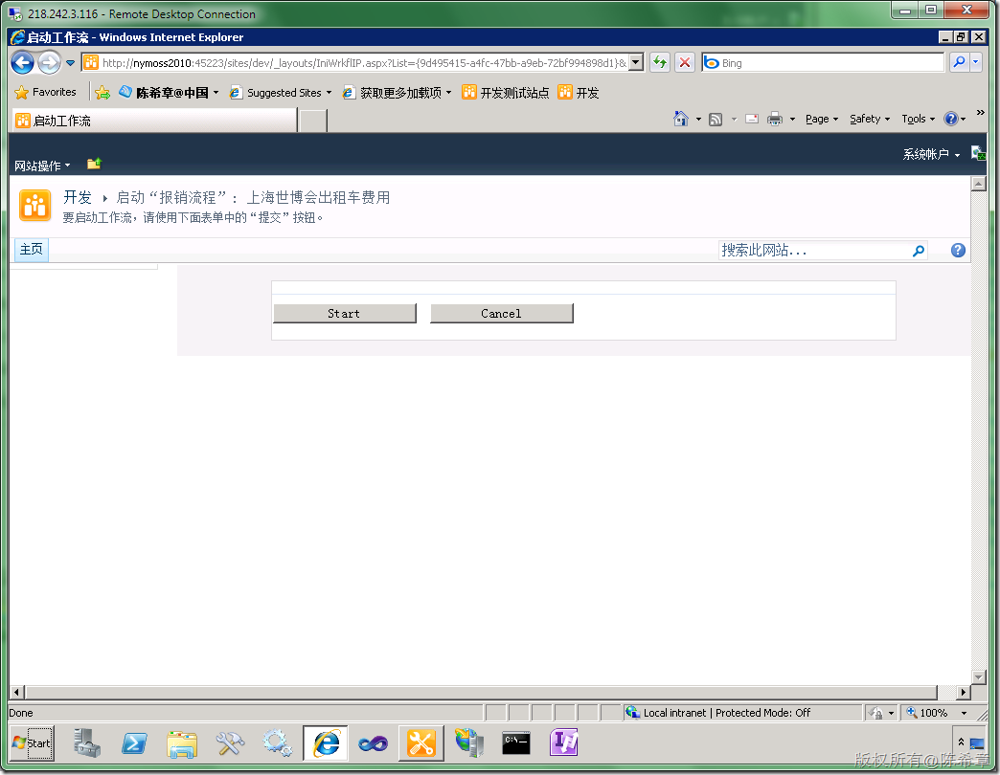](http://images.cnblogs.com/cnblogs_com/chenxizhang/WindowsLiveWriter/MOSS2010VisualStudio201028_146F7/image_22.png) 

  

 【备注】因为金额较小，所以无需审批直接就通过了

 [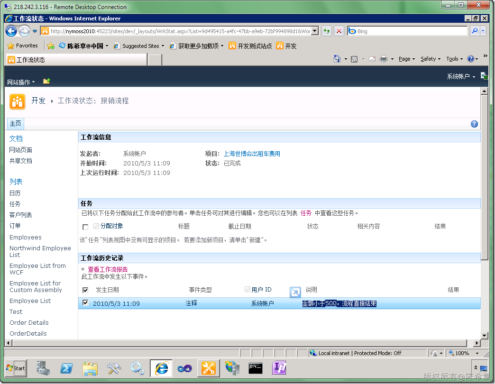](http://images.cnblogs.com/cnblogs_com/chenxizhang/WindowsLiveWriter/MOSS2010VisualStudio201028_146F7/image_26.png) 

 我们再来做一个要审批的

 [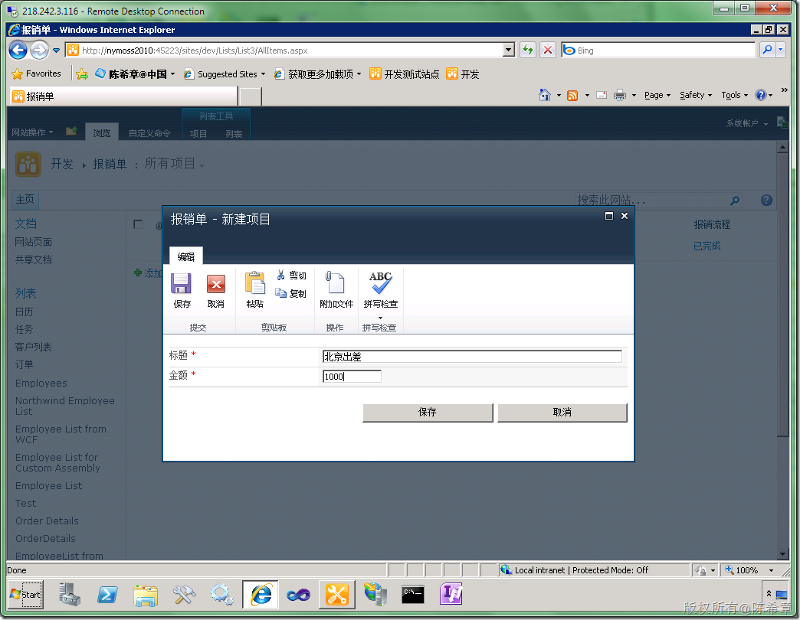](http://images.cnblogs.com/cnblogs_com/chenxizhang/WindowsLiveWriter/MOSS2010VisualStudio201028_146F7/image_28.png) 

 [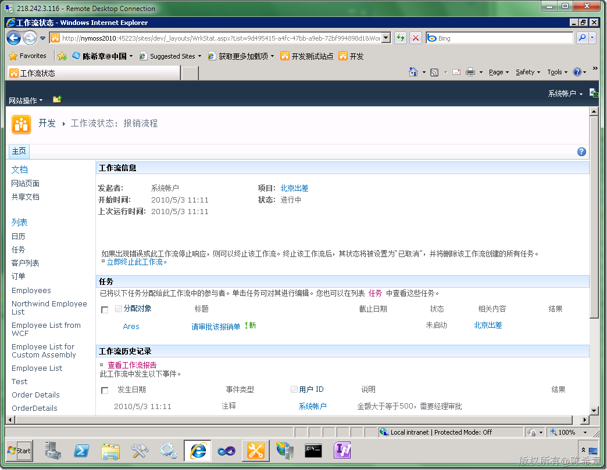](http://images.cnblogs.com/cnblogs_com/chenxizhang/WindowsLiveWriter/MOSS2010VisualStudio201028_146F7/image_30.png) 

 点击那个分配给ares的任务

 [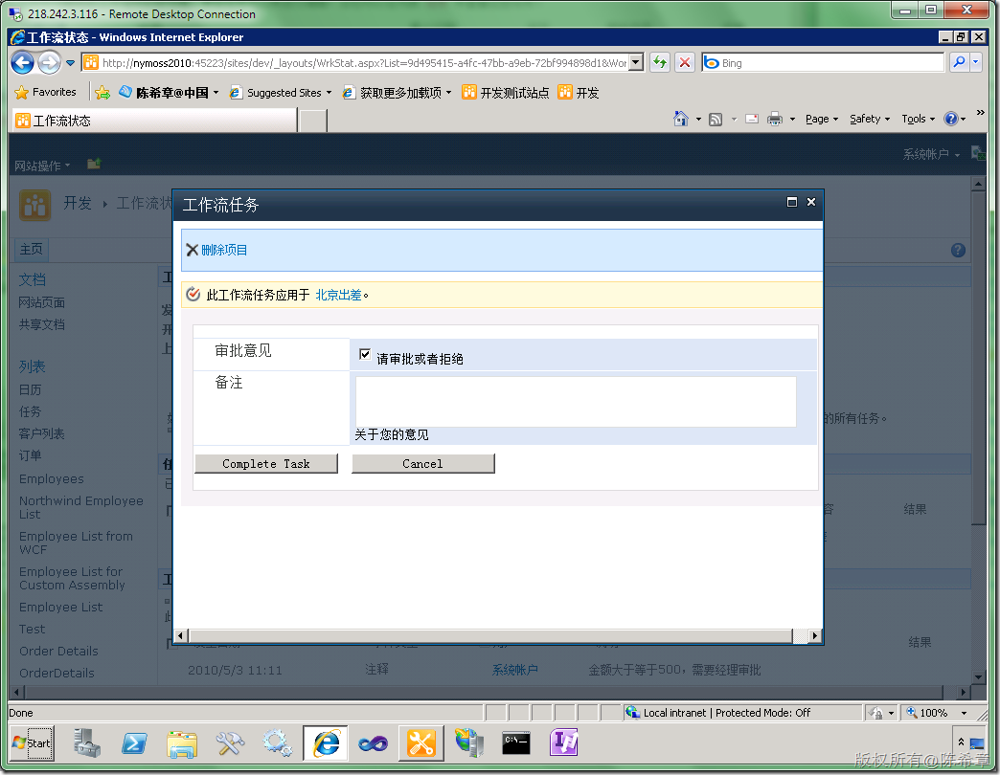](http://images.cnblogs.com/cnblogs_com/chenxizhang/WindowsLiveWriter/MOSS2010VisualStudio201028_146F7/image_32.png) 

 点击Complete Task

 [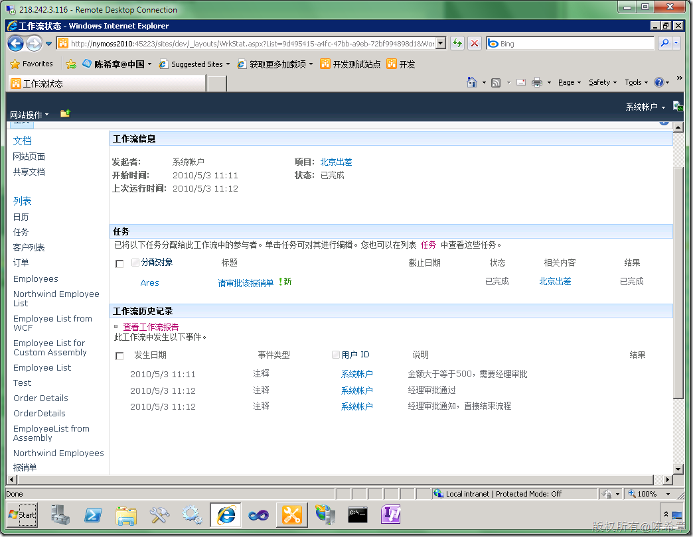](http://images.cnblogs.com/cnblogs_com/chenxizhang/WindowsLiveWriter/MOSS2010VisualStudio201028_146F7/image_34.png) 

  

  

      5. 将流程重新导出为Visio图形
------------------

 [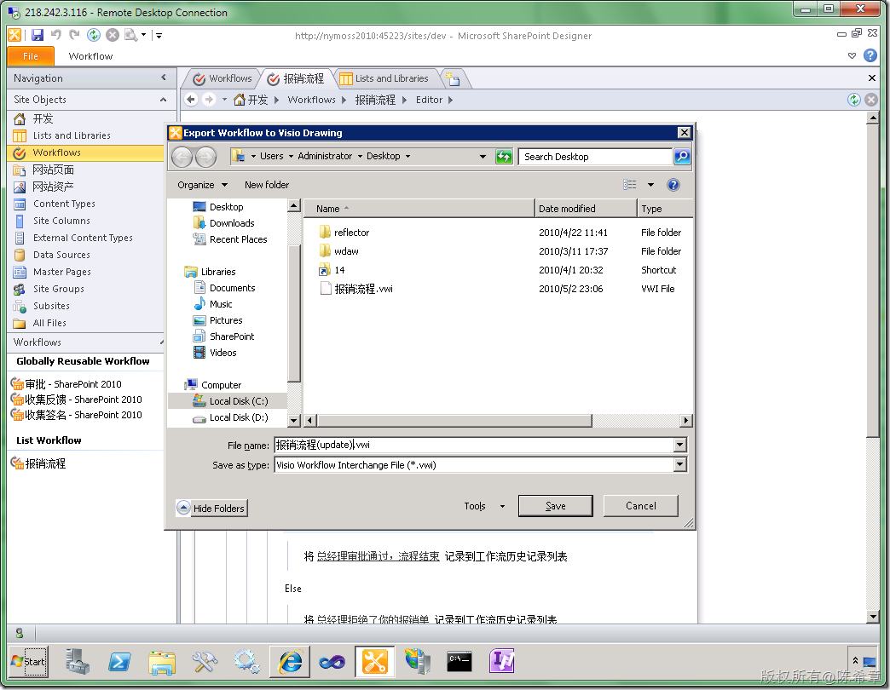](http://images.cnblogs.com/cnblogs_com/chenxizhang/WindowsLiveWriter/MOSS2010VisualStudio201028_146F7/image_12.png) 

  [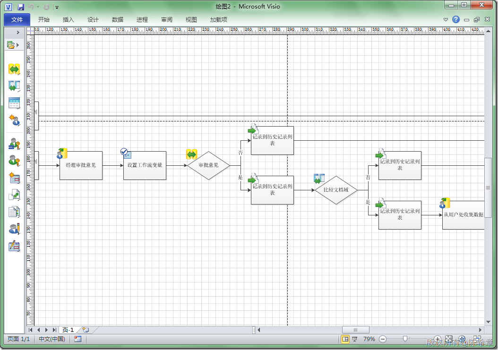](http://images.cnblogs.com/cnblogs_com/chenxizhang/WindowsLiveWriter/MOSS2010VisualStudio201028_146F7/image_16.png) 

  

 最新版的vmi文件，请通过下面地址下载

 <http://files.cnblogs.com/chenxizhang/workflowvmi.rar>

  

  

 总结：
---

 这一篇，我们将在Visio中设计的图形导入到了SharePoint Designer中，并且对其进行了实现。然后，我们将修改过的版本重新导出为Visio的格式。

  

 下一篇，我们将使用Visual Studio进一步地进行定制

