# VS 2010 : 如何开发和部署Outlook 2010插件(Add-in) 
> 原文发表于 2010-05-08, 地址: http://www.cnblogs.com/chenxizhang/archive/2010/05/08/1730766.html 


概述：
---

 这篇文章，我将通过一个简单的例子，给大家分享一下如何在VS 2010中开发和部署Outlook 2010的插件（Add-in）

  

 首先，我要说一下什么是插件（Add-in）
---------------------

 插件一般是对现有程序的扩展，微软的Office系统公开了一套接口，可以很方便地让开发人员基于这些接口去实现对Office应用程序的增强。这个接口，准确地说，就是Extensibility.IDTExtensibility2.

 当然，除了Office，有很多应用程序都支持类似的扩展机制，例如IE，以及Visual Studio本身，都支持一定程序的扩展。

  

 其次，我要说一下以前是怎么开发插件Add-in的
------------------------

 开发Office插件（Add-in）的途径有各种各样的，我大致总结分为三类：

 * **VBA 开发**：这个是基于Visaul Basic for Application这套开发模型做的一些定制。这种定制的限制比较多一些，但开发难度相对来说更加低一些。做过VBA开发的朋友都知道，VBA是脱离不了应用程序本身的。例如Excel的VBA编辑器如下图所示

 [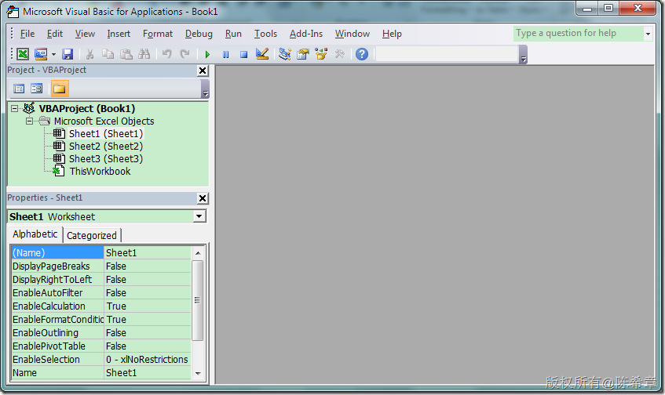](http://images.cnblogs.com/cnblogs_com/chenxizhang/WindowsLiveWriter/VS2010Outlook2010Addin_13417/image_2.png) 

 * **VC++,Visual Basic开发**：这种开发方式允许我们在VC++,或者VB 6中，直接实现Extensibility.IDTExtensibility2这套接口，并且可以更加灵活，做更加强大的一些定制。目前的Office应用程序中，默认就安装好了的一些插件，都是这种方式做的。例如下图是我的Outlook默认安装的一些插件列表

 [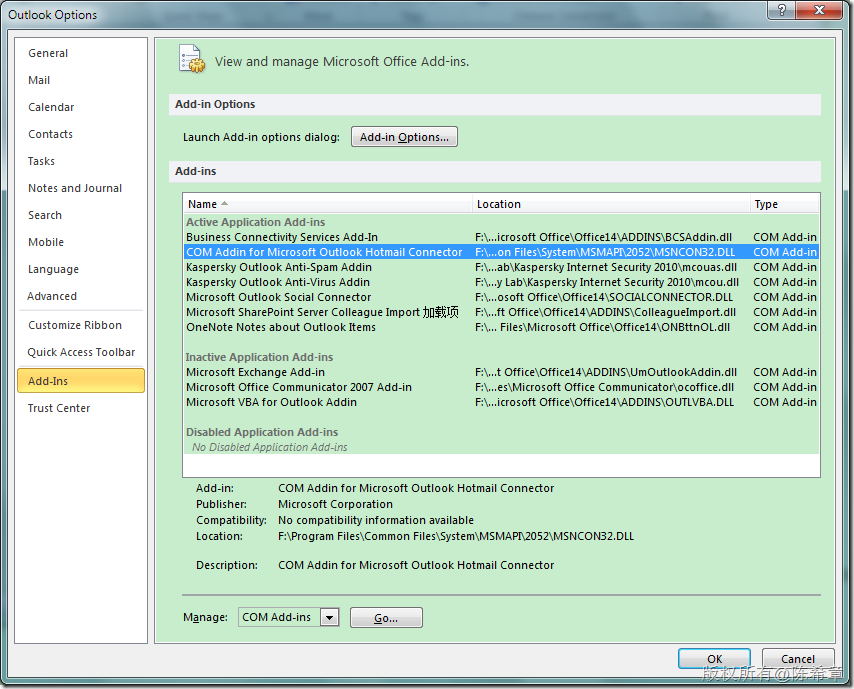](http://images.cnblogs.com/cnblogs_com/chenxizhang/WindowsLiveWriter/VS2010Outlook2010Addin_13417/image_4.png) 

 【备注】很早之前，我也用VB 6做过这方面的开发。但现在基本连VB 6的安装程序都找不到了。所以这里就不截图了，其实就是有一个项目模板，然后实现接口。开发这种插件，关键在于对Office本身内部的一些对象模型熟悉。

 * **VSTO开发**：所谓VSTO，全称是Visual Studio Tools for Office.我记得是从VS 2003开始提供了VSTO 1.0，简而言之，就是允许在.NET的开发环境中开发Office应用程序或者插件。这种方式有着显而易见的好处，就是能力增强，因为可以用到.NET的整套框架。VSTO发展到现在有几个版本，分别如下
+ VS 2003: VSTO 1.0
+ VS 2005: VSTO 2.0
+ VS 2008: VSTO 3.0
+ VS 2010: VSTO 4.0

  

 + VSTO 之前的版本有一些不太好的地方是部署，不要小看部署这个环节。如果你曾经花了很多精力写出来了一个很好的插件，但是因为各式各样的部署问题导致没有办法很顺利地分发给你的用户，那种感觉是很让人沮丧的。VSTO的解决方案有相当多的一些环境依赖，另外还需要提升.NET中的安全策略等等。
+ 一个好消息是，现在的新版本中，开发和部署将是相对更加容易了。在开发方面，模板更加好用，也提供了对Ribbon的内置支持，部署方面，我们可以通过ClickOnce技术发布到网站，或者打包成一个vsto压缩包文件，很容易地进行部署。本文我们就来用一个简单例子进行说明。

 然后，我们来看看在新版的开发工具中，如何快速高效地开发插件（Add-in）
-------------------------------------

 作为演示，我主要侧重于开发和部署的流程。我们要实现的一个插件，其场景比较简单：

 我们需要在Outlook中添加一个新的Ribbon按钮，该按钮点击之后，可以弹出一个窗口，允许我们从Excel文件中导入联系人

  

 那就让我们开始吧

 第一步：创建一个Add-in项目
----------------

 [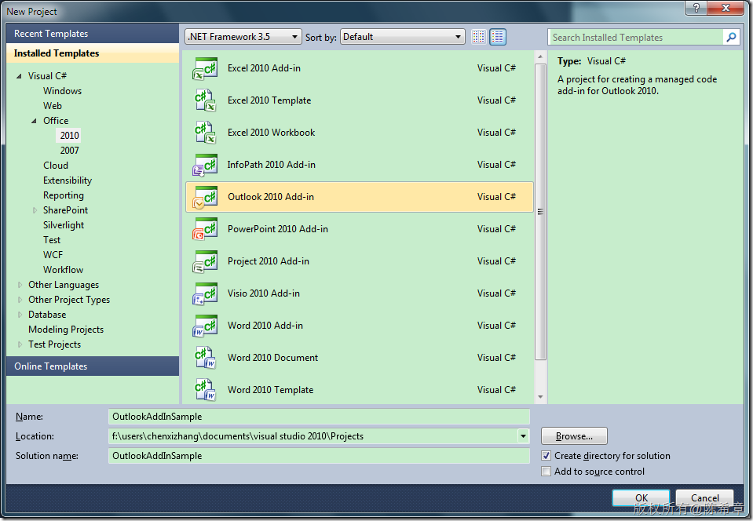](http://images.cnblogs.com/cnblogs_com/chenxizhang/WindowsLiveWriter/VS2010Outlook2010Addin_13417/image_6.png) 

 这个项目模板会自动创建下面的项目结构

 [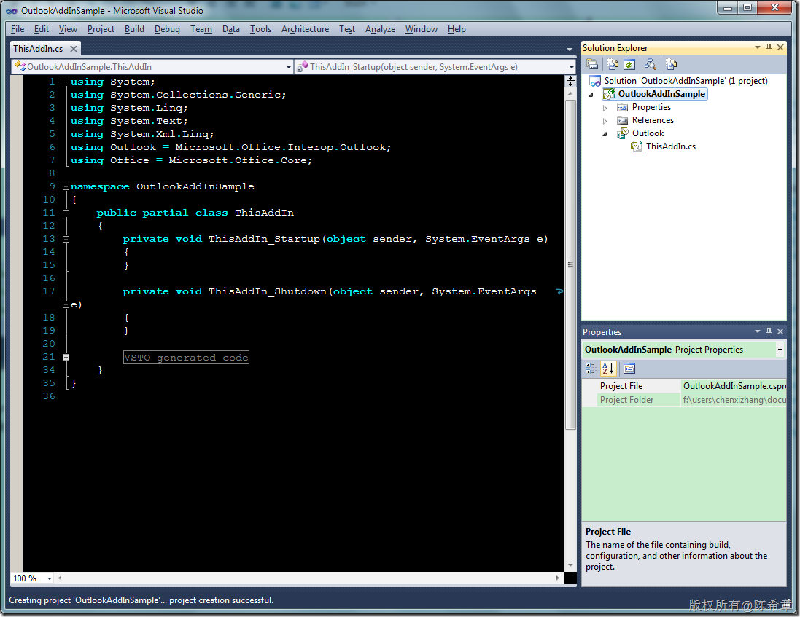](http://images.cnblogs.com/cnblogs_com/chenxizhang/WindowsLiveWriter/VS2010Outlook2010Addin_13417/image_8.png) 

 【备注】在ThisAddin这个类中，可以很方便地访问到Outlook的当前实例，只要使用如下的代码即可


```
this.Application
```

.csharpcode, .csharpcode pre
{
 font-size: small;
 color: black;
 font-family: consolas, "Courier New", courier, monospace;
 background-color: #ffffff;
 /*white-space: pre;*/
}
.csharpcode pre { margin: 0em; }
.csharpcode .rem { color: #008000; }
.csharpcode .kwrd { color: #0000ff; }
.csharpcode .str { color: #006080; }
.csharpcode .op { color: #0000c0; }
.csharpcode .preproc { color: #cc6633; }
.csharpcode .asp { background-color: #ffff00; }
.csharpcode .html { color: #800000; }
.csharpcode .attr { color: #ff0000; }
.csharpcode .alt 
{
 background-color: #f4f4f4;
 width: 100%;
 margin: 0em;
}
.csharpcode .lnum { color: #606060; }

第二步：添加一个Ribbon
--------------


我们需要为Outlook添加一个新的Ribbon按钮，事实上这很容易做到。


[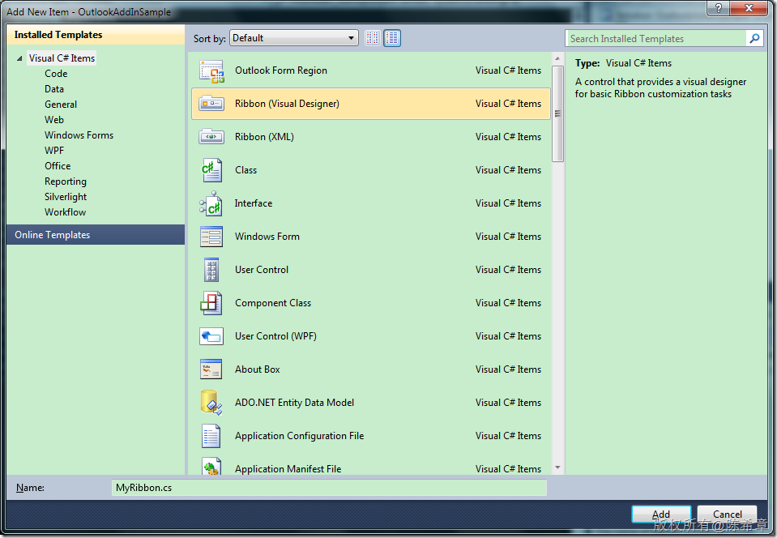](http://images.cnblogs.com/cnblogs_com/chenxizhang/WindowsLiveWriter/VS2010Outlook2010Addin_13417/image_10.png) 


我们选择Ribbon(Visual Designer)，这样就可以在可视化界面中设计了


[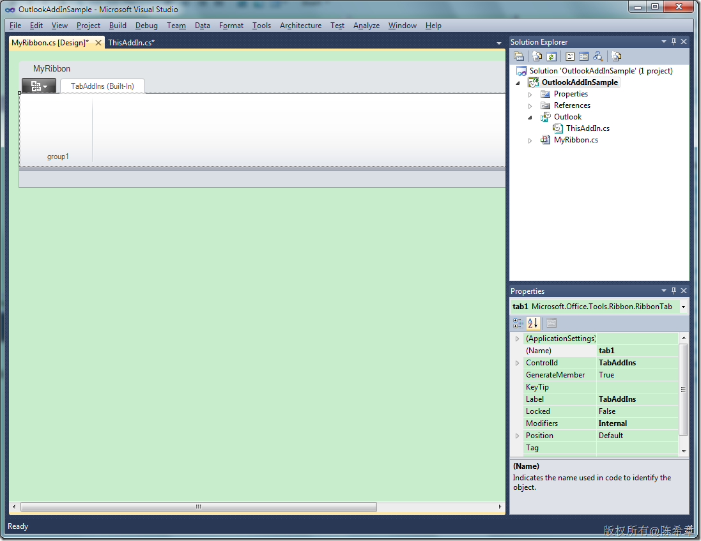](http://images.cnblogs.com/cnblogs_com/chenxizhang/WindowsLiveWriter/VS2010Outlook2010Addin_13417/image_12.png) 


我们首先需要设置一下，这个Ribbon是在什么地方要显示。在下图中，我们将RibbonType修改为Microsoft.Outlook.Explorer，这样的意思是说，我们这个Ribbon是现在在Outlook默认的那个管理器窗口中的


[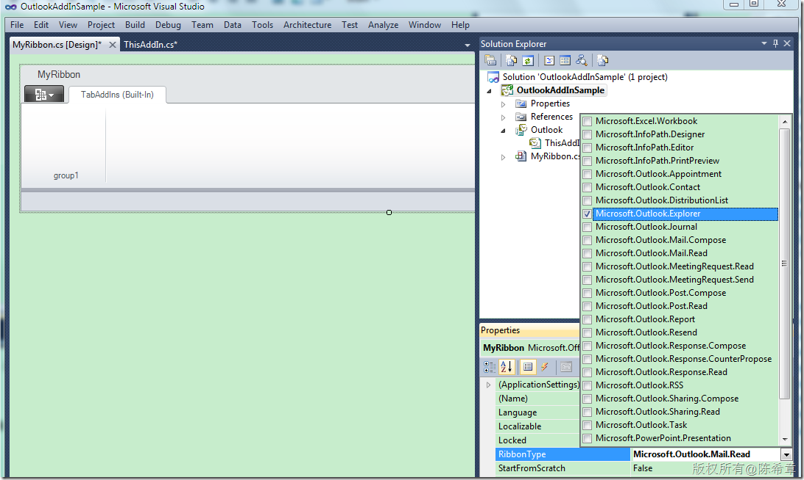](http://images.cnblogs.com/cnblogs_com/chenxizhang/WindowsLiveWriter/VS2010Outlook2010Addin_13417/image_14.png) 


接下来，我们可以添加一个按钮到group1中去。工具箱中有很多可用的控件


[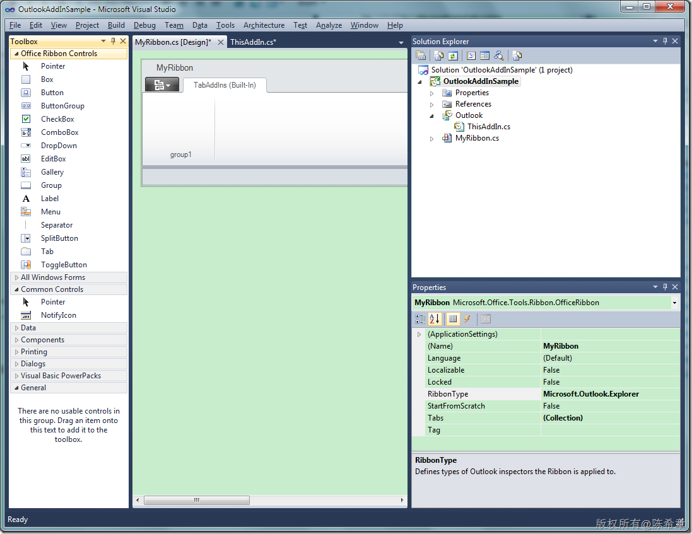](http://images.cnblogs.com/cnblogs_com/chenxizhang/WindowsLiveWriter/VS2010Outlook2010Addin_13417/image_16.png) 


我最好做好的Ribbon看起来像下面这样


[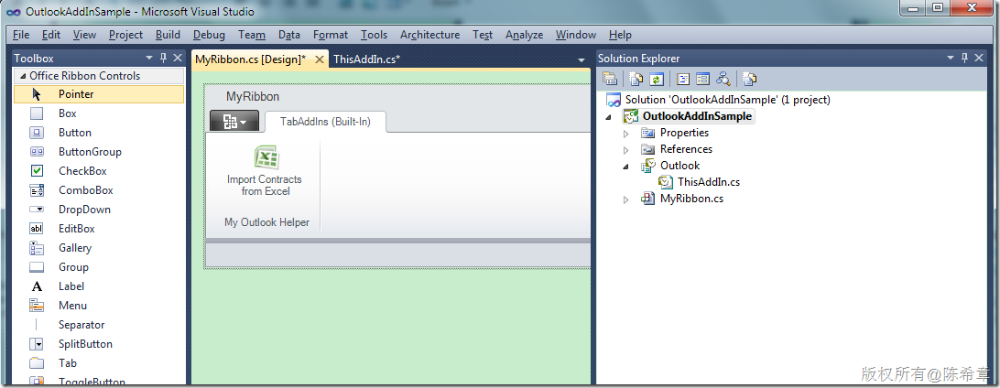](http://images.cnblogs.com/cnblogs_com/chenxizhang/WindowsLiveWriter/VS2010Outlook2010Addin_13417/image_18.png) 


 


第三步：实现简单的逻辑
-----------


接下来，我们可以为这个按钮实现简单的逻辑


通过双击该按钮，会产生一个事件处理器


[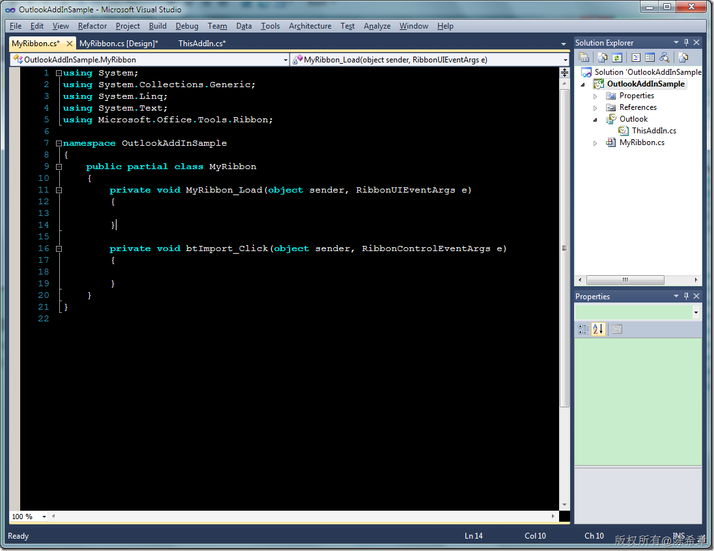](http://images.cnblogs.com/cnblogs_com/chenxizhang/WindowsLiveWriter/VS2010Outlook2010Addin_13417/image_20.png) 


我简单地实现代码如下


```
using System;
using System.Collections.Generic;
using System.Linq;
using System.Text;
using Microsoft.Office.Tools.Ribbon;
using System.Windows.Forms;

namespace OutlookAddInSample
{
    public partial class MyRibbon
    {
        private void MyRibbon\_Load(object sender, RibbonUIEventArgs e)
        {

        }

        private void btImport\_Click(object sender, RibbonControlEventArgs e)
        {
            Form form = new Form()
            {
                Text = "Import Contacts from Excel File",
                StartPosition=FormStartPosition.CenterScreen
            };
            form.Show();
        }
    }
}

```

.csharpcode, .csharpcode pre
{
 font-size: small;
 color: black;
 font-family: consolas, "Courier New", courier, monospace;
 background-color: #ffffff;
 /*white-space: pre;*/
}
.csharpcode pre { margin: 0em; }
.csharpcode .rem { color: #008000; }
.csharpcode .kwrd { color: #0000ff; }
.csharpcode .str { color: #006080; }
.csharpcode .op { color: #0000c0; }
.csharpcode .preproc { color: #cc6633; }
.csharpcode .asp { background-color: #ffff00; }
.csharpcode .html { color: #800000; }
.csharpcode .attr { color: #ff0000; }
.csharpcode .alt 
{
 background-color: #f4f4f4;
 width: 100%;
 margin: 0em;
}
.csharpcode .lnum { color: #606060; }

第四步：调试
------


完成如上的操作之后，一个最简单的Add-in就做好了。那么如何进行调试呢？


没错，直接按F5就可以进行调试了。此时，Outlook会自动打开，然后我们的Ribbon也确实能看到了


[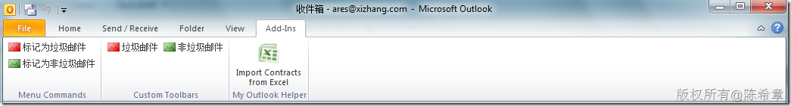](http://images.cnblogs.com/cnblogs_com/chenxizhang/WindowsLiveWriter/VS2010Outlook2010Addin_13417/image_22.png) 


点击该按钮，我们也确实可以看到一个窗口被显示出来了


[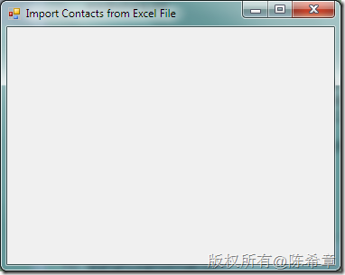](http://images.cnblogs.com/cnblogs_com/chenxizhang/WindowsLiveWriter/VS2010Outlook2010Addin_13417/image_24.png) 


同时，我们在Outlook的选项对话框中也能看到这个插件的信息


[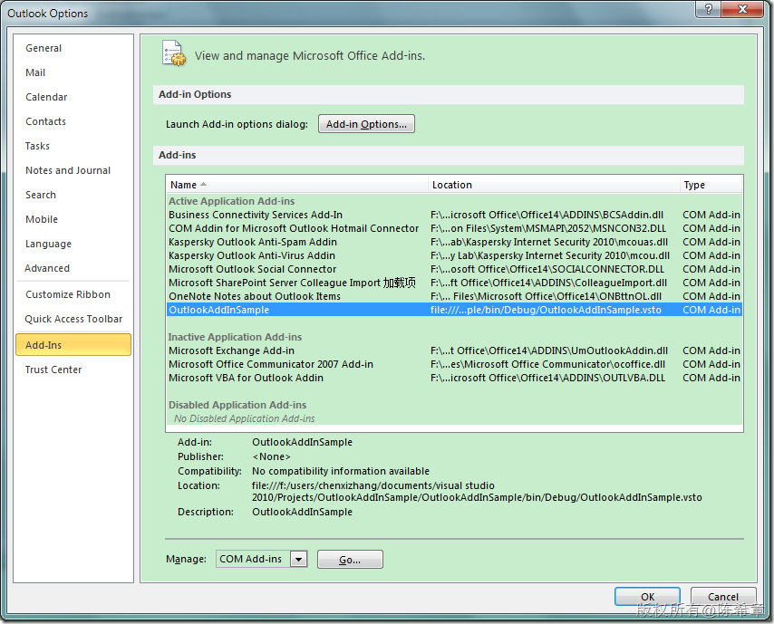](http://images.cnblogs.com/cnblogs_com/chenxizhang/WindowsLiveWriter/VS2010Outlook2010Addin_13417/image_26.png) 


 


第五步：发布
------


如果我们在本机做好了调试，那么如何分发给用户呢？以前我们一般会制作一个MSI的安装程序，现在你依然可以这么做。但我今天主要介绍的是一种更加方便的部署方式，就是通过ClickOnce技术发布到网站或者文件夹中。


[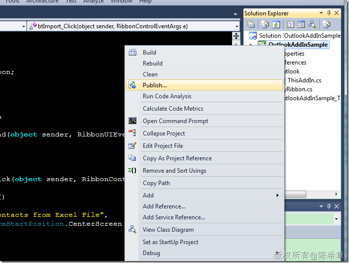](http://images.cnblogs.com/cnblogs_com/chenxizhang/WindowsLiveWriter/VS2010Outlook2010Addin_13417/image_28.png) 


[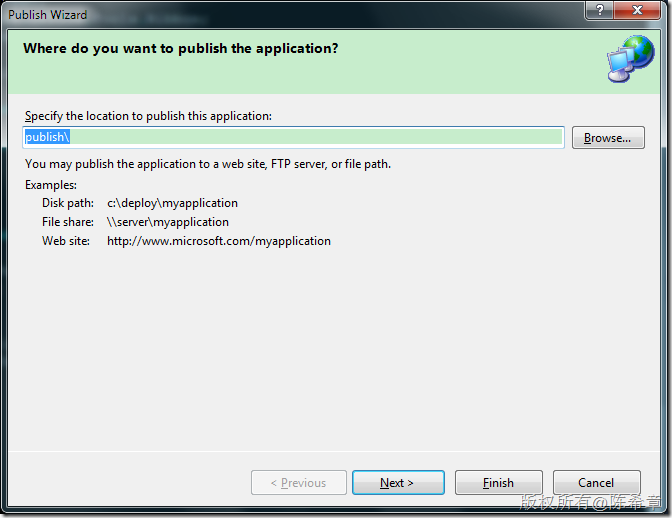](http://images.cnblogs.com/cnblogs_com/chenxizhang/WindowsLiveWriter/VS2010Outlook2010Addin_13417/image_30.png) 


[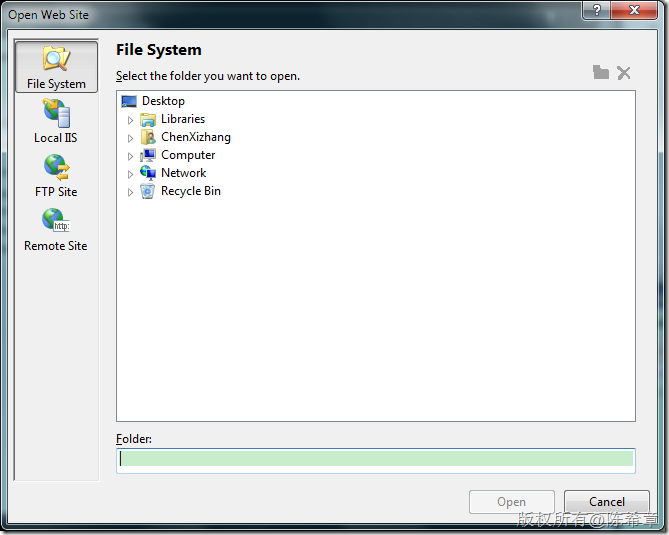](http://images.cnblogs.com/cnblogs_com/chenxizhang/WindowsLiveWriter/VS2010Outlook2010Addin_13417/image_32.png) 


【注意】这里的location是可以有下面几种的。但我这里保持默认的选择，直接发布到一个文件夹


发布如果没有遇到什么错误的话，会生成下面的一个目录


[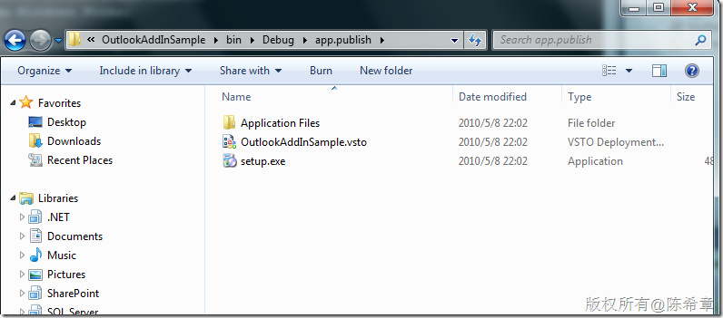](http://images.cnblogs.com/cnblogs_com/chenxizhang/WindowsLiveWriter/VS2010Outlook2010Addin_13417/image_34.png) 


我们一般可以将这个目录，打包给用户即可。


 


第六步：安装
------


接下来，用户如果拿到了这些文件，应该如何安装使用呢？其实也很简单，它可以双击setup.exe，或者设置直接双击vsto文件也可以


一般情况下，会有一个提示。


[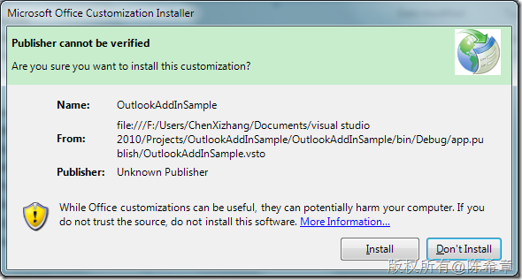](http://images.cnblogs.com/cnblogs_com/chenxizhang/WindowsLiveWriter/VS2010Outlook2010Addin_13417/image_36.png) 


点击“install”


[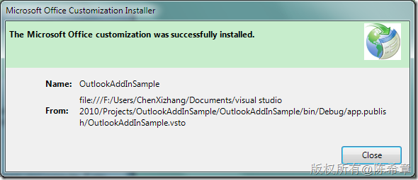](http://images.cnblogs.com/cnblogs_com/chenxizhang/WindowsLiveWriter/VS2010Outlook2010Addin_13417/image_38.png) 


然后，我们再去打开Outlook的话，仍然是可以看到这个Add-in以及它所添加的Ribbon的


[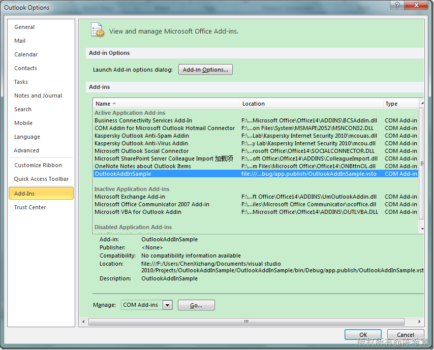](http://images.cnblogs.com/cnblogs_com/chenxizhang/WindowsLiveWriter/VS2010Outlook2010Addin_13417/image_40.png) 


第七步：卸载
------


最后，如果用户需要卸载这个插件，应该怎么做呢？


他们可以在Programs and Features窗口中，找到这个插件，然后点击“Uninstall”即可


[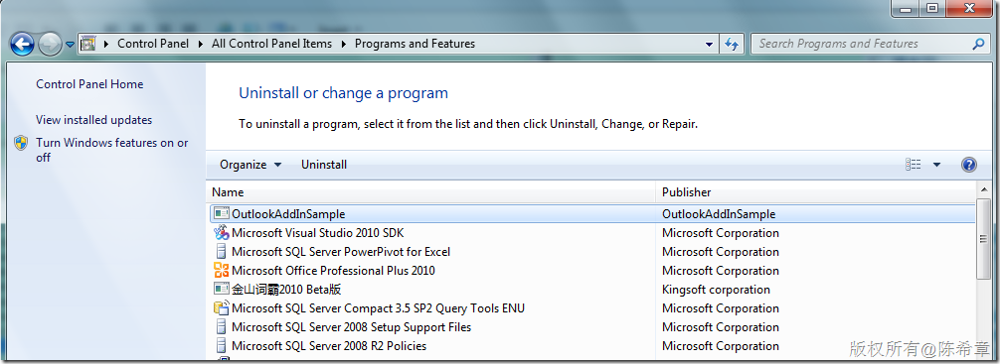](http://images.cnblogs.com/cnblogs_com/chenxizhang/WindowsLiveWriter/VS2010Outlook2010Addin_13417/image_42.png) 


 


总结
--


通过本文的简单实例，大家可以了解到在VS 2010中开发Outlook 2010插件相比较之前而言，有了很大的一些改进。当然，VS 2010也可以开发Office 2007版本的插件。

