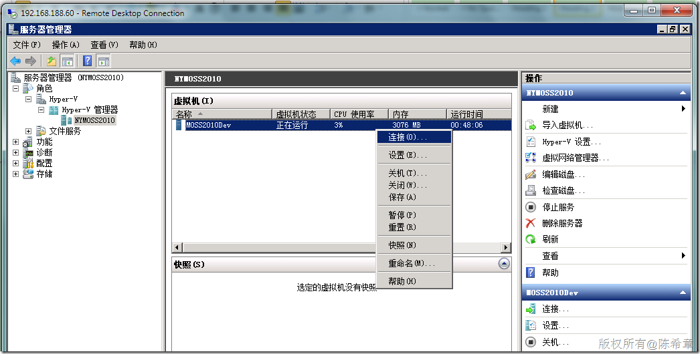
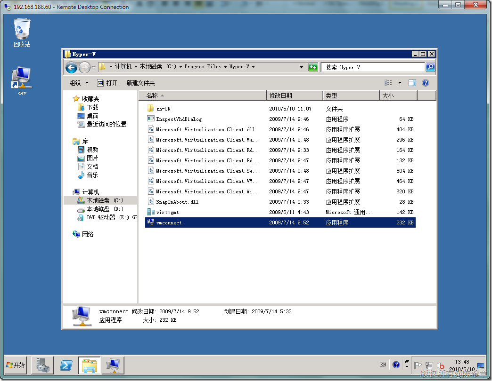

# 如何设置Hyper-V的虚拟机快捷方式 
> 原文发表于 2010-05-10, 地址: http://www.cnblogs.com/chenxizhang/archive/2010/05/10/1732067.html 

在Windows Server 2008中，提供的Hyper-V功能，可以很方便地在企业环境中部署多个虚拟机，以适应不同的开发需要。一般我们都是通过下面的方式

 1. 打开服务器管理器

 2.打开Hyper-V管理器，找到有关的虚拟机，然后右键点击“连接”

  

  

 如果你觉得这个过程太繁琐了，可以尝试建立一个快捷方式。很遗憾的是，这个服务管理器中并没有提供这样的功能。（其实这很值得改进一下）

 但我们可以手工做一个快捷方式，放在桌面上。我们其实是要用下面这个工具，vmconnect.exe

  

 这个快捷方式需要带两个参数，第一个参数是服务器名称，第二个参数是虚拟机名称，类似于下面这样

 "C:\Program Files\Hyper-V\vmconnect.exe" NYMOSS2010 MOSS2010Dev

 并且我们需要将该快捷方式设置为“以管理员身份运行”

 

