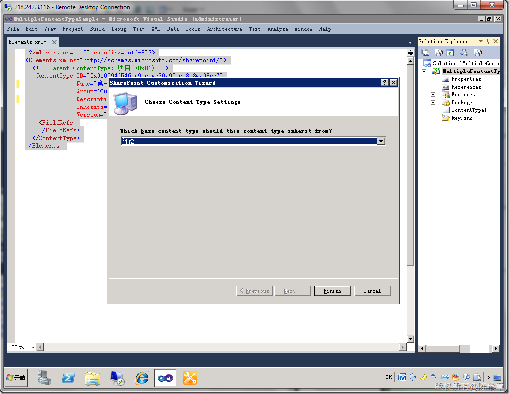

# MOSS 2010:Visual Studio 2010开发体验（31）——如何给列表绑定多个内容类型 
> 原文发表于 2010-05-14, 地址: http://www.cnblogs.com/chenxizhang/archive/2010/05/14/1735728.html 


有朋友看了下面这篇文章，给我留言提到一个问题。

 [MOSS 2010:Visual Studio 2010开发体验（10）——列表开发之内容类型](http://www.cnblogs.com/chenxizhang/archive/2010/04/25/1719694.html)

  

 他的问题是：**如果在列表定义的时候，使用多个内容类型**

 关于这个问题的简单答复如下。我在原文下面做了回复。

 ×××××××××××××××××××××××××××××××××××××××××××××

 修改那个schema.xml文件，再注册一个ContentType，但要注意的是，必须设置EnableContentTypes=true  
如下供参考  
<List xmlns:ows="Microsoft SharePoint" Title="ContentTypeProject3 - ListDefinition1" FolderCreation="FALSE" Direction="$Resources:Direction;" Url="Lists/ContentTypeProject3-ListDefinition1" BaseType="0" xmlns="<http://schemas.microsoft.com/sharepoint/"> **EnableContentTypes="TRUE"**>  
<MetaData>  
<ContentTypes>  
<ContentType ID="0x0100e65176f89de54e4981ba64256cbd6730" Name="ContentTypeProject3 - ContentType1" Group="Custom Content Types" Description="My Content Type" Inherits="TRUE" Version="0">  
<FieldRefs>  
</FieldRefs>  
</ContentType>  
**<ContentType ID="0x0100DC2417D125A4489CA59DCC70E3F152B20053b4506f008c4093a28443250322dea1" Name="ContentTypeProject3 - ContentType3" Group="Custom Content Types" Description="My Content Type" Inherits="TRUE" Version="0">  
<FieldRefs>  
</FieldRefs>  
</ContentType>**  
</ContentTypes> ×××××××××××××××××××××××××××××××××××××××××××××××

  

 为了帮助大家更好地理解这个问题，我还是单独写了一篇做介绍。如果你对上面的回复不是很清楚，请继续往下看

  

 第一步：创建一个ContentType项目
---------------------

 [](http://images.cnblogs.com/cnblogs_com/chenxizhang/WindowsLiveWriter/MOSS2010VisualStudio201031_10FA6/image_2.png) 

 [](http://images.cnblogs.com/cnblogs_com/chenxizhang/WindowsLiveWriter/MOSS2010VisualStudio201031_10FA6/image_4.png) 

 [](http://images.cnblogs.com/cnblogs_com/chenxizhang/WindowsLiveWriter/MOSS2010VisualStudio201031_10FA6/image_6.png) 

 [](http://images.cnblogs.com/cnblogs_com/chenxizhang/WindowsLiveWriter/MOSS2010VisualStudio201031_10FA6/image_8.png) 

 这样，我们就有了第一个ContentType了。为了更加易于理解，我们可以稍微修改一下它的名称


```
<?xml version="1.0" encoding="utf-8"?>
<Elements xmlns="http://schemas.microsoft.com/sharepoint/">
  <!-- Parent ContentType: 项目 (0x01) -->
  <ContentType ID="0x010094d546ec9eec4e90a951ce8e84a38ce7"
               Name="第一个内容类型"
               Group="Custom Content Types"
               Description="我的第一个内容类型"
               Inherits="TRUE"
               Version="0">
    <FieldRefs>
    </FieldRefs>
  </ContentType>
</Elements>

```

.csharpcode, .csharpcode pre
{
 font-size: small;
 color: black;
 font-family: consolas, "Courier New", courier, monospace;
 background-color: #ffffff;
 /*white-space: pre;*/
}
.csharpcode pre { margin: 0em; }
.csharpcode .rem { color: #008000; }
.csharpcode .kwrd { color: #0000ff; }
.csharpcode .str { color: #006080; }
.csharpcode .op { color: #0000c0; }
.csharpcode .preproc { color: #cc6633; }
.csharpcode .asp { background-color: #ffff00; }
.csharpcode .html { color: #800000; }
.csharpcode .attr { color: #ff0000; }
.csharpcode .alt 
{
 background-color: #f4f4f4;
 width: 100%;
 margin: 0em;
}
.csharpcode .lnum { color: #606060; }

 


第二步：添加另外一个ContentType
---------------------


[](http://images.cnblogs.com/cnblogs_com/chenxizhang/WindowsLiveWriter/MOSS2010VisualStudio201031_10FA6/image_10.png) 


[](http://images.cnblogs.com/cnblogs_com/chenxizhang/WindowsLiveWriter/MOSS2010VisualStudio201031_10FA6/image_12.png) 


[](http://images.cnblogs.com/cnblogs_com/chenxizhang/WindowsLiveWriter/MOSS2010VisualStudio201031_10FA6/image_14.png) 


出于同样的目的，我们对名称和描述进行如下的修改


```
<?xml version="1.0" encoding="utf-8"?>
<Elements xmlns="http://schemas.microsoft.com/sharepoint/">
  <!-- Parent ContentType: 评论 (0x0111) -->
  <ContentType ID="0x0111003cd6389f14304ad28da0da27a353ff6f"
               Name="第二个内容类型"
               Group="Custom Content Types"
               Description="我的第二个内容类型"
               Inherits="TRUE"
               Version="0">
    <FieldRefs>
    </FieldRefs>
  </ContentType>
</Elements>

```

.csharpcode, .csharpcode pre
{
 font-size: small;
 color: black;
 font-family: consolas, "Courier New", courier, monospace;
 background-color: #ffffff;
 /*white-space: pre;*/
}
.csharpcode pre { margin: 0em; }
.csharpcode .rem { color: #008000; }
.csharpcode .kwrd { color: #0000ff; }
.csharpcode .str { color: #006080; }
.csharpcode .op { color: #0000c0; }
.csharpcode .preproc { color: #cc6633; }
.csharpcode .asp { background-color: #ffff00; }
.csharpcode .html { color: #800000; }
.csharpcode .attr { color: #ff0000; }
.csharpcode .alt 
{
 background-color: #f4f4f4;
 width: 100%;
 margin: 0em;
}
.csharpcode .lnum { color: #606060; }

 


通过这样的过程，我们就有了两个内容类型的定义，下面，我们需要创建一个列表定义来使用他们


 


 


第三步：添加一个List Definition
-----------------------


[](http://images.cnblogs.com/cnblogs_com/chenxizhang/WindowsLiveWriter/MOSS2010VisualStudio201031_10FA6/image_16.png) 


[](http://images.cnblogs.com/cnblogs_com/chenxizhang/WindowsLiveWriter/MOSS2010VisualStudio201031_10FA6/image_18.png) 


【注意】这里先选择第一个内容类型


点击“Finish”之后，会产生一批文件，我们可以打开其中一个Schema.xml文件


[](http://images.cnblogs.com/cnblogs_com/chenxizhang/WindowsLiveWriter/MOSS2010VisualStudio201031_10FA6/image_20.png) 


那么，如何指定第二个内容类型呢？我们发现那个Schema.xml文件中的下面一段似乎有些玄机


```
    <ContentTypes>
      <ContentType ID="0x010094d546ec9eec4e90a951ce8e84a38ce7" Name="第一个内容类型" Group="Custom Content Types" Description="我的第一个内容类型" Inherits="TRUE" Version="0">
        <FieldRefs>
        </FieldRefs>
      </ContentType>
    </ContentTypes>
```

.csharpcode, .csharpcode pre
{
 font-size: small;
 color: black;
 font-family: consolas, "Courier New", courier, monospace;
 background-color: #ffffff;
 /*white-space: pre;*/
}
.csharpcode pre { margin: 0em; }
.csharpcode .rem { color: #008000; }
.csharpcode .kwrd { color: #0000ff; }
.csharpcode .str { color: #006080; }
.csharpcode .op { color: #0000c0; }
.csharpcode .preproc { color: #cc6633; }
.csharpcode .asp { background-color: #ffff00; }
.csharpcode .html { color: #800000; }
.csharpcode .attr { color: #ff0000; }
.csharpcode .alt 
{
 background-color: #f4f4f4;
 width: 100%;
 margin: 0em;
}
.csharpcode .lnum { color: #606060; }

看起来这就是注册内容类型的语法。那么，我们不妨就复制一下，添加第二个内容类型


最终看起来像下面这样


```
    <ContentTypes>
      <ContentType ID="0x010094d546ec9eec4e90a951ce8e84a38ce7" Name="第一个内容类型" Group="Custom Content Types" Description="我的第一个内容类型" Inherits="TRUE" Version="0">
        <FieldRefs>
        </FieldRefs>
      </ContentType>

      <ContentType ID="0x0111003cd6389f14304ad28da0da27a353ff6f" Name="第二个内容类型" Group="Custom Content Types" Description="我的第二个内容类型" Inherits="TRUE" Version="0">
        <FieldRefs>
        </FieldRefs>
      </ContentType>
    </ContentTypes>
```

.csharpcode, .csharpcode pre
{
 font-size: small;
 color: black;
 font-family: consolas, "Courier New", courier, monospace;
 background-color: #ffffff;
 /*white-space: pre;*/
}
.csharpcode pre { margin: 0em; }
.csharpcode .rem { color: #008000; }
.csharpcode .kwrd { color: #0000ff; }
.csharpcode .str { color: #006080; }
.csharpcode .op { color: #0000c0; }
.csharpcode .preproc { color: #cc6633; }
.csharpcode .asp { background-color: #ffff00; }
.csharpcode .html { color: #800000; }
.csharpcode .attr { color: #ff0000; }
.csharpcode .alt 
{
 background-color: #f4f4f4;
 width: 100%;
 margin: 0em;
}
.csharpcode .lnum { color: #606060; }

【注意】第二个内容类型的ID要修改


 


第四步：部署并测试
---------


看起来没有什么问题，也不难理解。那么我们就部署一下看看是否有效果吧


部署成功之后，我们确实可以看到一个列表实例，如下图所示


[](http://images.cnblogs.com/cnblogs_com/chenxizhang/WindowsLiveWriter/MOSS2010VisualStudio201031_10FA6/image_22.png) 


现在，我们去看看创建项目的时候，是否有两个内容类型呢？


[](http://images.cnblogs.com/cnblogs_com/chenxizhang/WindowsLiveWriter/MOSS2010VisualStudio201031_10FA6/image_24.png) 


奇怪的是，非但没有两个内容类型，而且所显示的那个“新建项目”与我们之前定义的两个内容类型都好像没有什么关系的。


这是怎么回事呢？难道我们的内容类型没有定义成功吗？但下图可以推翻这个假设


[](http://images.cnblogs.com/cnblogs_com/chenxizhang/WindowsLiveWriter/MOSS2010VisualStudio201031_10FA6/image_26.png) 


很显然，我们这里是看到了这两个内容类型的。


那么，问题究竟出现在哪里呢？其实这是由于列表默认不允许有多个内容类型这种特性导致的问题，如果我们需要做这样的事情，就必须在高级设置中，启用这个选项


[](http://images.cnblogs.com/cnblogs_com/chenxizhang/WindowsLiveWriter/MOSS2010VisualStudio201031_10FA6/image_28.png) 


保存设置之后，就可以看到下面的效果


[](http://images.cnblogs.com/cnblogs_com/chenxizhang/WindowsLiveWriter/MOSS2010VisualStudio201031_10FA6/image_30.png) 


看起来解决了我们的问题吧？但是，是不是每次都要求用户自己去设置这个选项呢？有没有办法自动设置好该选项呢？带着这个疑问，让我们继续下一步，也是最后一步操作吧


 


第五步：调整Schema
------------


其实，这个选项我们可以通过修改Schema定义的方式来实现


```
<List xmlns:ows="Microsoft SharePoint" 
Title="我的列表定义" 
FolderCreation="FALSE" 
Direction="$Resources:Direction;" 
Url="Lists/MultipleContentTypeSample-ListDefinition1" 
BaseType="0" 
xmlns="http://schemas.microsoft.com/sharepoint/" 
**EnableContentTypes="true"**>
```

.csharpcode, .csharpcode pre
{
 font-size: small;
 color: black;
 font-family: consolas, "Courier New", courier, monospace;
 background-color: #ffffff;
 /*white-space: pre;*/
}
.csharpcode pre { margin: 0em; }
.csharpcode .rem { color: #008000; }
.csharpcode .kwrd { color: #0000ff; }
.csharpcode .str { color: #006080; }
.csharpcode .op { color: #0000c0; }
.csharpcode .preproc { color: #cc6633; }
.csharpcode .asp { background-color: #ffff00; }
.csharpcode .html { color: #800000; }
.csharpcode .attr { color: #ff0000; }
.csharpcode .alt 
{
 background-color: #f4f4f4;
 width: 100%;
 margin: 0em;
}
.csharpcode .lnum { color: #606060; }

 


【注意】请注意这里的EnabelContentTypes属性


 


总结：
---


本文用一个简单的例子演示了如何给列表定义绑定多个内容类型，并且自动启用多个内容类型的支持


