# MOSS 2010:Visual Studio 2010开发体验（32）——工作流开发最佳实践（四）:可重用工作流 
> 原文发表于 2010-05-14, 地址: http://www.cnblogs.com/chenxizhang/archive/2010/05/14/1735816.html 

【备注】这篇本来之前就应该写好的，但因为在beta版的时候总是遇到一些问题，我自己都没有做成功，所以就搁笔不写。本周装好了正式版，看了看，这些问题总算是得到解决了。 【备注】这个与工作流开发的系列，大致还有三篇。本篇讲的是通过SharePoint Designer设计可复用的工作流。下一篇将讲解网站工作流，最后还有一篇讲解在VS 2010中设计和开发可用于SharePoint的工作流   在前面几篇中，我针对工作流基本概念，和最佳实践的前三步做了讲解和演示。他们的链接分别如下 * 工作流开发概述 <http://www.cnblogs.com/chenxizhang/archive/2010/05/02/1726105.html>* 工作流开发最佳实践（一）：使用Visio设计工作流概念模型 <http://www.cnblogs.com/chenxizhang/archive/2010/05/02/1726154.html>* 工作流开发最佳实践（二）：使用SharePoint Designer实现工作流细节 <http://www.cnblogs.com/chenxizhang/archive/2010/05/03/1726281.html>* 工作流开发最佳实践（三）：让工作流支持运行期配置 <http://www.cnblogs.com/chenxizhang/archive/2010/05/03/1726391.html>

  

 让我们开始吧

  

 是的，我再次用可复用的工作流做标题，之前我确实有一篇文章介绍过这个概念，大家有兴趣可以参考一下：

  <http://www.cnblogs.com/chenxizhang/archive/2010/04/06/1705021.html>

 可重用工作流，简单来说，很显然，是相对于“不可重用工作流”的一个概念，呵呵。当然，这只是一个玩笑话，不存在什么“不可重用工作流”，实际上这里指的是“列表工作流”，也就是说，因为“列表工作流”在设计的时候，是需要与某个具体的列表绑定的，所以就造成了它很难重用的事实。

 [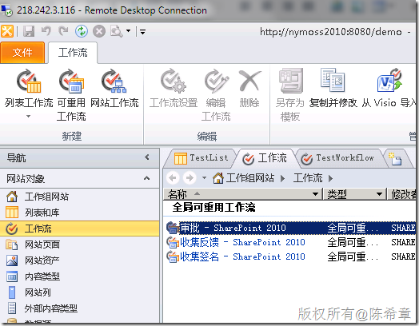](http://images.cnblogs.com/cnblogs_com/chenxizhang/WindowsLiveWriter/MOSS2010VisualStudio201030_DC84/image_40.png) 

 【注意】网站工作流将在下一篇介绍

 所以，我们的问题就是： **如何让一个流程（例如一个简单的审批流程）可以更加通用，例如可以绑定到不同的列表上面去？**

  

  

 第一步：创建一个内容类型
------------

 为什么要做这一步呢？其实不难理解的，因为既然你想在多个列表之间重用某个流程，那么这些列表肯定得有一定的公共之处吧？这是显而易见的。

 当然，你也可以不创建一个新的内容类型，而是为“任务”这种内容类型的所有列表实例去设计可重用的工作流，这个从本质上是一样的，因为“任务”其实就是一个内置的内容类型。从这个意义上说，内容类型是可重用工作流的一个基础。在下面的演示过程中，这一点将得到证明。

 好，闲话少说，我们创建了下面这样一个内容类型。这个类型是用来表示报销单的

 [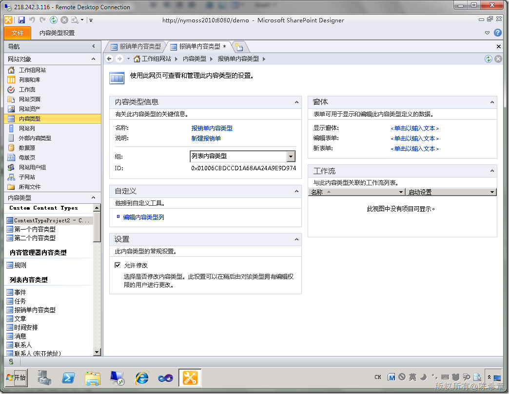](http://images.cnblogs.com/cnblogs_com/chenxizhang/WindowsLiveWriter/MOSS2010VisualStudio201030_DC84/image_44.png) 

 它有两个字段：标题和金额

 [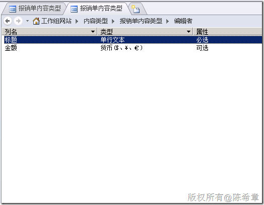](http://images.cnblogs.com/cnblogs_com/chenxizhang/WindowsLiveWriter/MOSS2010VisualStudio201030_DC84/image_46.png) 

  

 第二步：基于这个内容类型创建一个可重用工作流
----------------------

 接下来，我们可以针对这个内容类型创建一个可重用的工作流。作为演示目的，我们的流程逻辑做得简单一些：

 * 如果金额大于一定的数目，则要求经理审批
* 这个数目是可以配置的，也就是每个列表在具体绑定的时候，可以设置不同的值

 [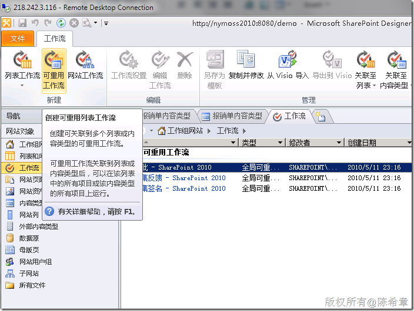](http://images.cnblogs.com/cnblogs_com/chenxizhang/WindowsLiveWriter/MOSS2010VisualStudio201030_DC84/image_48.png) 

 [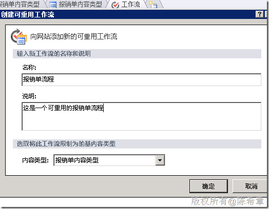](http://images.cnblogs.com/cnblogs_com/chenxizhang/WindowsLiveWriter/MOSS2010VisualStudio201030_DC84/image_50.png) 

 【注意】不出我们的意料，在创建可重用工作流的时候，就必须选择一个内容类型

 接下来的流程设计过程，我就不一一截图了。我首先定义了几个变量

 [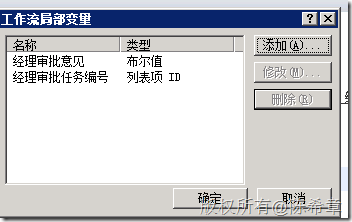](http://images.cnblogs.com/cnblogs_com/chenxizhang/WindowsLiveWriter/MOSS2010VisualStudio201030_DC84/image_58.png) 

 然后，为了让审批金额可以设置，我定义了一个关联和启动表单参数，并且默认值设置为500

 [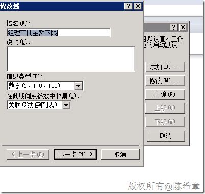](http://images.cnblogs.com/cnblogs_com/chenxizhang/WindowsLiveWriter/MOSS2010VisualStudio201030_DC84/image_54.png) [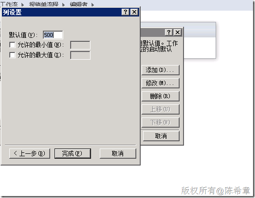](http://images.cnblogs.com/cnblogs_com/chenxizhang/WindowsLiveWriter/MOSS2010VisualStudio201030_DC84/image_56.png) 

 流程设计的结果大致如下

 [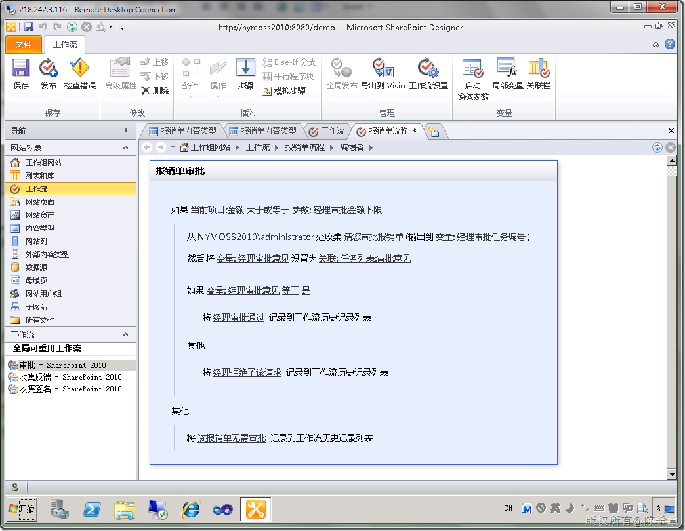](http://images.cnblogs.com/cnblogs_com/chenxizhang/WindowsLiveWriter/MOSS2010VisualStudio201030_DC84/image_60.png) 

  

 最后，保存并且发布该流程

  

 第三步：创建一个列表使用该内容类型
-----------------

 现在流程做好了，我们要着手准备一个列表来使用该流程。首先，我们需要创建这个列表，需要注意的是，我们需要让该表使用“报销单内容类型”

 [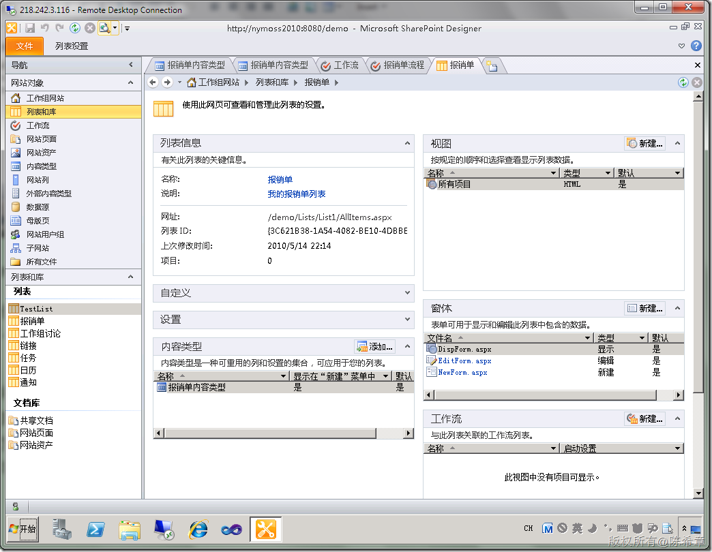](http://images.cnblogs.com/cnblogs_com/chenxizhang/WindowsLiveWriter/MOSS2010VisualStudio201030_DC84/image_62.png) 

 【注意】请注意，在内容类型这个区域，我们只保留了一个内容类型：“报销单内容类型”

  

 第四步：将工作流附加到这个列表
---------------

 现在工作流和列表都有了，那么接下来，如何将工作流与这个列表进行关联呢？

 [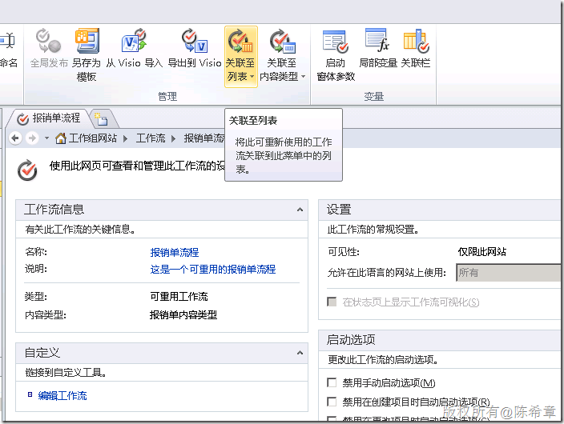](http://images.cnblogs.com/cnblogs_com/chenxizhang/WindowsLiveWriter/MOSS2010VisualStudio201030_DC84/image_64.png) 

 点击“关联至列表”按钮，会出现一个下拉列表

 [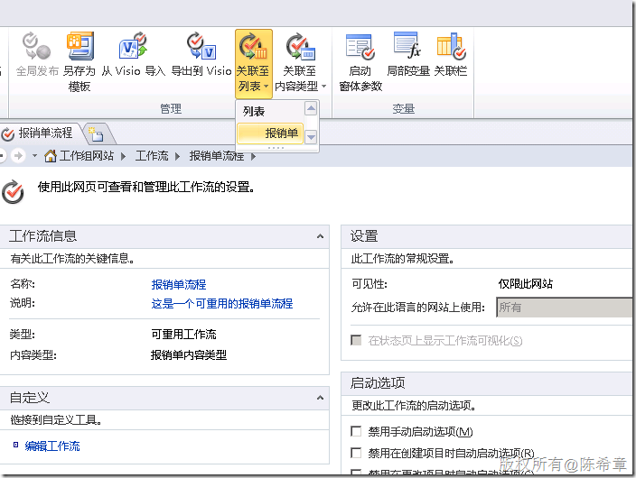](http://images.cnblogs.com/cnblogs_com/chenxizhang/WindowsLiveWriter/MOSS2010VisualStudio201030_DC84/image_66.png) 

 也就是说，它自动会检测当前网站中使用了“报销单内容类型”的列表。当前只有一个，就是“报销单”。点击这个列表，会转到IE窗口中

 [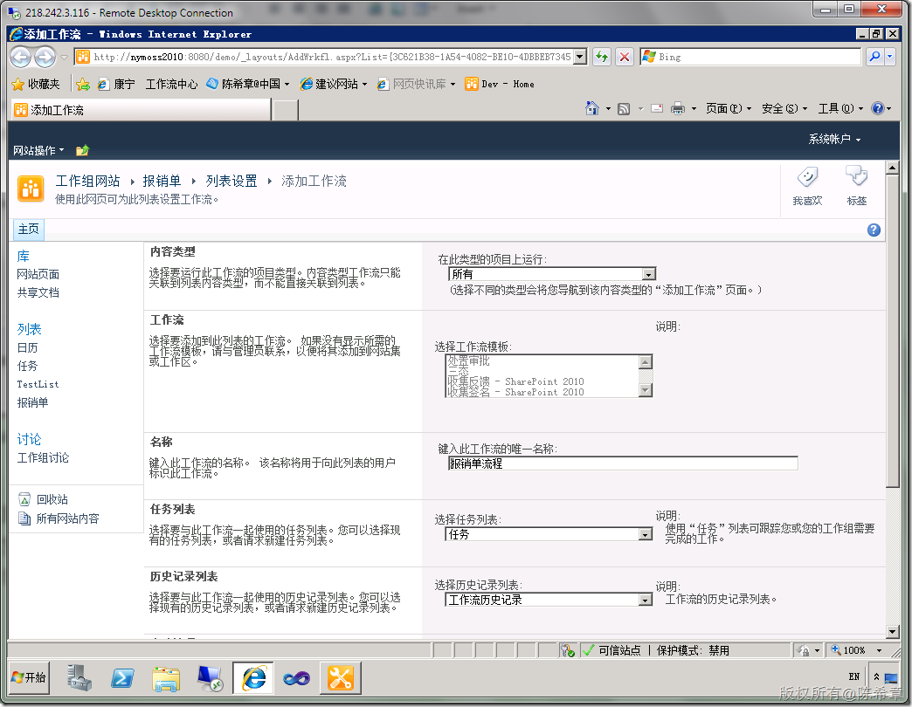](http://images.cnblogs.com/cnblogs_com/chenxizhang/WindowsLiveWriter/MOSS2010VisualStudio201030_DC84/image_68.png) 

 我们将内容类型的下拉框选择为“报销单内容类型”，请注意观察下面的工作流列表的变化

 [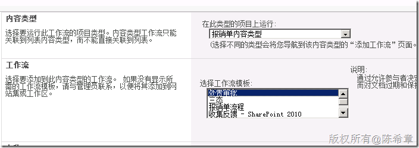](http://images.cnblogs.com/cnblogs_com/chenxizhang/WindowsLiveWriter/MOSS2010VisualStudio201030_DC84/image_70.png) 

 选中“报销单流程”，并且在下面的文本框中输入一个名称。当前页面其他的选项先不做更改

 [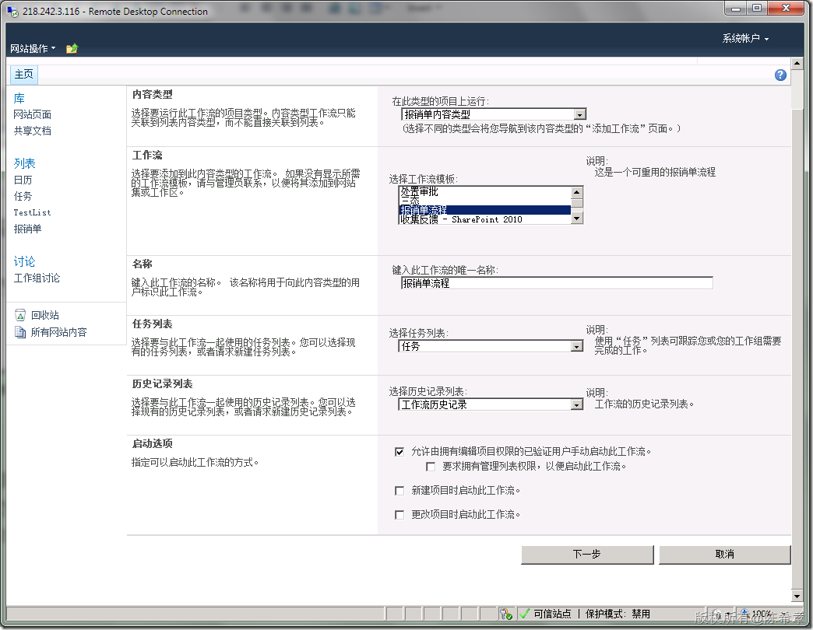](http://images.cnblogs.com/cnblogs_com/chenxizhang/WindowsLiveWriter/MOSS2010VisualStudio201030_DC84/image_72.png) 

 点击“下一步”，此时出现了一个界面，是让我们配置经理审批金额下限的

 [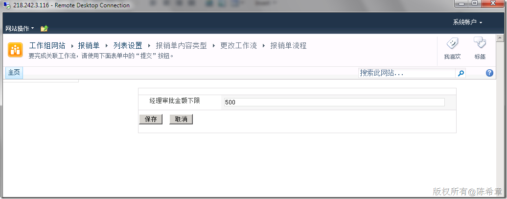](http://images.cnblogs.com/cnblogs_com/chenxizhang/WindowsLiveWriter/MOSS2010VisualStudio201030_DC84/image_74.png) 

 我这里先不做修改，保留500这个值，并且点击“保存”按钮。这样就实现了工作流与列表的关联了。

 [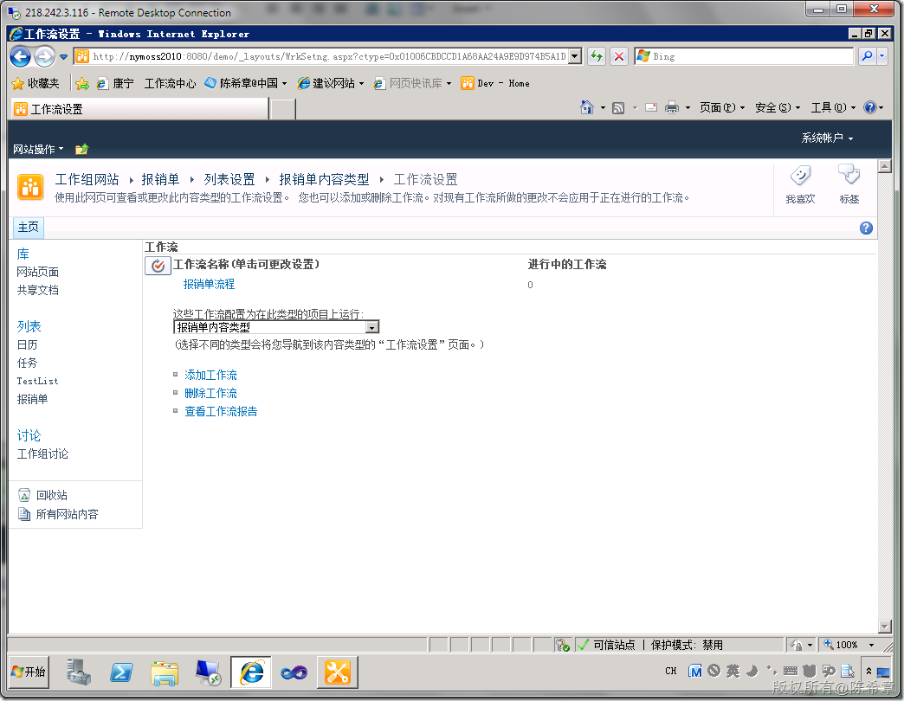](http://images.cnblogs.com/cnblogs_com/chenxizhang/WindowsLiveWriter/MOSS2010VisualStudio201030_DC84/image_76.png) 

 我们可以来测试一下这个流程，分别创建两个报销单，一个金额是小于500的，一个是大于500的。

 [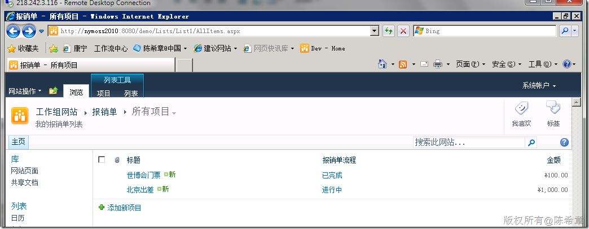](http://images.cnblogs.com/cnblogs_com/chenxizhang/WindowsLiveWriter/MOSS2010VisualStudio201030_DC84/image_78.png) 

 世博会门票因为金额小一些，所以直接无需审批就完成了

 [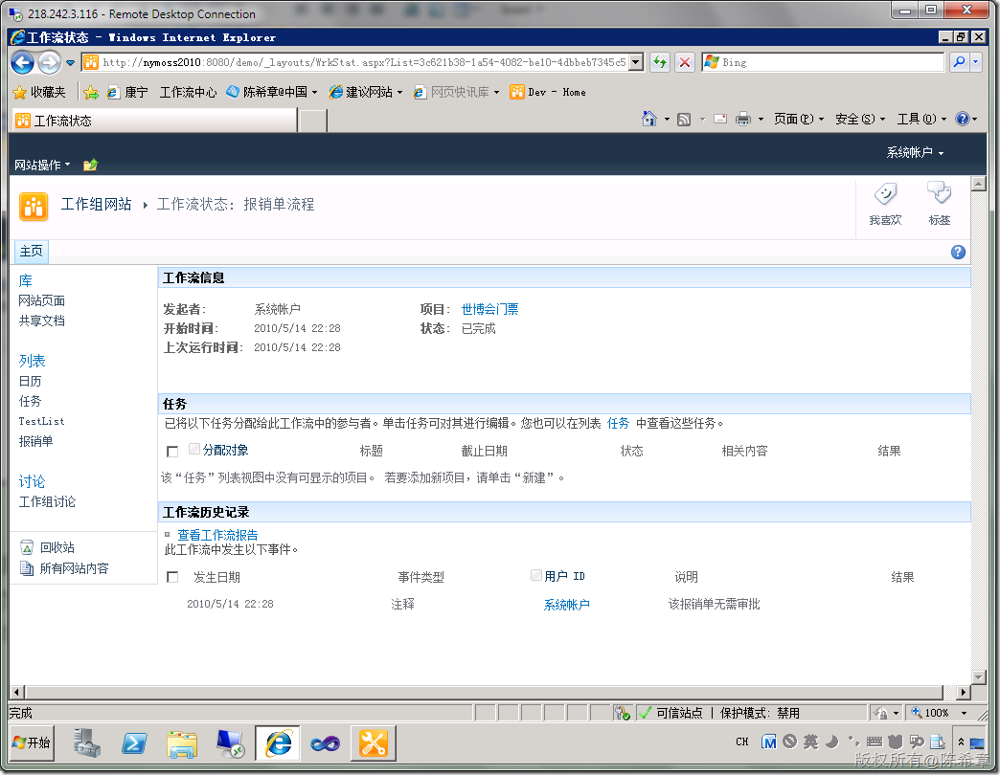](http://images.cnblogs.com/cnblogs_com/chenxizhang/WindowsLiveWriter/MOSS2010VisualStudio201030_DC84/image_80.png) 

 而北京出差因为高于了500，所以它需要经理审批

 [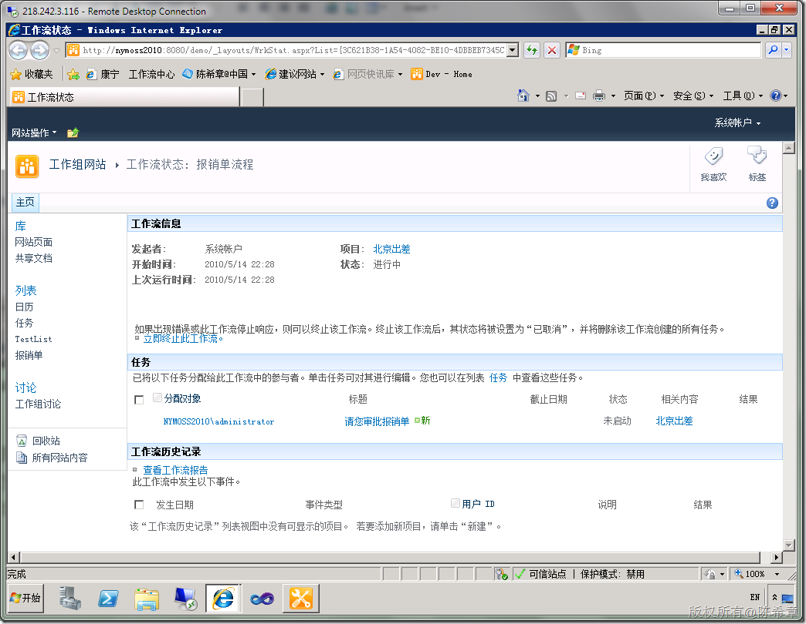](http://images.cnblogs.com/cnblogs_com/chenxizhang/WindowsLiveWriter/MOSS2010VisualStudio201030_DC84/image_82.png) 

 [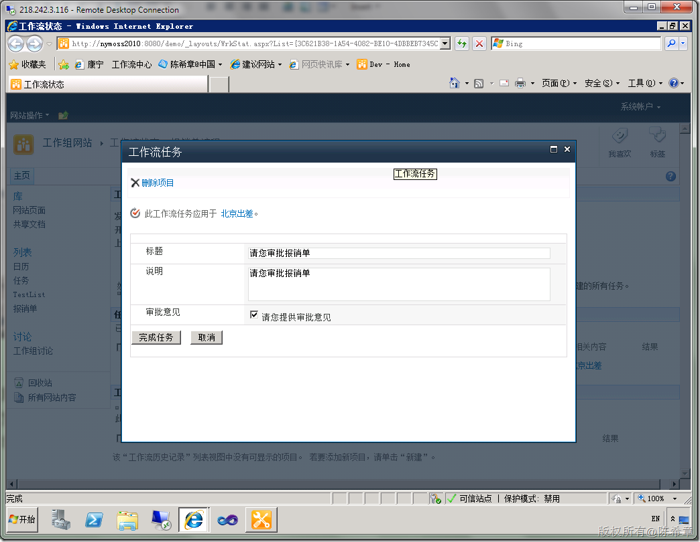](http://images.cnblogs.com/cnblogs_com/chenxizhang/WindowsLiveWriter/MOSS2010VisualStudio201030_DC84/image_84.png) 

  

 第五步：重复前面两步，再创建一个新列表，并且将工作流绑定到它上面
--------------------------------

 这一步我就不截图了。大家有兴趣可以试一下，应该是没有什么问题的。这样才称为可重用的工作流嘛

  

  

 总结：
---

 这一篇，我们讲解了什么是可重用工作流，以及如何重用它。

