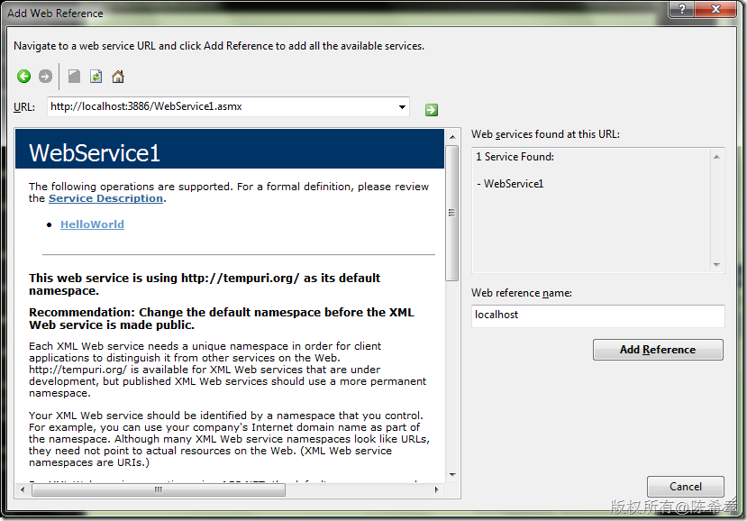
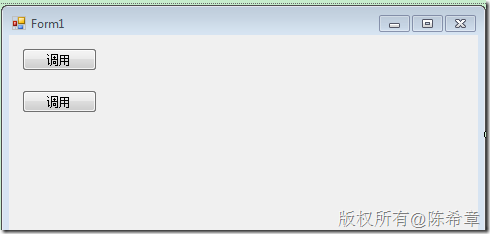
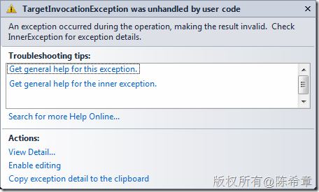
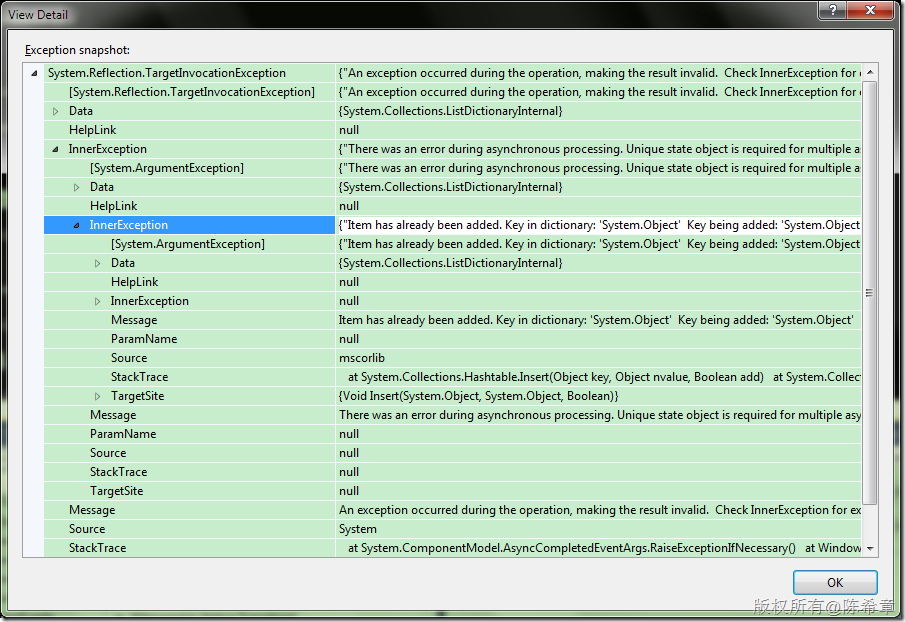
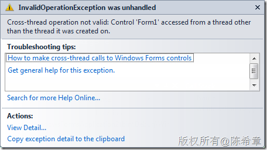
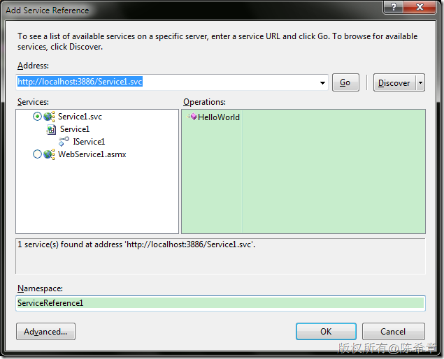
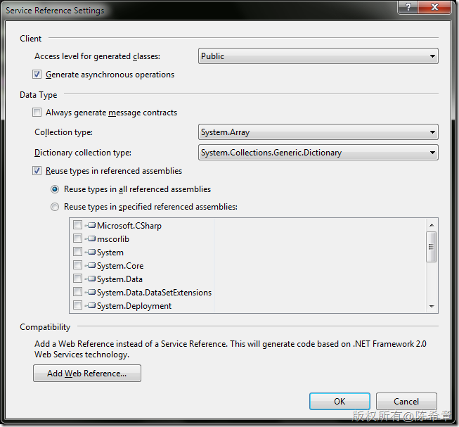

# XML Web Service并发异步调用的问题及其解决方案 
> 原文发表于 2010-05-31, 地址: http://www.cnblogs.com/chenxizhang/archive/2010/05/31/1747812.html 


最近在忙些其他项目的事情，之前的[MOSS 2010开发系列](http://www.cnblogs.com/chenxizhang/category/243016.html)暂时搁一搁了。这个项目是传统的C/S架构，有客户端，有服务器。客户那边的环境还比较老，是Windows Server 2000. 很不幸的是，Windows Server 2000是不可以安装.NET Framework 3.5的（这个问题我之前也提到过），所以其实有很多东西得用比较早的技术去实现。一个典型的例子就是，在服务层的设计里面，我被迫放弃了WCF，而是采用了XML Web Service的方式。当然，咱对Web Service很熟悉，也很亲切。这不存在什么问题。

 今天，要谈一个小问题，也是我们总结归纳出来在使用XML Web Service的场景下，如果需要并发地发起异步调用，而且是共享一个代理类的实例的话，可能出现的一些问题及其解决方法。记得很早之前某同学也跟我说到过这个问题，今天还是总结一下吧

 闲话少说，我们来看一个例子吧

 1. 采用Web Service的标准做法
---------------------

 创建Web Service


```
using System.Web.Services;
using System.Threading;

namespace WebApplication1
{
    /// <summary>
    /// Summary description for WebService1
    /// </summary>
    [WebService(Namespace = "http://tempuri.org/")]
    [WebServiceBinding(ConformsTo = WsiProfiles.BasicProfile1\_1)]
    [System.ComponentModel.ToolboxItem(false)]
    // To allow this Web Service to be called from script, using ASP.NET AJAX, uncomment the following line. 
    // [System.Web.Script.Services.ScriptService]
    public class WebService1 : System.Web.Services.WebService
    {

        [WebMethod]
        public string HelloWorld()
        {
            Thread.Sleep(10 * 1000);
            return "Hello World";
        }
    }
}

```

【注意】为了做异步调用的演示，我这里简单地让该方法休眠了10秒钟后返回。


.csharpcode, .csharpcode pre
{
 font-size: small;
 color: black;
 font-family: consolas, "Courier New", courier, monospace;
 background-color: #ffffff;
 /*white-space: pre;*/
}
.csharpcode pre { margin: 0em; }
.csharpcode .rem { color: #008000; }
.csharpcode .kwrd { color: #0000ff; }
.csharpcode .str { color: #006080; }
.csharpcode .op { color: #0000c0; }
.csharpcode .preproc { color: #cc6633; }
.csharpcode .asp { background-color: #ffff00; }
.csharpcode .html { color: #800000; }
.csharpcode .attr { color: #ff0000; }
.csharpcode .alt 
{
 background-color: #f4f4f4;
 width: 100%;
 margin: 0em;
}
.csharpcode .lnum { color: #606060; }


创建客户端代理


[](http://images.cnblogs.com/cnblogs_com/chenxizhang/WindowsLiveWriter/XMLWebService_7AE3/image_2.png) 


创建简单的界面来实施调用


[](http://images.cnblogs.com/cnblogs_com/chenxizhang/WindowsLiveWriter/XMLWebService_7AE3/image_4.png) 


 


编写如下简单的代码


```
using System;
using System.Windows.Forms;

namespace WindowsFormsApplication1
{
    public partial class Form1 : Form
    {
        public Form1()
        {
            InitializeComponent();
        }


        localhost.WebService1 proxy = new localhost.WebService1();

        private void button1\_Click(object sender, EventArgs e)
        {
            proxy.HelloWorldCompleted += (obj, a) =>
            {
                MessageBox.Show(a.Result);
            };
            proxy.HelloWorldAsync();
        }

        private void button2\_Click(object sender, EventArgs e)
        {
            proxy.HelloWorldCompleted += (obj, a) =>
            {
                MessageBox.Show(a.Result);
            };
            proxy.HelloWorldAsync();


        }
    }
}

```

.csharpcode, .csharpcode pre
{
 font-size: small;
 color: black;
 font-family: consolas, "Courier New", courier, monospace;
 background-color: #ffffff;
 /*white-space: pre;*/
}
.csharpcode pre { margin: 0em; }
.csharpcode .rem { color: #008000; }
.csharpcode .kwrd { color: #0000ff; }
.csharpcode .str { color: #006080; }
.csharpcode .op { color: #0000c0; }
.csharpcode .preproc { color: #cc6633; }
.csharpcode .asp { background-color: #ffff00; }
.csharpcode .html { color: #800000; }
.csharpcode .attr { color: #ff0000; }
.csharpcode .alt 
{
 background-color: #f4f4f4;
 width: 100%;
 margin: 0em;
}
.csharpcode .lnum { color: #606060; }

【注意】这里两个按钮的事件是一模一样的。


因为在一个窗体里面，我们当然希望proxy是共用的（推而广之，甚至在整个应用程序都只有一个实例）。然后在每个方法中调用它的一些方法。


代码看起来很合理，不是吗？那么，我们来看一下运行起来会怎么样？Oooop,我们收到了一个错误


[](http://images.cnblogs.com/cnblogs_com/chenxizhang/WindowsLiveWriter/XMLWebService_7AE3/image_6.png) 


[](http://images.cnblogs.com/cnblogs_com/chenxizhang/WindowsLiveWriter/XMLWebService_7AE3/image_8.png) 


一堆让你看得头疼（甚至有些不知所云）的错误消息对吧，其实简单来说，就是**XML Web Service的机制，不允许在一个异步请求没有返回之前，再发起另外一个异步请求**。这个其实与AJAX里面的机制有相似的。


anyway，我们如何解决这个问题呢？


 


2.采用多个proxy实例的做法来解决
-------------------


大家很容易想到的一个做法是，既然一个Proxy不能同时发起多个异步调用，那么创建多个不就可以了么？


```
using System;
using System.Windows.Forms;

namespace WindowsFormsApplication1
{
    public partial class Form1 : Form
    {
        public Form1()
        {
            InitializeComponent();
        }


        private void button1\_Click(object sender, EventArgs e)
        {
            **localhost.WebService1 proxy = new localhost.WebService1();**

            proxy.HelloWorldCompleted += (obj, a) =>
            {
                MessageBox.Show(a.Result);
            };
            proxy.HelloWorldAsync();
        }

        private void button2\_Click(object sender, EventArgs e)
        {
            localhost.WebService1 proxy = new localhost.WebService1();

            proxy.HelloWorldCompleted += (obj, a) =>
            {
                MessageBox.Show(a.Result);
            };
            proxy.HelloWorldAsync();


        }
    }
}

```

谁说不是呢，你当然可以像上面这样做，而且我可以担保它不会再报告那个错误啦。


这里唯一的问题就是：我们创建了多个Proxy的实例。从一个严肃的程序员的角度来说，似乎这是不可以接受的。创建新的对象实例毕竟需要成本。


3. 使用ThreadPool发起同步的调用
----------------------


让我们来思考一下这个问题，它的本质是，如果你采用异步调用，则无法同时发起多个请求（对同一个proxy而言）。那么如果是同步调用的话，就自然没有这个问题了吧。但是，如果同步调用的话，却又会阻塞线程，导致你根本无法发起第二个请求。


这有何难呢？我们大不了可以开两个线程，然后让这两个线程同时工作，在它们上面运行各自的同步调用方法，不就可以了么？为了让大家更好地理解，我用最简单的做法来实现吧


ThreadPool是一个静态类，顾名思义，它代表了线程池的概念。对于初学者而言，创建和控制线程并非易事。所以，.NET提供了这个ThreadPool，实际上相当于是傻瓜式的多线程（多任务）的接口。


```
using System;
using System.Windows.Forms;
using System.Threading;

namespace WindowsFormsApplication1
{
    public partial class Form1 : Form
    {
        public Form1()
        {
            InitializeComponent();
        }


        localhost.WebService1 proxy = new localhost.WebService1();

        private void button1\_Click(object sender, EventArgs e)
        {
            ThreadPool.QueueUserWorkItem(
                (obj) =>
                {
                    var result = proxy.HelloWorld();
                    MessageBox.Show(result);
                });


        }

        private void button2\_Click(object sender, EventArgs e)
        {

            ThreadPool.QueueUserWorkItem(
                (obj) =>
                {
                    var result = proxy.HelloWorld();
                    MessageBox.Show(result);
                });


        }
    }
}

```

.csharpcode, .csharpcode pre
{
 font-size: small;
 color: black;
 font-family: consolas, "Courier New", courier, monospace;
 background-color: #ffffff;
 /*white-space: pre;*/
}
.csharpcode pre { margin: 0em; }
.csharpcode .rem { color: #008000; }
.csharpcode .kwrd { color: #0000ff; }
.csharpcode .str { color: #006080; }
.csharpcode .op { color: #0000c0; }
.csharpcode .preproc { color: #cc6633; }
.csharpcode .asp { background-color: #ffff00; }
.csharpcode .html { color: #800000; }
.csharpcode .attr { color: #ff0000; }
.csharpcode .alt 
{
 background-color: #f4f4f4;
 width: 100%;
 margin: 0em;
}
.csharpcode .lnum { color: #606060; }

 


ThreadPool类型有一个静态方法，QueueUserWorkItem，顾名思义就是将用户任务排进队列，等待执行。你可能会说，那么这是要排队么？当然，但是既然称为Pool，也即是池，就自然不止一个线程，它里面有好多个线程可以使用，自然就可以同时运行多个任务了。关于这一点，大家可以类比一下我们在超市买完东西之后，去收银台付费的情况。（很多大超市都有声势浩大的一排收银台）


【注意】要实现多线程还有很多做法，例如下面这样无疑也是可以的


```
using System;
using System.Windows.Forms;
using System.Threading;

namespace WindowsFormsApplication1
{
    public partial class Form1 : Form
    {
        public Form1()
        {
            InitializeComponent();
        }


        localhost.WebService1 proxy = new localhost.WebService1();

        private void button1\_Click(object sender, EventArgs e)
        {

            (new Thread((obj) =>
            {
                var result = proxy.HelloWorld();
                MessageBox.Show(result);
            })).Start();

        }

        private void button2\_Click(object sender, EventArgs e)
        {

            (new Thread((obj) =>
            {
                var result = proxy.HelloWorld();
                MessageBox.Show(result);
            })).Start();
        }
    }
}

```

.csharpcode, .csharpcode pre
{
 font-size: small;
 color: black;
 font-family: consolas, "Courier New", courier, monospace;
 background-color: #ffffff;
 /*white-space: pre;*/
}
.csharpcode pre { margin: 0em; }
.csharpcode .rem { color: #008000; }
.csharpcode .kwrd { color: #0000ff; }
.csharpcode .str { color: #006080; }
.csharpcode .op { color: #0000c0; }
.csharpcode .preproc { color: #cc6633; }
.csharpcode .asp { background-color: #ffff00; }
.csharpcode .html { color: #800000; }
.csharpcode .attr { color: #ff0000; }
.csharpcode .alt 
{
 background-color: #f4f4f4;
 width: 100%;
 margin: 0em;
}
.csharpcode .lnum { color: #606060; }

这个做法，是由我们自己创建并启动了一个线程。这看起来虽然比较刺激，但并见得是多么好的一个做法。尤其是你对线程操作并不是特别熟悉的情况下，我推荐你还是多用ThreadPool


至于，其他的做法（如Backgroundworker，以及自定义Callback等），这里就不列举了。


4. 线程安全问题
---------


这样做，看起来是解决了问题了。但是大家要知道，通常情况下，我们希望调用Web Service获得的结果，能进一步地进行处理，或者要显示在界面上。例如下面这样


```
using System;
using System.Windows.Forms;
using System.Threading;

namespace WindowsFormsApplication1
{
    public partial class Form1 : Form
    {
        public Form1()
        {
            InitializeComponent();
        }


        localhost.WebService1 proxy = new localhost.WebService1();

        private void button1\_Click(object sender, EventArgs e)
        {

            ThreadPool.QueueUserWorkItem(
                (obj) =>
                {
                    var result = proxy.HelloWorld();
                    **this.Text = result;//将结果显示在窗体的标题上**
                });

        }

        private void button2\_Click(object sender, EventArgs e)
        {

            ThreadPool.QueueUserWorkItem(
                (obj) =>
                {
                    var result = proxy.HelloWorld();
                    **this.Text = result;**
                });
        }
    }
}

```

.csharpcode, .csharpcode pre
{
 font-size: small;
 color: black;
 font-family: consolas, "Courier New", courier, monospace;
 background-color: #ffffff;
 /*white-space: pre;*/
}
.csharpcode pre { margin: 0em; }
.csharpcode .rem { color: #008000; }
.csharpcode .kwrd { color: #0000ff; }
.csharpcode .str { color: #006080; }
.csharpcode .op { color: #0000c0; }
.csharpcode .preproc { color: #cc6633; }
.csharpcode .asp { background-color: #ffff00; }
.csharpcode .html { color: #800000; }
.csharpcode .attr { color: #ff0000; }
.csharpcode .alt 
{
 background-color: #f4f4f4;
 width: 100%;
 margin: 0em;
}
.csharpcode .lnum { color: #606060; }

 


再次运行这个代码就会发现，它又报错了，这回报告的错误是下面这样的


[](http://images.cnblogs.com/cnblogs_com/chenxizhang/WindowsLiveWriter/XMLWebService_7AE3/image_10.png) 


这个错误的意思是说，当前的线程需要访问控件”Form1”，但是Form1并不是它所创建的。什么是当前线程？就是我们用ThreadPool发起的一个任务所占用的线程。而Form1这个控件是谁创建的呢？是主线程创建的。


这就是我们常说的线程安全性问题，也就是说，在多个不同的线程之间是不能互相访问到一些资源的。还是用超市的收银做例子，如果我是排在1号收银台，那么2号收银员是不可以把我的钱拿走的。


那么，如何解决这个问题呢？其实这还是比较简单的，Windows Forms(或者WPF)都内置了一些机制来解决


```
using System;
using System.Windows.Forms;
using System.Threading;

namespace WindowsFormsApplication1
{
    public partial class Form1 : Form
    {
        public Form1()
        {
            InitializeComponent();
        }


        localhost.WebService1 proxy = new localhost.WebService1();

        private void button1\_Click(object sender, EventArgs e)
        {

            ThreadPool.QueueUserWorkItem(
                (obj) =>
                {
                    var result = proxy.HelloWorld();
                    this.BeginInvoke(new Action(() =>
                    {
                        this.Text = result;//将结果显示在窗体的标题上
                    }));
                });

        }

        private void button2\_Click(object sender, EventArgs e)
        {

            ThreadPool.QueueUserWorkItem(
                (obj) =>
                {
                    var result = proxy.HelloWorld();
                    this.BeginInvoke(new Action(() =>
                    {
                        this.Text = result;//将结果显示在窗体的标题上
                    }));
                });
        }
    }
}

```


.csharpcode, .csharpcode pre
{
 font-size: small;
 color: black;
 font-family: consolas, "Courier New", courier, monospace;
 background-color: #ffffff;
 /*white-space: pre;*/
}
.csharpcode pre { margin: 0em; }
.csharpcode .rem { color: #008000; }
.csharpcode .kwrd { color: #0000ff; }
.csharpcode .str { color: #006080; }
.csharpcode .op { color: #0000c0; }
.csharpcode .preproc { color: #cc6633; }
.csharpcode .asp { background-color: #ffff00; }
.csharpcode .html { color: #800000; }
.csharpcode .attr { color: #ff0000; }
.csharpcode .alt 
{
 background-color: #f4f4f4;
 width: 100%;
 margin: 0em;
}
.csharpcode .lnum { color: #606060; }


【注意】如果是在WPF中，则是用Dispatcher.BeginInvoke


 


5. WCF中是否有这个问题
--------------


有些朋友可能会接着问道，那么这个问题是否在WCF中也存在呢？我们还是以事实为依据，看一个例子吧


 


创建一个WCF服务


服务契约


```
using System.ServiceModel;

namespace WebApplication1
{
    // NOTE: You can use the "Rename" command on the "Refactor" menu to change the interface name "IService1" in both code and config file together.
    [ServiceContract]
    public interface IService1
    {


        [OperationContract]
        string HelloWorld();
    }
}

```

.csharpcode, .csharpcode pre
{
 font-size: small;
 color: black;
 font-family: consolas, "Courier New", courier, monospace;
 background-color: #ffffff;
 /*white-space: pre;*/
}
.csharpcode pre { margin: 0em; }
.csharpcode .rem { color: #008000; }
.csharpcode .kwrd { color: #0000ff; }
.csharpcode .str { color: #006080; }
.csharpcode .op { color: #0000c0; }
.csharpcode .preproc { color: #cc6633; }
.csharpcode .asp { background-color: #ffff00; }
.csharpcode .html { color: #800000; }
.csharpcode .attr { color: #ff0000; }
.csharpcode .alt 
{
 background-color: #f4f4f4;
 width: 100%;
 margin: 0em;
}
.csharpcode .lnum { color: #606060; }

服务实现


```
using System.Threading;

namespace WebApplication1
{
    // NOTE: You can use the "Rename" command on the "Refactor" menu to change the class name "Service1" in code, svc and config file together.
    public class Service1 : IService1
    {
        #region IService1 Members

        public string HelloWorld()
        {
            Thread.Sleep(10 * 1000);
            return "Hello,world";
        }

        #endregion
    }
}

```


.csharpcode, .csharpcode pre
{
 font-size: small;
 color: black;
 font-family: consolas, "Courier New", courier, monospace;
 background-color: #ffffff;
 /*white-space: pre;*/
}
.csharpcode pre { margin: 0em; }
.csharpcode .rem { color: #008000; }
.csharpcode .kwrd { color: #0000ff; }
.csharpcode .str { color: #006080; }
.csharpcode .op { color: #0000c0; }
.csharpcode .preproc { color: #cc6633; }
.csharpcode .asp { background-color: #ffff00; }
.csharpcode .html { color: #800000; }
.csharpcode .attr { color: #ff0000; }
.csharpcode .alt 
{
 background-color: #f4f4f4;
 width: 100%;
 margin: 0em;
}
.csharpcode .lnum { color: #606060; }

添加服务引用


[](http://images.cnblogs.com/cnblogs_com/chenxizhang/WindowsLiveWriter/XMLWebService_7AE3/image_12.png) 


【注意】这里不要着急点击“Ok”，而是点击“Advanced…”


[](http://images.cnblogs.com/cnblogs_com/chenxizhang/WindowsLiveWriter/XMLWebService_7AE3/image_14.png) 


勾选上：Generate asynchronous operations，也就是说生成异步的操作。因为WCF服务引用默认是不生成异步操作的


```
using System;
using System.Windows.Forms;
using System.Threading;

namespace WindowsFormsApplication1
{
    public partial class Form1 : Form
    {
        public Form1()
        {
            InitializeComponent();
        }


        **ServiceReference1.Service1Client proxy = new ServiceReference1.Service1Client();**

        private void button1\_Click(object sender, EventArgs e)
        {

            proxy.HelloWorldCompleted += (obj, a) =>
            {
                MessageBox.Show(a.Result);
            };

            proxy.HelloWorldAsync();
            
        }

        private void button2\_Click(object sender, EventArgs e)
        {
            proxy.HelloWorldCompleted += (obj, a) =>
            {
                MessageBox.Show(a.Result);
            };

            proxy.HelloWorldAsync();
            
        }
    }
}

```

.csharpcode, .csharpcode pre
{
 font-size: small;
 color: black;
 font-family: consolas, "Courier New", courier, monospace;
 background-color: #ffffff;
 /*white-space: pre;*/
}
.csharpcode pre { margin: 0em; }
.csharpcode .rem { color: #008000; }
.csharpcode .kwrd { color: #0000ff; }
.csharpcode .str { color: #006080; }
.csharpcode .op { color: #0000c0; }
.csharpcode .preproc { color: #cc6633; }
.csharpcode .asp { background-color: #ffff00; }
.csharpcode .html { color: #800000; }
.csharpcode .attr { color: #ff0000; }
.csharpcode .alt 
{
 background-color: #f4f4f4;
 width: 100%;
 margin: 0em;
}
.csharpcode .lnum { color: #606060; }

我们现在发现，两次调用并不会触发任何的错误。看起来WCF是允许并发异步调用的。


**但是**，令人惊讶的事情再次发生了，就是虽然这两次调用都会返回结果，但那个MessageBox.Show方法却会被执行四次。两次调用会导致四次的返回（或者叫后续处理），这又是为什么呢？这个问题就留给读者自己琢磨一下吧


【注意】如果有10个请求同时发出，那么会有多少该处理呢？10的平方，也就是100次。


所以，WCF的机制其实并没有本质上的改变。**遇到需要并发异步调用远端服务这种需求，我还是推荐你用ThreadPool，直接发起同步调用吧**。


这就是本文的结论。

