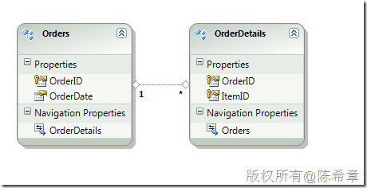

# ADO.NET Data Service中更新和查询一对多实体集的注意事项 
> 原文发表于 2010-06-04, 地址: http://www.cnblogs.com/chenxizhang/archive/2010/06/04/1751327.html 


尽管有人不喜欢ADO.NET Data Service，或者也有人不喜欢LINQ to SQL以及Entity Framework。但我还是愿意写这一篇文章，这是我在用的时候遇到的一个问题和解决方法。写出来，也可以为以后有类似问题的朋友提供一些帮助吧

  

 如果你不了解什么是ADO.NET Data Service，可以参考下面的一些链接和我之前的一些文章

 <http://kb.cnblogs.com/page/43963/?page=1>

 #### [ADO.NET Data Service之CRUD操作](http://www.cnblogs.com/chenxizhang/archive/2010/02/28/1675306.html)

 #### [如何在AJAX应用中访问ADO.NET Data Service](http://www.cnblogs.com/chenxizhang/archive/2010/02/28/1675304.html)

 #### [如何在AJAX应用中访问ADO.NET Data Service（续）——基于jquery框架](http://www.cnblogs.com/chenxizhang/archive/2010/02/28/1675305.html)

 #### [再谈谈ADO.NET Data Service](http://www.cnblogs.com/chenxizhang/archive/2009/05/18/1459533.html)

 #### [ADO.NET Data Service中如何自定义Operation](http://www.cnblogs.com/chenxizhang/archive/2010/02/28/1675270.html)

 #### [ADO.NET Data Service:如何做身份验证](http://www.cnblogs.com/chenxizhang/archive/2010/02/28/1675307.html)

  

 上面的一些文章从不同的角度介绍了ADO.NET Data Service，其实你也不必感到惊慌，要学习ADO.NET Data Service还是不太难的。

 好吧，言归正传吧，我今天要讲的一个问题是如何实现一对多实体集的更新

 1. 实体模型
-------

 [](http://images.cnblogs.com/cnblogs_com/chenxizhang/WindowsLiveWriter/ADO.NETDataService_B14E/image_2.png) 

 从字面上就可以看出，这是一个订单和订单明细组成的一对多关系。一个订单可以拥有多个订单明细。

 2. 正常情况
-------

 正常的Entity Framework中是如何实现插入一个订单并且附带插入多个订单明细呢？


```
            var ctx = new TestEntities();
            var order = new Orders() { OrderDate = DateTime.Now };//因为OrderID是自动递增的，所以无需提供
            order.OrderDetails.Add(new OrderDetails() { ItemID = 1 });
            order.OrderDetails.Add(new OrderDetails() { ItemID = 2 });
            //因为OrderDetails的OrderID是与Order关联的，所以也不需要提供

            ctx.AddToOrders(order);
            ctx.SaveChanges();
```


.csharpcode, .csharpcode pre
{
 font-size: small;
 color: black;
 font-family: consolas, "Courier New", courier, monospace;
 background-color: #ffffff;
 /*white-space: pre;*/
}
.csharpcode pre { margin: 0em; }
.csharpcode .rem { color: #008000; }
.csharpcode .kwrd { color: #0000ff; }
.csharpcode .str { color: #006080; }
.csharpcode .op { color: #0000c0; }
.csharpcode .preproc { color: #cc6633; }
.csharpcode .asp { background-color: #ffff00; }
.csharpcode .html { color: #800000; }
.csharpcode .attr { color: #ff0000; }
.csharpcode .alt 
{
 background-color: #f4f4f4;
 width: 100%;
 margin: 0em;
}
.csharpcode .lnum { color: #606060; }


3.在ADO.NET Data Service的客户端中如何做？
--------------------------------


上述的代码，如果拿到ADO.NET Data Service的客户端中来，稍作修改，就能够执行，而且不会报任何错误。但问题在于：


它只是插入了订单资料，而会忽略订单明细资料


 


这是为什么呢？简单的解释就是，因为ADO.NET Data Service是基于http的一个服务，考虑到数据量以及实际应用的情况，所以默认情况下，它是不会将一个对象所关联的其他对象都加载进来的，反过来讲也是一样，它不会自动将对象关联起来。也就是说，上面我们添加的两个OrderDetails的对象，其实没有跟Order进行关联，既然没有关联，自然就不会更新。


 


那么应该怎么修改代码，才可以完成这个操作呢？


```
            var ctx = new localhost.TestEntities(new Uri("http://localhost:7949/WcfDataService.svc/"));
            var o = new localhost.Orders() { OrderDate = DateTime.Now };
            
            
            ctx.AddToOrders(o);
            ctx.AddRelatedObject(o, "OrderDetails", new localhost.OrderDetails() {ItemID = 2});
            ctx.AddRelatedObject(o, "OrderDetails", new localhost.OrderDetails() { ItemID = 3 });
            ctx.SaveChanges();
```

.csharpcode, .csharpcode pre
{
 font-size: small;
 color: black;
 font-family: consolas, "Courier New", courier, monospace;
 background-color: #ffffff;
 /*white-space: pre;*/
}
.csharpcode pre { margin: 0em; }
.csharpcode .rem { color: #008000; }
.csharpcode .kwrd { color: #0000ff; }
.csharpcode .str { color: #006080; }
.csharpcode .op { color: #0000c0; }
.csharpcode .preproc { color: #cc6633; }
.csharpcode .asp { background-color: #ffff00; }
.csharpcode .html { color: #800000; }
.csharpcode .attr { color: #ff0000; }
.csharpcode .alt 
{
 background-color: #f4f4f4;
 width: 100%;
 margin: 0em;
}
.csharpcode .lnum { color: #606060; }

 


注意，我们需要明确地AddRelatedObject.关于这一点，MSDN中也有明确的讲解。


 


 


4.附录： 理解延迟加载
------------


本文附带讲一下所谓的延迟加载问题。刚才说到了，考虑数据量的问题，LINQ to SQL或者Entity Framework默认是不会自动加载一个对象所有的关联对象的。这有显而易见的好处，例如一个对象会有好多层的关联（例如：公司=》员工=》订单=》订单明细=》产品），如果全部加载进来非但耗时费力，也不是用户所需要的。


延迟加载当然也有一个问题，就是它需要多次发起数据库查询。这是无法避免的，因为毕竟它需要加载过来。但这一点仍然是让人可以理解的，至少它是按需发起这些请求。


我给大家看一个简单的代码


```
            var ctx = new TestEntities();
            var order = ctx.Orders.FirstOrDefault(o => o.OrderID == 15);
            MessageBox.Show(order.OrderDate.ToString());
            MessageBox.Show(order.OrderDetails.Count.ToString());
```

这个查询很简单，它获取到一个订单对象，然后读取它的订购日期，然后还需要读取它的订单明细个数。那么，在延迟加载的情况下，需要几次数据库访问呢？答案是：两次。


[](http://images.cnblogs.com/cnblogs_com/chenxizhang/WindowsLiveWriter/ADO.NETDataService_B14E/image_4.png) 


值得注意的是，第二个查询是直到我们请求了order.OrderDetails.Count.ToString()才会运行的。
.csharpcode, .csharpcode pre
{
 font-size: small;
 color: black;
 font-family: consolas, "Courier New", courier, monospace;
 background-color: #ffffff;
 /*white-space: pre;*/
}
.csharpcode pre { margin: 0em; }
.csharpcode .rem { color: #008000; }
.csharpcode .kwrd { color: #0000ff; }
.csharpcode .str { color: #006080; }
.csharpcode .op { color: #0000c0; }
.csharpcode .preproc { color: #cc6633; }
.csharpcode .asp { background-color: #ffff00; }
.csharpcode .html { color: #800000; }
.csharpcode .attr { color: #ff0000; }
.csharpcode .alt 
{
 background-color: #f4f4f4;
 width: 100%;
 margin: 0em;
}
.csharpcode .lnum { color: #606060; }


 


那么，如果你在某些场合，确实想预先加载，不想延迟加载的话，你该怎么做呢？


```
            var ctx = new TestEntities();
            var order = ctx.Orders.FirstOrDefault(o => o.OrderID == 15);
            ctx.LoadProperty(order, "OrderDetails");
            MessageBox.Show(order.OrderDate.ToString());
            MessageBox.Show(order.OrderDetails.Count.ToString());
```


.csharpcode, .csharpcode pre
{
 font-size: small;
 color: black;
 font-family: consolas, "Courier New", courier, monospace;
 background-color: #ffffff;
 /*white-space: pre;*/
}
.csharpcode pre { margin: 0em; }
.csharpcode .rem { color: #008000; }
.csharpcode .kwrd { color: #0000ff; }
.csharpcode .str { color: #006080; }
.csharpcode .op { color: #0000c0; }
.csharpcode .preproc { color: #cc6633; }
.csharpcode .asp { background-color: #ffff00; }
.csharpcode .html { color: #800000; }
.csharpcode .attr { color: #ff0000; }
.csharpcode .alt 
{
 background-color: #f4f4f4;
 width: 100%;
 margin: 0em;
}
.csharpcode .lnum { color: #606060; }

大家注意看，我们可以添加一个LoadProperty的方法。就可以实现这样的功能。


 


【注意】即便添加了这个方法，查询还是分成了两次，如下


[](http://images.cnblogs.com/cnblogs_com/chenxizhang/WindowsLiveWriter/ADO.NETDataService_B14E/image_6.png) 


这是Entity Framework与LINQ TO SQL不一样的。在LINQ TO SQL中（用LoadWith方法），如果是预先加载就只有一个查询语句了。（那个语句，可能很复杂）


你可能会说，这个看起来没有什么优势啊，不是仍然需要两次查询码？这里的关键在于发起查询的时间。


而尤其重要的一点是，如果你是使用ADO.NET Data Service编程，而不是直接使用Entity Framework。那么LoadProperty却是必须的，因为客户端根本就不会再发起第二次请求。


```
            var ctx = new localhost.TestEntities(new Uri("http://localhost:7949/WcfDataService.svc/"));
            var order = ctx.Orders.Where(o => o.OrderID == 15).FirstOrDefault();
            ctx.LoadProperty(order, "OrderDetails");
            MessageBox.Show(order.OrderDate.ToString());
            MessageBox.Show(order.OrderDetails.Count.ToString());
```

.csharpcode, .csharpcode pre
{
 font-size: small;
 color: black;
 font-family: consolas, "Courier New", courier, monospace;
 background-color: #ffffff;
 /*white-space: pre;*/
}
.csharpcode pre { margin: 0em; }
.csharpcode .rem { color: #008000; }
.csharpcode .kwrd { color: #0000ff; }
.csharpcode .str { color: #006080; }
.csharpcode .op { color: #0000c0; }
.csharpcode .preproc { color: #cc6633; }
.csharpcode .asp { background-color: #ffff00; }
.csharpcode .html { color: #800000; }
.csharpcode .attr { color: #ff0000; }
.csharpcode .alt 
{
 background-color: #f4f4f4;
 width: 100%;
 margin: 0em;
}
.csharpcode .lnum { color: #606060; }

【注意】上面的LoadProperty这行代码如果不加，虽然不会报告错误。但在最后那个MessageBox中，显示为0 ，而不是真正的2.（我目前测试的表里面有2行记录）


 


5. 总结
-----


这一篇文章讲解了在ADO.NET Data Service中，加载和更新一对多实体集的相关概念、问题和解决方法。

