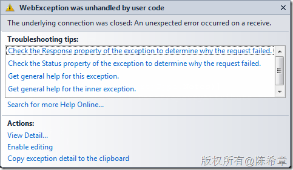

# 如何在ADO.NET Data Service的解决方案中修改最大传输数据量 
> 原文发表于 2010-06-09, 地址: http://www.cnblogs.com/chenxizhang/archive/2010/06/09/1754648.html 


1.问题描述：
-------

 如果你在使用ADO.NET Data Service做应用开发，那么有时候你可能会遇到如下的情况，尤其是你传输的数据量比较大的情况下，例如要上传或者下载一个比较大的文件时。

 [](http://images.cnblogs.com/cnblogs_com/chenxizhang/WindowsLiveWriter/ADO.NETDataService_AF35/image_2.png) 

  

 System.Net.WebException was unhandled by user code  
  Message=The underlying connection was closed: An unexpected error occurred on a receive.  
  Source=System  
  StackTrace:  
       at System.Net.HttpWebRequest.GetResponse()  
       at System.Data.Services.Client.DataServiceContext.SaveResult.BatchRequest(Boolean replaceOnUpdate)  
       at System.Data.Services.Client.DataServiceContext.SaveChanges(SaveChangesOptions options)  
       at System.Data.Services.Client.DataServiceContext.SaveChanges()  
       at System.Windows.Forms.ToolStripItem.RaiseEvent(Object key, EventArgs e)  
       at System.Windows.Forms.ToolStripMenuItem.OnClick(EventArgs e)  
       at System.Windows.Forms.ToolStripItem.HandleClick(EventArgs e)  
       at System.Windows.Forms.ToolStripItem.HandleMouseUp(MouseEventArgs e)  
       at System.Windows.Forms.ToolStripItem.FireEventInteractive(EventArgs e, ToolStripItemEventType met)  
       at System.Windows.Forms.ToolStripItem.FireEvent(EventArgs e, ToolStripItemEventType met)  
       at System.Windows.Forms.ToolStrip.OnMouseUp(MouseEventArgs mea)  
       at System.Windows.Forms.ToolStripDropDown.OnMouseUp(MouseEventArgs mea)  
       at System.Windows.Forms.Control.WmMouseUp(Message& m, MouseButtons button, Int32 clicks)  
       at System.Windows.Forms.Control.WndProc(Message& m)  
       at System.Windows.Forms.ScrollableControl.WndProc(Message& m)  
       at System.Windows.Forms.ToolStrip.WndProc(Message& m)  
       at System.Windows.Forms.ToolStripDropDown.WndProc(Message& m)  
       at System.Windows.Forms.Control.ControlNativeWindow.OnMessage(Message& m)  
       at System.Windows.Forms.Control.ControlNativeWindow.WndProc(Message& m)  
       at System.Windows.Forms.NativeWindow.Callback(IntPtr hWnd, Int32 msg, IntPtr wparam, IntPtr lparam)  
  InnerException: System.IO.IOException  
       Message=Unable to read data from the transport connection: An existing connection was forcibly closed by the remote host.  
       Source=System  
       StackTrace:  
            at System.Net.Sockets.NetworkStream.Read(Byte[] buffer, Int32 offset, Int32 size)  
            at System.Net.PooledStream.Read(Byte[] buffer, Int32 offset, Int32 size)  
            at System.Net.Connection.SyncRead(HttpWebRequest request, Boolean userRetrievedStream, Boolean probeRead)  
       InnerException: System.Net.Sockets.SocketException  
            Message=An existing connection was forcibly closed by the remote host  
            Source=System  
            ErrorCode=10054  
            NativeErrorCode=10054  
            StackTrace:  
                 at System.Net.Sockets.Socket.Receive(Byte[] buffer, Int32 offset, Int32 size, SocketFlags socketFlags)  
                 at System.Net.Sockets.NetworkStream.Read(Byte[] buffer, Int32 offset, Int32 size)  
            InnerException: 如果你无法看到如上的错误消息，那么你需要在服务里面开启一个选项


```
        public static void InitializeService(DataServiceConfiguration config)
        {
            // TODO: set rules to indicate which entity sets and service operations are visible, updatable, etc.
            // Examples:
            config.SetEntitySetAccessRule("*", EntitySetRights.All);
            config.SetServiceOperationAccessRule("*", ServiceOperationRights.All);
            config.DataServiceBehavior.MaxProtocolVersion = DataServiceProtocolVersion.V2;
            config.UseVerboseErrors = true;

            
        }

```


.csharpcode, .csharpcode pre
{
 font-size: small;
 color: black;
 font-family: consolas, "Courier New", courier, monospace;
 background-color: #ffffff;
 /*white-space: pre;*/
}
.csharpcode pre { margin: 0em; }
.csharpcode .rem { color: #008000; }
.csharpcode .kwrd { color: #0000ff; }
.csharpcode .str { color: #006080; }
.csharpcode .op { color: #0000c0; }
.csharpcode .preproc { color: #cc6633; }
.csharpcode .asp { background-color: #ffff00; }
.csharpcode .html { color: #800000; }
.csharpcode .attr { color: #ff0000; }
.csharpcode .alt 
{
 background-color: #f4f4f4;
 width: 100%;
 margin: 0em;
}
.csharpcode .lnum { color: #606060; }


 


2.原因分析：
-------


当然，其实即便你看到了如上的错误消息，估计你也是一头雾水。事实上，上面的错误消息中并没有告诉你问题的真相。（所以我才要写这篇文章的嘛，呵呵）


出现这个问题到底是什么原因呢？


* WCF服务对最大传输的数据量有限制。默认是64KB，即65536BYTE. 因为ADO.NET Data Service说到底是一个WCF服务，只不过它使用的binding是比较特殊的罢
* ASP.NET执行引擎本身对请求数据的长度有限制，默认为4MB(4096KB)。 因为我们的ADO.NET Data Service是宿主在ASP.NET网站中，对它的请求当然首先要能够发送给ASP.NET引擎。（其实，数据发送到了服务器之后，会有两种处理的模式，默认情况下WCF是有一套独立的处理管道，但与此同时也可以设置为所谓的ASP.NET兼容模式。这个话题这里不多展开了）


3.解决方案：
-------


了解了如上的原因，我们就可以设法来解决它


首先，设置WCF的最大消息数据大小为10MB（这里只是举例，你可以根据需要设置为你希望的大小）


```
  <system.serviceModel>
    <bindings>
      <webHttpBinding>
        <binding  name="my" maxReceivedMessageSize="10485760"></binding>
        <!--最大传输数据量为10MB:10*1024*1024-->
      </webHttpBinding>
    </bindings>
    <behaviors>
      <serviceBehaviors>
        <behavior name="">
          <serviceMetadata httpGetEnabled="true" />
          <serviceDebug includeExceptionDetailInFaults="false" />
        </behavior>
      </serviceBehaviors>
    </behaviors>
    <serviceHostingEnvironment aspNetCompatibilityEnabled="true" multipleSiteBindingsEnabled="true" />
    <services>
      <service name="Web.AdministrationService">
        <endpoint address="" binding="wsHttpBinding" contract="Web.IAdministrationService"></endpoint>
      </service>
      <service name="Web.MyDataService">
        <endpoint address="" binding="webHttpBinding" bindingConfiguration="my" contract="System.Data.Services.IRequestHandler"></endpoint>
      </service>
      
    </services>
  </system.serviceModel>
```


.csharpcode, .csharpcode pre
{
 font-size: small;
 color: black;
 font-family: consolas, "Courier New", courier, monospace;
 background-color: #ffffff;
 /*white-space: pre;*/
}
.csharpcode pre { margin: 0em; }
.csharpcode .rem { color: #008000; }
.csharpcode .kwrd { color: #0000ff; }
.csharpcode .str { color: #006080; }
.csharpcode .op { color: #0000c0; }
.csharpcode .preproc { color: #cc6633; }
.csharpcode .asp { background-color: #ffff00; }
.csharpcode .html { color: #800000; }
.csharpcode .attr { color: #ff0000; }
.csharpcode .alt 
{
 background-color: #f4f4f4;
 width: 100%;
 margin: 0em;
}
.csharpcode .lnum { color: #606060; }

【注意】大家可以看到,ADO.NET Data Service所使用的binding是webHttpBinding,它的contract是System.Data.Service.IRequestHandler


【注意】这里的maxReceivedMessageSize单位是Byte,所以是10*1024*1024


 


接下来，我们还需要设置网站级别处理请求的最大长度


```
<httpRuntime maxRequestLength="10240"/>
```

```
【注意】这个参数的单位是KB，所以是10*1024即可(关于单位不统一这一点，我是颇有微词的，很多地方单位都不一样，让你不得不记住那么多东西，例如同样的问题还存在于设置timeout的地方，这里就不多说了）
```

```
 
```

```
完成上面两个设置之后，再次运行程序，就不会遇到错误了。然后，整个世界清静了……[](http://images.cnblogs.com/cnblogs_com/chenxizhang/WindowsLiveWriter/ADO.NETDataService_AF35/%E6%84%9F%E8%A7%89%E4%B8%8D%E9%94%99_2.gif) 
```

```
 
```

.csharpcode, .csharpcode pre
{
 font-size: small;
 color: black;
 font-family: consolas, "Courier New", courier, monospace;
 background-color: #ffffff;
 /*white-space: pre;*/
}
.csharpcode pre { margin: 0em; }
.csharpcode .rem { color: #008000; }
.csharpcode .kwrd { color: #0000ff; }
.csharpcode .str { color: #006080; }
.csharpcode .op { color: #0000c0; }
.csharpcode .preproc { color: #cc6633; }
.csharpcode .asp { background-color: #ffff00; }
.csharpcode .html { color: #800000; }
.csharpcode .attr { color: #ff0000; }
.csharpcode .alt 
{
 background-color: #f4f4f4;
 width: 100%;
 margin: 0em;
}
.csharpcode .lnum { color: #606060; }


