# Workflow Foundation 4.0中的事件驱动流程设计和应用（一） 
> 原文发表于 2010-10-07, 地址: http://www.cnblogs.com/chenxizhang/archive/2010/10/07/1845104.html 


已经有不少朋友知道Workflow Foundation 4了。这个版本较之于以往有了一些明显的区别，开发的一些思路也大不相同了。

 很多人会觉得很怀念以前3.0中的“顺序工作流”和“状态机工作流”的分类，其实大可不必。在4.0中虽然没有称之为“状态机工作流”的东西，但其实实现起来也很自然.WF 4提供了FlowChart的功能，其实就是状态机工作流。（它的不同Decision之间可以转化，而这正是状态机与顺序工作流的根本区别）

 这一篇不是用来讨论状态机工作流这个话题的，提一下只是想说，大家要抓住重点，而不是表象。

 专门写一篇来介绍一下所谓事件驱动的流程设计和应用，是因为

 * 首先，没有太多流程不需要用户交互，而如果需要用户交互，就得通过事件这样的机制。（无论是顺序型还是状态机）
* 其次，没有太多文章和例子介绍这些细节，但WF4中的做法也不是很直观，一般人要理解起来还是蛮吃力的。

 我们来假想这样一个场景，我们需要有一个文档审批的流程。很显然流程是不会自动启动的，它得由用户发出一个指令（通常是在界面上填写了一些数据，然后点击了一个按钮）。那么，这样的功能要怎么实现呢？

 那么，就让我们开始吧

  

 【备注】本文代码，可以通过 [这里](http://files.cnblogs.com/chenxizhang/WFEventDriven(1).rar) 下载

 1.创建一个Activity Library.
=======================

  

 请注意,我建议你创建Activity Library,不要为了省事就创建WCF Workflow Service Application或者Workflow Console Application.因为那样既不实用（你不可能在项目中这么做），也会隐藏很多细节。

 [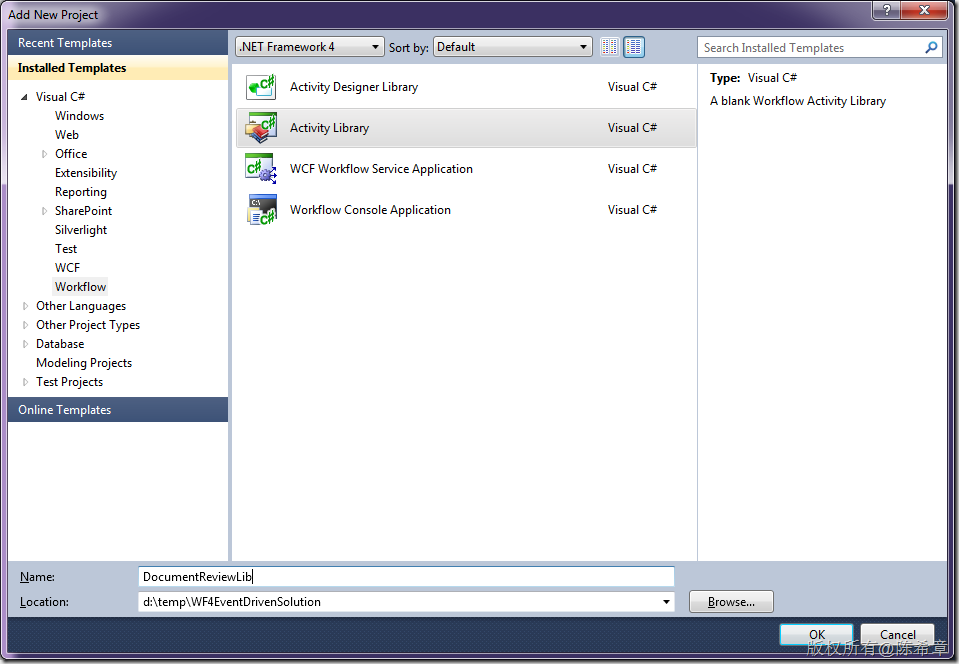](http://images.cnblogs.com/cnblogs_com/chenxizhang/Windows-Live-Writer/efd06ad0b37c_BDDB/image_2.png)

 将默认的那个Activity1.xaml删除掉，然后添加一个DocumentReviewWorkflow

 [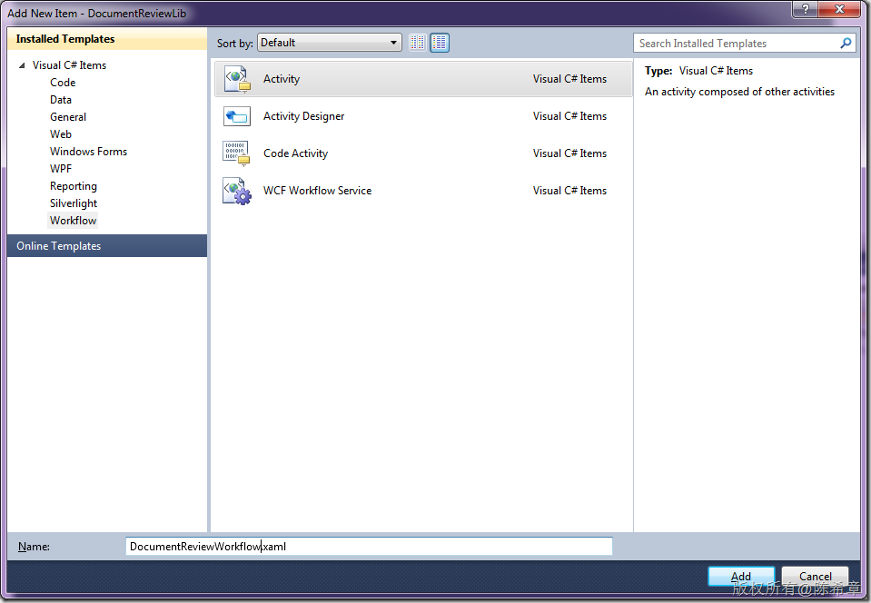](http://images.cnblogs.com/cnblogs_com/chenxizhang/Windows-Live-Writer/efd06ad0b37c_BDDB/image_4.png)

 [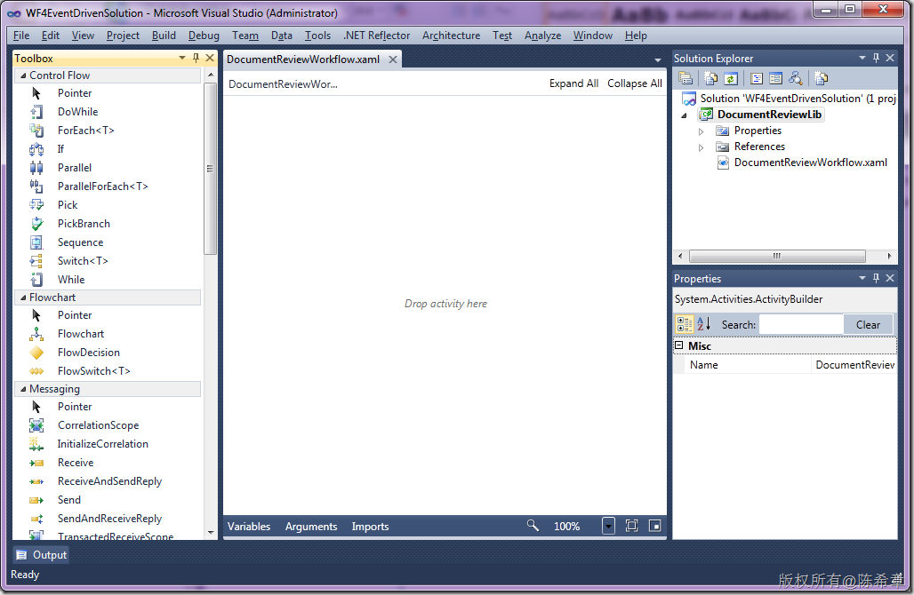](http://images.cnblogs.com/cnblogs_com/chenxizhang/Windows-Live-Writer/efd06ad0b37c_BDDB/image_6.png)

  

 2. 修改这个workflow的设计
==================

 在WF 4中，对Activity进行了全新的设计，3.0中的Activity几乎一个不留了。对于事件监听而言，现在是使用一个所谓的Pick的Activity

 我们这个流程首先需要能够监控用户创建表单的一个行为（事件），所以，我们需要添加这样一个Pick

 大致是这样的设计过程：

 2.1 拖放一个Sequence到设计器中

 2.2 拖放一个Pick到Sequence中，默认会有两个PickBranch，删除其中的一个

 2.3 拖放一个Receive到PickBranch的Trigger里面（我们设置了这个Receive的ServiceContractName，和OperationName，你可以随便取名，没有太多限制。这里其实是使用了WCF的技术。这是WF 4的一个很大的特点：与WCF结合得很紧密）

 2.4 定义一个TicketId的变量，用来保存流程编号

 2.5 拖放一个Assign 和WriteLine到PickBranch的Action中。（作为响应，我们只是随机产生一个流程编号，然后输出它）

 [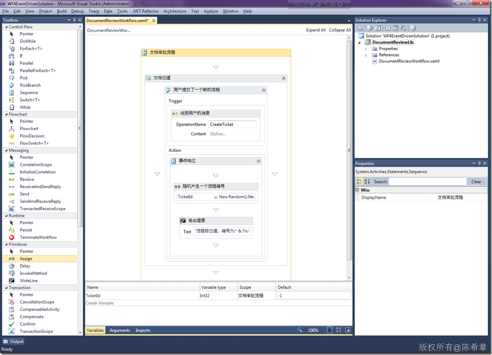](http://images.cnblogs.com/cnblogs_com/chenxizhang/Windows-Live-Writer/efd06ad0b37c_BDDB/image_8.png)

 这个设计过程，将得到下面这样的xaml.我这里就不一一截图了。如果觉得有必要，直接将这段xaml覆盖掉你的设计即可看到效果。


```
<Activity mc:Ignorable="sap" x:Class="DocumentReviewLib.DocumentReviewWorkflow" sap:VirtualizedContainerService.HintSize="470,711" mva:VisualBasic.Settings="Assembly references and imported namespaces for internal implementation" xmlns="http://schemas.microsoft.com/netfx/2009/xaml/activities" xmlns:mc="http://schemas.openxmlformats.org/markup-compatibility/2006" xmlns:mv="clr-namespace:Microsoft.VisualBasic;assembly=System" xmlns:mva="clr-namespace:Microsoft.VisualBasic.Activities;assembly=System.Activities" xmlns:p="http://schemas.microsoft.com/netfx/2009/xaml/servicemodel" xmlns:s="clr-namespace:System;assembly=mscorlib" xmlns:s1="clr-namespace:System;assembly=System" xmlns:s2="clr-namespace:System;assembly=System.Xml" xmlns:s3="clr-namespace:System;assembly=System.Core" xmlns:s4="clr-namespace:System;assembly=System.ServiceModel" xmlns:sa="clr-namespace:System.Activities;assembly=System.Activities" xmlns:sad="clr-namespace:System.Activities.Debugger;assembly=System.Activities" xmlns:sap="http://schemas.microsoft.com/netfx/2009/xaml/activities/presentation" xmlns:scg="clr-namespace:System.Collections.Generic;assembly=System" xmlns:scg1="clr-namespace:System.Collections.Generic;assembly=System.ServiceModel" xmlns:scg2="clr-namespace:System.Collections.Generic;assembly=System.Core" xmlns:scg3="clr-namespace:System.Collections.Generic;assembly=mscorlib" xmlns:sd="clr-namespace:System.Data;assembly=System.Data" xmlns:sl="clr-namespace:System.Linq;assembly=System.Core" xmlns:st="clr-namespace:System.Text;assembly=mscorlib" xmlns:x="http://schemas.microsoft.com/winfx/2006/xaml">
  <Sequence DisplayName="文档审批流程" sad:XamlDebuggerXmlReader.FileName="d:\temp\WF4EventDrivenSolution\DocumentReviewLib\DocumentReviewWorkflow.xaml" sap:VirtualizedContainerService.HintSize="430,671">
    <Sequence.Variables>
      <Variable x:TypeArguments="x:Int32" Default="-1" Name="TicketId" />
    </Sequence.Variables>
    <sap:WorkflowViewStateService.ViewState>
      <scg3:Dictionary x:TypeArguments="x:String, x:Object">
        <x:Boolean x:Key="IsExpanded">True</x:Boolean>
      </scg3:Dictionary>
    </sap:WorkflowViewStateService.ViewState>
    <Pick DisplayName="文档创建" sap:VirtualizedContainerService.HintSize="408,547">
      <PickBranch DisplayName="用户提交了一个新的流程" sap:VirtualizedContainerService.HintSize="294,501">
        <PickBranch.Trigger>
          <p:Receive DisplayName="收到用户的消息" sap:VirtualizedContainerService.HintSize="264,100" OperationName="CreateTicket" ServiceContractName="IDocumentReview" />
        </PickBranch.Trigger>
        <Sequence DisplayName="事件响应" sap:VirtualizedContainerService.HintSize="264,283">
          <sap:WorkflowViewStateService.ViewState>
            <scg3:Dictionary x:TypeArguments="x:String, x:Object">
              <x:Boolean x:Key="IsExpanded">True</x:Boolean>
            </scg3:Dictionary>
          </sap:WorkflowViewStateService.ViewState>
          <Assign DisplayName="随机产生一个流程编号" sap:VirtualizedContainerService.HintSize="242,58">
            <Assign.To>
              <OutArgument x:TypeArguments="x:Int32">[TicketId]</OutArgument>
            </Assign.To>
            <Assign.Value>
              <InArgument x:TypeArguments="x:Int32">[New Random().Next()]</InArgument>
            </Assign.Value>
          </Assign>
          <WriteLine DisplayName="输出信息" sap:VirtualizedContainerService.HintSize="242,61" Text="[&quot;流程被创建，编号为:&quot; &amp; TicketId]" />
        </Sequence>
      </PickBranch>
    </Pick>
  </Sequence>
</Activity>
```

.csharpcode, .csharpcode pre
{
 font-size: small;
 color: black;
 font-family: consolas, "Courier New", courier, monospace;
 background-color: #ffffff;
 /*white-space: pre;*/
}
.csharpcode pre { margin: 0em; }
.csharpcode .rem { color: #008000; }
.csharpcode .kwrd { color: #0000ff; }
.csharpcode .str { color: #006080; }
.csharpcode .op { color: #0000c0; }
.csharpcode .preproc { color: #cc6633; }
.csharpcode .asp { background-color: #ffff00; }
.csharpcode .html { color: #800000; }
.csharpcode .attr { color: #ff0000; }
.csharpcode .alt 
{
 background-color: #f4f4f4;
 width: 100%;
 margin: 0em;
}
.csharpcode .lnum { color: #606060; }

 


3. 设计一个宿主程序
===========


流程设计好之后，我们如何将它托管起来，并且允许客户端发出流程有关的操作呢


我们需要设计一个宿主。为简便起见，我们可以用Console来做为宿主。


[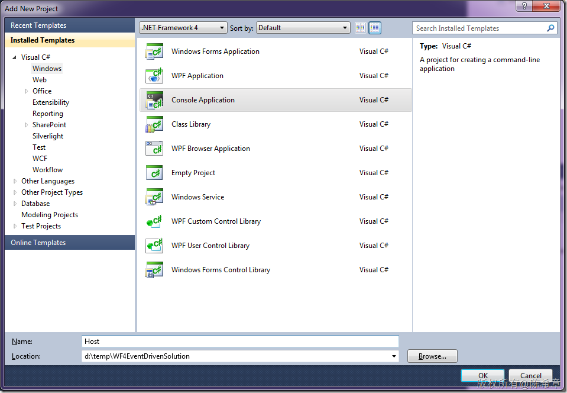](http://images.cnblogs.com/cnblogs_com/chenxizhang/Windows-Live-Writer/efd06ad0b37c_BDDB/image_10.png)


同时，我们需要添加几个程序集的引用


[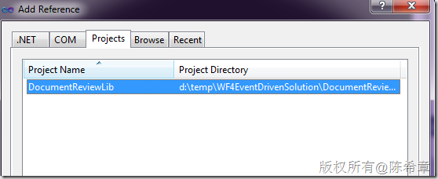](http://images.cnblogs.com/cnblogs_com/chenxizhang/Windows-Live-Writer/efd06ad0b37c_BDDB/image_12.png)


[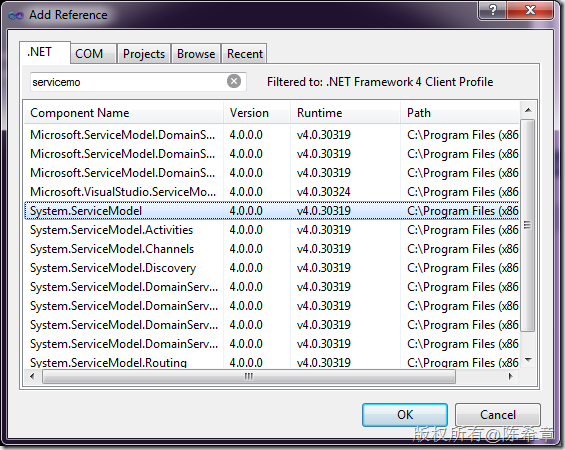](http://images.cnblogs.com/cnblogs_com/chenxizhang/Windows-Live-Writer/efd06ad0b37c_BDDB/image_16.png)


[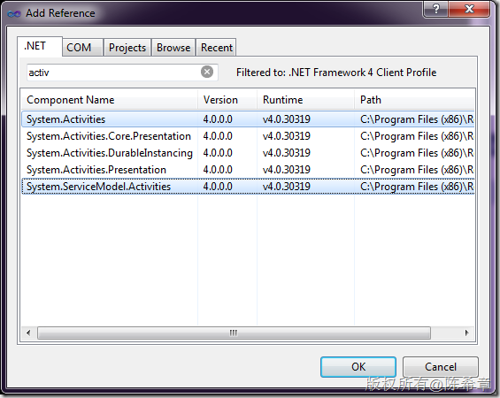](http://images.cnblogs.com/cnblogs_com/chenxizhang/Windows-Live-Writer/efd06ad0b37c_BDDB/image_14.png)


 


然后，修改Main方法，代码如下


```
using System;
using System.Collections.Generic;
using System.Linq;
using System.Text;
using System.ServiceModel;
using System.Activities;
using System.ServiceModel.Activities;
using System.ServiceModel.Description;

namespace Host
{
    class Program
    {
        static void Main(string[] args)
        {
            var host = new WorkflowServiceHost(
                new DocumentReviewLib.DocumentReviewWorkflow(),
                new Uri("http://localhost:8080/DRS"));

            host.AddDefaultEndpoints();
            host.Description.Behaviors.Add(
                new ServiceMetadataBehavior() { HttpGetEnabled = true });

            host.AddServiceEndpoint(
                "IMetadataExchange",
                MetadataExchangeBindings.CreateMexHttpBinding(),
                "mex");

            host.Open();
            Console.WriteLine("Server is ready.");
            Console.Read();

        }
    }
}

```

.csharpcode, .csharpcode pre
{
 font-size: small;
 color: black;
 font-family: consolas, "Courier New", courier, monospace;
 background-color: #ffffff;
 /*white-space: pre;*/
}
.csharpcode pre { margin: 0em; }
.csharpcode .rem { color: #008000; }
.csharpcode .kwrd { color: #0000ff; }
.csharpcode .str { color: #006080; }
.csharpcode .op { color: #0000c0; }
.csharpcode .preproc { color: #cc6633; }
.csharpcode .asp { background-color: #ffff00; }
.csharpcode .html { color: #800000; }
.csharpcode .attr { color: #ff0000; }
.csharpcode .alt 
{
 background-color: #f4f4f4;
 width: 100%;
 margin: 0em;
}
.csharpcode .lnum { color: #606060; }

 


这里，我们创建了一个所谓的WorkflowServiceHost（其实这是一个特殊的WCF中的ServiceHost对象），启动了在8080端口的监听


启动Host的调试（如果是Vista或Win7),请将Visual Studio run as administrator，如果没有出什么意外的话，你可以看到下面这样的一个窗口


[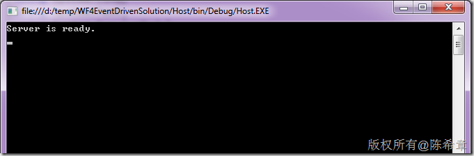](http://images.cnblogs.com/cnblogs_com/chenxizhang/Windows-Live-Writer/efd06ad0b37c_BDDB/image_18.png)


然后，你在浏览器中输入下面的地址，可以看到


[](http://images.cnblogs.com/cnblogs_com/chenxizhang/Windows-Live-Writer/efd06ad0b37c_BDDB/image_20.png)


这就表示服务已经成功启动了。


根据上面页面的提示，我们可以产生一个服务代理类。注意，要使用Visual Studio Command Prompt，而不是默认的cmd


[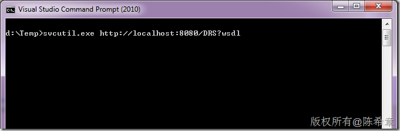](http://images.cnblogs.com/cnblogs_com/chenxizhang/Windows-Live-Writer/efd06ad0b37c_BDDB/image_22.png)


[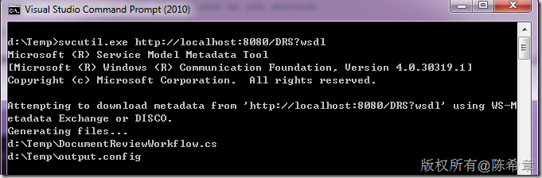](http://images.cnblogs.com/cnblogs_com/chenxizhang/Windows-Live-Writer/efd06ad0b37c_BDDB/image_24.png)


 


4. 设计一个客户端程序
============


我们接下来要设计一个Windows Forms的客户端程序，来使用该服务，发起流程的操作


[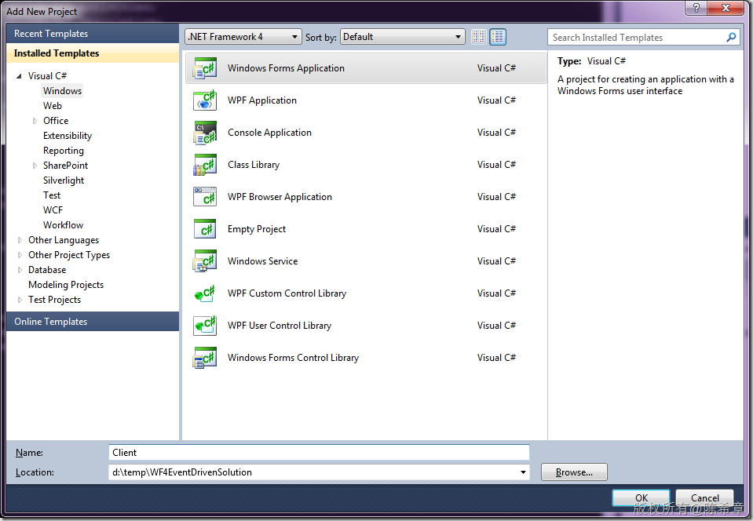](http://images.cnblogs.com/cnblogs_com/chenxizhang/Windows-Live-Writer/efd06ad0b37c_BDDB/image_26.png)


将刚才工具所生成的两个文件添加到当前项目，并且将output.config修改为app.config


[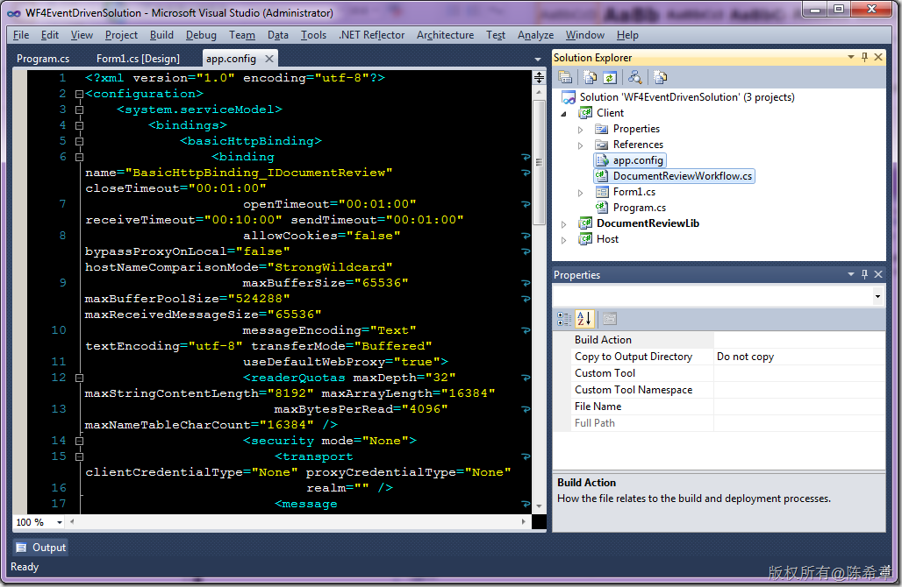](http://images.cnblogs.com/cnblogs_com/chenxizhang/Windows-Live-Writer/efd06ad0b37c_BDDB/image_28.png)


添加对System.ServiceModel的引用


[](http://images.cnblogs.com/cnblogs_com/chenxizhang/Windows-Live-Writer/efd06ad0b37c_BDDB/image_30.png)


 


修改窗口的设计如下


[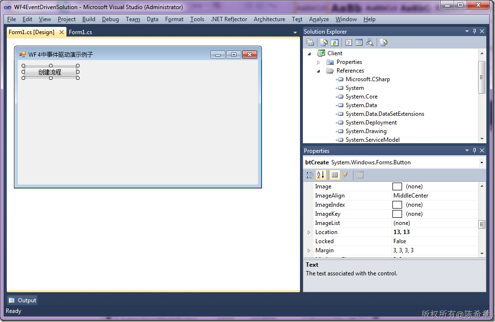](http://images.cnblogs.com/cnblogs_com/chenxizhang/Windows-Live-Writer/efd06ad0b37c_BDDB/image_32.png)


代码如下


```
        private void btCreate\_Click(object sender, EventArgs e)
        {
            var proxy = new DocumentReviewClient();
            proxy.CreateTicket();
        }
```


.csharpcode, .csharpcode pre
{
 font-size: small;
 color: black;
 font-family: consolas, "Courier New", courier, monospace;
 background-color: #ffffff;
 /*white-space: pre;*/
}
.csharpcode pre { margin: 0em; }
.csharpcode .rem { color: #008000; }
.csharpcode .kwrd { color: #0000ff; }
.csharpcode .str { color: #006080; }
.csharpcode .op { color: #0000c0; }
.csharpcode .preproc { color: #cc6633; }
.csharpcode .asp { background-color: #ffff00; }
.csharpcode .html { color: #800000; }
.csharpcode .attr { color: #ff0000; }
.csharpcode .alt 
{
 background-color: #f4f4f4;
 width: 100%;
 margin: 0em;
}
.csharpcode .lnum { color: #606060; }


是不是很简单呢？其实这里就是WCF调用。（有在WF3中做过流程开发的朋友一定不会陌生，以前我们也是自己定义WCF服务来实现客户端与服务器端的通讯）


那么，现在可以进行调试了。


 


5. 调试流程
=======


因为既要启动服务器，又要启动客户端，所以我们可以设置一下启动项目顺序


[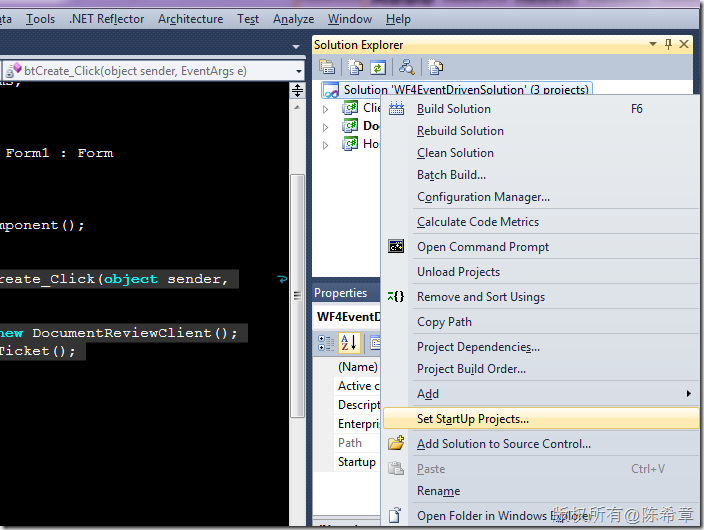](http://images.cnblogs.com/cnblogs_com/chenxizhang/Windows-Live-Writer/efd06ad0b37c_BDDB/image_34.png)


[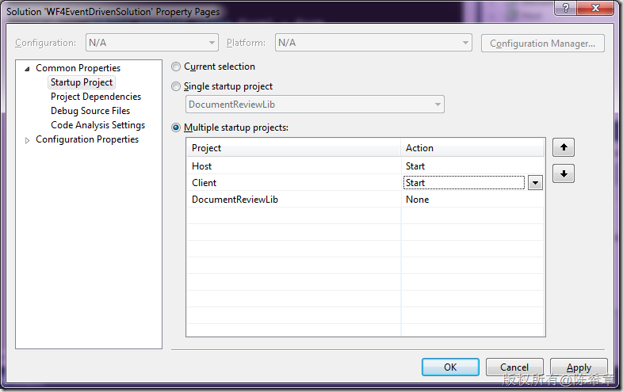](http://images.cnblogs.com/cnblogs_com/chenxizhang/Windows-Live-Writer/efd06ad0b37c_BDDB/image_36.png)


接下来，就可以按下F5键进行调试了


[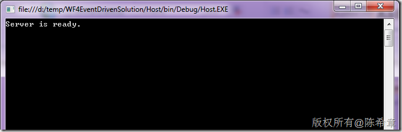](http://images.cnblogs.com/cnblogs_com/chenxizhang/Windows-Live-Writer/efd06ad0b37c_BDDB/image_38.png)


[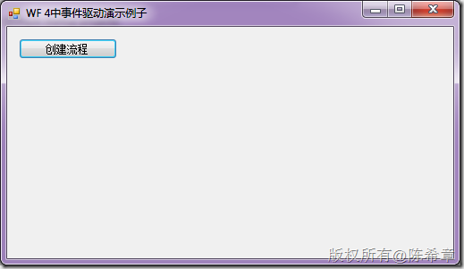](http://images.cnblogs.com/cnblogs_com/chenxizhang/Windows-Live-Writer/efd06ad0b37c_BDDB/image_40.png)


然后，我们点击“创建流程”按钮。我们并没有发现什么。流程并没有被启动。这是为什么呢？


放心，没有什么大不了的，这只是我预先设计好的一个“陷阱”而已。我是想让大家明白，所有的WCF调用，默认都不会启动流程，除非有一个属性设置为true。这就是那个Receive Activity的CanCreateInstance属性，我们可以回到DocumentReviewLib中，将其设置为true。因为它默认是false。这个属性的意思是说，如果收到这个事件，那么要不要创建工作流的实例。一般在一个流程的顶部事件中，都是设置为true的


[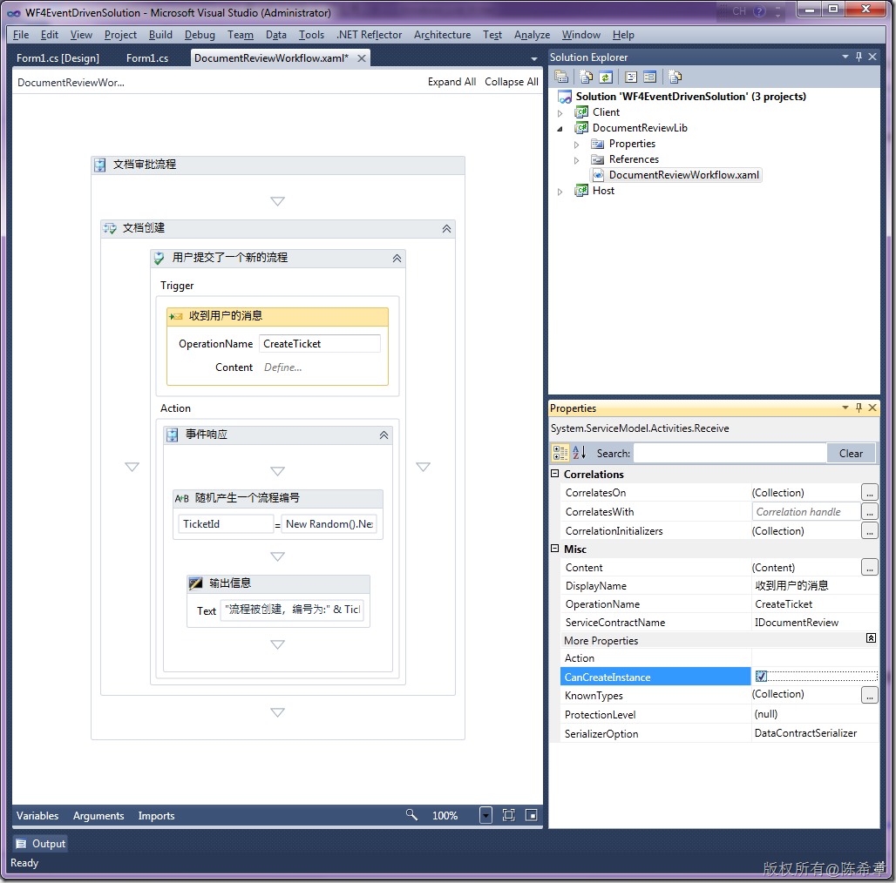](http://images.cnblogs.com/cnblogs_com/chenxizhang/Windows-Live-Writer/efd06ad0b37c_BDDB/image_42.png)


再次按下F5键，进行调试，然后点击“创建流程”按钮


[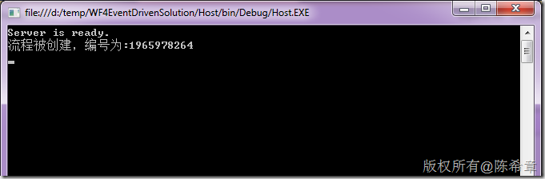](http://images.cnblogs.com/cnblogs_com/chenxizhang/Windows-Live-Writer/efd06ad0b37c_BDDB/image_44.png)


这样看起来，流程确实被创建了。如果我们点击多次呢？毫无疑问，它会有多个实例产生出来


[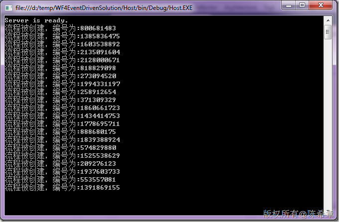](http://images.cnblogs.com/cnblogs_com/chenxizhang/Windows-Live-Writer/efd06ad0b37c_BDDB/image_46.png)


 


看起来不错，不是吗？我们从客户端发起了一个操作，它将被工作流收到消息，并且进行了相应的处理。（我们这里只是输出消息，你可以想象一下，你完全可以在这里更新数据库的记录）


 


那么，接下来有一个话题，一般情况下，我们一个流程都不止一个事件，例如发起流程之后，需要将这个编号返回给客户端，同时还要等待经理审批。如此这般的需求怎么实现呢？


我在下一篇先介绍一下，如何将处理结果发回给客户端。


然后，第三篇介绍如何实现审批事件。


 


【备注】本文代码，可以通过 [这里](http://files.cnblogs.com/chenxizhang/WFEventDriven(1).rar) 下载

